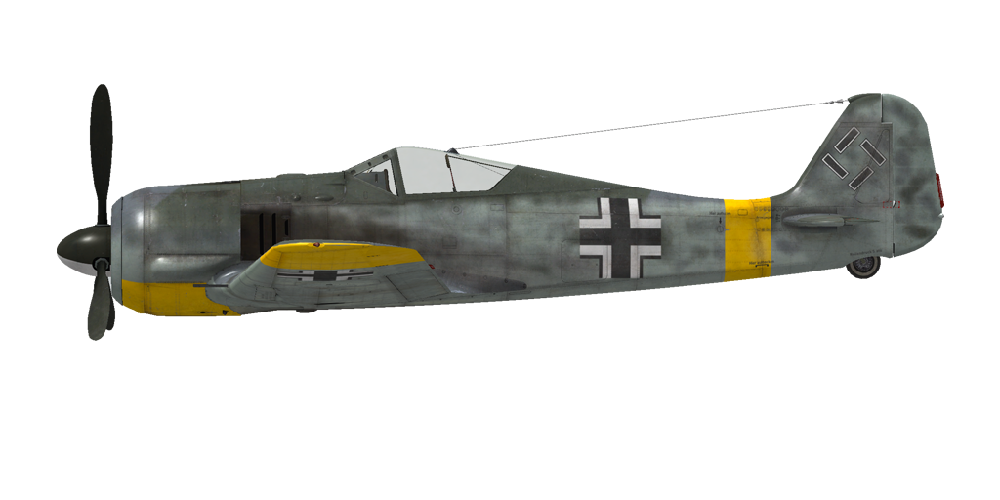

# Fw 190 A-3

## 描述

飞行构型的失速指示空速：166~189 km/h
起降构型的失速指示空速：166~172 km/h
俯冲极速：850 km/h
最大过载：11 G
飞行构型失速迎角：19.5°
着陆构型失速迎角：18.1°

最大真空速，高度海平面，发动机模式——应急：560 km/h
最大真空速，高度3000m，发动机模式——应急：581 km/h
最大真空速，高度6400m，发动机模式——应急：662 km/h

最大真空速，高度海平面，发动机模式——战斗：535 km/h
最大真空速，高度3000m，发动机模式——战斗：562 km/h
最大真空速，高度6000m，发动机模式——战斗：626 km/h

实用升限：10800 m
海平面爬升率：16.0 m/s
3000m时爬升率：12.7 m/s
6000m时爬升率：10.3 m/s

海平面最大性能盘旋时间：23.0 s，指示空速 280 km/h。
3000m时最大性能盘旋时间：28.0 s，指示空速 280 km/h。

3000m（9843 feet）时续航时间：3.2h，指示空速 350 km/h。

起飞速度：170~210 km/h
进近速度：205~215 km/h
着陆速度：160~170 km/h
着陆迎角：12.5°

注1：所提供的数据适用于国际标准大气（ISA）。
注2：飞行性能范围基于可能的飞机质量范围。
注3：极速、爬升率和盘旋时间基于标准飞机质量。
注4：爬升率基于战斗动力，盘旋时间基于应急动力。

发动机：
型号：BMW-801D
海平面应急模式下的最大功率：1700 HP
应急模式下的最大功率，高度5700m：1440 HP
战斗模式下的最大功率，高度700m：1520 HP
战斗模式下的最大功率，高度5300m：1320 HP

发动机模式：
标称（无时间限制）：2300 RPM，1.2 ATA
战斗（不超过30min）：2400 RPM，1.32 ATA压
应急动力（不超过3min）：2700 RPM，1.42 ATA压

发动机滑油进油口额定油温：60~70 °C
发动机滑油进油口最高油温：85 °C
发动机滑油出油口额定油温：105 °C
发动机滑油出油口最高油温：120 °C
气缸头额定温度：180 °C
气缸头最高温度：220 °C
机械增压器换挡高度：自动

空重：3148 kg
最小重量（无弹药、10%25燃油）：3330 kg
标准重量：3855 kg
最大起飞重量：4385 kg
燃油载荷：409 kg/524 L
有效载荷：1237 kg

前射武器：
2 x 20mm机炮"MG 151/20"，250发，700发/分，同步
2 x 7.92mm机枪"MG 17"，900发，1200发/分，同步
2 x 20mm机炮"MG FF"，60发，540发/分，机翼安装（改装）
2 x 20mm机炮"MG FF"，90发，540发/分，机翼安装（改装）

炸弹：
最多4 x 55kg 通用炸弹"SC 50"
249kg 通用炸弹"SC 250"
500kg 通用炸弹"SC 500"

长度：8.85 m
翼展：10.51 m
机翼面积：18.3 m²

首次投入战斗：1942年3月

操作特性：
——飞机的发动机系统自动化程度较高，实际上，要控制速度只要使用油门杆即可。正常飞行中无需手动调整发动机的转速、混合比以及增压器的档位。发动机增压器有自动开关系统，其工作取决于高度和发动机转速。
——为了减少由于螺旋桨洗流导致的滑跑摇摆，螺旋桨桨距应设置成手动模式并设置成最小。
——当迎角增加到临界水平时，机翼可能突然失速。 失速前几乎没有警告。为避免这种情况，飞行员在进行极端操纵时必须格外注意。
——飞机没有飞行操纵的配平。飞机装有可弯曲的配平片，可由地面人员在飞行前设置。
——飞机有手动控制的电动水平安定面。在起飞和着陆前应设置为+1.5°。它也可用于飞行时配平操纵杆。在大角度俯冲时应设定安定面，让飞行员必须向前推杆才能保持俯冲角。
——飞机的电动着陆襟翼有三个的固定位置：收起、起飞（13°）和着陆（58°）。襟翼控制按钮和指示灯位于油门附近的左侧面板上。襟翼角度也可以通过驾驶舱外左右机翼上的指示器检查。
——飞机有尾轮锁系统，向后拉杆时会锁尾轮。在长距离直线滑行时、起飞前和降落接地后应锁住尾轮。
——飞机有独立的左右液压机轮刹车。要使用刹车，踩下方向舵脚蹬的上部。
——飞机有油量表，会根据开关位置显示前部或后部油箱的剩余油量。在游戏里，飞机水平飞行时每隔10s油量指示开关都会自动更改位置。此外，飞机还有个应急油量警告灯（100 L）。
——由于强气流，高速时无法开闭座舱盖。座舱盖配有紧急抛弃系统，用于跳伞。
——炸弹挂架的控制系统只允许单颗投放。
——射击瞄准具拥有一个滑动式的太阳滤光片。

## 修改

### MG FF/M 2 x 20mm机炮(120发)

机翼加装MG FF/M 2 x 20mm机炮，每门60发
增加质量：123 kg
弹药质量：29 kg
枪炮质量：94 kg
预期速度损失：7 km/h

### MG FF/M 2 x 20mm机炮(180发)

机翼加装MG FF/M 2 x 20mm机炮，每门90发
增加质量：144 kg
弹药质量：50 kg
枪炮质量：94 kg
预期速度损失：8 km/h

### SC 250炸弹

249kg 通用炸弹SC 250
增加质量：279 kg
弹药质量：249 kg
挂架质量：30 kg
投弹前预期速度损失：37 km/h
投弹后预期速度损失：11 km/h

### SC 500炸弹

500kg 通用炸弹 SC 500
增加质量：530 kg
弹药质量：500 kg
挂架质量：30 kg
投弹前预期速度损失：43 km/h
投弹后预期速度损失：13 km/h

### 4 x SC 50炸弹

4 x 55kg 通用炸弹SC 50
增加质量：280 kg
弹药质量：220 kg
挂架质量：60 kg
投弹前预期速度损失：85 km/h
投弹后预期速度损失：41 km/h