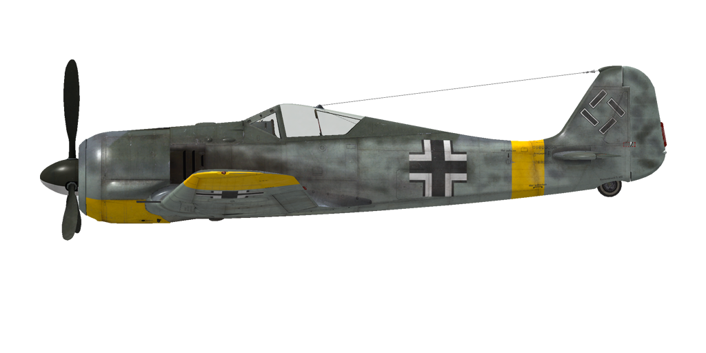

# Fw 190 A-3  
  
  
  
## Description  
  
Vitesse de décrochage indiquée en configuration de vol : 166..189 km/h  
Vitesse de décrochage indiquée en configuration de décollage/atterrissage : 166..172 km/h  
Vitesse limite de piqué : 850 km/h  
Facteur de charge maximum : 11 g  
Angle d\attaque de décrochage en configuration de vol : 19,5°  
Angle d\attaque de décrochage indiquée en configuration d\atterrissage : 18,1°  
  
Vitesse sol au niveau de la mer, régime moteur - Urgence : 560 km/h  
Vitesse sol maximale à 3000 m, régime moteur - Urgence : 581 km/h  
Vitesse sol maximale à 6400 m, régime moteur - Urgence : 662 km/h  
  
Vitesse sol au niveau de la mer, régime moteur - Combat : 535 km/h  
Vitesse sol maximale à 3000 m, régime moteur - Combat : 562 km/h  
Vitesse sol maximale à 6000 m, régime moteur - Combat : 626 km/h  
  
Plafond opérationnel : 10800 m  
Taux de montée au niveau de la mer : 16,0 m/s  
Taux de montée à 3000 m : 12,7 m/s  
Taux de montée à 6000 m : 10,3 m/s  
  
Virage à 360° au niveau de la mer en : 23,0 s, à 280 km/h vitesse indiquée (IAS).  
Virage à 360° à 3000 m : 28,0 s, à 280 km/h vitesse indiquée (IAS).  
  
Endurance à 3000 m : 3,2 h, à 350 km/h vitesse indiquée (IAS).  
  
Vitesse de décollage : 170..210 km/h  
Vitesse d\approche : 205..215 km/h  
Vitesse d\atterrissage : 160..170 km/h  
Angle d\atterrissage : 12,5°  
  
Note 1 : les données sont indiquées à l\atmosphère standard international (ISA).  
Note 2 : les performances d\endurance sont données pour plusieurs masses possibles.  
Note 3 : la vitesse maximale, le taux de montée et le temps de virage sont donnés pour une masse standard.  
Note 4 : le taux de montée est à régime de combat, le temps de virage est à régime d\urgence.  
  
Moteur :  
Modèle : BMW-801D  
Puissance maximale au régime d\urgence au niveau de la mer : 1700 cv  
Puissance maximale au régime d\urgence à 5700 m : 1440 cv  
Puissance maximale au régime de combat à 700 m : 1520 cv  
Puissance maximale au régime de combat à 5300 m : 1320 cv  
  
Performance du moteur :  
Continu (durée illimitée) : 2300 tr/min, 1,2 ata  
Combat (jusqu\à 30 minutes) : 2400 tr/min, 1,32 ata  
Urgence (jusqu\à 3 minutes) : 2700 tr/min, 1,42 ata  
  
Température de fonctionnement d\huile à l\admission du moteur : 60..70 °C  
Température maximale d\huile à l\admission du moteur : 85 °C  
Température de fonctionnement d\huile en sortie du moteur : 105 °C  
Température maximale d\huile en sortie du moteur : 120 °C  
Température de fonctionnement des têtes de cylindre : 180 °C  
Température maximale des têtes de cylindre : 220 °C  
Altitude de changement d\étage du compresseur : automatique  
  
Masse à vide : 3148 kg  
Masse minimale (sans munitions, 10% de carburant) : 3330 kg  
Masse standard : 3855 kg  
Masse maximale au décollage : 4385 kg  
Masse de carburant : 409 kg / 524 l  
Charge utile : 1237 kg  
  
Armement offensif :  
2 canons MG 151/20 de 20 mm, 250 coups, 700 coups par minute, synchronisés  
2 mitrailleuses MG 17 de 7,92 mm, 900 coups, 1200 coups par minute, synchronisées  
2 canons MG FF de 20 mm, 60 coups, 540 coups par minute, dans l\aile (modification)  
2 canons MG FF de 20 mm, 90 coups, 540 coups par minute, dans l\aile (modification)  
  
Bombes :  
Jusqu\à 4 bombes d\emploi général SC 50 de 55 kg  
1 bombe d\emploi général SC 250 de 249 kg  
1 bombe d\emploi général SC 500 de 500 kg  
  
Longueur : 8,85 m  
Envergure : 10,51 m  
Surface alaire : 18,3 m²  
  
Premier engagement : mars 1942  
  
Caractéristiques  
- Cet avion utilise une gestion automatique des réglages moteur et, de ce fait, pour contrôler la vitesse, il suffit  d\agir sur la manette des gaz. En vol normal, il n\est pas nécessaire de procéder au réglage manuel du nombre de tours moteur, du mélange ou de la suralimentation. Le compresseur moteur dispose d\un système de commutation automatique qui dépend de l\altitude et du régime du moteur.  
- Pour atténuer le cahotement pendant le roulage dû au brassage de l\hélice, la commande du pas de l\hélice doit être commutée en mode manuel et le pas doit être réduit au minimum.  
- Lorsque l\angle d\attaque augmente à des niveaux critiques, l\aile peut décrocher soudainement et de façon inattendue. Il n\y a presque pas d\effet de pré-décrochage avant le décrochage. Pour éviter cela, le pilote doit accorder une attention supplémentaire lors de manoeuvres extrêmes.  
- L\avion n\a pas de trim en vol. L\avion est équipé de trim qui ne peut être réglées que par le personnel au sol, avant le vol.  
- L\avion possède un stabilisateur horizontal commandé manuellement et actionné électriquement. Il doit être réglé à + 1,5 ° avant le décollage et l\atterrissage. Il est aussi possible de trimer le manche pendant le vol. Dans un piqué accentué, le stabilistaeur doit être réglé de manière à pousser sur le manche pour maintenir l\angle de piqué.  
- L\avion a des volets d\atterrissage à commande électrique avec trois positions fixes: rétracté, décollage (13 °) et atterrissage (58 °). Les boutons de commande des volets et les témoins lumineux sont situés sur le panneau gauche près de la manette des gaz. L\angle du volet peut également être vérifié par des indicateurs sur l\aile gauche et droite à l\extérieur du poste de pilotage.  
- L\avion a un système de verouillage de roulette de queue qui bloque la roulette de queue si le manche de vol est tiré vers l\arrière. La roue arrière doit être verrouillée en roulant droit sur une longue distance, avant le décollage et après l\atterrissage.  
- L\avion a des commandes de frein hydrauliques à gauche et à droite qui sont indépendantes. Pour freiner, poussez la partie supérieure de la pédale de direction.  
- L\avion a une jauge de carburant qui indique la quantité de carburant restant dans le réservoir de carburant avant ou arrière en fonction de la position du commutateur. En jeu, le commutateur de sélection deréservoir de carburant change de lui-même pendant le vol horizontal toutes les 10 secondes. De plus, l\avion dispose d\un témoin d\alerte de carburant (100 litres).  
- Il est impossible d\ouvrir ou de fermer la verrière à grande vitesse en raison d\un fort flux d\air. La verrière a un système d\éjection d\urgence dans le cas où vous devriez évacuer l\avion en plain vol.  
- Le système de controle du ratelier à bombe ne permet de larguer les bombes que une par une.  
- Le viseur a un filtre solaire coulissant.  
  
## Modifications  
  
  
  
### 2 MG FF/M de 20 mm (120 obus)  
  
2 canons MG FF/M supplémentaires de 20 mm montés dans les ailes avec 60 obus chaque  
Masse supplémentaire : 123 kg  
Masse des munitions : 29 kg  
Masse des canons : 94 kg  
Perte estimée de vitesse : 7 km/h  
  
  
### 2 MG FF/M de 20 mm (180 obus)  
  
2 canons MG FF/M supplémentaires de 20 mm montés dans les ailes avec 90 obus chaque  
Masse supplémentaire : 144 kg  
Masse des munitions : 50 kg  
Masse des canons : 94 kg  
Perte estimée de vitesse : 8 km/h  
  
  
### 1 bombe SC 250  
  
Bombe d’emploi général SC 250 de 249 kg  
Masse supplémentaire : 279 kg  
Masse des munitions : 249 kg  
Masse des pylones : 30 kg  
Perte estimée de vitesse avant le largage : 37 km/h  
Perte estimée de vitesse après le largage : 11 km/h  
  
  
### 1 bombe SC 500  
  
Bombe d’emploi général SC 500 de 500 kg  
Masse supplémentaire : 530 kg  
Masse des munitions : 500 kg  
Masse des pylones : 30 kg  
Perte estimée de vitesse avant le largage : 43 km/h  
Perte estimée de vitesse après le largage : 13 km/h  
  
  
### 4 bombes SC 50  
  
4 bombes d’emploi général SC 50 de 55 kg  
Masse supplémentaire : 280 kg  
Masse des munitions : 220 kg  
Masse des pylones : 60 kg  
Perte estimée de vitesse avant le largage : 85 km/h  
Perte estimée de vitesse après le largage : 41 km/h  