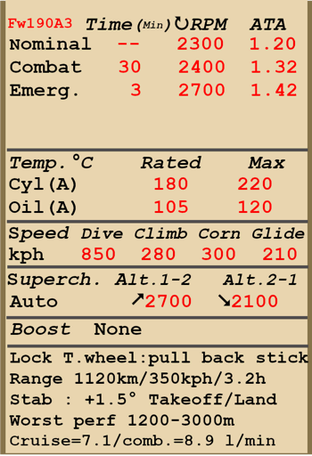

# Fw 190 A-3  

| Image | Notes  
|:---|:---  
|  |   

## Beschreibung  

Überziehgeschwindigkeit in Flugkonfiguration: 166..189 km/h  
Überziehgeschwindigkeit in Landekonfiguration: 166..172 km/h  
Höchstzulässige Geschwindigkeit im Sturzflug: 850 km/h  
Bruchlastvielfache: 11 G  
Kritischer Anstellwinkel in Flugkonfiguration: 19.5°  
Kritischer Anstellwinkel in Landekonfiguration: 18.1°  
  
Höchstgeschwindigkeit in Bodennähe, Notleistung: 560 km/h  
Höchstgeschwindigkeit in 3000 m Höhe, Notleistung: 581 km/h  
Höchstgeschwindigkeit in 6400 m Höhe, Notleistung: 662 km/h  
  
Höchstgeschwindigkeit in Bodennähe, Kampfleistung: 535 km/h  
Höchstgeschwindigkeit in 3000 m Höhe, Kampfleistung: 562 km/h  
Höchstgeschwindigkeit in 6400 m Höhe, Kampfleistung: 626 km/h  
  
Dienstgipfelhöhe: 10800 m  
Steigleistung in Bodennähe: 16.0 m/s  
Steigleistung in 3000 m Höhe: 12.7 m/s  
Steigleistung in 6000 m Höhe: 10.3 m/s  
  
Maximale Wendegeschwindigkeit in Bodennähe: 23.0 s, bei 280 km/h IAS.  
Maximale Wendegeschwindigkeit in 3000 m Höhe: 28.0 s (280 km/h IAS).  
  
Reichweite in 5000 m: 3.2 h, bei 350 km/h IAS.  
  
Startgeschwindigkeit: 170..210 km/h  
Anfluggeschwindigkeit: 205..215 km/h  
Landegeschwindigkeit: 160..170 km/h  
Sinkflugpfad: 12.5°  
  
Anmerkung 1: Die Werte gelten für Normatmosphäre (ISA).  
Anmerkung 2: Flugleistungen varrieren je nach Abfluggewicht.  
Anmerkung 3: Höchstgeschwindigkeiten, Steigleistungen und Wendegeschwindigkeiten gelten für Standard-Fluggewicht.  
Anmerkung 4: Steigraten gelten für Kampfleistung, Wendegeschwindigkeiten gelten für Notleistung.  
  
Triebwerk:  
Baumuster: BMW-801D  
Notleistung in Bodennähe: 1700 PS  
Notleistung in 5700 m: 1440 PS  
Kampfleistung in 700 m: 1520 PS  
Kampfleistung in 5300 m: 1320 PS  
  
Leistungsstufen:  
Nennleistung (unbegrenzt): 2300 U/min, 1.2 ata  
Kampfleistung (bis zu 30 Minuten): 2400 U/min, 1.32 ata  
Notleistung (bis zu 3 Minuten): 2700 U/min, 1.42 ata  
  
Schmierstoffeintrittstemperatur (normal): 60..70 °C  
Schmierstoffeintrittstemperatur (höchstens): 85 °C  
Schmierstoffaustrittstemperatur (normal): 105 °C  
Schmierstoffaustrittstemperatur (höchstens): 120 °C  
Zylinderkopftemperatur (normal): 180 °C  
Zylinderkopftemperatur (höchstens): 220 °C  
Laderumschalthöhe: Automatisch  
  
Leergewicht: 3148 kg  
Minimalgewicht (keine Munition, 10% Treibstoff): 3330 kg  
Normalgewicht: 3855 kg  
Höchstabfluggewicht: 4385 kg  
Kraftstoffmenge: 409 kg / 524 l  
Nutzlast: 1237 kg  
  
Starre Schusswaffenanlage:  
2 x 20 mm MG 151/20, 250 Schuss, 700 Schuss pro Minute, gesteuert schießend  
2 x 7.92 mm MG 17, 900 Schuss, 1200 Schuss pro Minute, gesteuert schießend  
2 x 20 mm MG FF, 60 Schuss, 540 Schuss pro Minute, flügelmontiert (Rüstsatz)  
2 x 20 mm MG FF, 90 Schuss, 540 Schuss pro Minute, flügelmontiert (Rüstsatz)  
  
Abwurfwaffen:  
Bis zu 4 50 kg Mehrzweck-Sprengbomben SC 50  
250 kg Mehrzweck-Sprengbombe SC 250  
500 kg Mehrzweck-Sprengbombe SC 500  
  
Länge: 8.85 m  
Spannweite: 10.51 m  
Flügelfläche: 18.3 m²  
  
Erster Fronteinsatz: März 1942  
  
Eigenschaften:  
- Das Flugzeug besitzt eine größtenteils automatische Motorsteuerung, grundsätzlich muss nur der Schubhebel für die Regelung der Geschwindigkeit bedient werden. Es ist normalerweise nicht erforderlich, die Drehzahl, das Gemisch oder den Schaltladergang manuell zu bedienen. Der Schaltlader besitzt eine Steuerung, welche den Ladergang automatisch je nach Flughöhe und Motordrehzahl umschaltet.  
- Um ein durch den Propellerstrahl erzeugtes Schwingen während des Rollvorgangs zu reduzieren, sollte der Propeller-Anstellwinkel manuell auf die niedrigste Stellung reduziert werden.  
- Bei einem kritischen Anstieg des Anstellwinkels kann es vorkommen, dass die Strömung eines der Flügel plötzlich und unerwartet abreißt. Es gibt fast keine Warnung durch Schütteln des Steuerknüppels vor dem Strömungsabriss. Deshalb muss der Pilot besonders vorsichtig bei der Durchführung von extremen Flugmanövern sein.  
- Das Flugzeug hat keine Vorrichtungen zur Trimmung während des Fluges. Das Flugzeug besitzt Trimmkannten, welche vor dem Flug von dem Bodenpersonal angepasst werden können.  
- Das Flugzeug hat ein manuell verstellbares Höhenleitwerk, welches elektrisch verstellt wird. Es sollte vor Start und Landung auf +1,5° eingestellt werden. Es kann auch während des Fluges zur Trimmung des Flugzeugs verstellt werden. Vor einem längeren Sturzflug sollte das Leitwerk so eingestellt werden, dass der Pilot den Steuerknüppel nach vorne drücken muss, um das Flugzeug im Sturzflug zu halten.  
- The aircraft has electrically-actuated landing flaps with three fixed positions: retracted, takeoff (13°) and landing (58°). Flaps control buttons and indicator lights are located on left panel near the throttle. The flap angle may also be checked by indicators on the left and right wing outside the cockpit.  
- Das Flugzeug hat ein Spornrad, welches automatisch verriegelt wird, wenn der Steuerknüppel zurückgezogen wird. Das Spornrad sollte beim längeren Geradeausrollen, sowie beim Abflug und bei der Landung verriegelt werden.  
- Das Flugzeug hat links und rechts unabhängig gesteuerte hydraulische Bremsen. Um die Bremsen zu betätigen, muss der obere Teil der Ruderpedale nach vorne gedrückt werden.  
- Das Flugzeug hat eine Anzeige, welche den Treibstoffstand des Tanks je nach Position des Treibstoffstandschalters anzeigt. In der Simulation wechselt der Schalter selbständig alle 10 Sekunden. Im Simulator ändert sich der Schalter durch Drücken von (Shift+I). Außerdem hat das Flugzeug eine Reststandwarnleuchte (100 Liter).  
- Aufgrund des starken Luftstroms ist es nicht möglich die Cockpithaube bei hoher Geschwindigkeit zu öffnen oder zu schließen. Die Cockpithaube kann für den Notausstieg abgeworfen werden.  
- Die Abwurfmechanik der Bomben erlaubt nur das einzelne Abwerfen der Bomben.  
- Das Visier ist mit einen Sonnenfilter ausgestattet.  
  
Basic data and recommended positions of the aircraft controls:  
1. Starting the engine:  
	- recommended position of the mixture control lever: auto mixture control  
	- recommended position of the radiator control handle: auto radiator control  
	- recommended position of the prop pitch control handle: auto prop pitch control  
	- recommended position of the throttle lever: 10%  
	- before taxiing, you must unlock the tailwheel  
  
2. Recommended mixture control lever positions for various flight modes: auto mixture control  
  
3. Recommended positions of the radiator control handle for various flight modes: auto radiator control  
  
4. Approximate fuel consumption at 2000 m altitude:  
	- Cruise engine mode: 7.1 l/min  
	- Combat engine mode: 8.9 l/min  

## Änderungen  

### 2 x 20 mm MG FF/M mit 120 Schuss  

MG FF/M Zusätzlich angebrachte 20-mm-Flügelkanonen mit je 60 Schuss  
Zusätzliches Gewicht: 123 kg  
Gewicht der Munition: 29 kg  
Gewicht der Schusswaffen: 94 kg  
Geschwindigkeitsverlust: 7 km/h  
  

### 2 x 20 mm MG FF/M mit 180 Schuss  

MG FF/M Zusätzlich angebrachte 20-mm-Flügelkanonen mit je 90 Schuss  
Zusätzliches Gewicht: 144 kg  
Gewicht der Munition: 50 kg  
Gewicht der Schusswaffen: 94 kg  
Geschwindigkeitsverlust: 8 km/h  
  

### 1 x Bombe, Typ SC 250   

249-kg-Splitterbombe SC 250  
Zusätzliches Gewicht: 279 kg  
Gewicht der Munition: 249 kg  
Gewicht der Abwurfwaffenroste: 30 kg  
Geschwindigkeitsverlust vor Abwurf: 37 km/h  
Geschwindigkeitsverlust nach Abwurf: 11 km/h  
  

### 1 x Bombe, Typ SC 500  

500-kg-Splitterbombe SC 500  
Zusätzliches Gewicht: 530 kg  
Gewicht der Munition: 500 kg  
Gewicht der Abwurfwaffenroste: 30 kg  
Geschwindigkeitsverlust vor Abwurf: 43 km/h  
Geschwindigkeitsverlust nach Abwurf: 13 km/h  
  

### 4 x Bomben, Typ SC 50   

4 x 55-kg-Splitterbomben SC 50  
Zusätzliches Gewicht: 280 kg  
Gewicht der Munition: 220 kg  
Gewicht der Abwurfwaffenroste: 60 kg  
Geschwindigkeitsverlust vor Abwurf: 85 km/h  
Geschwindigkeitsverlust nach Abwurf: 41 km/h  
