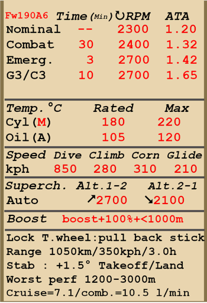

# Fw 190 A-6  

<table><tbody><tr><td style="text-align: center"></td><td style="text-align: center"></td></tr></td></tr></tbody></table>  

Приборная скорость сваливания в полётной конфигурации: 170..197 км/ч  
Приборная скорость сваливания в посадочной конфигурации: 156..178 км/ч  
Предельная скорость в пикировании: 850 км/ч  
Разрушающая перегрузка: 11 единиц  
Угол атаки сваливания, в полётной конфигурации: 19,5°  
Угол атаки сваливания, в посадочной конфигурации: 18,1°  
  
Максимальная истинная скорость у земли, режим двигателя - чрезвычайный: 563 км/ч  
Максимальная истинная скорость на высоте 3000 м, режим двигателя - чрезвычайный: 585 км/ч  
Максимальная истинная скорость на высоте 6250 м, режим двигателя - чрезвычайный: 661 км/ч  
  
Максимальная истинная скорость у земли, режим двигателя - боевой: 535 км/ч  
Максимальная истинная скорость на высоте 3000 м, режим двигателя - боевой: 560 км/ч  
Максимальная истинная скорость на высоте 6000 м, режим двигателя - боевой: 622 км/ч  
  
Практический потолок: 10400 м  
Скороподъёмность у земли: 15,0 м/с  
Скороподъёмность на высоте 3000 м: 11,3 м/с  
Скороподъёмность на высоте 6000 м: 8,9 м/с  
  
Время виража предельного по тяге у земли: 23,5 с, на скорости 280 км/ч по прибору  
Время виража предельного по тяге на высоте 3000 м: 35,5 с, на скорости 280 км/ч по прибору  
  
Продолжительность полёта на высоте 3000 м: 3,0 ч, на скорости 350 км/ч по прибору  
  
Скорость взлётная: 170..210 км/ч  
Скорость на глиссаде: 205..215 км/ч  
Скорость посадочная: 160..170 км/ч  
Посадочный угол: 12,5°  
  
Примечание 1: данные указаны для условий международной стандартной атмосферы.  
Примечание 2: диапазоны характеристик даны для допустимого диапазона масс самолёта.  
Примечание 3: максимальные скорости, скороподъемности и время виража даны для стандартной массы самолёта.  
Примечание 4: скороподъемность дана на боевом режиме работы двигателя, время виража - на чрезвычайном.  
  
Двигатель:  
Модель: BMW-801D  
Максимальная мощность на чрезвычайном режиме у земли: 1700 л.с.  
Максимальная мощность на чрезвычайном режиме на высоте 5700 м: 1440 л.с.  
Максимальная мощность на боевом режиме на высоте 700 м: 1520 л.с.  
Максимальная мощность на боевом режиме на высоте 5300 м: 1320 л.с.  
  
Режимы работы двигателя:  
Номинальный (время неограничено): 2300 об/мин, 1,2 атмосфер  
Боевой (до 30 минут): 2400 об/мин, 1,32 атмосфер  
Чрезвычайный (до 3 минут): 2700 об/мин, 1,42 атмосфер  
  
Температура масла на входе в двигатель номинальная: 60..70 °С  
Температура масла на входе в двигатель предельная: 85 °С  
Температура масла на выходе из двигателя номинальная: 105 °С  
Температура масла на выходе из двигателя предельная: 120 °С  
Температура головок номинальная: 180 °С  
Температура головок предельная: 220 °С  
Высота переключения нагнетателя: автомат  
  
Масса пустого самолёта: 3371 кг  
Минимальная масса (без БК, 10% топлива): 3553 кг  
Стандартная масса: 4140 кг  
Максимальная взлётная масса: 4766 кг  
Максимальный запас топлива: 409 кг / 524 л  
Максимальная полезная нагрузка: 1395 кг  
  
Вооружение курсовое:  
2 x 7,92мм пулемёт "MG 17", 900 патронов, 1200 выстр/мин, синхронизированный  
2 x 20мм пушка "MG 151/20", 250 снарядов, 700 выстр/мин, синхронизированная  
2 x 20мм пушка "MG 151/20", 140 снарядов, 700 выстр/мин, крыльевая  
  
Вооружение бомбовое:  
До 8 x 66 кг осколочно-фугасных авиабомб "SD 70"  
До 3 х 249 кг осколочно-фугасных авиабомб "SC 250"  
500 кг осколочно-фугасная авиабомба "SC 500"  
  
Вооружение ракетное:  
Две ракеты WGr.21 в сбрасываемых пусковых контейнерах  
  
Длина: 8,85 м  
Размах крыла: 10,51 м  
Площадь крыла: 18,3 кв.м  
  
Начало участия в боевых действиях: лето 1943  
  
Особенности эксплуатации:  
- Управление винтомоторной группой максимально автоматизировано: фактически для изменения тяги двигателя используется только РУД. Обороты винта, качество топливовоздушной смеси и температура масла не требуют ручного регулирования в полёте. Переключение скоростей нагнетателя также производится автоматически, высота переключения зависит от оборотов двигателя.  
- На модификации самолёта "G-3" и "G-3/R-5" установлена система дополнительного впрыска топлива С3. При её включении наддув увеличивается до 1.65 атмосфер, ограничение по времени - 10 минут. Система включается командой форсажа двигателя, работает только при РУД в положении 100%, автоматическом режиме управления винтом, и при высотах менее 1 км.  
- Выходные створки капота для воздушного охлаждения двигателя управляются вручную.  
- Для уменьшения разворачивающего момента самолёта воздушным потоком от винта при рулении по земле следует переключаться в ручной режим управления шагом винта и устанавливать винт на минимальный шаг.  
- При увеличении угла атаки до критических значений срыв потока с крыла происходит резко, почти без "предупреждающей тряски". Это требует повышенного внимания при энергичном маневрировании.  
- На самолёте нет триммеров. Регулировка планера осуществляется на земле специальными регулировочными отгибными пластинами на рулях.  
- Самолёт имеет переставной стабилизатор управляемый электромотором. Стабилизатор следует устанавливать на угол +1,5° перед взлётом и посадкой. Также можно пользоваться им как триммером, уменьшая усилия на ручке управления в полёте. Перед глубоким пикированием на большой скорости стабилизатор следует устанавливать так, чтобы для удержания самолёта в пикировании приходилось немного отдавать ручку управления "от себя".  
- Посадочные щитки самолёта имеют 3 фиксированных положения: убраны, взлётное положение (13°) и посадочное положение (58°). Привод щитков электрический с кнопочным управлением. Угол выпуска щитков можно проконтролировать по шкалам на левой и правой консолях крыла, а также по сигнальным лампам расположенным рядом с РУД.  
- Свободно-ориентируемое хвостовое колесо может быть застопорено в положении "по полёту" взятием РУС "на себя" от нейтрального положения. Колесо необходимо застопорить при продолжительном рулении по прямой, перед взлётом, а также при пробеге по ВПП на посадке.  
- Самолёт имеет раздельное управление гидравлическими тормозами левого и правого колёс шасси. Торможение каждого колеса осуществляется нажатием на верхнюю часть соответствующей педали.  
- Самолёт оборудован указателем топлива, который может показывать остаток топлива в каждом из баков. Выбор бака для индикации по-умолчанию производится комбинацией клавиш (RShift+I). Также есть сигнальная лампа аварийного остатка топлива 100 литров.  
- На высоких скоростях полёта фонарь кабины невозможно сдвинуть из-за скоростного напора воздуха. Конструкция фонаря кабины предусматривает систему аварийного сброса фонаря для покидания лётчиком самолёта в полёте.  
- Система управления бомбодержателем позволяет сбрасывать бомбы только по одной. Для модификаций "G-3" и "G-3/R-5" можно выбрать для сброса левый, правый или оба подкрыльевых держателя, но центральный держатель выбран всегда и каждое нажатие боевой кнопки сбрасывает одну из подвешенных на нём бомб.  
- Прицел имеет сдвижной светофильтр.  
  
Основные данные и рекомендуемые положения органов управления самолётом:  
1. Запуск двигателя:  
	- рекомендуемое положение рукояти управления смесью: автоматическое управление смесью  
	- рекомендуемое положение рукояти управления створками капота: закрыто  
	- рекомендуемое положения рукояти управления шагом: автоматическое управление шагом  
	- рекомендуемое положение рычага управления двигателем: 10%  
	- перед рулением необходимо разблокировать колесо  
  
2. Рекомендуемые положения рукояти смеси при различных режимах полёта: автоматическое управление смесью  
  
3. Рекомендуемые положения рукояти управления створками капота при различных режимах полёта:  
	- взлёт: открыто 50%  
	- крейсерский полёт: открыто 50%  
	- бой: открыто 50%  
  
4. Ориентировочный расход топлива на различных режимах работы на высоте 2000 м:  
	- крейсерский режим работы двигателя: 7,1 л/мин  
	- боевой режим работы двигателя: 10,5 л/мин  

## Модификации  
### Бомбовая нагрузка  

Подкрыльевые (G-3) и подфюзеляжный держатели с бомбами  
  
Центральный бомбодержатель ETC 501  
4 x 66 кг осколочно-фугасные авиабомбы SD 70:  
Дополнительная масса: 324 кг  
Масса вооружения: 264 кг  
Масса держателей: 60 кг  
Ориентировочная потеря скорости до сброса: 90 км/ч  
Ориентировочная потеря скорости после сброса: 46 км/ч  
  
249 кг осколочно-фугасная авиабомба SC 250:  
Дополнительная масса: 279 кг  
Масса вооружения: 249 кг  
Масса держателей: 30 кг  
Ориентировочная потеря скорости до сброса: 43 км/ч  
Ориентировочная потеря скорости после сброса: 17 км/ч  
  
500 кг осколочно-фугасная авиабомба SC 500:  
Дополнительная масса: 530 кг  
Масса вооружения: 500 кг  
Масса держателей: 30 кг  
Ориентировочная потеря скорости до сброса: 47 км/ч  
Ориентировочная потеря скорости после сброса: 17 км/ч  
  
### 2 ракеты WGr.21  

 Две ракеты WGr.21 в сбрасываемых пусковых контейнерах BR 21  
Дополнительная масса: 222 кг  
Масса вооружения: 188 кг  
Масса держателей: 34 кг  
Ориентировочная потеря скорости до запуска: 66 км/ч  
Ориентировочная потеря скорости после запуска: 17 км/ч  
Ориентировочная потеря скорости после сброса: 6 км/ч  
  
### Fw 190 G-3  

Штурмовой вариант самолёта Fw 190 G-3 включает в себя подкрыльевые держатели 250 кг бомб, подфюзеляжный бомбодержатель, модификацию мотора с увеличением наддува до 1.65 ATA (система C3) а также снимает внешние 20-мм пушки и пулемёты.  
  
Снимаемая масса: 151 кг  
Ориентировочная потеря скорости: 27 км/ч  
  
### Fw 190 G-3/R-5  

Штурмовой вариант самолёта Fw 190 G-3/R-5 включает в себя подкрыльевые держатели 70 кг бомб, подфюзеляжный бомбодержатель, модификацию мотора с увеличением наддува до 1.65 ATA (система C3) а также снимает внешние 20-мм пушки и пулемёты (пулемёты могут быть возвращены обратно специальной модификацией).  
  
Снимаемая масса: 151 кг  
Ориентировочная потеря скорости: 29 км/ч  
  
### Снятие пушек MG 151/20  

Снятие двух 20-мм крыльевых пушек MG 151/20 (только без выбранных модификаций "G-3" или "G-3/R-5").  
  
Масса снимаемого боекомплекта: 62 кг  
Масса снимаемых орудий: 87 кг  
  
### Установка пулемётов MG 17  

Установка двух 7.92-мм носовых пулемётов MG-17(только в комбинации с модификациями "Sturmjager" или "G-3/R-5").  
  
Масса устанавливаемого боекомплекта: 52 кг  
Масса устанавливаемых орудий: 20 кг  
  
### Fw 190 A-6 Sturmjäger  

Дополнительная защита: бронеплиты на боковых поверхностях кабины и боковые бронестёкла на козырьке и сдвижной части фонаря. Пулемёты сняты.  
Дополнительная масса: 34 кг  
Ориентировочная потеря скорости: 5 км/ч  
