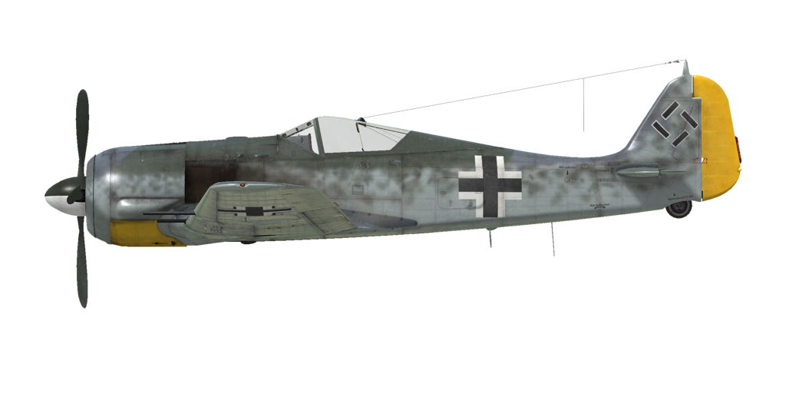

# Fw 190 A-6  
  
  
  
## Descripción  
  
Velocidad indicada de pérdida en configuración de vuelo: 170..197 km/h  
Velocidad indicada de pérdida en configuración de despegue/aterrizaje: 156..178 km/h  
Velocidad de picado límite: 850 km/h  
Carga de rotura máxima (en fuerzas <i>g</i>): 11 <i>g</i>  
Ángulo de ataque crítico en configuración de vuelo: 19,5°  
Ángulo de ataque crítico en configuración de aterrizaje: 18,1°  
  
Velocidad respecto al suelo al nivel del mar, modo motor - Emergencia: 563 km/h  
Velocidad máxima respecto al suelo a 3000 m, modo motor - Emergencia: 585 km/h  
Velocidad máxima respecto al suelo a 6400 m, modo motor - Emergencia: 661 km/h  
  
Velocidad respecto al suelo al nivel del mar, modo motor - Combate: 535 km/h  
Velocidad máxima respecto al suelo a 3000 m, modo motor - Combate: 560 km/h  
Velocidad máxima respecto al suelo a 6400 m, modo motor - Combate: 622 km/h  
  
Techo de servicio: 10400 m  
Tasa de ascenso al nivel del mar: 15,0 m/s  
Tasa de ascenso a 3000 m: 11,3 m/s  
Tasa de ascenso a 6000 m: 8,9 m/s  
  
Viraje de máximo rendimiento al nivel del mar: 23,5 s, a 280 km/h velocidad indicada (IAS).  
Viraje de máximo rendimiento a 3000 m: 35,5 s, a 280 km/h velocidad indicada (IAS).  
  
Autonomía de vuelo a 3000 m: 3,0 h, a 350 km/h velocidad indicada (IAS).  
  
Velocidad de despegue: 170..210 km/h  
Velocidad senda de planeo: 205..215 km/h  
Velocidad de aterrizaje: 160..170 km/h  
Ángulo de aterrizaje: 12,5°  
  
Nota 1: los datos están basados en la atmósfera estándar internacional (ISA).  
Nota 2: diferentes rendimientos de vuelo dados para los diferentes pesos posibles del avión.  
Nota 3: velocidades máximas, tasas de ascenso y tiempos de giro dados para el peso estándar del avión.  
Nota 4: tasas de ascenso dadas para la potencia de Combate; tiempos de giro dados para la potencia de Emergencia.  
  
Motor:  
Modelo: BMW-801D  
Potencia máxima en modo Emergencia al nivel del mar: 1700 CV  
Potencia máxima en modo Emergencia a 5700 m: 1440 CV  
Potencia máxima en modo Combate a 700 m: 1520 CV  
Potencia máxima en modo Combate a 5300 m: 1320 CV  
  
Modos de funcionamiento motor:  
Continuo (sin límite de tiempo): 2300 rpm, 1,2 ata  
Combate (hasta 30 minutos): 2400 rpm, 1,32 ata  
Emergencia (hasta 3 minutos): 2700 rpm, 1,42 ata  
  
Temperatura nominal del aceite en la admisión del motor: 60..70 °C  
Temperatura máxima del aceite en la admisión del motor: 85 °C  
Temperatura nominal del aceite a la salida del motor: 105 °C  
Temperatura máxima del aceite a la salida del motor: 120 °C  
Temperatura nominal en la culata: 180 °C  
Temperatura máxima en la culata: 220 °C  
Altitud conexión compresor: automático  
  
Peso vacío: 3371 kg  
Peso mínimo (sin munición, 10% de combustible): 3553 kg  
Peso estándar: 4140 kg  
Peso máximo al despegue: 4766 kg  
Carga de combustible: 409 kg / 524 l  
Carga útil: 1395 kg  
  
Armamento delantero:  
2 ametralladoras de 7,92 mm «MG 17», 900 balas, 1200 balas por minuto, sincronizadas  
2 cañones de 20 mm «MG 151/20», 250 balas, 700 balas por minuto, sincronizados  
2 cañones de 20 mm «MG 151/20», 140 balas, 700 balas por minuto, montados en ala  
  
Bombas:  
Hasta 8 bombas de propósito general de 66 kg «SD 70»  
Hasta 3 bombas de propósito general de 249 kg «SC 250»  
1 bomba de propósito general de 500 kg «SC 500»  
  
Cohetes:  
2 cohetes WGr.21 en lanzadores desechables  
  
Longitud: 8,85 m  
Envergadura alar: 10,51 m  
Superficie de ala: 18,3 m²  
  
Debut en combate: verano de 1943  
  
Características operativas:  
- El avión tiene una considerable automatización de la gestión del motor. De hecho, para controlar la velocidad solo es necesario utilizar la palanca de potencia. En vuelo normal no hay necesidad de fijar manualmente las revoluciones del motor ni la mezcla o la etapa del compresor. El compresor del motor tiene un sistema de conmutación automático que depende de la altitud y las revoluciones del motor.  
- La modificación G-3 y G-3/R-5 incluye un sistema adicional de inyección de combustible C3. Cuando entra en funcionamiento, incrementa la presión a 1,65 ata (tiempo límite 10 minutos). Este sistema solo puede activarse mediante la orden de impulso del motor cuando la palanca de potencia está al 100%, con el control automático de paso de hélice activado y en altitudes inferiores a 1 km.  
- Las persianas de salida en el carenado del motor se controlan manualmente.  
- Para reducir el balanceo durante el rodaje debido al flujo de la hélice, el control del paso de la hélice debe estar en modo manual y el paso debe reducirse al mínimo.  
- Cuando el ángulo de ataque se incrementa hasta niveles críticos el avión puede entrar en pérdida repentina e inesperadamente. Practicamente no hay ningún tipo de aviso previo (sacudidas, etc.) antes de entrar en pérdida. Para evitar ésto el piloto debe prestar una atención especial cuando realice maniobras extremas.  
- El avión no tiene compensadores de control en vuelo. Está equipado con unas aletas de compensación flexibles que pueden ser ajustadas antes del vuelo por el personal de tierra.  
- El avión cuenta con un estabilizador horizontal eléctrico. Debe fijarse a +1,5º antes del despegue y aterrizaje. Además, puede emplearse para compensar la palanca de control durante el vuelo. En un picado pronunciado el estabilizador debe fijarse de tal manera que el piloto tenga que empujar la palanca hacia adelante para mantener el ángulo de picado.  
- El avión cuenta con flaps eléctricos con tres posiciones prefijadas: subidos, despegue (13º) y aterrizaje (58º). Los controles y luces de estado de los flaps están situados en el panel izquierdo, cerca de la palanca de potencia. También se puede conocer el ángulo actual de los flaps mediante las marcas existentes en el ala izquierda y derecha.  
- El avión cuenta con un sistema de bloqueo de la rueda de cola que la bloquea cuando se tira de la palanca de control hacia atrás. Se debe bloquear la rueda cuando se vaya a rodar en línea recta durante un tramo largo y antes del despegue y tras tomar tierra en un aterrizaje.  
- El avión posee unos controles hidráulicos independientes para el frenado de la rueda izquierda y derecha. Para frenar cada una de ellas es necesario empujar la parte superior del pedal del control de timón correspondiente.  
- El avión cuenta con un indicador de combustible que muestra la cantidad de combustible remanente en el depósito frontal o trasero dependiendo de la posición del selector. En la simulación el selector conmuta de posición entre depósitos presionando «Mayús_Dcha + I». Además, el avión posee una luz de aviso de entrada en reserva (100 litros).  
- Es imposible abrir o cerrar la cubierta a altas velocidades a causa de la intensidad del flujo del aire. La cubierta tiene un sistema de desbloqueo de emergencia para facilitar el salto.  
- El controlador por defecto del lanzamiento de las bombas solo permite soltar las bombas instaladas en la panza de una en una. En las modificaciones G-3 y G-3/R-5, donde se pueden transportar bombas en soportes bajo las alas, se añade un pequeño controlador adicional al existente para gestionar el lanzamiento de estas bombas, en el lado izquierdo de la cabina. Así, es posible seleccionar si, junto a una bomba del soporte de la panza, se lanzarán al mismo tiempo todas las bombas instaladas en el ala izquierda, la derecha, o ambas.  
- La mira tiene un filtro solar deslizante.  
  
Datos básicos y configuraciones recomendadas de los controles del avión:  
1. Arranque del motor:  
	- palanca de control de la mezcla: (control de mezcla automático)  
	- aletas/persianas del carenado: cerradas  
	- palanca de control del paso de la hélice: (control paso hélice automático)  
	- palanca de potencia: 10%  
	- antes de empezar a rodar, desbloquear rueda de cola  
  
2. Posición de la palanca de control de mezcla según momento de vuelo: (control de mezcla automático)  
  
3. Posición de las aletas/persianas de carenado según momento de vuelo:  
	- despegue: abiertas 50%  
	- ascenso: abiertas 100%  
	- crucero: abiertas 30%  
	- combate: abiertas 70%  
  
4. Consumo aproximado de combustible a 2000 m de altitud:  
	- Modo motor - Crucero: 7,1 l/min  
	- Modo motor - Combate: 10,5 l/min  
  
## Modificaciones  
  
  
### Carga de bombas  
  
Bastidores con bombas instaladas para las alas y panza  
  
Soporte central para bombas ETC 501  
4 bombas de propósito general de 66 kg SD 70:  
Peso adicional: 324 kg  
Peso de munición: 264 kg  
Peso de los soportes: 60 kg  
Pérdida de velocidad estimada antes de soltar: 90 km/h  
Pérdida de velocidad estimada tras soltar: 46 km/h  
  
1 bomba de propósito general de 249 kg SC 250:  
Peso adicional: 279 kg  
Peso de munición: 249 kg  
Peso de los soportes: 30 kg  
Pérdida de velocidad estimada antes de soltar: 43 km/h  
Pérdida de velocidad estimada tras soltar: 17 km/h  
  
1 bomba de propósito general de 500 kg SC 500:  
Peso adicional: 530 kg  
Peso de munición: 500 kg  
Peso de los soportes: 30 kg  
Pérdida de velocidad estimada antes de soltar: 47 km/h  
Pérdida de velocidad estimada tras soltar: 17 km/h  
  
### 2 cohetes WGr.21  
  
2 cohetes WGr.21 en lanzadores desechables BR 21  
Peso adicional: 222 kg  
Peso de munición: 188 kg  
Peso de los soportes: 34 kg  
Pérdida de velocidad estimada antes de lanzarlos: 66 km/h  
Pérdida de velocidad estimada tras lanzarlos: 17 km/h  
Pérdida de velocidad estimada tras soltar lanzadores: 6 km/h  
  
  
### Fw 190 G-3  
  
La modificación de ataque a tierra G-3, basada en el Fw 190 A-6, incluye soportes bajo las alas para bombas de hasta 250 kg, soporte central ETC 501 en la panza, motor modificado para alcanzar 1,65 ata (sistema C3) y elimina las ametralladoras MG-17 y el cañón MG 151/20 más exterior montado en cada una de las alas.  
  
Peso retirado: 151 kg  
Pérdida de velocidad estimada: 27 km/h  
  
### Fw 190 G-3/R-5  
  
La modificación de ataque a tierra G-3/R-5, basada en el Fw 190 A-6, incluye soportes bajo las alas para bombas de hasta 70 kg, soporte central ETC 501 en la panza, motor modificado para alcanzar 1,65 ata (sistema C3) y elimina las ametralladoras MG-17 y el cañón MG 151/20 más exterior montado en cada una de las alas. Las ametralladoras pueden instalarse de nuevo con una modificación especial.  
  
Peso retirado: 151 kg  
Pérdida de velocidad estimada: 29 km/h  
  
### Desinstalación de MG 151/20  
  
Desinstalación de 2 cañones de 20 mm MG 151/20 montados en las alas (no compatible con modificación «G-3» o «G-3/R-5»)  
  
Peso de la munición retirada: 62 kg  
Peso de las armas retiradas: 87 kg  
  
  
### Instalación de MG 17  
  
Instalación de 2 ametralladores de 7,92 mm MG 17 montadas en el morro.  
Solamente disponible en combinación con las modificaciones «Sturmjäger» o «G-3/R-5».  
  
Peso de la munición adicional: 52 kg  
Peso de las armas adicional: 20 kg  
  
  
### Fw 190 A-6 Sturmjäger  
  
Incrementa la protección del piloto: planchas y cristales blindados adicionales en los laterales del parabrisas y ambos lados de la cabina. Ametralladoras retiradas.  
  
Peso adicional: 34 kg  
Pérdida de velocidad estimada: 5 km/h  