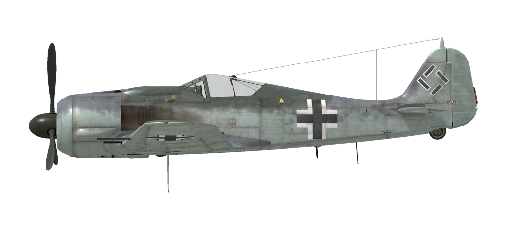

# Fw 190 A-8  

<table><tbody><tr><td style="text-align: center"></td><td style="text-align: center"></td></tr></tbody></table>  

## Description  

Vitesse de décrochage indiquée en configuration de vol : 177..208 km/h  
Vitesse de décrochage indiquée en configuration de décollage/atterrissage : 164..188 km/h  
Vitesse limite de piqué : 850 km/h  
Facteur de charge maximum : 11 g  
Angle d\attaque de décrochage en configuration de vol : 19,5°  
Angle d\attaque de décrochage indiquée en configuration d\atterrissage : 18,1°  
  
Vitesse sol au niveau de la mer, régime moteur - Urgence : 558 km/h  
Vitesse sol maximale à 3000 m, régime moteur - Urgence : 580 km/h  
Vitesse sol maximale à 6200 m, régime moteur - Urgence : 641 km/h  
  
Vitesse sol au niveau de la mer, régime moteur - Combat : 532 km/h  
Vitesse sol maximale à 3000 m, régime moteur - Combat : 558 km/h  
Vitesse sol maximale à 5800 m, régime moteur - Combat : 612 km/h  
  
Plafond opérationnel : 10300 m  
Taux de montée au niveau de la mer : 13,8 m/s  
Taux de montée à 3000 m : 10,1 m/s  
Taux de montée à 6000 m : 7,8 m/s  
  
Virage à 360° au niveau de la mer en : 24,2 s, à 280 km/h vitesse indiquée (IAS).  
Virage à 360° à 3000 m : 33,0 s, à 280 km/h vitesse indiquée (IAS).  
  
Endurance à 3000 m : 3,8 h, à 350 km/h vitesse indiquée (IAS).  
  
Vitesse de décollage : 180..220 km/h  
Vitesse d\approche : 215..225 km/h  
Vitesse d\atterrissage : 160..180 km/h  
Angle d\atterrissage : 12,5°  
  
Note 1 : les données sont indiquées à l\atmosphère standard international (ISA).  
Note 2 : les performances d\endurance sont données pour plusieurs masses possibles.  
Note 3 : la vitesse maximale, le taux de montée et le temps de virage sont donnés pour une masse standard.  
Note 4 : le taux de montée est à régime de combat, le temps de virage est à régime d\urgence.  
  
Moteur :  
Modèle : BMW-801D  
Puissance maximale au régime d\urgence au niveau de la mer : 1700 cv  
Puissance maximale au régime d\urgence à 5700 m : 1440 cv  
Puissance maximale au régime de combat à 700 m : 1520 cv  
Puissance maximale au régime de combat à 5300 m : 1320 cv  
  
Performance du moteur :  
Continu (durée illimitée) : 2300 tr/min, 1,2 ata  
Combat (jusqu\à 30 minutes) : 2400 tr/min, 1,32 ata  
Urgence (jusqu\à 3 minutes) : 2700 tr/min, 1,42 ata  
  
Température de fonctionnement d\huile à l\admission du moteur : 60..70 °C  
Température maximale d\huile à l\admission du moteur : 85 °C  
Température de fonctionnement d\huile en sortie du moteur : 105 °C  
Température maximale d\huile en sortie du moteur : 120 °C  
Température de fonctionnement des têtes de cylindre : 180 °C  
Température maximale des têtes de cylindre : 220 °C  
Altitude de changement d\étage du compresseur : automatique  
  
Masse à vide : 3504 kg  
Masse minimale (sans munitions, 10% de carburant) : 3697 kg  
Masse standard : 4391 kg  
Masse maximale au décollage : 5239 kg  
Masse de carburant : 498 kg / 639 l  
Charge utile : 1735 kg  
  
Armement offensif :  
2 canons MG 151/20 de 20 mm, 250 coups, 700 coups par minute, synchronisés  
2 canons MG 151/20 de 20 mm, 140 coups, 700 coups par minute, dans l\aile  
2 mitrailleuses MG 131 de 13 mm, 475 coups, 900 coups par minute, synchronisées  
2 canons MK 108 de 30 mm, 55 coups, 650 coups par minute, dans l\aile (modification)  
  
Bombes :  
Jusqu\à 8 bombes d\emploi général SD 70 de 66 kg  
Jusqu\à 3 bombes d\emploi général SC 250 de 249 kg  
1 bombe d\emploi général SС 500 de 500 kg  
1 bombe d\emploi général SС 1000 de 1090 kg  
  
Roquettes:  
2 WGr.21 roquettes  
Jusqu\à 12 Panzerblitz 1 roquettes (R-HL, M8)  
  
Longueur : 8,85 m  
Envergure : 10,51 m  
Surface alaire : 18,3 m²  
  
Premier engagement : printemps 1944  
  
Caractéristiques  
- Cet avion utilise une gestion automatique des réglages moteur et, de ce fait, pour contrôler la vitesse, il suffit  d\agir sur la manette des gaz. En vol normal, il n\est pas nécessaire de procéder au réglage manuel du nombre de tours moteur, du mélange ou de la suralimentation. Le compresseur moteur dispose d\un système de commutation automatique qui dépend de l\altitude et du régime du moteur.  
- There is an additional emergency engine mode system installed. When it is engaged, the first supercharger gear pressure increases to 1.58 ATA and the second gear pressure to 1.65 ATA, the time limit is 10 minutes. This system is turned on by the engine boost command and works only when the throttle is set to 100%, automatic propeller pitch system is engaged and the altitude is lower than critical altitude for a given supercharger gear.  
- Outlet cowl shutters are operated manually.  
- Pour atténuer le cahotement pendant le roulage dû au brassage de l\hélice, la commande du pas de l\hélice doit être commutée en mode manuel et le pas doit être réduit au minimum.  
- Lorsque l\angle d\attaque augmente à des niveaux critiques, l\aile peut décrocher soudainement et de façon inattendue. Il n\y a presque pas d\effet de pré-décrochage avant le décrochage. Pour éviter cela, le pilote doit accorder une attention supplémentaire lors de manoeuvres extrêmes.  
- L\avion n\a pas de trim en vol. L\avion est équipé de trim qui ne peut être réglées que par le personnel au sol, avant le vol.  
- L\avion possède un stabilisateur horizontal commandé manuellement et actionné électriquement. Il doit être réglé à + 1,5 ° avant le décollage et l\atterrissage. Il est aussi possible de trimer le manche pendant le vol. Dans un piqué accentué, le stabilistaeur doit être réglé de manière à pousser sur le manche pour maintenir l\angle de piqué.  
- L\avion a des volets d\atterrissage à commande électrique avec trois positions fixes: rétracté, décollage (13 °) et atterrissage (58 °). Les boutons de commande des volets sont situés sur le panneau gauche près de la manette des gaz. L\angle du volet peut également être vérifié par des indicateurs sur l\aile gauche et droite à l\extérieur du poste de pilotage.  
- L\avion a un système de verouillage de roulette de queue qui bloque la roulette de queue si le manche de vol est tiré vers l\arrière. La roue arrière doit être verrouillée en roulant droit sur une longue distance, avant le décollage et après l\atterrissage.  
- L\avion a des commandes de frein hydrauliques à gauche et à droite qui sont indépendantes. Pour freiner, poussez la partie supérieure de la pédale de direction.  
- The aircraft has a fuel gauge which shows remaining fuel in fuel tanks depending on switch position. In game the fuel indicator switch changes by pressing (RShift+I). Also, the airplane has an emergency fuel warning light (100 liters).  
- Il est impossible d\ouvrir ou de fermer la verrière à grande vitesse en raison d\un fort flux d\air. La verrière a un système d\éjection d\urgence dans le cas où vous devriez évacuer l\avion en plain vol.  
- The standard bomb release controller (without modification) allows dropping the bombs only one by one. The strike modification (F-8) bomb release controller allows to choose the bomb release order for underbelly and underwing bombs and the delay between each bomb in the salvo.  
- Le viseur a un filtre solaire coulissant.  
  
Basic data and recommended positions of the aircraft controls:  
1. Starting the engine:  
	- recommended position of the mixture control lever: auto mixture control  
	- recommended position of the cowl flap control handle: close  
	- recommended position of the prop pitch control handle: auto prop pitch control  
	- recommended position of the throttle lever: 10%  
	- before taxiing, you must unlock the tailwheel  
  
2. Recommended mixture control lever positions for various flight modes: auto mixture control  
  
3. Recommended positions of the cowl flap control handle for various flight modes:  
	- takeoff: open 50%  
	- climb: open 100%  
	- cruise flight: open 30%  
	- combat: open 70%  
  
4. Approximate fuel consumption at 2000 m altitude:  
	- Cruise engine mode: 7.2 l/min  
	- Combat engine mode: 10.5 l/min  

## Modifications  
### Sturmjäger  

Additional protection: side armour plates and armoured glass on the windshield sides.  
Masse supplémentaire : 85 kg  
Perte estimée de vitesse : 5 km/h  
  
### 21 cm BR  

Two WGr.21 rockets in jettisonable launchers  
Masse supplémentaire : 258 kg  
Masse des munitions : 224 kg  
Masse des pylones : 34 kg  
Perte estimée de vitesse avant le lancement : 67 km/h  
Perte estimée de vitesse après le lancement : 16 km/h  
Perte estimée de vitesse après le largage : 4 km/h  
  

### ETC 501 sur le support central  

4 bombes d’emploi général SD 70 de 66 kg:  
Masse supplémentaire : 324 kg  
Masse des munitions : 264 kg  
Masse des pylones : 60 kg  
Perte estimée de vitesse avant le largage : 93 km/h  
Perte estimée de vitesse après le largage : 46 km/h  
  
Bombe d’emploi général SC 250 de 249 kg:  
Masse supplémentaire : 279 kg  
Masse des munitions : 249 kg  
Masse des pylones : 30 kg  
Perte estimée de vitesse avant le largage : 43 km/h  
Perte estimée de vitesse après le largage : 16 km/h  
  
Bombe d’emploi général SC 500 de 500 kg:  
Masse supplémentaire : 530 kg  
Masse des munitions : 500 kg  
Masse des pylones : 30 kg  
Perte estimée de vitesse avant le largage : 48 km/h  
Perte estimée de vitesse après le largage : 16 km/h  
  
Bombe d’emploi général SC 1000 de 1090 kg:  
Masse supplémentaire : 1120 kg  
Masse des munitions : 1090 kg  
Masse des pylones : 30 kg  
Perte estimée de vitesse avant le largage : 85 km/h  
Perte estimée de vitesse après le largage : 28 km/h  
  
### Fw 190 F-8 / G-8  

Fw 190 F-8 "Schlachtflugzeug" strike modification includes additional fuselage bottom and engine armour, 70 kg underwing bomb or rocket holders and removes the outer MG151/20 wing-mounted guns.  
Fw 190 G-8 "Jabo-Rei" bomber modification is enabled when "Removal of MG 131" is also selected. This modification also allows to attach 250 kg underwing bombs.  
  
Additional mass: 68 kg  
Estimated speed loss: 17 km/h  
  
### 2 x Canon MK 108 de 30 mm  

Canon MK 108 de 30 mm monté dans le nez avec 55 obus  
Additional mass: 63 kg  
Masse des munitions : 64 kg  
Masse des canons : 116 kg  
Perte estimée de vitesse : 0 km/h  
  
### Removal of MG 131  

Removal of 2 nose-mounted 13mm machine guns (only together with "Sturmjäger" or "F-8/G-8" modifications).  
In combination with "F-8/G-8" modification it allows to carry one SC 1000 or two SC 250 bombs.  
  
Removed ammunition mass: 81 kg  
Removed guns mass: 40 kg  
