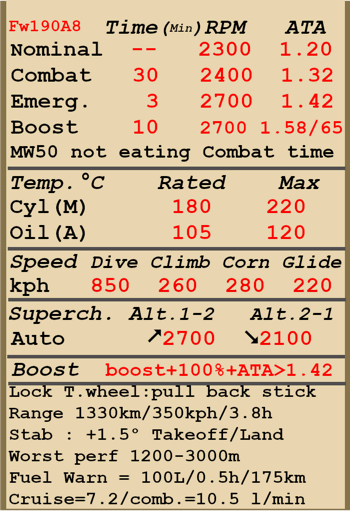

# Fw 190 A-8  

<table><tbody><tr><td style="text-align: center"></td><td style="text-align: center"></td></tr></tbody></table>  

## Описание  

Приборная скорость сваливания в полётной конфигурации: 177..208 км/ч  
Приборная скорость сваливания в посадочной конфигурации: 164..188 км/ч  
Предельная скорость в пикировании: 850 км/ч  
Разрушающая перегрузка: 11 единиц  
Угол атаки сваливания, в полётной конфигурации: 19,5°  
Угол атаки сваливания, в посадочной конфигурации: 18,1°  
  
Максимальная истинная скорость у земли, режим двигателя - чрезвычайный: 558 км/ч  
Максимальная истинная скорость на высоте 3000 м, режим двигателя - чрезвычайный: 580 км/ч  
Максимальная истинная скорость на высоте 6200 м, режим двигателя - чрезвычайный: 641 км/ч  
  
Максимальная истинная скорость у земли, режим двигателя - боевой: 532 км/ч  
Максимальная истинная скорость на высоте 3000 м, режим двигателя - боевой: 558 км/ч  
Максимальная истинная скорость на высоте 5800 м, режим двигателя - боевой: 612 км/ч  
  
Практический потолок: 10300 м  
Скороподъёмность у земли: 13,8 м/с  
Скороподъёмность на высоте 3000 м: 10,1 м/с  
Скороподъёмность на высоте 6000 м: 7,8 м/с  
  
Время виража предельного по тяге у земли: 24,2 с, на скорости 280 км/ч по прибору  
Время виража предельного по тяге на высоте 3000 м: 33,0 с, на скорости 280 км/ч по прибору  
  
Продолжительность полёта на высоте 3000 м: 3,8 ч, на скорости 350 км/ч по прибору  
  
Скорость взлётная: 180..220 км/ч  
Скорость на глиссаде: 215..225 км/ч  
Скорость посадочная: 160..180 км/ч  
Посадочный угол: 12,5°  
  
Примечание 1: данные указаны для условий международной стандартной атмосферы.  
Примечание 2: диапазоны характеристик даны для допустимого диапазона масс самолёта.  
Примечание 3: максимальные скорости, скороподъемности и время виража даны для стандартной массы самолёта.  
Примечание 4: скороподъемность дана на боевом режиме работы двигателя, время виража - на чрезвычайном.  
  
Двигатель:  
Модель: BMW-801D  
Максимальная мощность на чрезвычайном режиме у земли: 1700 л.с.  
Максимальная мощность на чрезвычайном режиме на высоте 5700 м: 1440 л.с.  
Максимальная мощность на боевом режиме на высоте 700 м: 1520 л.с.  
Максимальная мощность на боевом режиме на высоте 5300 м: 1320 л.с.  
  
Режимы работы двигателя:  
Номинальный (время неограничено): 2300 об/мин, 1,2 атмосфер  
Боевой (до 30 минут): 2400 об/мин, 1,32 атмосфер  
Чрезвычайный (до 3 минут): 2700 об/мин, 1,42 атмосфер  
  
Температура масла на входе в двигатель номинальная: 60..70 °С  
Температура масла на входе в двигатель предельная: 85 °С  
Температура масла на выходе из двигателя номинальная: 105 °С  
Температура масла на выходе из двигателя предельная: 120 °С  
Температура головок номинальная: 180 °С  
Температура головок предельная: 220 °С  
Высота переключения нагнетателя: автомат  
  
Масса пустого самолёта: 3504 кг  
Минимальная масса (без БК, 10% топлива): 3697 кг  
Стандартная масса: 4391 кг  
Максимальная взлётная масса: 5239 кг  
Максимальный запас топлива: 498 кг / 639 л  
Максимальная полезная нагрузка: 1735 кг  
  
Вооружение курсовое:  
2 x 20мм пушка "MG 151/20", 250 снарядов, 700 выстр/мин, синхронизированная  
2 x 20мм пушка "MG 151/20", 140 снарядов, 700 выстр/мин, крыльевая  
2 x 13мм пулемёт "MG 131", 475 патронов, 900 выстр/мин, синхронизированный  
2 x 30мм пушка "MK 108", 55 снарядов, 650 выстр/мин, крыльевая (модификация)  
  
Вооружение бомбовое:  
До 8 x 66 кг осколочных авиабомб "SD 70"  
До 3 x 249 кг осколочно-фугасных авиабомб "SC 250"  
500 кг осколочно-фугасная авиабомба "SС 500"  
1090 кг осколочно-фугасная авиабомба "SС 1000"  
  
Вооружение ракетное:  
Две ракеты WGr.21 в сбрасываемых пусковых контейнерах  
До 12 ракет Panzerblitz 1 (R-HL, M8)  
  
Длина: 8,85 м  
Размах крыла: 10,51 м  
Площадь крыла: 18,3 кв.м  
  
Начало участия в боевых действиях: весна 1944  
  
Особенности эксплуатации:  
- Управление винтомоторной группой максимально автоматизировано: фактически для изменения тяги двигателя используется только РУД. Обороты винта, качество топливовоздушной смеси и температура масла не требуют ручного регулирования в полёте. Переключение скоростей нагнетателя также производится автоматически, высота переключения зависит от оборотов двигателя.  
- На самолёте установлена система дополнительного чрезвычайного режима работы двигателя. При её включении наддув на первой ступени нагнетателя увеличивается до 1.58 атмосфер, на второй ступени - до 1.65 атмосфер, ограничение по времени - 10 минут. Система включается командой форсажа двигателя, работает только при РУД в положении 100%, автоматическом режиме управления винтом, и при высотах ниже расчётной для каждой ступени нагнетателя.  
- Выходные створки капота для воздушного охлаждения двигателя управляются вручную.  
- Для уменьшения разворачивающего момента самолёта воздушным потоком от винта при рулении по земле следует переключаться в ручной режим управления шагом винта и устанавливать винт на минимальный шаг.  
- При увеличении угла атаки до критических значений срыв потока с крыла происходит резко, почти без "предупреждающей тряски". Это требует повышенного внимания при энергичном маневрировании.  
- На самолёте нет триммеров. Регулировка планера осуществляется на земле специальными регулировочными отгибными пластинами на рулях.  
- Самолёт имеет переставной стабилизатор управляемый электромотором. Стабилизатор следует устанавливать на угол +1,5° перед взлётом и посадкой. Также можно пользоваться им как триммером, уменьшая усилия на ручке управления в полёте. Перед глубоким пикированием на большой скорости стабилизатор следует устанавливать так, чтобы для удержания самолёта в пикировании приходилось немного отдавать ручку управления "от себя".  
- Посадочные щитки самолёта имеют 3 фиксированных положения: убраны, взлётное положение (13°) и посадочное положение (58°). Привод щитков электрический с кнопочным управлением. Угол выпуска щитков можно проконтролировать по шкалам на левой и правой консолях крыла.  
- Свободно-ориентируемое хвостовое колесо может быть застопорено в положении "по полёту" взятием РУС "на себя" от нейтрального положения. Колесо необходимо застопорить при продолжительном рулении по прямой, перед взлётом, а также при пробеге по ВПП на посадке.  
- Самолёт имеет раздельное управление гидравлическими тормозами левого и правого колёс шасси. Торможение каждого колеса осуществляется нажатием на верхнюю часть соответствующей педали.  
- Самолёт оборудован указателем топлива, который может показывать остаток топлива в каждом из баков. Выбор бака для индикации по-умолчанию производится комбинацией клавиш (RShift+I). Также есть сигнальная лампа аварийного остатка топлива 100 литров.  
- На высоких скоростях полёта фонарь кабины невозможно сдвинуть из-за скоростного напора воздуха. Конструкция фонаря кабины предусматривает систему аварийного сброса фонаря для покидания лётчиком самолёта в полёте.  
- Система управления сбросом с центрального бомбодержателя (на стандартном варианте самолёта) позволяет сбрасывать бомбы только по одной. При использовании штурмового варианта самолёта (F-8) система управления сбросом позволяет выбрать последовательность сброса подфюзеляжных и подкрыльевых бомб, а также задержку между сбросами.  
- Прицел имеет сдвижной светофильтр.  
  
Основные данные и рекомендуемые положения органов управления самолётом:  
1. Запуск двигателя:  
	- рекомендуемое положение рукояти управления смесью: автоматическое управление смесью  
	- рекомендуемое положение рукояти управления створками капота: закрыто  
	- рекомендуемое положения рукояти управления шагом: автоматическое управление шагом  
	- рекомендуемое положение рычага управления двигателем: 10%  
	- перед рулением необходимо разблокировать колесо  
  
2. Рекомендуемые положения рукояти смеси при различных режимах полёта: автоматическое управление смесью  
  
3. Рекомендуемые положения рукояти управления створками капота при различных режимах полёта:  
	- взлёт: открыто 50%  
	- набор высоты: открыто 100%  
	- крейсерский полёт: открыто 30%  
	- бой: открыто 70%  
  
4. Ориентировочный расход топлива на различных режимах работы на высоте 2000 м:  
	- крейсерский режим работы двигателя: 7,2 л/мин  
	- боевой режим работы двигателя: 10,5 л/мин  

## Модификации  
### Sturmjäger  

Дополнительная защита: бронеплиты на боковых поверхностях кабины и боковые бронестёкла на козырьке фонаря.  
Дополнительная масса: 85 кг  
Ориентировочная потеря скорости: 5 км/ч  
  
### 2 ракеты WGr.21  

 Две ракеты WGr.21 в сбрасываемых пусковых контейнерах BR 21  
Дополнительная масса: 258 кг  
Масса вооружения: 224 кг  
Масса держателей: 34 кг  
Ориентировочная потеря скорости до запуска: 67 км/ч  
Ориентировочная потеря скорости после запуска: 16 км/ч  
Ориентировочная потеря скорости после сброса: 4 км/ч  
  

### Центральный бомбодержатель ETC 501  

4 x 66 кг осколочно-фугасные авиабомбы SD 70:  
Дополнительная масса: 324 кг  
Масса вооружения: 264 кг  
Масса держателей: 60 кг  
Ориентировочная потеря скорости до сброса: 93 км/ч  
Ориентировочная потеря скорости после сброса: 46 км/ч  
  
249 кг осколочно-фугасная авиабомба SC 250:  
Дополнительная масса: 279 кг  
Масса вооружения: 249 кг  
Масса держателей: 30 кг  
Ориентировочная потеря скорости до сброса: 43 км/ч  
Ориентировочная потеря скорости после сброса: 16 км/ч  
  
500 кг осколочно-фугасная авиабомба SC 500:  
Дополнительная масса: 530 кг  
Масса вооружения: 500 кг  
Масса держателей: 30 кг  
Ориентировочная потеря скорости до сброса: 48 км/ч  
Ориентировочная потеря скорости после сброса: 16 км/ч  
  
1090 кг осколочно-фугасная авиабомба SC 1000:  
Дополнительная масса: 1120 кг  
Масса вооружения: 1090 кг  
Масса держателей: 30 кг  
Ориентировочная потеря скорости до сброса: 85 км/ч  
Ориентировочная потеря скорости после сброса: 28 км/ч  
  
### Fw 190 F-8 / G-8  

Штурмовой вариант самолёта Fw 190 F-8 "Schlachtflugzeug" включает в себя дополнительное бронирование фюзеляжа снизу, подкрыльевые держатели 70 кг бомб или противотанковых ракет, а также снимает внешние 20-мм пушки.  
Бомбардировочный вариант самолёта Fw 190 G-8 "Jabo-Rei" доступен при одновременном включении модификации "Снятие пулемётов MG 131". Этот вариант также позволяет подвешивать подкрыльевые 250 кг бомбы.  
  
Дополнительная масса: 68 кг  
Ориентировочная потеря скорости: 17 км/ч  
  
### 30-мм пушки MK 108  

Крыльевые 30-мм пушки MK 108 с боезапасом 55 снарядов на каждую  
Дополнительная масса: 63 кг  
Масса боекомплекта: 64 кг  
Масса орудий: 116 кг  
Ориентировочная потеря скорости: 0 км/ч  
  
### Снятие пулемётов MG 131  

Снятие двух 13-мм носовых пулемётов (только в комбинации с модификациями "Sturmjäger" или "F-8/G-8").  
В комбинации с модификацией "F-8/G-8" позволяет подвешивать подкрыльевые бомбы SC 250 или бомбу SC 1000.  
  
Масса снимаемого боекомплекта: 81 кг  
Масса снимаемых орудий: 40 кг  
