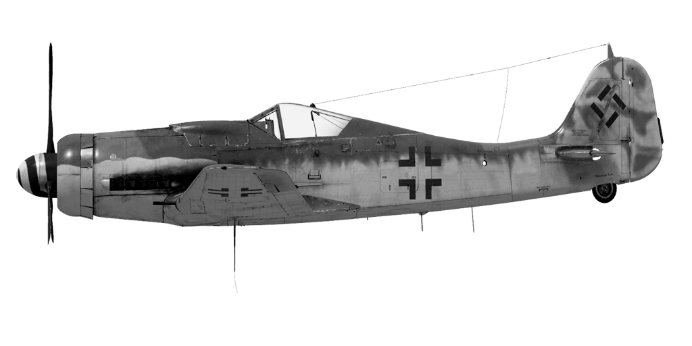

# Fw 190 D-9  

  
  

## Описание  

Приборная скорость сваливания в полётной конфигурации: 174..197 км/ч  
Приборная скорость сваливания в посадочной конфигурации: 160..181 км/ч  
Предельная скорость в пикировании: 850 км/ч  
Разрушающая перегрузка: 11 единиц  
Угол атаки сваливания, в полётной конфигурации: 19,5°  
Угол атаки сваливания, в посадочной конфигурации: 18,1°  
  
Максимальная истинная скорость у земли, режим двигателя - чрезвычайный: 607 км/ч  
Максимальная истинная скорость на высоте 2000 м, режим двигателя - чрезвычайный: 641 км/ч  
Максимальная истинная скорость на высоте 5200 м, режим двигателя - чрезвычайный: 694 км/ч  
  
Максимальная истинная скорость у земли, режим двигателя - боевой: 565 км/ч  
Максимальная истинная скорость на высоте 3200 м, режим двигателя - боевой: 623 км/ч  
Максимальная истинная скорость на высоте 6500 м, режим двигателя - боевой: 663 км/ч  
  
Практический потолок: 11600 м  
Скороподъёмность у земли: 19,0 м/с  
Скороподъёмность на высоте 3000 м: 17,3 м/с  
Скороподъёмность на высоте 6000 м: 14,6 м/с  
  
Время виража предельного по тяге у земли: 20,0 с, на скорости 300 км/ч по прибору  
Время виража предельного по тяге на высоте 3000 м: 29,0 с, на скорости 300 км/ч по прибору  
  
Продолжительность полёта на высоте 3000 м: 2,5 ч, на скорости 350 км/ч по прибору  
  
Скорость взлётная: 180..220 км/ч  
Скорость на глиссаде: 215..225 км/ч  
Скорость посадочная: 160..180 км/ч  
Посадочный угол: 12,5°  
  
Примечание 1: данные указаны для условий международной стандартной атмосферы.  
Примечание 2: диапазоны характеристик даны для допустимого диапазона масс самолёта.  
Примечание 3: максимальные скорости, скороподъемности и время виража даны для стандартной массы самолёта.  
Примечание 4: скороподъемность дана на боевом режиме работы двигателя, время виража - на чрезвычайном.  
  
Двигатель:  
Модель: Jumo-213 A1  
Максимальная мощность на чрезвычайном режиме у земли: 2130 л.с.  
Максимальная мощность на чрезвычайном режиме на высоте 3800 м: 1980 л.с.  
Максимальная мощность на боевом режиме у земли: 1900 л.с.  
Максимальная мощность на боевом режиме на высоте 5100 м: 1680 л.с.  
  
Режимы работы двигателя:  
Номинальный (время неограничено): 3000 об/мин, 1,42 атмосфер  
Боевой (до 30 минут): 3250 об/мин, 1,51 атмосфер  
Чрезвычайный (до 3 минут): 3250 об/мин, 1,7 атмосфер  
Чрезвычайный с впрыском MW-50 (до 10 минут): 3250 об/мин, 1,8 атмосфер  
  
Температура воды на выходе из двигателя номинальная: 55..100 °С  
Температура воды на выходе из двигателя предельная: 110 °С  
Температура масла на выходе из двигателя номинальная: 40..110 °С  
Температура масла на выходе из двигателя предельная: 120 °С  
  
Высота переключения нагнетателя: автомат  
  
Масса пустого самолёта: 3443 кг  
Минимальная масса (без БК, 10% топлива): 3759 кг  
Стандартная масса: 4289 кг  
Максимальная взлётная масса: 4832 кг  
Максимальный запас топлива: 388 кг / 524 л  
Максимальная полезная нагрузка: 1389 кг  
  
Вооружение курсовое:  
2 x 20мм пушка "MG 151/20", 250 снарядов, 700 выстр/мин, крыльевая  
2 x 13мм пулемёт "MG 131", 475 патронов, 900 выстр/мин, синхронизированный  
  
Вооружение бомбовое:  
До 4 x 66 кг осколочных авиабомб "SD 70"  
249 кг осколочно-фугасная авиабомба "SC 250"  
500 кг осколочно-фугасная авиабомба "SС 500"  
  
Вооружение ракетное:  
Две ракеты WGr.21 в сбрасываемых пусковых контейнерах  
26 ракет R4M  
  
Длина: 10,2 м  
Размах крыла: 10,51 м  
Площадь крыла: 18,3 кв.м  
  
Начало участия в боевых действиях: конец сентября 1944  
  
Особенности эксплуатации:  
- Управление винтомоторной группой максимально автоматизировано: фактически для изменения тяги двигателя используется только РУД. Обороты винта, качество топливовоздушной смеси и температура масла не требуют ручного регулирования в полёте. Переключение скоростей нагнетателя также производится автоматически, высота переключения зависит от оборотов двигателя.  
- На самолёте имеется система впрыска водометаноловой смеси MW-50. Система используется для предотвращения детонации при работе мотора на чрезвычайном режиме. Система включается пилотом.  
- Створки водорадиатора управляются автоматически, поддерживая заданную пилотом температуру ОЖ с помощью термостата. Настройка термостата на 0% (по умолчанию) достаточна для всех режимов полёта, но в случае необходимости она может быть увеличена вплоть до 100% для более агрессивного охлаждения двигателя.  
- При увеличении угла атаки до критических значений срыв потока с крыла происходит резко, почти без "предупреждающей тряски". Это требует повышенного внимания при энергичном маневрировании.  
- На самолёте нет триммеров. Регулировка планера осуществляется на земле специальными регулировочными отгибными пластинами на рулях.  
- Самолёт имеет переставной стабилизатор управляемый электромотором. Стабилизатор следует устанавливать на угол +1,5° перед взлётом и посадкой. Также можно пользоваться им как триммером, уменьшая усилия на ручке управления в полёте. Перед глубоким пикированием на большой скорости стабилизатор следует устанавливать так, чтобы для удержания самолёта в пикировании приходилось немного отдавать ручку управления "от себя".  
- Посадочные щитки самолёта имеют 3 фиксированных положения: убраны, взлётное положение (13°) и посадочное положение (58°). Привод щитков электрический с кнопочным управлением. Угол выпуска щитков можно проконтролировать по шкалам на левой и правой консолях крыла.  
- Свободно-ориентируемое хвостовое колесо может быть застопорено в положении "по полёту" взятием РУС "на себя" от нейтрального положения. Колесо необходимо застопорить при продолжительном рулении по прямой, перед взлётом, а также при пробеге по ВПП на посадке.  
- Самолёт имеет раздельное управление гидравлическими тормозами левого и правого колёс шасси. Торможение каждого колеса осуществляется нажатием на верхнюю часть соответствующей педали.  
- Самолёт оборудован указателем топлива, который может показывать остаток топлива в каждом из баков. Выбор бака для индикации по-умолчанию производится комбинацией клавиш (RShift+I). Также есть сигнальная лампа аварийного остатка топлива 100 литров.  
- На высоких скоростях полёта фонарь кабины невозможно сдвинуть из-за скоростного напора воздуха. Конструкция фонаря кабины предусматривает систему аварийного сброса фонаря для покидания лётчиком самолёта в полёте.  
- Система управления сбросом с центрального бомбодержателя позволяет сбрасывать бомбы только по одной.  
- Прицел имеет сдвижной светофильтр.  
  
Основные данные и рекомендуемые положения органов управления самолётом:  
1. Запуск двигателя:  
	- рекомендуемое положение рукояти управления смесью: автоматическое управление смесью  
	- рекомендуемое положение рукояти управления радиаторами: автоматическое управление радиаторами  
	- рекомендуемое положения рукояти управления шагом винта: автоматическое управление шагом  
	- рекомендуемое положение рычага управления двигателем: 10%  
  
2. Рекомендуемые положения рукояти смеси при различных режимах полёта: автоматическое управление смесью  
  
3. Рекомендуемые положения рукояти управления створками капота (термостатом) при различных режимах полёта:  
	- взлёт: открыто 50%  
	- набор высоты: открыто 100%  
	- крейсерский полёт: открыто 70%  
	- бой: открыто 100%  
  
4. Ориентировочный расход топлива на различных режимах работы на высоте 2000 м:  
	- крейсерский режим работы двигателя: 9,7 л/мин  
	- боевой режим работы двигателя: 11,2 л/мин  

## Модификации  
### 2 ракеты WGr.21  

 Две ракеты WGr.21 в сбрасываемых пусковых контейнерах BR 21  
Дополнительная масса: 258 кг  
Масса вооружения: 224 кг  
Масса держателей: 34 кг  
Ориентировочная потеря скорости до запуска: 58 км/ч  
Ориентировочная потеря скорости после запуска: 12 км/ч  
Ориентировочная потеря скорости после сброса: 1 км/ч  
  
### Каплевидный фонарь  

Каплевидный фонарь  
Дополнительная масса: 3 кг  
Ориентировочная потеря скорости: 1 км/ч  
  
### Гироприцел  

Гироприцел EZ42  
Дополнительная масса: 13 кг  
Ориентировочная потеря скорости: 0 км/ч  

### 26 х R4M  

26 55-мм реактивных осколочных снарядов R4M  
Дополнительная масса: 107 кг  
Масса вооружения: 87 кг  
Масса держателей: 20 кг  
Ориентировочная потеря скорости до пуска: 24 км/ч  
Ориентировочная потеря скорости после пуска: 14 км/ч  

### 1 x SC 250  

249 кг осколочно-фугасная авиабомба SC 250  
Дополнительная масса: 279 кг  
Масса вооружения: 249 кг  
Масса держателей: 30 кг  
Ориентировочная потеря скорости до сброса: 31 км/ч  
Ориентировочная потеря скорости после сброса: 6 км/ч  
  

### 1 x SC 500  

500 кг осколочно-фугасная авиабомба SC 500  
Дополнительная масса: 530 кг  
Масса вооружения: 500 кг  
Масса держателей: 30 кг  
Ориентировочная потеря скорости до сброса: 35 км/ч  
Ориентировочная потеря скорости после сброса: 6 км/ч  
  
### 4 x SD 70  

4 x 66 кг осколочные авиабомбы SD 70  
Дополнительная масса: 324 кг  
Масса вооружения: 264 кг  
Масса держателей: 60 кг  
Ориентировочная потеря скорости до сброса: 61 км/ч  
Ориентировочная потеря скорости после сброса: 13 км/ч  
