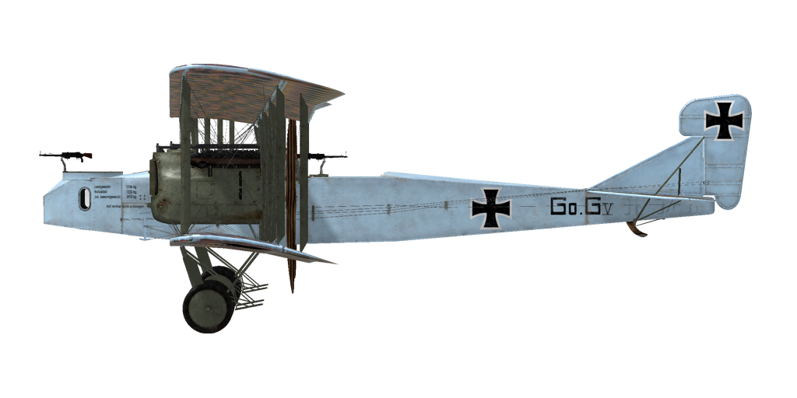

# Gotha G.V  
  
  
  
## Описание  
  
Самолёт стал следующим шагом развития конструкции Gotha G.IV. Боевой опыт показал, что близость топливных баков к двигателю чрезвычайно опасна. Топливные баки перенесли в фюзеляж. Недостаток качественных материалов привел к увеличению веса конструкции. Нижняя часть фюзеляжа сохранила пулемётный туннель для стрельбы назад и вниз. Для увеличения устойчивости самолёта при маневрах на земле были укорочены стойки шасси, что вызвало необходимость приподнять мотогондолу над крылом. Пожалуй, это главное внешнее отличие серии V от предыдущих моделей. В октябре 1916 года было заказано 100 бомбардировщиков. В августе 1917 года завод покинули первые Gotha G.V. Самолёт выпускался фабрикой Gothaer Waggonfabrik A.G. Всего было изготовлено 205 экземпляров серии V.  
Самолёт применялся для нанесения ударов по стратегическим целям противника и бомбардировки Лондона. К концу войны Gotha G.V использовался как ночной бомбардировщик.  
При полной боевой загрузке самолёт в полёте был стабилен, однако при возращении на аэродром обладал минимальной устойчивостью и неприятной тяжестью хвостового оперения. Для борьбы с этим недостатком хвостовой стрелок садился рядом с пилотом, впоследствии концы крыльев просто сместили назад на 20 см. При посадке самолёт проявлял тенденцию к развороту, которая сохранялась до самого касания земли. В феврале 1918 года устанавливают дополнительные шасси призванные сделать посадку безопаснее и избежать капотирования. Самолёт принимал участие в боевых действиях на Западном фронте.  
  
  
Двигатели: два рядных 6-ти цилиндровых Mercedes D. IVa  
Мощность: 260 л.с.  
  
Размеры:  
Высота: 4300 мм  
Длина: 12400 мм  
Размах крыла: 23700 мм  
Площадь крыла: 89,5 кв.м  
  
Вес:  
Пустой: 2739,8 кг  
Экипаж: 240 кг  
Объём топливных баков: 841 литр (626,8 кг)  
Объём маслобакa: 43 литров (79,8 кг)     
Взлётный без бомб: 3745,4 кг  
Взлётный с 350 кг бомб: 4095 кг  
  
Скорость (приборная), без бомб:  
на уровне моря - 137,6 км/ч  
1000 м - 132,7 км/ч  
2000 м - 126,7 км/ч  
3000 м - 121,7 км/ч  
4000 м - 113,9 км/ч  
5000 м - 102,6 км/ч  
  
Скороподъёмность, с полной заправкой, без бомб:  
1000 м - 6 мин.  
2000 м - 12 мин. 38 сек.  
3000 м - 20 мин. 46 сек.  
4000 м - 32 мин. 07 сек.  
5000 м - 53 мин. 37 сек.  
  
Скороподъёмность, с полной заправкой, 350 кг бомб:  
1000 м - 7 мин. 35 сек.  
2000 м - 16 мин. 20 сек.  
3000 м - 27 мин. 51 сек.  
4000 м - 47 мин. 53 сек.  
  
Практический потолок: 4650 м (6850 м без бомб)  
  
Продолжительность полёта: 5 ч. (7 ч. без бомб)  
  
Вооружение:  
Носовая стрелковая позиция:  1 х Parabellum LMG 14/17 7,92мм, 4 барабана по 250 патронов каждый  
Верхняя хвостовая стрелковая позиция:  1 х Parabellum LMG 14/17 7,92мм, 4 барабана по 250 патронов каждый  
  
Варианты бомбовых загрузок:  
7 x 50кг (350кг)  
7 x 100кг (700кг)  
4 x 100кг (400кг)  
1 х 300кг + 4 x 100кг (700кг)  
1 х 300кг (300кг)  
  
700кг максимум  
  
Использованные источники:  
1) Gotha by P.M. Grosz  
2) German Aircraft of World War I. Grey and Thetford Putnam Books. ISBN  0-933852-71-1  
3) The Gotha G1-G5. Profile Publications Number 115  
4) The Gotha. Flight magazine 1917.  
  
## Модификации  
### Авиабомбы P.u.W.  
  
До 7 осколочно-фугасных авиабомб 50 kg P.u.W.  
Дополнительная масса: 434 кг  
Масса вооружения: 350 кг  
Масса держателей: 84 кг  
Ориентировочная потеря скорости до сброса: 2 км/ч  
Ориентировочная потеря скорости после сброса: 1 км/ч  
  
До 7 осколочно-фугасных авиабомб 100 kg P.u.W.  
Дополнительная масса: 784 кг  
Масса вооружения: 700 кг  
Масса держателей: 84 кг  
Ориентировочная потеря скорости до сброса: 2.5 км/ч  
Ориентировочная потеря скорости после сброса: 1 км/ч  
  
4 осколочно-фугасных авиабомбы 100 kg P.u.W. и одна осколочно-фугасная авиабомба 300 kg P.u.W.  
Дополнительная масса: 760 кг  
Масса вооружения: 700 кг  
Масса держателей: 60 кг  
Ориентировочная потеря скорости до сброса: 2 км/ч  
Ориентировочная потеря скорости после сброса: 1 км/ч  
  
Одна осколочно-фугасная авиабомба 300 kg P.u.W.  
Дополнительная масса: 312 кг  
Масса вооружения: 300 кг  
Масса держателей: 12 кг  
Ориентировочная потеря скорости до сброса: 1.5 км/ч  
Ориентировочная потеря скорости после сброса: 1 км/ч  
### Задняя 20мм пушка Becker  
  
Задняя турель с 20мм автоматической пушкой Becker  
Боезапас: 60 снарядов 20мм (4 магазина по 15 снарядов в каждом)  
Тип боеприпасов: ОФ/БР (бронебойные и осколочно-фугасные)  
Скорострельность: 300 выстр/мин  
Масса снаряда: 120/130 г  
Дульная скорость: 450/490 м/с  
Масса оружия: 30 кг  
Масса станины: 10 кг  
Масса боезапаса: 25 кг  
Общая масса: 65 кг  
Примерная потеря скорости: 2 км/ч  
### Задние пулемёты Parabellum  
  
Задняя кольцевая турель со спаренными пулемётами Parabellum  
Боезапас: 2000 патронов 7.92мм (8 магазинов по 250 патронов в каждом)  
Масса пули: 10 г  
Дульная скорость: 825 м/с  
Скорострельность: 700 выстр/мин  
Масса оружия: 19 кг (без магазинов)  
Масса станины: 5 кг  
Масса боезапаса: 40 кг  
Общая масса: 64 кг  
Примерная потеря скорости: 1 км/ч  
### Освещение кабины  
  
Лампа ночного освещения кабины самолёта  
Дополнительная масса: 1 кг  
### Топливомер и часы  
  
Стрелочный указатель уровня топлива (0-800 литров) и механические часы  
Дополнительная масса: 0,5 кг  
### Передняя 20мм пушка Becker  
  
Передняя турель с 20мм автоматической пушкой Becker  
Боезапас: 60 снарядов 20мм (4 магазина по 15 снарядов в каждом)  
Тип боеприпасов: ОФ/БР (бронебойные и осколочно-фугасные)  
Скорострельность: 300 выстр/мин  
Масса снаряда: 120/130 г  
Дульная скорость: 450/490 м/с  
Масса оружия: 30 кг  
Масса станины: 10 кг  
Масса боезапаса: 25 кг  
Общая масса: 65 кг  
Примерная потеря скорости: 2 км/ч  
### Передние пулемёты Parabellum  
  
Передняя кольцевая турель со спаренными пулемётами Parabellum  
Боезапас: 2000 патронов 7.92мм (8 магазинов по 250 патронов в каждом)  
Масса пули: 10 г  
Дульная скорость: 825 м/с  
Скорострельность: 700 выстр/мин  
Масса оружия: 19 кг (без магазинов)  
Масса станины: 5 кг  
Масса боезапаса: 40 кг  
Общая масса: 64 кг  
Примерная потеря скорости: 1 км/ч  
