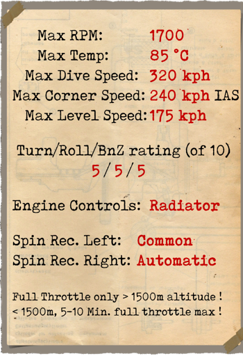

# Halberstadt CL.II 200hp  

  
  

## 描述  

哈尔伯施塔特（Halberstadt）CL.II的设计是对1916年8月德意志帝国空中力量管理局发布招标规格的回应，该规格是针对新型160-180 HP发动机的“轻型C型”。   
  
其目的是创造一种双座护航战斗机，以保护更重的观测飞机免受协约国战斗机的攻击。1916年11月，管理局订购了三架采用梅赛德斯（Mercedes）D.III发动机的哈尔伯施塔特CL.II原型机，并于1917年4月推出了第一架成机。经过几次机翼设计的变更后，该型飞机于1917年5月2日至7日在阿德尔斯多夫（Adlesdorf）进行了最终测试。   
  
1917年8月开始向前线交付飞机，主要供应给护航小队（Schutzstaffeln）和对地攻击小队（Schlachtstaffeln）。它的爬升能力和机动性极佳，被机组人员视为与信天翁（Albatros）D.III/V等单发战斗机非常接近。虽然该飞机能够携带拍照和无线电装置，并且主要用作护航战斗机，但也被用作对地攻击机。由于其良好的机动性和快速改变飞行高度的能力，它能够避开敌方地面火力，并成功地用于打击敌方地面部队和其他前线设施。   
  
由于其良好的性能和对抗敌方战斗机的能力，并且轻巧舒适，CL.II在整个战争中一直是飞行员的首选，并与其他新型飞机一起服役。   
  
目前尚不清楚确切制造了多少CL.II，但是900架来自于哈尔伯施塔特飞机制造公司（Halberstadter Flugzeugwerke）的飞机满足了6个管理局生产订单，再加上巴伐利亚飞机公司（Bayerische Flugzeug Werke AG）的300架飞机（分两个订单），因此总共约有1200架。   
  
梅赛德斯D.IIIaü发动机在高空的性能有所改善，但在低空将油门调至最大可能会引起发动机爆震。   
  
  
发动机： 直列六缸梅赛德斯（Mercedes）D.IIIaü  
功率：200 HP  
  
尺寸：  
高度：2750 mm  
长度：7300 mm  
翼展：10770 mm  
机翼面积：27.5 m²  
  
重量：  
空载重量：735 kg  
组员重量：160 kg  
燃油容量：155 L（115 kg）  
滑油容量：28 L（22 kg）  
不挂炸弹起飞：1032 kg  
起飞携带3 x 50 kg炸弹: 1182 kg  
起飞携带12 x 12.5 kg炸弹: 1182 kg  
  
最大空速(指示空速)，无炸弹  
海平面——174 km/h  
1000——164 km/h  
2000——154 km/h  
3000——144 km/h  
4000——132 km/h  
5000——120 km/h  
6000——100 km/h  
  
爬升率，燃油装载，无炸弹：  
1000 m——4min 20s  
2000 m——9min 38s  
3000 m——16min 44s  
4000 m——27min 27s  
  
实用升限：4900 m  
理论升限：6100 m  
  
1000m高度的续航时间：  
标称动力（战斗）— 3h  
最低消耗— 6h 40min  
  
武器：  
前射：1 х LMG 08/15 史宾道（Spandau） 7.92mm，500发  
炮塔: 1 х LMG 14/17 帕拉贝伦（Parabellum） 7.92mm，3个弹箱每个250发  
  
炸弹装载种类：  
12 x 12.5 kg（150 kg）  
1 x 50 kg+ 8 x 12.5 kg（150 kg）  
3 x 50 kg（150 kg）  
4 x 12.5 kg（50 kg）  
1 x 50 kg（50 kg）  
共计150 kg  
  
参考  
1) Schlachtflieger by Rick Duiven，Dan-San Abbott.  
2) Report on the Halberstadt Fighter，October 1918，Flight.  
3) Windsock Datafile 27 Halberstadt CL.II P.M. Grosz.  

## 修改  
### 阿尔迪斯（Aldis）瞄准具（战利品）  

阿尔迪斯（Aldis）折射型直筒瞄准具  
增加质量：2 kg  
  
### 20mm贝克（Becker）炮塔  

装有贝克（Becker）机炮的炮塔  
弹药：60发20mm弹药（4个弹匣，每个15发）  
弹药类型：HE/AP（高爆和穿甲弹）  
射速：300 rpm  
弹丸重量：120/130 g  
膛口速度：450/490 m/s  
枪炮重量：30 kg  
基座重量：10 kg  
弹药重量：25 kg  
总重：65 kg  
预期速度损失：6 km/h  

### P.u.W. 炸弹  

最多12 x 12.5 kg P.u.W. 通用炸弹  
增加质量：186 kg  
弹药质量：150 kg  
挂架质量：36 kg  
投弹前预期速度损失：4 km/h  
投弹后预期速度损失：2 km/h  
  
最多3 x 50 kg P.u.W. 通用炸弹  
增加质量：186 kg  
弹药质量：150 kg  
挂架质量：36 kg  
投弹前预期速度损失：4 km/h  
投弹后预期速度损失：2 km/h  

### 驾驶舱照明  

用于夜间飞行的驾驶舱照明灯  
增加质量：1 kg  
  
### 附加仪表  

威廉·莫雷尔(Wilhelm Morell)风速仪(45-250 km/h)  
  
D.R.G.M液体测斜仪（地面指示坡度，飞行中指示侧滑）  
  
A·施莱格 m尔奇(A.Schlegelmilch)发动机冷却液温度指示器(0-100℃)  
  
机械时钟  
  
增加质量：3 kg  

### 相机  

可拍摄航空照片的相机  
增加质量：10 kg  

### 无线电  

无线电发射机  
增加质量：10 kg  
  
### 双帕拉贝伦（Parabellum）机枪炮塔  

带有双帕拉贝伦（Parabellum）机枪的旋转炮塔。  
弹药：1500发7.92mm弹药（6个弹鼓，每个250发）  
弹丸重量：10 g  
膛口速度：825 m/s  
射速：700 rpm  
枪炮重量：19 kg（无弹鼓）  
基座重量：5 kg  
弹药重量：30 kg  
总重：54 kg  
预期速度损失：8 km/h  
  
### 双史宾道（Spandau）机枪  

双固定前射LMG 08/15机枪。  
弹药：1000发7.92mm弹药（每挺500发）  
弹丸重量：10 g  
膛口速度：825 m/s  
射速：650 rpm  
枪炮重量：26 kg  
基座重量：8 kg  
弹药重量：20 kg  
总重：54 kg  
预期速度损失：4 km/h  
