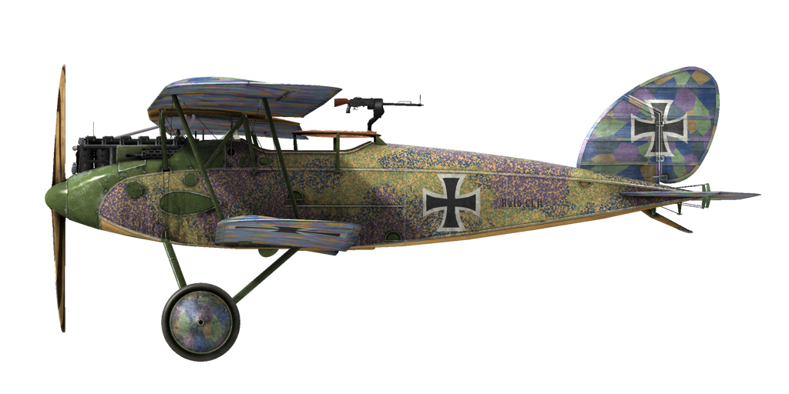
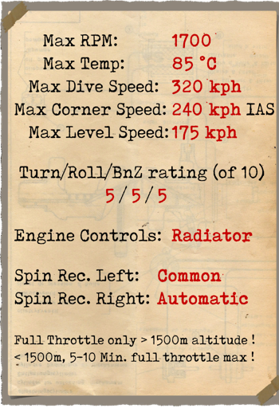
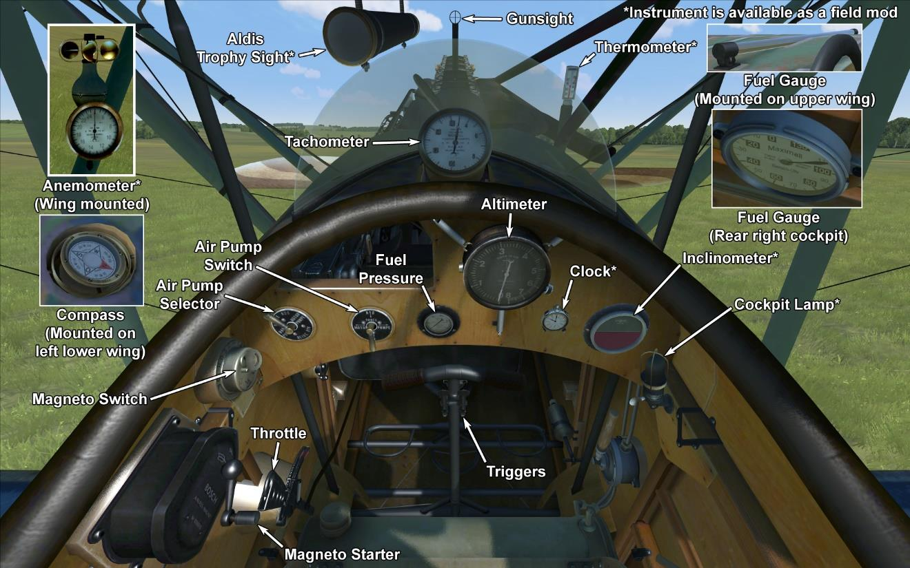

# Halberstadt CL.II 200hp  

<table><tbody><tr><td style="text-align: center"></td><td style="text-align: center"></td></tr><tr><td style="text-align: center" colspan="2"></td></tr></tbody></table>  

## Beschreibung  

Die Entwicklung der Halberstadt CL.II war eine Antwort auf eine im August 1916 herausgegebene Anforderung der Idflieg (Inspektion der Fliegertruppen) für einen neuen "leichten C-Typen" mit einem 160 bis 180 PS starken Motor.  
  
Zweck war es, ein zweisitziges Begleitjagdflugzeug zum Schutze schwerer Aufklärer vor Angriffen alliierter Jäger zu entwickeln. Im November 1916 ordnete die Idflieg den Bau dreier Prototypen der Halberstadt CL.II mit Mercedes D.III als Motor an, sodass das erste fertige Flugzeug im April 1917 die Montagehalle verließ. Nach geringen Veränderungen im Aufbau der Flügel ging der Typ vom 2. zum 7. Mai 1917 nach Adlesdorf in die abschließende Erprobung.  
  
Die Lieferung der Maschinen zum Fronteinsatz begann im August 1917, hauptsätzlich an Schutzstaffeln (Schustas, Begleitjagd) und Schlachtstaffeln (Schlastas, Bodenangriff). Steigrate und Manövrierfähigkeit waren hervorragend und auch von ihrer Besatzung als nahe an der einsitziger Jagdflugzeuge wie den Albatros D.III und D.V angesehen. Während das Flugzeug auch Photographie- und Funkausrüstung mitführen konnte und hauptsächlich als Begleitjagdflugzeug eingesetzt wurde, sah es auch Verwendung als Bodenangriffsflugzeug. Wegen seiner guten Manövrierfähigkeit und der Eignung, schnell die Flughöhe zu wechseln, konnte es feindliches Flugabwehrfeuer vermeiden und erfolgreich feindliche Bodentruppen und Fronteinrichtungen angreifen.  
  
Ihren guten Leistungen, der Art, wie sie sich gegen feindliche Jäger behauptete, der Leichtigkeit und den gutmütigen Flugeigenschaften verdankte es die CL.II, dass sie von ihren Piloten gegenüber allen anderen Typen bevorzugt wurde und den ganzen Krieg hindurch, gemeinsam mit neu eingeführten Typen, im Einsatz blieb.  
  
Es ist nicht genau bekannt, wieviele CL.II gebaut wurden, aber den Herstellungsordern nach müssten es 900 Stück sein nach sechs Produktionsanweisungen der Idflieg an die Halberstädter Flugzeugwerke, sowie 300 durch die Bayerische Flugzeugwerke AG in zwei Ordern. Daher kann man annehmen, dass um die 1200 Maschinen insgesamt produziert wurden.  
  
Der Motor von Mercedes D. IIIaü hatte in höheren Lagen eine verbesserte Leistung, aber wenn der Gashebel in niedrigen Lagen auf Vollgas gestellt wurde, konnte dies zu einer Detonation des Motors führen.  
  
  
Triebwerk: 6—Zyl. flüssigkeitsgekühler Reihenmotor Mercedes D.IIIaü  
Stärke: 200 PS  
  
Abmessung:  
Höhe: 2750 mm  
Länge: 7300 mm  
Spannweite: 10770 mm  
Flügelfläche: 27.5 qm  
  
Gewicht:  
Leer: 735 kg  
Besatzung: 160 kg  
Treibstoffkapazität: 155 Liter (115 kg)  
Ölkapazität: 28 Liter (22 kg)  
Startgewicht ohne Bombenzuladung: 1032 kg  
Startgewicht mit 3 x 50 kg Bombenzuladung: 1182 kg  
Startgewicht mit 12 x 12,5 kg Bombenzuladung: 1182 kg  
  
Fluggeschwindigkeit (IAS), ohne Bomben:  
Meeresspiegel - 174 km/h  
1000 - 164 km/h  
2000 - 154 km/h  
3000 - 144 km/h  
4000 - 132 km/h  
5000 - 120 km/h  
6000 - 100 km/h  
  
Steigzeit, volle Treibstoffzuladung, ohne Bomben:  
1000 m -  4 Min. 20 Sek.  
2000 m -  9 Min. 38 Sek.  
3000 m - 16 Min. 44 Sek.  
4000 m - 27 Min. 27 Sek.  
  
Dienstgipfelhöhe: 4900 m  
Theoretical ceiling: 6100 m  
  
Reichweite at 1000 m:  
Nennleistung (im Kampf) — 3 Std.  
Minimaler Verbrauch — 6 Std. 40 Min.  
  
Bewaffnung:  
Starre Bewaffnung nach vorne: 1x LMG 08/15 Spandau 7,92 mm, 1 Gurt mit 500 Schuss.  
MG-Geschützturm: 1x LMG 14/17 Parabellum 7,92 mm, 3 Boxen mit je 250 Schuss.  
  
Bombenzuladungsmöglichkeiten:  
12 x 12.5 kg (150 kg)  
1 x 50 kg + 8 x 12.5 kg (150 kg)  
3 x 50 kg (150 kg)  
4 x 12.5 kg (50 kg)  
1 x 50 kg (50 kg)  
Maximale Zuladung 150 kg in total.  
  
Referenzen  
1) Schlachtflieger by Rick Duiven, Dan-San Abbott.  
2) Report on the Halberstadt Fighter, October 1918, Flight.  
3) Windsock Datafile 27 Halberstadt CL.II P.M. Grosz.  

## Änderungen  
### Aldis (Trophäe)  

Aldis Teleskopvisier  
Zusätzliches Gewicht: 2 kg  
  
### 20mm Becker Turret  

Turret with Becker Automatic Cannon  
Ammo: 60 of 20mm rounds (4 magazines with 15 rounds in each)  
Ammo type: HE/AP (High Explosive and Armour Piercing rounds)  
Rate of fire: 300 rpm  
Projectile weight: 120/130 g  
Muzzle velocity: 450/490 m/s  
Gun weight: 30 kg  
Mount weight: 10 kg  
Ammunition total weight: 25 kg  
Total weight: 65 kg  
Estimated speed loss: 6 km/h  
  
### Bomben, Typ P.u.W.  

12 x Splitterbomben 12.5 kg P.u.W  
Zusätzliches Gewicht: 186 kg  
Gewicht der Munition: 150 kg  
Gewicht der Abwurfwaffenroste: 36 kg  
Geschwindigkeitsverlust vor Abwurf: 4 km/h  
Geschwindigkeitsverlust nach Abwurf: 2 km/h  
  
3 x Splitterbomben 50 kg P.u.W  
Zusätzliches Gewicht: 186 kg  
Gewicht der Munition: 150 kg  
Gewicht der Abwurfwaffenroste: 36 kg  
Geschwindigkeitsverlust vor Abwurf: 4 km/h  
Geschwindigkeitsverlust nach Abwurf: 2 km/h  
  
### Instrumentenlicht  

Glühlampe zum Beleuchten des Instrumentenbrettes bei Nachteinsätzen  
Zusätzliches Gewicht: 1 kg  
  
### Zusätzliche Anzeigen  

Wilhelm Morell Anemometer (45-250 km/h)  
  
D.R.G.M Flüssigkeitsquerneigungsmesser (zeigt am Boden Querneigung und im Flug Schieben an)  
  
A.Schlegelmilch Kühlwasserthermometer (0-100 °C)  
  
Taschenuhr  
  
Zusätzliches Gewicht: 3 kg  
  
### Kamera  

Kamera zum Aufnehmen von Luftbildern  
Zusätzliches Gewicht: 10 kg  
  
### Funkgerät  

Funkgerät  
Zusätzliches Gewicht: 10 kg  
  
### Twin Parabellum MG Turret  

Ring turret with twin Parabellum machine guns.  
Ammo: 1500 of 7.92mm rounds (6 drums with 250 rounds in each)  
Projectile weight: 10 g  
Muzzle velocity: 825 m/s  
Rate of fire: 700 rpm  
Guns weight: 19 kg (w/o ammo drums)  
Mount weight: 5 kg  
Ammo weight: 30 kg  
Total weight: 54 kg  
Estimated speed loss: 8 km/h  
  
### Twin Spandau MG  

Twin fixed forward firing LMG 08/15 guns.  
Ammo: 1000 of 7.92mm rounds (500 rounds for each gun)  
Projectile weight: 10 g  
Muzzle velocity: 825 m/s  
Rate of fire: 650 rpm  
Guns weight: 26 kg  
Mount weight: 8 kg  
Ammo weight: 20 kg  
Total weight: 54 kg  
Estimated speed loss: 4 km/h  
