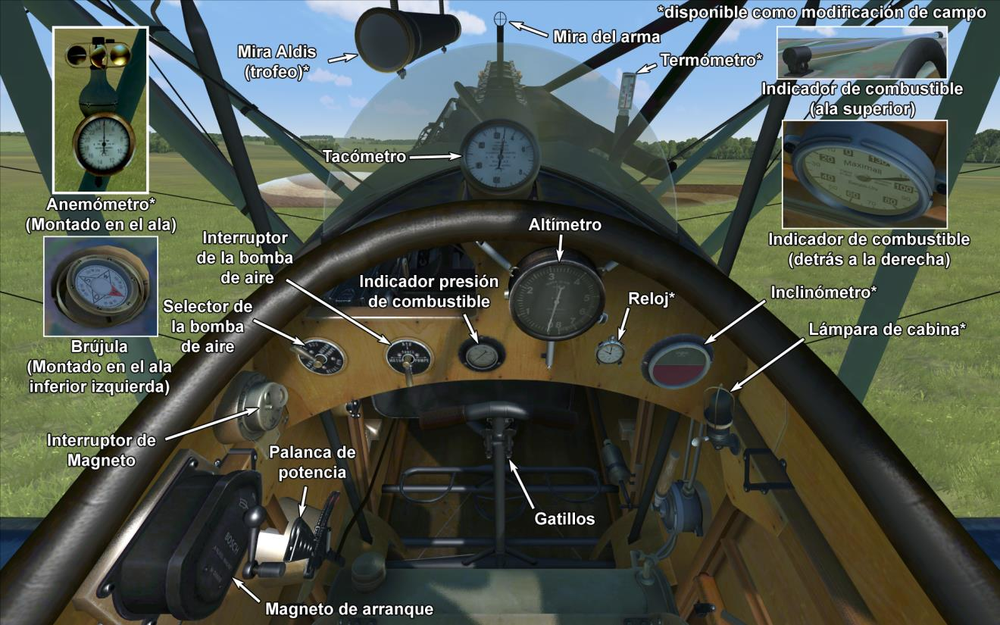

# Halberstadt CL.II 200 CV  

<table><tbody><tr><td style="text-align: center"></td><td style="text-align: center"></td></tr><tr><td style="text-align: center" colspan="2"></td></tr></tbody></table>  

El diseño del Halberstadt CL.II fue una respuesta a la especificación del Idflieg (<i>Inspektion der Fliegertruppen</i>) emitida en agosto de 1916 para un nuevo «tipo ligero C» con un motor de 160-180 caballos.  
  
El propósito era crear un biplaza tipo caza/escolta para proteger aviones de observación más pesados de ataques de aviones aliados. En noviembre de 1916 el idflieg ordenó tres prototipos del Halberstadt CL.II, todos con motor Mercedes D.III. El primero de estos aviones estuvo preparado en abril de 1917, y tras realizar algunos cambios en el diseño del ala pasó las pruebas finales en Aldershof entre el 2 y el 7 de mayo de 1917.  
  
La entrega de las máquinas en el frente empezó en Agosto de 1917, suministrándose principalmente a los <i>Schutzstaffeln</i> (escuadrones de protección), y a la Schlachtstaffeln (escuadrones de ataque terrestre). Su ratio de ascenso y su maniobrabilidad eran excelentes y sus pilotos consideraban su rendimiento muy cercano a algunos cazas de un solo motor como el Albatros D.III y el D.V. Aunque el avión era capaz de transportar equipo de radio y fotografía, su principal uso fue el de caza de escolta y como caza de ataque terrestre. Dada su gran maniobrabilidad y su habilidad para cambiar rápidamente de altitud, era capaz de esquivar los disparos del enemigo desde tierra y de atacar con éxito a las tropas terrestres enemigas y otras instalaciones del frente.  
  
Durante el desarrollo del CL.II, el avión fue equipado con el motor Mercedes D.IIIaü de 200 caballos, lo que mejoró su rendimiento a gran altitud. Los CL.II equipados con este tipo de motor podían ser reconocidos por la bomba de aire horizontal que llevaban. No obstante, los viejos motores Mercedes fueron actualizados a los estándar del D.IIIaü, pero en estos casos, mantuvieron su bomba de aire vertical.  
  
Gracias a su buen rendimiento, habilidad para defenderse por sí mismo de los aviones enemigos, y siendo cómodo de volar, el CL.II era preferido por los pilotos sobre cualquier otro modelo y permaneció en servicio a lo largo del resto de guerra, sirviendo junto a otros modelos de avión más modernos.  
  
No se sabe exactamente cuántos CL.II fueron construidos. Ideflieg realizó seis pedidos de producción a la Halberstadter Flugzeugwerke por un total de 900 aviones y aproximadamente unos 300 aviones fueron solicitados a la Bayerische Flugzeug Werke AG en dos pedidos separados. En total, la producción fue de unos 1.200 aviones.  
  
El motor Mercedes D.IIIaü había mejorado el rendimiento en altitudes más altas, pero aplicar la potencia máxima a bajas altitudes podía provocar una detonación en el motor.  
  
  
Motor:  
Mercedes D.IIIaü de 6 cilindros en línea, 200 CV  
  
Dimensiones:  
Altura: 2750 mm  
Longitud:7300 mm  
Envergadura alar: 10770 mm  
Superficie de ala: 27,5 m²  
  
Peso:  
Vacío: 735 kg  
Tripulación: 160 kg  
Capacidad de combustible: 155 litros (115 kg)  
Capacidad de aceite: 28 litros (22 kg)  
Al despegue sin bombas kg: 1032 kg  
Al despegue con 3 bombas de 50 kg: 1182 kg  
Al despegue con 12 bombas de 12,5 kg: 1182 kg  
  
Velocidad (IAS), sin bombas:  
Nivel del mar - 174 km/h  
1000 - 164 km/h  
2000 - 154 km/h  
3000 - 144 km/h  
4000 - 132 km/h  
5000 - 120 km/h  
6000 - 100 km/h  
  
Tasa de ascenso, depósito combustible lleno, sin bombas:  
1000 m -  4 min 20 s  
2000 m -  9 min 38 s  
3000 m - 16 min 44 s  
4000 m - 27 min 27 s  
  
Techo de servicio: 4900 m  
Techo teórico: 6100 m  
  
Autonomía a 1000 m:  
Potencia nominal (combate) — 3 h  
En consumo mínimo — 6 h 40 min  
  
Armamento:  
Disparo frontal: 1 LMG 08/15 Spandau de 7,92 mm, 500 balas  
Artillero de cola: 1 LMG 14/17 Parabellum de 7,92 mm, 3 cajas con 250 balas cada una  
  
Variaciones en la carga de bombas:  
12 bombas de 12,5 kg (150 kg)  
1 bomba de 50 kg + 8 12,5 kg (150 kg)  
3 bombas de 50 kg (150 kg)  
4 bombas de 12,5 kg (50 kg)  
1 bomba de 50 kg (50 kg)  
  
Peso máximo en bombas: 150 kg  
  
Referencias:  
1) Schlachtflieger por Rick Duiven, Dan-San Abbott.  
2) Informe sobre el  caza Halberstadt, octubre de 1918.  
3) Windsock Datafile 27 Halberstadt CL.II P.M. Grosz.  

## Modificaciones  
### Aldis (Trofeo)  

Colimador reflectante Aldis  
Peso adicional: 2 kg  
  
### Cañón Becker de 20 mm en artillero  

Cañón automático Becker de 20 mm montado sobre anillo en posición de artillero.  
Munición: 60 balas de 20 mm (4 cargadores con 15 balas cada uno)  
Tipo de munición: HE/AP (balas explosivas y perforantes)  
Peso del proyectil: 120/130 g  
Velocidad de salida: 450/490 m/s  
Tasa de disparo: 300 bpm  
Peso del arma: 30 kg (sin cargador)  
Peso del soporte: 10 kg  
Peso de la munición: 25 kg  
Peso total: 65 kg  
Pérdida de velocidad estimada: 6 km/h  
  
### Bombas P.u.W.  

Hasta 12 bombas de propósito general de 12,5 kg P.u.W (Prünfanstalt und der Werft Fliegertruppe)  
Peso adicional: 186 kg  
Peso de munición: 150 kg  
Peso de los soportes: 36 kg  
Pérdida de velocidad estimada antes de soltar: 4 km/h  
Pérdida de velocidad estimada tras soltar: 2 km/h  
  
Hasta 3 bombas de propósito general de 50 kg P.u.W (Prünfanstalt und der Werft Fliegertruppe)  
Peso adicional: 186 kg  
Peso de munición: 150 kg  
Peso de los soportes: 36 kg  
Pérdida de velocidad estimada antes de soltar: 4 km/h  
Pérdida de velocidad estimada tras soltar: 2 km/h  
  
### Luz de cabina  

Lámpara para iluminar la cabina en las salidas nocturnas  
Peso adicional: 1 kg  
  
### Instrumentación adicional  

Anemómetro Wilhelm Morell (45-250 km/h)  
  
Inclinómetro Líquido D.R.G.M (indica inclinación en tierra y deslizamiento lateral en vuelo)  
  
Indicador de temperatura del refrigerante del motor de A.Schlegelmilch (0-100 °C)  
  
Reloj mecánico  
  
Peso adicional: 3 kg  
  
### Cámara de fotos  

Cámara para tomar fotografías aéreas  
Peso adicional: 10 kg  
  
### Radio  

Radiotransmisor  
Peso adicional: 10 kg  
  
### Doble Parabellum en artillero  

Dos ametralladoras Parabellum sincronizadas sobre anillo en la posición del artillero.  
Munición: 1500 balas de 7,92 mm (6 tambores con 250 balas cada uno)  
Peso del proyectil: 10 g  
Velocidad de salida: 825 m/s  
Tasa de disparo: 700 bpm  
Peso de las armas: 19 kg (sin cargador)  
Peso de los soportes: 5 kg  
Peso de la munición: 30 kg  
Peso total: 54 kg  
Pérdida de velocidad estimada: 8 km/h  
  
### Doble Spandau frontal  

Dos ametralladoras frontales sincronizadas Spandau LMG 08/15 de posición fija.  
Munición: 1000 balas de 7,92 mm (500 balas por arma)  
Peso del proyectil: 10 g  
Velocidad de salida: 825 m/s  
Tasa de disparo: 650 rpm  
Peso de las armas: 26 kg  
Peso de los soportes: 8 kg  
Peso de la munición: 20 kg  
Peso total: 54 kg  
Pérdida de velocidad estimada: 4 km/h  
