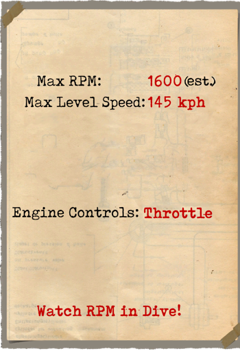
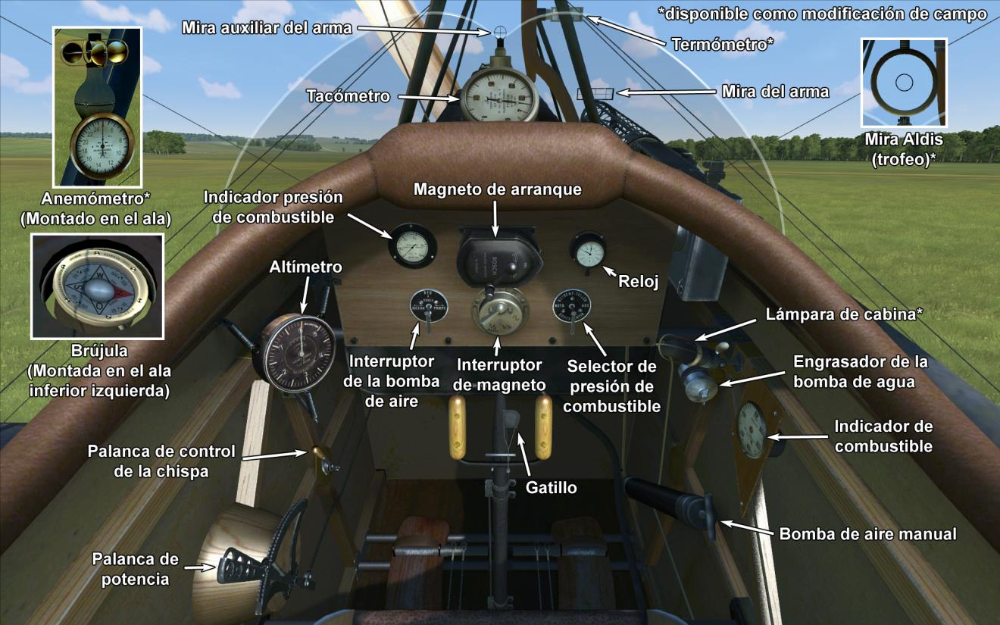

# Halberstadt D.II  

<table><tbody><tr><td style="text-align: center"></td><td style="text-align: center"></td></tr><tr><td style="text-align: center" colspan="2"></td></tr></tbody></table>  

## Descripción  

El primer prototipo del Halberstadt D.I, equipado con un motor Mercedes D.I de 100 CV, voló a finales del otoño de 1915. Más tarde sería equipado con un motor Mercedes D.II de 120 CV, entrando en producción con la designación D.II. Estaba pensado para complementar a los biplanos Fokker tipo D, que en aquellos momentos estaban reemplazando a los obsoletos monoplanos Fokker de la serie E. Los primeros aparatos fueron enviados a las unidades del frente en junio de 1916.  
  
La mayoría de los pilotos quedaron impresionados por su mejor rendimiento en comparación con los antiguos monoplanos Fokker, especialmente por su mejor ascenso y velocidad, y por unos controles muy rápidos, fáciles y sensibles que le daban una buena maniobrabilidad en manos de los experimentados pilotos alemanes.  
  
A finales de 1916, los Halberstadt D.II quedaron obsoletos y la mayoría fueron retirados del Frente Occidental o trasladados a sectores más tranquilos del frente. Sin embargo, sus adversarios los respetaban. En total, se construyeron 96 Halberstadt D.II con motores Mercedes D.II.  
  
  
Motor:  
Mercedes D.II de 6 cilindros en línea 120 (hp)  
  
Dimensiones:  
Altura: 2660 mm  
Longitud: 7300 mm  
Envergadura alar: 8800 mm  
Superficie de ala: 23,6 m²  
  
Peso:  
Vacío: 519 kg  
Al despegue: 728 kg  
Capacidad de combustible: 96 l  
Capacidad de aceite: 18 l  
  
Velocidad máxima (IAS):  
Nivel del mar – 145 km/h  
1000 m – 138 km/h  
2000 m – 131 km/h  
3000 m – 124 km/h  
4000 m – 115 km/h  
5000 m – 105 km/h  
  
Tasa de ascenso:  
1000 m — 4 min 00 s  
2000 m — 8 min 50 s  
3000 m — 15 min 00 s  
4000 m — 23 min 25 s  
5000 m — 37 min 35 s  
  
Techo de servicio: 5950 m  
  
Autonomía a 1000 m: 2 h 34 min  
  
Armamento:  
Disparo frontal: 1 LMG 08/15 Spandau de 7,92mm, hasta 500 balas  
  
Referencias:  
1) Halberstadt Fightres, Windsock Datafile Special.  

## Modificaciones  
### Aldis (trofeo)  

Colimador reflectante Aldis  
Peso adicional: 2 kg  
  
### Luz de cabina  

Lámpara para iluminar la cabina en las salidas nocturnas  
Peso adicional: 1 kg  
  
### Anemómetro  

Anemómetro Wilhelm Morell (45-250 km/h)  
Peso adicional: 1 kg  
  
### Termómetro  

Indicador de temperatura del refrigerante del motor de A.Schlegelmilch (0-100 °C)  
Peso adicional: 1 kg  
