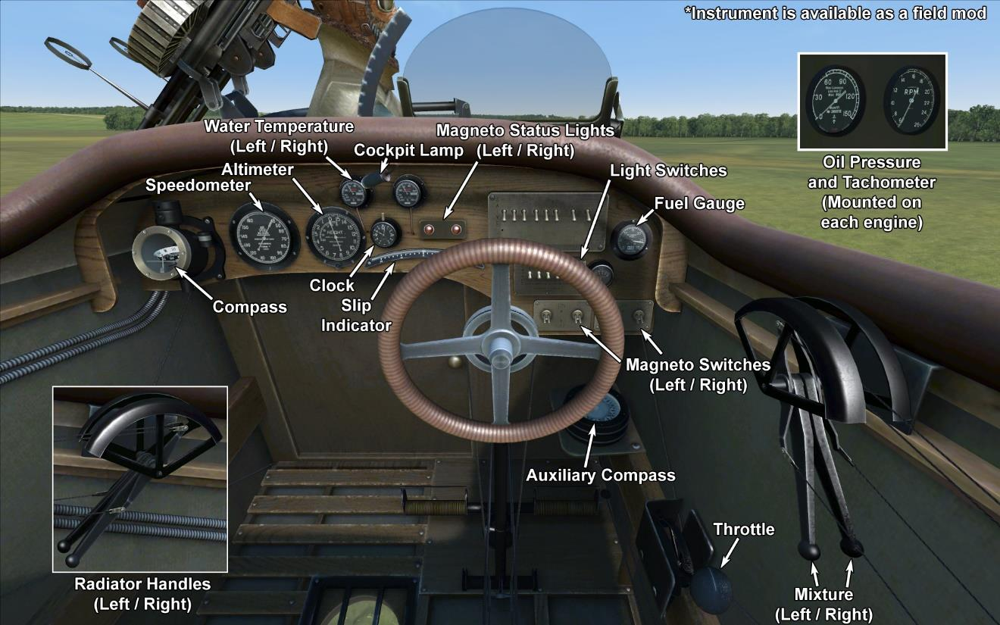

# Handley Page O/400  

<table><tbody><tr><td style="text-align: center"></td><td style="text-align: center"></tr><tr><td style="text-align: center" colspan="2"></td></tr></tbody></table>  

Самолёт стал следующим этапом в усовершенствовании конструкции HP O/100. Два топливных бака были перенесены из мотогондол в фюзеляж, промежуточный бак установили в верхней секции корпуса над ними. В конструкции крыльев применили полые лонжероны, на шасси установили буксировочные кольца, шторки радиаторов стали устанавливать на сборочной линии. Броневые листы закрывали двигатели. Разница в тяге левого и правого двигателей компенсировалась центральным килем в хвостовом оперении. Новые двигатели Eagle VIII увеличили бомбовую нагрузку. Кроме головной компании бомбардировщик собирали: Royal Aircraft Factory, Boulton and Paul, Metropolitan Carriage Wagon, Birmingham Carriage Co. До конца войны в Англии было выпущено 554 экземпляра.  
Первые упоминания о появлении этой машины на фронте датируются сентябрем 1917 года. Самолёты применяли для нанесения ударов по железнодорожным узлам, складам снабжения, фабрикам и портам в ночное время. Пилоты говорили, что самолёт приятен в полёте, легок на взлёте, управление требует усилий, отмечается замедленная реакция на рули управления.  
Самолёты принимали участие в боевых действиях на Западном и Палестинском фронтах.  
  
  
Двигатели: 2 рядных 12-цилиндровых Eagle VIII  
Мощность: 360 л.с.  
  
Размеры:  
Высота: 6700 мм  
Длина: 18930 мм  
Размах крыла: 30480 мм  
Площадь крыла: 153,1 кв.м.  
  
Веса:  
Пустой: 3774 кг   
Экипаж: 320 кг  
Объём топливных баков: 1291 литр (962 кг)  
Объём маслобаков: 136,4 литра (126 кг)  
Взлётный без бомб: 5265 кг  
Взлётный с 16 112 фнт бомбами: 6078 кг  
  
Скорость (приборная), полные баки, без бомб:  
на уровне моря - 156.3 км/ч  
1000 - 146.3 км/ч  
2000 - 135.2 км/ч  
3000 - 121.3 км/ч  
  
Скороподъемность, полные баки, без бомб:  
1000 м: 7 мин. 42 сек.  
2000 м: 18 мин. 54 сек.  
3000 м: 43 мин. 14 сек.  
  
Скороподъемность, полные баки, 16 122 фнт (813 кг) бомб:  
1000 м: 13 мин. 51 сек.  
2000 м: 47 мин. 54 сек.  
  
Продолжительность полёта: 8 часов (9 часов 26 минут без бомб)  
  
Вооружение:  
Носовая стрелковая позиция: 2 х Lewis LMG 7,69мм, 12 барабанов по 97 патронов каждый  
Верхняя хвостовая стрелковая позиция: 2 х Lewis LMG 7,69мм, 7 барабанов по 97 патронов каждый  
Нижняя хвостовая стрелковая позиция: 1 х Lewis LMG 7,69мм, 7 барабанов по 97 патронов каждый  
  
Варианты бомбовых загрузок:  
16 x 112 фнт (813 кг)  
8 x 112 фнт (406 кг)  
8 x 250 фнт (908 кг)  
4 x 250 фнт (454 кг)  
1 x 1650 фнт (749 кг)  
  
Максимум 2000 фнт (908 кг)  
  
Использованные источники:  
1) Trial Report M219, July 1918.  
2) Handley Page O/400, CA Owers, vol. 1 and 2.  
3) Handley Page O/400 Specification.  
4) Aviation Enthusiast Magazine. Viewed from the Cockpit, page 81.  

## Модификации  
### Тяжелая авиабомба 1650 lb SN  

1650-фунтовая (748 кг) авиабомба на центральной внешней подвеске  
Дополнительная масса: 778 кг  
Масса вооружения: 748 кг  
Масса держателей: 30 кг  
Ориентировочная потеря скорости до сброса: 5 км/ч  
Ориентировочная потеря скорости после сброса: 0 км/ч  
  
### 57мм безоткатная пушка Davis  

Установленная на носовой турели 57мм безоткатная пушка Davis с ручным заряжанием  
Боезапас: 17 осколочно-фугасных снарядов 57мм  
Тип боеприпасов: ОФ (осколочно-фугасные)  
Скорострельность: 3 выстр/мин  
Масса снаряда: 2,7 кг  
Дульная скорость: 300 м/с  
Масса оружия: 50 кг  
Масса станины: 15 кг  
Масса боезапаса: 119 кг  
Общая масса: 210 кг  
Примерная потеря скорости: 0,5 км/ч  
  
### 57мм безоткатная пушка Davis (+Lewis)  

Установленная на носовой турели 57мм безоткатная пушка Davis с ручным заряжанием и дополнительным соосным пулемётом Lewis для грубой пристрелки  
Боезапас: 17 осколочно-фугасных снарядов 57мм  
Тип боеприпасов: ОФ (осколочно-фугасные)  
Скорострельность: 3 выстр/мин  
Масса снаряда: 2,7 кг  
Дульная скорость: 300 м/с  
Масса оружия: 50 кг  
Масса станины: 15 кг  
Масса боезапаса: 119 кг  
Общая масса: 210 кг  
Примерная потеря скорости: 0,5 км/ч  
  
### Топливомер  

Трубчатый указатель уровня топлива (0-300 Гал.)  
Дополнительная масса: 1 кг  
  
### Турель с пулемётами Lewis  

Кольцевая турель со спаренными пулемётами Lewis  
Боезапас: 776 патронов 7,69 мм (8 магазинов по 97 патронов в каждом)  
Масса пули: 11 г  
Дульная скорость: 745 м/с  
Скорострельность: 550 выстр/мин  
Масса оружия: 15 кг (без магазинов)  
Масса станины: 12 кг  
Масса боезапаса: 32 кг  
Общая масса: 59 кг  
Примерная потеря скорости: 2 км/ч  
