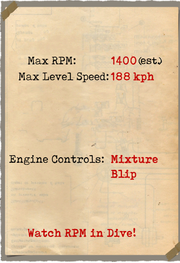
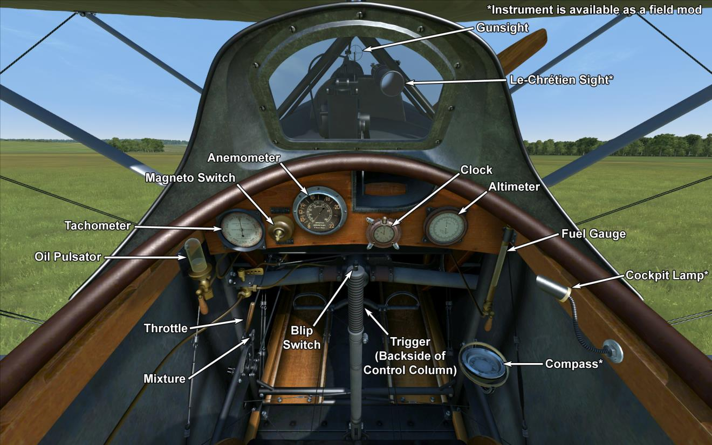

# Hanriot HD.1  

<table><tbody><tr><td style="text-align: center"></td><td style="text-align: center"></td></tr><tr><td style="text-align: center" colspan="2"></td></tr></tbody></table>  

## Beschreibung  

The Hanriot HD.1 was developed by Pierre Dupont in the summer of 1916 for the Hanriot company as a classical biplane made mostly of wood with two-spar wings (the rudder frame and the nose part were metal). The upper wing had a small V-angle while the lower one was straight. There were 3 fuel tanks in the fuselage: two behind the engine and one more behind the pilots back.  
  
At first, the HD.1 was meant to take over from the older Nieuport 11 and 17 planes, but the new Spad 7s were already in use on the front lines and got positive feedback from pilots for their in-line engines. Meanwhile, Nieuport squadrons still used Le Rhone engines. As a result, the French Air Force (Aviation Militaire) decided not to switch to HDs as it wasnt cost-effective, and the acquisition was canceled.  
  
However, the Entente allies found this plane attractive - it was more firm, maneuverable, and slightly better than the Nieuport in general. The Italian Air Force (Aviazione Militaire) was the first to order this plane. Societa Nieuport-Macchi started manufacturing HDs in November 1916, and in the summer of 1917, the first Hanriots were delivered to the front lines. By the end of the war, the Italians had 831 Hanriots. The Belgian Air Force, Aeronautique Militaire Belge, ranked second in buying these new planes, and the French Hanriot manufacturer constructed 125 aircraft. Belgian squadrons began flying HD1s on August 22, 1917, and they used them effectively, especially the Belgian aces like Coppens, de Meulemeester, and Olieslagers.  
  
Triebwerk 9 Zyl. luftgekühlter Rotationsmotor Le Rhone 9Jby 130 PS  
  
Abmessung  
Höhe: 2940 mm  
Länge: 5850 mm  
Spannweite: 8700 mm  
Flügelfläche: 18.2 qm  
  
Gewicht  
Leergewicht: 406.9 kg  
Startgewicht: 612.1 kg  
Treibstoffkapazität: 104 l  
Ölkapazität: 18 l  
  
Steigrate  
1000 m:  2 min. 39 sec.  
2000 m:  5 min. 45 sec.  
3000 m:  9 min. 22 sec.  
4000 m: 14 min. 19 sec.  
5000 m: 20 min. 52 sec.  
6000 m: 31 min. 39 sec.  
  
Max Geschwindigkeit (IAS)  
Meeresspiegel – 188 km/h  
1000 m — 179 km/h  
2000 m — 169 km/h  
3000 m — 159 km/h  
4000 m — 149 km/h  
5000 m — 138 km/h  
6000 m — 126 km/h  
  
Dienstgipfelhöhe 6620 m  
  
Reichweite — 2 Std.ы  
  
Bewaffnung  
Starre Bewaffnung nach vorne: 1 х Vickers Mk.I 7.69mm, 500 Schuss pro Magazin.  
  
Referenzen  
1) Windsock Datafile 12 - Hanriot HD.1, by J.M. Bruce.  

## Änderungen  
### Ballon Maschinengewehre  

Vickers "Ballon" Maschinengewehr  
Munition: 250 11,43mm Patronen  
Geschossgewicht: 17,5 g  
Mündungsgeschwindigkeit: 610 m/s  
Gewicht der Waffe: 13 kg  
Gewicht der Munition: 20 kg  
Feuerrate: 600 Schuss/min  
Zusätzliches Gewicht: 33 kg  
  
### Instrumentenlicht  

Glühlampe zum Beleuchten des Instrumentenbrettes bei Nachteinsätzen  
Zusätzliches Gewicht: 1 kg  
  
### Kompass  

L.Maxant Kompass  
Zusätzliches Gewicht: 1 kg  
  
### Le-Chretien  

Le-Chretien Teleskopvisier  
Zusätzliches Gewicht: 1 kg  
  
### Lewis Überflügel-Maschinengewehr  

Overwing mounted additional Lewis machinegun with changeable position.  
Munition: 388 7,69mm Patronen (4 Trommeln mit jeweils 97 Schuss)  
Geschossgewicht: 11 g  
Mündungsgeschwindigkeit: 745 m/s  
Feuerrate: 550 Schuss/min  
Gewicht der Waffe: 8 kg (ohne Munitionstrommel)  
Gewicht der Halterung: 3 kg  
Gewicht der Munition: 16 kg  
Gseamtgewicht: 27 kg  
Geschätzter Geschwindigkeitsverlust: 5 km/h  
