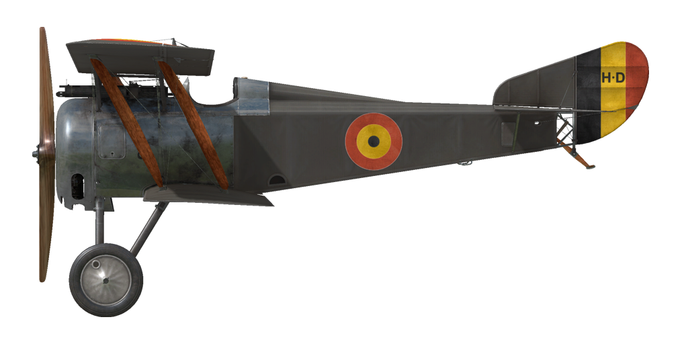

# Hanriot HD.1  
  
  
  
## Descripción  
  
El avión fue desarrollado por Pierre Dupont para la compañía Hanriot en verano de 1916 y estaba construido como un biplano clásico hecho principalmente de madera; solo la estructura del timón y parte del morro eran metálicos. Tenía alas soportadas por dos largueros y arriostradas: la superior con un pequeño ángulo en V, las inferiores rectas. Contaba con 3 depósitos de combustible en el fuselaje: dos detrás del motor y uno más detrás de la espalda del piloto.  
  
Inicialmente el HD.1 debía sustituir a los antiguos Nieuport 11 y 17. Pero el nuevo Spad 7 ya había sido desplegado en el frente, habiendo tenido una buena acogida entre los pilotos por su motor en línea, mientras que el motor Le Rhône instalado en el Hanriot todavía era usado en los escuadrones de Nieuport. Así que el mando de la fuerza aérea francesa, <i>Aviation Militaire</i>, pensó que no sería rentable el cambio a los HD.1 y canceló la adquisición. Sin embargo, el resto de aliados de la Entente se interesaron por este avión, ya que era más firme, maniobrable, y en general, sensiblemente mejor que el Nieuport.  
  
La <i>Aviazione Militare</i>, fuerza aérea italiana, fue la primera en pedir este avión. La <i>Società Anonima Nieuport Macchi</i> empezó a fabricar el HD en noviembre de 1916, y en verano de 1917 los primeros Hanriots fueron entregados a escuadrones del frente. En total, los italianos tuvieron 831 Hanriot al final de la guerra.  
  
La <i>Aviation Militaire Belge</i>, fuerza aérea belga, fue la segunda en adquirir estos nuevos aviones, 125 aparatos, construidos por la compañía francesa Hanriot. Los escuadrones belgas empezaron a volar los HD.1 el 22 de agosto de 1917 y los emplearon con éxito. En particular, los ases belgas Willy Coppens, André de Meulemeester y Jan Olieslagers fueron auténticos expertos en el uso del HD.1.  
  
El ejército francés nunca usó el Hanriot HD.1, aunque la <i>Aviation Maritime</i> (la armada francesa) dio buen uso al HD.2, un hidroavión, modificación del HD. 1 con flotadores, una aleta estabilizadora más grande y un motor Clerget 9B. Algunos HD.2 fueron equipados con una segunda ametralladora.  
  
En total, 125 Hanriot HD.1 fueron construidos en Francia por la compañía Hanriot y más de 831 fueron fabricados en Italia por Macchi.  
  
  
Motor:  
Le Rhône 9Jby, 9 cil. rotativo, 130 CV  
  
Dimensiones:  
Altura: 2940 mm  
Longitud: 5850 mm  
Envergadura alar: 8700 mm  
Superficie de ala: 18,2 m²  
  
Pesos:  
Vacío: 406,9 kg  
Al despegue: 612,1 kg  
Capacidad de combustible: 104 l  
Capacidad de aceite: 18 l  
  
Velocidad máxima (IAS):  
Nivel del mar – 188 km/h  
1000 m — 179 km/h  
2000 m — 169 km/h  
3000 m — 159 km/h  
4000 m — 149 km/h  
5000 m — 138 km/h  
6000 m — 126 km/h  
  
Tasa de ascenso:  
1000 m — 2 min 39 s  
2000 m — 5 min 45 s  
3000 m — 9 min 22 s  
4000 m — 14 min 19 s  
5000 m — 20 min 52 s  
6000 m — 31 min 39 s  
  
Techo de servicio: 6620 m  
  
Autonomía a 1000 m: 2 h  
  
Armamento:  
Disparo frontal: 1 Vickers Mk.I de 7,69 mm, 500 balas  
  
Referencias  
1) Windsock Datafile 12 - Hanriot HD.1, por J.M. Bruce.  
  
## Modificaciones  
### Ametralladora cazaglobo  
  
Ametralladora Vickers «Balloon»  
Munición: 250 balas de 11,43 mm  
Peso del proyectil: 17,5 g  
Velocidad de salida: 610 m/s  
Peso de las armas: 13 kg  
Peso de la munición: 20 kg  
Cadencia de disparo: 600 bpm  
Peso adicional total: 33 kg  
### Luz de cabina  
  
Lámpara para iluminar la cabina en las salidas nocturnas  
Peso adicional: 1 kg  
### Brújula  
  
Brújula de L.Maxant  
Peso adicional: 1 kg  
### Le-Chretien  
  
Colimador reflectante Le-Chretien  
Peso adicional: 1 kg  
### Lewis sobre ala superior  
  
Ametralladora Lewis adicional de posición variable montada sobre el ala superior.  
Munición: 388 balas de 7,69 mm (4 tambores con 97 balas cada uno)  
Peso del proyectil: 11 g  
Velocidad de salida: 745 m/s  
Tasa de disparo: 550 bpm  
Peso del arma: 8 kg (sin cargador)  
Peso del soporte: 3 kg  
Peso de la munición: 16 kg  
Peso total: 27 kg  
Pérdida de velocidad estimada: 5 km/h  
