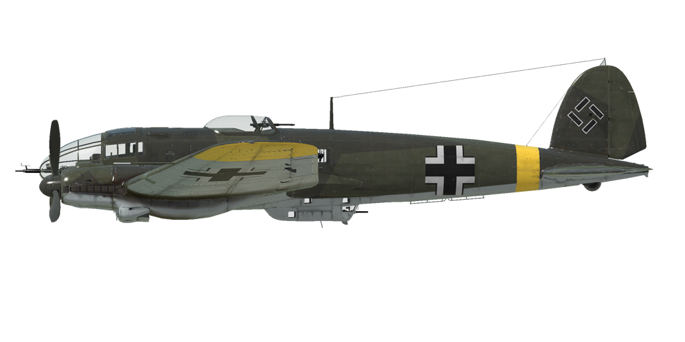

# He 111 H-16  

<table><tbody><tr><td style="text-align: center"></td><td style="text-align: center"></tr></td></tr></tbody></table>  

Приборная скорость сваливания в полётной конфигурации: 150..194 км/ч  
Приборная скорость сваливания в посадочной конфигурации: 123..156 км/ч  
Предельная скорость в пикировании: 560 км/ч  
Разрушающая перегрузка: 4,5 единиц  
Угол атаки сваливания, в полётной конфигурации: 20 °  
Угол атаки сваливания, в посадочной конфигурации: 17 °  
  
Максимальная истинная скорость у земли, режим двигателя - набор высоты: 370 км/ч  
Максимальная истинная скорость на высоте 2000 м, режим двигателя - набор высоты: 399 км/ч  
Максимальная истинная скорость на высоте 5000 м, режим двигателя - набор высоты: 410 км/ч  
  
Практический потолок: 6850 м  
Скороподъёмность у земли: 5,3 м/с  
Скороподъёмность на высоте 3000 м: 4,1 м/с  
Скороподъёмность на высоте 6000 м: 2,3 м/с  
  
Время виража предельного по тяге у земли: 30,8 с, на скорости 250 км/ч по прибору  
Время виража предельного по тяге на высоте 3000 м: 45,2 с, на скорости 250 км/ч по прибору  
  
Продолжительность полёта на высоте 3000 м: 6,7 ч, на скорости 300 км/ч по прибору  
  
Скорость взлётная: 170..210 км/ч  
Скорость на глиссаде: 180..200 км/ч  
Скорость посадочная: 125..150 км/ч  
Посадочный угол: 9 °  
  
Примечание 1: данные указаны для условий международной стандартной атмосферы.  
Примечание 2: диапазоны характеристик даны для допустимого диапазона масс самолёта.  
Примечание 3: максимальные скорости, скороподъемности и время виража даны для стандартной массы самолёта.  
Примечание 4: скороподъемность дана на режиме работы двигателя "набор высоты", время виража - на взлётном.  
  
Двигатель:  
Модель: Jumo-211F   
Максимальная мощность на чрезвычайном режиме у земли: 1340 л.с.  
Максимальная мощность на режиме набора высоты у земли: 1120 л.с.  
Максимальная мощность на режиме набора высоты на высоте 1900 м: 1210 л.с.  
Максимальная мощность на режиме набора высоты на высоте 5300 м: 1060 л.с.  
  
Режимы работы двигателя:  
Номинальный (время неограничено): 2250 об/мин, 1,15 атмосфер  
Набор высоты (до 30 минут): 2400 об/мин, 1,25 атмосфер  
Взлётный (до 1 минуты): 2600 об/мин, 1,40 атмосфер  
  
Температура воды на выходе из двигателя номинальная: 80 °С  
Температура воды на выходе из двигателя предельная: 110 °С  
Температура масла на выходе из двигателя номинальная: 90 °С  
Температура масла на выходе из двигателя предельная: 105 °С  
  
Высота переключения нагнетателя: автомат   
  
Масса пустого самолёта: 8698 кг  
Минимальная масса (без БК, 10% топлива): 9831 кг  
Стандартная масса: 13017 кг  
Максимальная взлётная масса: 15689 кг  
Максимальный запас топлива: 2553 кг / 3450 л  
Максимальная полезная нагрузка: 6991 кг  
  
Вооружение оборонительное:  
Носовое: 20мм пушка "MG FF", 240 снарядов, 540 выстр/мин  
Верхнее: 13мм пулемёт "MG 131", 1000 патронов, 900 выстр/мин  
Нижнее-заднее: 2 x 7.92мм пулемёт "MG 81", 850 патронов, 1600 выстр/мин  
Левое: 7.92мм пулемёт "MG 81", 500 патронов, 1600 выстр/мин  
Правое: 7.92мм пулемёт "MG 81", 500 патронов, 1600 выстр/мин  
  
  
Вооружение бомбовое:  
До 16 x 55 кг осколочно-фугасных авиабомб "SC 50"  
До 4 x 249 кг осколочно-фугасных авиабомб "SC 250"  
До 2 x 500 кг осколочно-фугасная авиабомба "SC 500"  
До 2 x 1090 кг осколочно-фугасных авиабомб "SC 1000"  
До 2 x 1780 кг осколочно-фугасных авиабомб "SC 1800"  
2400 кг осколочно-фугасная авиабомба "SC 2500"  
  
Длина: 16,38 м  
Размах крыла: 22,5 м  
Площадь крыла: 79,5 кв.м  
  
Начало участия в боевых действиях: зима 1943  
  
Особенности эксплуатации:  
- Двигатели оборудованы двухступенчатыми нагнетателями, переключение скоростей которых выполняется автоматически. Высота переключения скоростей нагнетателей зависит от оборотов двигателей. Также при необходимости можно принудительно включить первую ступень нагнетателя для каждого двигателя.  
- Двигатели оборудованы автоматическими высотными корректорами, поддерживающими оптимальный состав топливовоздушной смеси.  
- Регуляторы постоянных оборотов винтов поддерживают заданные обороты моторов в соответствии с положением рычагов управления винтами за счёт автоматического изменения шага винтов.  
- Воздушные винты имеют режим флюгирования по потоку. Флюгирование винта применяется для уменьшения сопротивления от вращающегося винта в случае выхода двигателя из строя.  
- Водо- и маслорадиаторы имеют ручное управление створками. При этом створки маслорадиаторов имеют только 5 фиксированных положений.  
- Самолёт оснащён триммерами во всех трёх каналах управления.  
- Привод посадочных закрылков гидравлический. Закрылки можно выпустить на любой угол до 60°.  
- Хвостовое колесо свободно ориентируемо, стопора не имеет. В связи с этим при движении по ВПП с большой скоростью на взлёте или посадке следует уверенно и аккуратно работать педалями, своевременно парируя стремление самолёта к развороту.- Самолёт имеет раздельное управление гидравлическими тормозами левого и правого колёс шасси. Торможение каждого колеса осуществляется нажатием на верхнюю часть соответствующей педали.  
- Самолёт имеет раздельное управление гидравлическими тормозами левого и правого колёс шасси. Торможение каждого колеса осуществляется нажатием на верхнюю часть соответствующей педали.  
- Самолёт оснащён отдельными топливомерами для левой и правой групп баков с переключением между внутренними и внешними баками в каждой группе. Выбор бака для индикации по умолчанию производится комбинацией клавиш (RShift+I). Также есть сигнальные лампы аварийного остатка топлива в группах баков (200 литров).  
- На самолёте установлен электросбрасыватель подвесного оружия, который позволяет выбирать между внешними и внутренними бомбодержателями и задавать различные серии сброса бомб. Также возможно задавать интервал сброса бомб в серии.  
  
Основные данные и рекомендуемые положения органов управления самолётом:  
1. Запуск двигателя:  
	- рекомендуемое положение рукояти управления смесью: автоматическое управление смесью  
	- рекомендуемое положение рукояти управления маслорадиаторами: закрыто  
	- рекомендуемое положение рукояти управления водорадиаторами: закрыто  
	- рекомендуемое положения рукояти управления шагом: легкий винт  
	- рекомендуемое положение рычага управления двигателем: 0%  
	- перед рулением необходимо разблокировать колесо  
  
2. Рекомендуемые положения рукояти смеси при различных режимах полёта: автоматическое управление смесью  
  
3.1 Рекомендуемые положения рукояти управления маслорадиаторами при различных режимах полёта:  
	- взлёт: открыто 50%  
	- набор высоты: открыто 100%  
	- крейсерский полёт: открыто 25% (зимой закрыть при необходимости)  
	- бой: открыто 50%  
  
3.2 Рекомендуемые положения рукояти управления водорадиаторами при различных режимах полёта:  
	- взлёт: открыто 50%  
	- набор высоты: открыто 100%  
	- крейсерский полёт: открыто 20% (зимой закрыть при необходимости)  
	- бой: открыто 50%  
  
4. Ориентировочный расход топлива на различных режимах работы на высоте 2000 м:  
	- крейсерский режим работы двигателя: 10,4 л/мин  
	- боевой режим работы двигателя: 13,6 л/мин  

## Модификации  
### 2 x Тяжелых авиабомбы SC 1000  

2 x 1090 кг авиабомба SC 1000 на центральной внешней подвеске  
Дополнительная масса: 2180 кг  
Масса вооружения: 2180 кг  
Ориентировочная потеря скорости до сброса: 23 км/ч  
Ориентировочная потеря скорости после сброса: 0 км/ч  

### 2 x Тяжелых авиабомбы SC 1800  

2 x 1780 кг авиабомба SC 1800 на центральной внешней подвеске  
Дополнительная масса: 3560 кг  
Масса вооружения: 3560 кг  
Ориентировочная потеря скорости до сброса: 32 км/ч  
Ориентировочная потеря скорости после сброса: 0 км/ч  

### Тяжелая авиабомба SC 2500  

2400 кг авиабомба SC 2500 на центральной внешней подвеске  
Дополнительная масса: 2400 кг  
Масса вооружения: 2400 кг  
Ориентировочная потеря скорости до сброса: 17 км/ч  
Ориентировочная потеря скорости после сброса: 0 км/ч  
