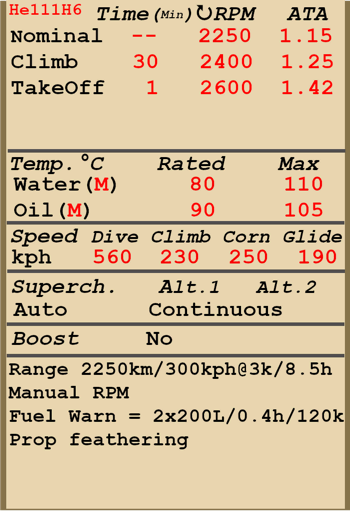
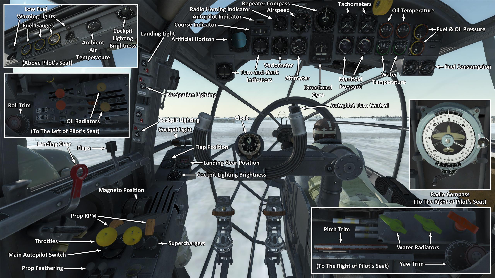

# He 111 H-6  

<table><tbody><tr><td style="text-align: center"></td><td style="text-align: center"></td></tr><tr><td style="text-align: center" colspan="2"></td></tr></tbody></table>  

## 描述  

飞行构型的失速指示空速：150~184 km/h  
起降构型的失速指示空速：123~151 km/h  
俯冲极速：560 km/h  
最大过载：4.5 G  
飞行构型失速迎角：20 °  
着陆构型失速迎角：17 °  
  
最大真空速，高度海平面，发动机模式——爬升：369 km/h  
最大真空速，高度2000m，发动机模式——爬升：398 km/h  
最大真空速，高度5000m，发动机模式——爬升：405 km/h  
  
实用升限：6300 m  
海平面爬升率：4.5 m/s  
3000m时爬升率：3.6 m/s  
6000m时爬升率：1.8 m/s  
  
海平面最大性能盘旋时间：30.8 s，指示空速 250 km/h。  
3000m时最大性能盘旋时间：45.2 s，指示空速 250 km/h。  
  
3000m（9843 feet）时续航时间：8.5h，指示空速 300 km/h。  
  
起飞速度：170~210 km/h  
进近速度：180~200 km/h  
着陆速度：125~150 km/h  
着陆迎角：9 °  
  
注1：所提供的数据适用于国际标准大气（ISA）。  
注2：飞行性能范围基于可能的飞机质量范围。  
注3：极速、爬升率和盘旋时间基于标准飞机质量。  
注4：爬升率基于爬升动力，盘旋时间基于起飞动力。  
  
发动机：  
型号：Jumo-211F  
海平面起飞模式下的最大功率 1340 HP  
海平面爬升模式下的最大功率：1120 HP  
爬升模式下的最大功率，高度1900m：1210 HP  
爬升模式下的最大功率，高度5300m：1060 HP  
  
发动机模式：  
标称（无时间限制）：2250 RPM，1.15 ATA  
爬升动力（不超过30min）：2400 RPM，1.25 ATA  
起飞动力（不超过1min）：2600 RPM，1.42 ATA  
  
发动机液冷出水口额定水温：80 °C  
发动机液冷出水口最高水温：110 °C  
发动机滑油出油口额定油温：90 °C  
发动机滑油出油口最高油温：105 °C  
  
机械增压器换挡高度：自动   
  
空重：8963 kg  
最小重量（无弹药、10%燃油）：9946 kg  
标准重量：13727 kg  
最大起飞重量：15239 kg  
燃油载荷：3214 kg/4285 L  
有效载荷：6276 kg  
  
防御武器：  
头部：7.92mm机枪"MG 15"，600发，1000发/分  
顶部：7.92mm机枪"MG 15"，1125发，1000发/分  
腹部后射：7.92mm机枪"MG 15"，1200发，1000发/分  
腹部前射：7.92mm机枪"MG 15"，675发，1000发/分  
左边：7.92mm机枪"MG 15"，450发，1000发/分  
右边：7.92mm机枪"MG 15"，450发，1000发/分  
头部：20mm机炮"MG FF"，240发，540发/分（改装）  
腹部前射：20mm机炮"MG FF"，330发，540发/分（改装）  
  
炸弹：  
最多16 x 55kg 通用炸弹"SC 50"  
最多4 x 249kg 通用炸弹"SC 250"  
500kg 通用炸弹"SC 500"  
最多2 x 1090kg 通用炸弹"SC 1000"  
最多2 x 1780kg 通用炸弹"SC 1800"  
2400kg 通用炸弹"SC 2500"  
  
长度：16.38 m  
翼展：22.5 m  
机翼面积：79.5 m²  
  
首次投入战斗：1941年6月  
  
操作特性：  
——每个发动机都带有一个自动切换系统的二级机械增压器，切换取决于高度和发动机转速。可以手动设置到第一级。  
——发动机混合比控制是自动的。  
——发动机转速有自动调节器，其根据调节器控制杆位置保持对应的需用转速。调节器自动控制螺旋桨桨距来保持需用转速。  
——螺旋桨有顺桨系统，为了减小在发动机故障的情况下螺旋桨自转所产生的阻力，需要将螺旋桨调为顺桨。  
——水冷和滑油散热器风门是手动控制的。滑油散热器控制器有五个固定位置。  
——飞机的所有飞行操纵均有配平：俯仰、滚转和偏航。  
——着陆襟翼由液压机构控制，可展开至0-60°之间的任意角度。  
——飞机尾轮自由旋转，没有锁。因此，在起飞和着陆时必须自信而准确地操作方向舵脚蹬。  
——飞机有独立的左右液压机轮刹车。要使用刹车，踩下方向舵脚蹬的上部。  
——飞机左、右油箱组各有一个专用油量表，还有切换显示内部和外部油箱组的开关。在游戏中，按下（RShift+I）可改变燃油指示器开关。飞机还有机身油箱的专用油量表。此外，飞机还有左、右油箱组的低油量警告灯（180 L）。  
——飞机配备了自动炸弹齐投控制器，它允许您在要投弹的挂弹架之间（内部或外部）进行切换，并切换不同的齐投数量。还有一个控制器用于齐投时设置每个炸弹投放的间隔时间。  
  
Basic data and recommended positions of the aircraft controls:  
1. Starting the engine:  
	- recommended position of the mixture control lever: auto mixture control  
	- recommended position of the oil radiator control handle: close  
	- recommended position of the water radiator control handle: close  
	- recommended position of the prop pitch control handle: light  
	- recommended position of the throttle lever: 0%  
  
2. Recommended mixture control lever positions for various flight modes: auto mixture control  
  
3.1 Recommended positions of the oil radiator control handle for various flight modes:  
	- takeoff: open 50%  
	- climb: open 100%  
	- cruise flight: open 25% (in winter conditions - close if necessary)  
	- combat: open 50%  
  
3.2 Recommended positions of the water radiator control handle for various flight modes:  
	- takeoff: open 50%  
	- climb: open 100%  
	- cruise flight: open 20% (in winter conditions - close if necessary)  
	- combat: open 50%  
  
4. Approximate fuel consumption at 2000 m altitude:  
	- Cruise engine mode: 9.8 l/min  
	- Combat engine mode: 13.3 l/min  

## 修改  
### 机腹20mm机炮炮塔  

装有20mm MG FF机炮和300发炮弹的机腹前射炮塔  
增加质量：147 kg  
预期速度损失：0 km/h  

### 机头20mm机炮炮塔  

装有20mm MG FF机炮和240发炮弹的机头炮塔  
增加质量：46 kg  
预期速度损失：0 km/h  

### 2 x SC 1000重型炸弹  

2 x 1090kg 通用炸弹SC 1000  
增加质量：2180 kg  
弹药质量：2180 kg  
投弹前预期速度损失：23 km/h  
投弹后预期速度损失：0 km/h  

### 2 x SC 1800重型炸弹  

2 x 1780kg 通用炸弹SC 1800  
增加质量：3560 kg  
弹药质量：3560 kg  
投弹前预期速度损失：32 km/h  
投弹后预期速度损失：0 km/h  

### SC 2500重型炸弹  

2400kg 通用炸弹SC 2500  
增加质量：2400 kg  
弹药质量：2400 kg  
投弹前预期速度损失：17 km/h  
投弹后预期速度损失：0 km/h  
