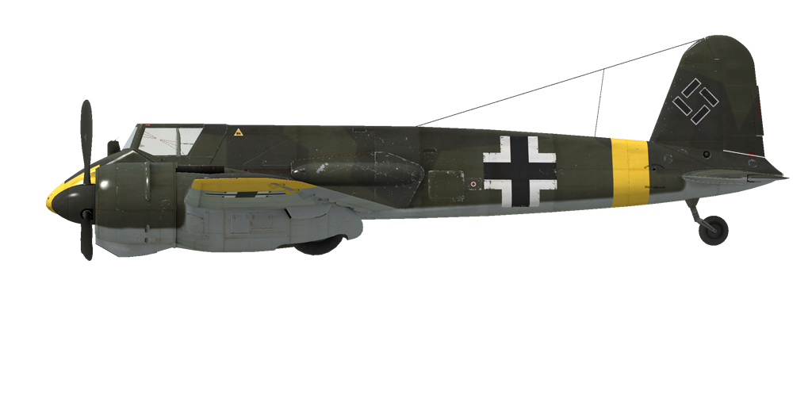

# Hs 129 B-2

## 描述

飞行构型的失速指示空速：143~159 km/h
起降构型的失速指示空速：136~150 km/h
俯冲极速：670 km/h
最大过载：9 G
飞行构型失速迎角：20.0 °
着陆构型失速迎角：18.0 °

最大真空速，高度海平面，发动机模式——战斗：349 km/h
最大真空速，高度3000m，发动机模式——战斗：396 km/h

实用升限：7000 m
海平面爬升率：8.4 m/s
3000m时爬升率：8.1 m/s
6000m时爬升率：2.6 m/s

海平面最大性能盘旋时间：30.0 s，指示空速 255 km/h。
3000m时最大性能盘旋时间：46.0 s，指示空速 270 km/h。

3000m（9843 feet）时续航时间：2.1h，指示空速 300 km/h。

起飞速度：145~155 km/h
进近速度：180~200 km/h
着陆速度：135~145 km/h
着陆迎角：10.6 °

注1：所提供的数据适用于国际标准大气（ISA）。
注2：飞行性能范围基于可能的飞机质量范围。
注3：极速、爬升率和盘旋时间基于标准飞机质量。
注4：爬升率和盘旋时间基于战斗动力。

发动机：
型号：Gnome-Rhone 14 M
海平面起飞模式下的最大功率 700 HP
战斗模式下的最大功率，高度海平面：580 HP
战斗模式下的最大功率，高度4000m：650 HP

发动机模式：
标称（无时间限制）：2350 RPM，1.1 ATA
战斗（不超过30min）：2750 RPM，1.25 ATA
起飞动力（不超过1min）：3030 RPM，1.5 ATA

发动机滑油进油口额定油温：60~75 °C
发动机滑油进油口最高油温：125 °C

机械增压器换挡高度：单级

空重：3992 kg
最小重量（无弹药、10%燃油）：4200 kg
标准重量：4756 kg
最大起飞重量：5170 kg
燃油载荷：451 kg/610 L
有效载荷：1178 kg

前射武器：
2 x 7.92mm机枪"MG 17"，1000发，1200发/分，机头安装
2 x 15mm机炮"MG 151/15"，250发，700发/分，机头安装
2 x 20mm机炮"MG 151/20"，250发，700发/分，机头安装（改装）
4 x 7.92mm机枪"MG 17"，1000发，1200发/分，机腹（改装）
30mm机炮"MK 101"，30发，250发/分，机腹（改装）
30mm机炮"MK 103"，80发，400发/分，机腹（改装）

炸弹：
最多6 x 55kg 通用炸弹"SC 50"
249kg 通用炸弹"SC 250"

长度：9.7 m
翼展：14.2 m
机翼面积：28.9 m²

首次投入战斗：1942年5月

操作特性：
——仅可通过更改桨距来控制螺旋桨转速。自动模式保持转速在2750 RPM。
——发动机控制杆允许将压力设置为战斗模式（1.25  ATA）（1.25 ATA）。
——要将发动机切换到起飞模式，请把油门移动到1.5 ATA位置，并将螺旋桨设置为3030 RPM。
——发动机混合比控制是自动的。手动贫油混合比可降低飞行中的油耗。
——滑油散热器风门自动控制且没有手动模式。
——螺旋桨有顺桨系统，为了减小在发动机故障的情况下螺旋桨自转所产生的阻力，需要将螺旋桨调为顺桨。
——该机型只有俯仰和偏航配平设置。
——该型号飞机有独立的左右液压机轮刹车控制。如要使用任一刹车，踩方向舵脚蹬的上部。
——着陆襟翼有一个液压致动器，可以放下到不超过40°的任意角度或固定在起飞位。
——尾轮自由转动且没有锁。因此，在起飞和着陆时必须自信而准确地操作方向舵脚蹬。
——飞机的油量表直接装在发动机舱上，且仅显示机翼油箱的剩余油量（中央油箱的油量不显示）。
——该机型未配备氧气系统，故禁止在4000 m以上高度飞行。
——该飞机配备了一个电子投弹控制器，只可单颗投放炸弹。
——射击瞄准具拥有一个滑动式的太阳滤光片。

Basic data and recommended positions of the aircraft controls:
1. Starting the engine:
	- recommended position of the mixture control lever: auto mixture control
	- recommended position of the oil radiator control handle: auto radiator control
	- recommended position of the prop pitch control handle: auto prop pitch control
	- recommended position of the throttle lever: 10%

2. Recommended mixture control lever positions for various flight modes: auto mixture control

3. Recommended positions of the radiator control handle for various flight modes: auto radiator control

4. Approximate fuel consumption at 2000 m altitude:
	- Cruise engine mode: 4.5 l/min
	- Combat engine mode: 7.4 l/min

## 修改

### 2 x 20mm MG 151/20机炮

2 x MG 151/20 20mm头部机炮，备弹250发
增加质量：14.4 kg
弹药质量：105 kg
枪炮质量：42 kg
预期速度损失：0 km/h

### 4 x 7.92mm MG 17机枪吊舱

安装在机身吊舱里的四个MG 17 7.92mm机枪，每挺备弹1000发
增加质量：194.8 kg
弹药质量：106 kg
枪炮质量：88.8 kg
预期速度损失：4 km/h

### 后视镜

后视镜
增加质量：1 kg
预期速度损失：1 km/h

### 30mm MK 101机炮

30mm MK 101机炮吊舱，备弹30发
增加质量：179 kg
弹药质量：24 kg
枪炮质量：155 kg
预期速度损失：6 km/h

### 30mm MK 103机炮

30mm MK 103机炮吊舱，备弹80发
增加质量：234.2 kg
弹药质量：74.7 kg
枪炮质量：159.5 kg
预期速度损失：6 km/h

### PR 16环形测向天线

用于无线电信标导航的固定环形无线电罗盘
增加质量：10 kg
预期速度损失：0 km/h
