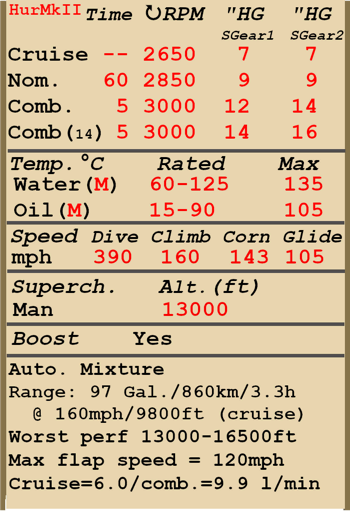

# Hurricane Mk.II  

<table><tbody><tr><td style="text-align: center"></td><td style="text-align: center"></td></tr></tbody></table>  

- Document 01 [ [eng](../real_manuals/hurricanemkii.01.eng.pdf) ]   

## Description  

Vitesse de décrochage indiquée en configuration de vol : 132...155 km/h  
Vitesse de décrochage indiquée en configuration de décollage/atterrissage : 123...144 km/h  
  
Vitesse limite de piqué : 630 km/h  
Facteur de charge maximum : 11.0 G  
Angle d\attaque de décrochage en configuration de vol : 17.6 °  
Angle d\attaque de décrochage indiquée en configuration d\atterrissage : 15.4 °  
  
Vitesse sol au niveau de la mer, 3000 RPM, boosté +14 : 466 km/h (modification)  
Vitesse sol au niveau de la mer, 3000 RPM, boosté +12 : 455 km/h  
Vitesse sol au niveau de la mer, 3000 RPM, boosté +9 : 435 km/h  
Vitesse sol maximale à 4200 m, 3000 RPM, boosté +9 : 514 km/h  
Vitesse sol maximale à 6550 m, 3000 RPM, boosté +9 : 543 km/h  
  
Plafond opérationnel : 11300 m  
Taux de montée au niveau de la mer : 14.0 m/s  
Taux de montée à 3000 m : 13.5 m/s  
Taux de montée à 6000 m : 10.2 m/s  
  
Virage à 360° au niveau de la mer en : 16,8 s, à 230 km/h vitesse indiquée (IAS).  
Virage à 360° à 3000 m : 20,3 s, à 230 km/h vitesse indiquée (IAS).  
  
Endurance à 3000 m : 3,3 h, à 260 km/h vitesse indiquée (IAS).  
  
Vitesse de décollage : 150...180 km/h  
Vitesse d\approche : 150...185 km/h  
Vitesse d\atterrissage : 115...135 km/h  
Angle d\atterrissage : 10,0 °  
  
Note 1 : les données sont indiquées à l\atmosphère standard international (ISA).  
Note 2 : les performances d\endurance sont données pour plusieurs masses possibles.  
Note 3 : la vitesse maximale, le taux de montée et le temps de virage sont donnés pour une masse standard.  
Note 4: climb rates are given for 2850 RPM and boost +9, turn times are given for 3000 RPM and boost +12.  
  
Moteur :  
Modèle : Merlin XX  
Puissance maximale au régime de décollage au niveau de la mer (3000 RPM, boosté +12) : 1280 cv  
Puissance maximale au régime de montée à 10000 feet (2850 RPM, boosté +9) : 1240 cv  
Puissance maximale au régime de montée à 17500 feet (2850 RPM, boosté +9) : 1175 cv  
Puissance maximale au régime combat à 8500 feet (3000 RPM, boosté +12) : 1400 cv  
Puissance maximale au régime combat à 14750 feet (3000 RPM, boosté +14) : 1405 cv  
  
Performance du moteur :  
Continu (durée illimitée) : 2650 tr/min, boosté +7  
Montée (jusqu\à 60 minutes) : 2850 tr/min, boosté +9  
Combat (jusqu\à 5 minutes) : 3000 tr/min, boosté +12/+14  
Combat (jusqu\à 5 minutes) : 3000 tr/min, boosté +14/+16 (modification)  
  
Température de fonctionnement d\eau en sortie du moteur : 60..125 °C  
Température maximale d\eau en sortie du moteur : 135 °C  
Température de fonctionnement d\huile à l\admission du moteur : 15..90 °C  
Température maximale d\huile à l\admission du moteur : 105 °C  
  
Altitude de changement d\étage du compresseur : 3960 m  
  
Masse à vide : 2567 kg  
Masse minimale (sans munitions, 10% de carburant) : 2859 kg  
Masse standard : 3225 kg  
Masse maximale au décollage : 3894 kg  
Masse de carburant : 317 kg / 441,5 l  
Charge utile : 1327 kg  
  
Armement offensif :  
8 mitrailleuse Browning .303 de 7,7 mm, 324-338 coups, 2676 coups au total, 1150 coups par minute, dans l\aile  
8 mitrailleuse Browning .303 de 7,7 mm, 370-490 coups, 3270 coups au total, 1150 coups par minute, dans l\aile (modification)  
12 mitrailleuse Browning .303 de 7,7 mm, 324-338 coups, 3988 coups au total, 1150 coups par minute, dans l\aile (modification)  
12 mitrailleuse Browning .303 de 7,7 mm, 328-490 coups, 4582 coups au total, 1150 coups par minute, dans l\aile (modification)  
4 canons Hispano Mk.V de 20 mm, 90 coups, 650 coups par minute, dans l\aile (modification)  
2 mitrailleuse Browning .303 de 7,7 mm, 650 coups, 1150 coups par minute, dans l\aile (modification)  
2 canons Vickers Class S de 40 mm, 15 coups, 125 coups par minute, dans l\aile (modification)  
2 mitrailleuses UB de 12,7 mm, 100 coups, 1000 coups par minute, dans l\aile (modification)  
2 canons ShVAK de 20 mm, 120 coups, 800 coups par minute, dans l\aile (modification)  
  
Bombes :  
2 bombes d\emploi général 250 lb. G.P. de 113 kg  
2 bombes d\emploi général 500 lb. G.P. de 226 kg  
2 bombes d\emploi général FAB-100M de 104 kg (modification)  
  
Roquettes:  
6 roquettes ROS-82 de 7 kg, charge militaire HE (explosif) de 2,5 kg (modification)  
  
Longueur : 9,82 m  
Envergure : 12,19 m  
Surface alaire : 23,92 m²  
  
Premier engagement : lautomne 1940  
  
Operation features:  
- The engine is equipped with the two-stage mechanical supercharger which should be manually switched at 13000ft altitude.  
- The engine is equipped with an automatic fuel mixture control which maintains optimal mixture.  
- Engine RPM has an automatic governor that controls the propeller pitch to maintain the required RPM.  
- Water and oil temperatures are controlled manually by adjusting the radiator shutter.  
- The aircraft has a fuel gauge which shows remaining fuel in fuel tanks depending on switch position. In game the fuel indicator switch changes by pressing (RShift+I).  
- The aircraft is equipped with elevator and rudder trimmers.  
- Landing flaps have hydraulic actuators and can be extended to any angle up to 80°. The speed with the extended flaps is limited to 120 mph.  
- The aircraft tailwheel rotates freely and does not have a lock.  
- The aircraft has differential pneumatic wheel brakes with shared control lever. This means that if the brake lever is held and the rudder pedal the opposite wheel brake is gradually released causing the plane to swing to one side or the other.  
- The aircraft is equipped with a siren that warns a pilot if the throttle is set to low position with landing gear retracted.  
- It is impossible to open the canopy at high speeds because of the ram air, but there is an emergency jettison handle for bailing out.  
- The aircraft is equipped with upper and bottom formation lights which can be turned on simultaneously or independently.  
- The gunsight is adjustable: both the target distance and target base can be set.  
- The gunsight has a sliding sun-filter.  
- When bombs are installed there is a salvo controller, it has two release modes: single drop or drop two in a salvo.  
- When rockets are installed there is a salvo controller, it has three launch modes: single fire, fire two in a salvo or fire four in a salvo.  
  
Basic data and recommended positions of the aircraft controls:  
1. Starting the engine:  
	- recommended position of the mixture control lever: auto mixture control  
	- recommended position of the radiator control handle: open  
	- recommended position of the prop pitch control handle: auto prop pitch control  
	- recommended position of the throttle lever: 15%  
  
2. Recommended mixture control lever positions for various flight modes: auto mixture control  
  
3. Recommended positions of the radiator control handle for various flight modes:  
	- takeoff: open 60%  
	- climb: open 100%  
	- cruise flight: open 40%  
	- combat: open 80%  
  
4. Approximate fuel consumption at 2000 m altitude:  
	- Cruise engine mode: 6.0 l/min  
	- Combat engine mode: 9.9 l/min  

## Modifications  
### Merlin XX engine with +14 lb boost  

Merlin XX engine with +14 lb boost  
Estimated speed increase at sea level: 11 km/h  
  
### Air Cleaner  

Air cleaner for dusty conditions  
Additional mass: 13 kg  
Estimated speed loss: 5 km/h  
  
### Four additional "Browning .303" MGs  

Four additional wing-mounted "Browning .303" 7.7mm machine guns with 328 rounds per gun.  
Additional mass: 100 kg  
Ammunition mass: 39 kg  
Guns mass: 55 kg  
Estimated speed loss: 3 km/h  
  
### 4 x 20mm "Hispano Mk.II" gun  

Four "Hispano Mk.II" 20mm wing-mounted guns with 90 rounds per each instead of default "Browning .303" wing-mounted machineguns  
Additional mass: 195 kg  
Ammunition mass: 102 kg  
Guns mass: 228 kg  
Estimated speed loss: 12 km/h  
  
### Miroir  

Miroir pour voir lhémisphère arrière  
Additional mass: 1 kg  
Estimated speed loss: 2 km/h  
  
### 2 x 12.7 mm BS and 2 x 20mm ShVAK  

Two BS 12.7 mm wing-mounted machine guns with 100 rounds per each and two ShVAK 20mm wing-mounted guns with 120 rounds per each instead of default "Browning .303" wing-mounted machineguns  
Additional mass: 59 kg  
Ammunition mass: 87 kg  
Guns mass: 124 kg  
Estimated speed loss: 4 km/h  
  
### 2 x 40mm Vickers gun pods + Armor  

Two wing-mounted "Browning .303" 7.7mm machine guns with 650 rounds per each and two Vickers Class S 40mm gun pods with 15 rounds per each instead of default "Browning .303" wing-mounted machineguns + additional armour plates  
Additional mass: 390 kg  
Ammunition mass: 84 kg  
Guns mass: 323 kg  
Armour mass: 148 kg  
Estimated speed loss: 16 km/h  
  
### 2 x 40mm Vickers Class S gun pods  

Two wing-mounted "Browning .303" 7.7mm machine guns with 650 rounds per each and two Vickers Class S 40mm gun pods with 15 rounds per each instead of default "Browning .303" wing-mounted machineguns  
Additional mass: 242 kg  
Ammunition mass: 84 kg  
Guns mass: 323 kg  
Estimated speed loss: 14 km/h  
