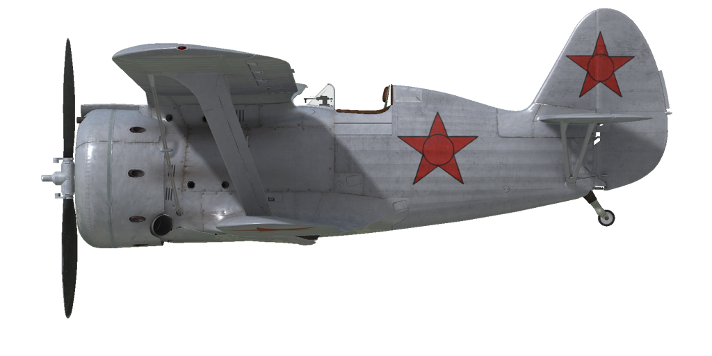

# I-153  
  
  
  
## Beschreibung  
  
Überziehgeschwindigkeit in Flugkonfiguration: 114..124 km/h  
Höchstzulässige Geschwindigkeit im Sturzflug: 550 km/h  
Bruchlastvielfache: 12 G  
Kritischer Anstellwinkel in Flugkonfiguration: 19.9 °  
  
Höchstgeschwindigkeit in Bodennähe, Startleistung: 409 km/h  
Höchstgeschwindigkeit in 1530 m Höhe, Nennleistung: 411 km/h  
Höchstgeschwindigkeit in 4850 m Höhe, Nennleistung: 440 km/h  
  
Dienstgipfelhöhe: 11000 m  
Steigleistung in Bodennähe: 16.1 m/s  
Steigleistung in 4000 m Höhe: 13.1 m/s  
Steigleistung in 6000 m Höhe: 9.7 m/s  
  
Maximale Wendegeschwindigkeit in Bodennähe: 11.9 s (200 km/h IAS).  
Maximale Wendegeschwindigkeit in 3000 m Höhe: 15.3 s (200 km/h IAS).  
  
Reichweite in 3000 m: 1.0 h, bei 300 km/h IAS.  
  
Startgeschwindigkeit: 110..120 km/h  
Anfluggeschwindigkeit: 145..160 km/h  
Landegeschwindigkeit: 105..115 km/h  
Sinkflugpfad: 16.3 °  
  
Anmerkung 1: Die Werte gelten für Normatmosphäre (ISA).  
Anmerkung 2: Flugleistungen varrieren je nach Abfluggewicht.  
Anmerkung 3: Höchstgeschwindigkeiten, Steigleistungen und Wendegeschwindigkeiten gelten für Standard-Fluggewicht.  
Anmerkung 4: Steigraten und Wendegeschwindigkeiten gelten für Nennleistung.  
  
Triebwerk:  
Baumuster: M-62  
Startleistung in Bodennähe: 1000 PS  
Nennleistung in Bodennähe: 830 PS  
Nennleistung in 1530 m Höhe: 850 PS  
Nennleistung in 4200 m Höhe: 800 PS  
  
Leistungsstufen:  
Nennleistung (unbegrenzt): 2100 U/min, 900 mm Hg  
Startleistung (bis zu 5 Minuten): 2200 U/min, 1050 mm Hg  
  
Schmierstoffaustrittstemperatur (normal): 60..90 °C  
Schmierstoffaustrittstemperatur (höchstens): 125 °C  
Zylinderkopftemperatur (normal): 125..200 °C  
Zylinderkopftemperatur (höchstens): 205 °C  
  
Laderumschalthöhe: 2500 m  
  
Triebwerk:  
Baumuster: M-63  
Startleistung in Bodennähe: 1100 PS  
Nennleistung in Bodennähe: 930 PS  
Nennleistung in 1800 m Höhe: 1000 PS  
Nennleistung in 4500 m Höhe: 900 PS  
  
Leistungsstufen:  
Nennleistung (unbegrenzt): 2200 U/min, 915 mm Hg  
Startleistung (bis zu 5 Minuten): 2300 U/min, 1065 mm Hg  
  
Schmierstoffaustrittstemperatur (normal): 55..90 °C  
Schmierstoffaustrittstemperatur (höchstens): 125 °C  
Zylinderkopftemperatur (normal): 120..200 °C  
Zylinderkopftemperatur (höchstens): 205 °C  
  
Laderumschalthöhe: 3000 m  
  
Leergewicht: 1514 kg  
Minimalgewicht (keine Munition, 10% Treibstoff): 1630 kg  
Normalgewicht: 1863 kg  
Höchstabfluggewicht: 2195 kg  
Kraftstoffmenge: 237 kg / 316 l  
Nutzlast: 681 kg  
  
Starre Schusswaffenanlage:  
2 x 7.62 mm SchKAS, 1450 Schuss, 1800 Schuss pro Minute, gesteuert schießend  
2 x 7.62 mm SchKAS, 1020 Schuss, 1800 Schuss pro Minute, gesteuert schießend  
12.7 mm UB, 165 Schuss, 1000 Schuss pro Minute, gesteuert schießend (Rüstsatz)  
  
Abwurfwaffen:  
4 x 50 kg Mehrzweck-Sprengbomben FAB-50sv  
2 x 104 kg Mehrzweck-Sprengbomben FAB-100M  
  
Raketen:  
Bis zu 8 x 7 kg Raketen ROS-82, Sprengladung 2.52 kg  
  
Länge: 6.175 m  
Spannweite: of upper wing: 10 m  
Spannweite: of lower wing: 7.5 m  
Flügelfläche: 22.14 m²  
  
Erster Fronteinsatz: Juli 1939  
  
Eigenschaften:  
- Der Motor hat eine verstärkte Zusatzleistung. Um die Zusatzleistung zu verwenden, ist es erforderlich, den Zusatzleistung-Hebel nach vorne zu drücken und die Motordrehzahl auf 2200 U/min zu erhöhen.  
- Der Motor hat einen Zweiganglader, welcher manuell auf 2500 m Höhe umgeschaltet werden muss.  
- Die Gemischregelung erfolgt automatisch, wenn sich der Hebel in der Maximalstellung befindet. Es ist möglich das Gemisch abzumagern, wenn der Hebel in eine niedrige Stellung bewegt wird. Dies reduziert den Treibstoffverbrauch während des Fluges.  
- Der Motor besitzt eine automatische Drehzahlregelung, welche die Motordrehzahl je nach Hebelstellung festlegt. Der Regler verstellt automatisch den Anstellwinkel des Propellers um die erforderliche Drehzahl einzuhalten.  
- Die Regelung der Ölkühlerklappen und die Einlassklappe für die Luftkühlung erfolgt manuell.  
- Das Flugzeug hat keine Vorrichtungen zur Trimmung während des Fluges. Das Flugzeug besitzt Trimmkannten, welche vor dem Flug von dem Bodenpersonal angepasst werden können.  
- Das Spornrad des Flugzeug ist mit den Ruderpedalen gekoppelt. Deshalb ist es erforderlich, größere Ruderpedalausschläge bei hohen Geschwindigkeiten am Boden zu vermeiden.  
- The aircraft has differential pneumatic wheel brakes with shared control lever. This means that if the brake lever is held and the rudder pedal the opposite wheel brake is gradually released causing the plane to swing to one side or the other. To brake the wheels, move the pedals to the neutral position and press the brake lever located on the flight stick. If the pedals are not in neutral position, only one wheel will be braked. If the right pedal is in the forward position, the right wheel will be braked and vice versa, if the left pedal is in the forward position, the left wheel will be braked.  
- Das Flugzeug hat eine hydrostatische Tankanzeige, welch den gesamten Treibstoffstand nur dann anzeigt, wenn ein manueller Ansaug-Hebel eingedrückt wird. In game this happens by pressing (RShift+I by default).  
- Das Cockpit hat Seitentüren, welche vor dem Abflug geschlossen werden sollten, um eine Beschädigung zu vermeiden  
- The aircraft is equipped with a bomb salvo controller, it has three release modes: single drop, drop two in a salvo or drop four in a salvo.  
- The aircraft is equipped with a rockets salvo controller, it has three launch modes: single fire, fire two in a salvo or fire four in a salvo.  
- Das Visier ist mit einen Sonnenfilter ausgestattet. Für den Fall, dass das Visier beschädigt wird, steht ein mechanisches Hilfsvisier zur Verfügung.  
- There is no radio station in the default aircraft configuration. As a modification, the installation of the RSI-3 radio station is provided.  
- Full fuel tank capacity is 316 liters (237 kg of petrol). Normal fuel load is 200 liters (150 kg).  
  
Basic data and recommended positions of the aircraft controls:  
1. Starting the engine:  
	- recommended position of the mixture control lever: auto mixture control  
	- recommended position of the cowl flap control handle: 0%  
	- recommended position of the radiator control handle: 0%  
	- recommended position of the prop pitch control handle: light 90%  
	- recommended position of the throttle lever: 15%  
  
2. Recommended mixture control lever positions for various flight modes: auto mixture control  
  
3.1 Recommended positions of cowl flaps for various flight modes:  
	- takeoff: open 50%  
	- climb: open 100%  
	- cruise flight: open 30% (in winter conditions - close to 15% if necessary)  
	- combat: open 70%  
  
3.2 Recommended positions of the oil radiator control handle for various flight modes:  
	- takeoff: open 50%  
	- climb: open 100%  
	- cruise flight: open 60%  
	- combat: open 100%  
  
4. Approximate fuel consumption at 2000 m altitude:  
	- Nominal engine mode: 5.6 l/min  
	- Boosted engine mode: 6.0 l/min  
  
## Änderungen  
  
### BS 12.7 mm (165 rounds)  
  
BS 12.7mm nose-mounted machinegun with 165 rounds instead of default two upper SchKAS nose-mounted machineguns  
Ammunition mass: 31 kg  
Guns mass: 24.2 kg  
Estimated speed loss: 0 km/h  
  
  
### 2 x Bomben, Typ FAB-50sv / FAB-100M  
  
2 x 50-kg-Splitterbomben FAB-50sv / 2 x 104-kg-Splitterbomben FAB-100M  
  
FAB-50sv:  
Zusätzliches Gewicht: 120 kg  
Gewicht der Munition: 104 kg  
Gewicht der Abwurfwaffenroste: 20 kg  
Geschwindigkeitsverlust vor Abwurf: 13 km/h  
Geschwindigkeitsverlust nach Abwurf: 7 km/h  
  
FAB-100M:  
Zusätzliches Gewicht: 228 kg  
Gewicht der Munition: 208 kg  
Gewicht der Abwurfwaffenroste: 20 kg  
Geschwindigkeitsverlust vor Abwurf: 18 km/h  
Geschwindigkeitsverlust nach Abwurf: 7 km/h  
  
  
### 4 x Bomben, Typ FAB-50sv  
  
4 x 50-kg-Splitterbomben FAB-50sv  
  
FAB-50sv:  
Zusätzliches Gewicht: 240 kg  
Gewicht der Munition: 200 kg  
Gewicht der Abwurfwaffenroste: 40 kg  
Geschwindigkeitsverlust vor Abwurf: 16 km/h  
Geschwindigkeitsverlust nach Abwurf: 7 km/h  
  
### M-63 Engine  
  
Increased RPM and boost, the oil radiator enlarged to 9 inches and placed under the hood. The frontal cooling openings size increased.  
Estimated speed gain: 10 km/h.  
Estimated climb rate gain: 1.5 m/s.  
  
### Funkgerät  
  
Funkgerät RSI-3  
Zusätzliches Gewicht: 12.6 kg  
Geschwindigkeitsverlust: 0 km/h  
  
  
### 8 x Raketen, Typ ROS-82  
  
8 x ungelenkte 82-mm-Explosivraketen ROS-82  
Zusätzliches Gewicht: 80 kg  
Gewicht der Munition: 56 kg  
Gewicht der Abwurfwaffenroste: 24 kg  
Geschwindigkeitsverlust vor dem Abfeuern: 15 km/h  
Geschwindigkeitsverlust nach dem Abfeuern: 8 km/h  
