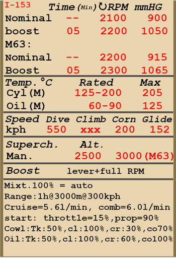

# И-153  

<table><tbody><tr><td style="text-align: center"></td><td style="text-align: center"></tr></td></tr></tbody></table>  

Приборная скорость сваливания в полётной конфигурации: 114..124 км/ч  
Предельная скорость в пикировании: 550 км/ч  
Разрушающая перегрузка: 12 единиц  
Угол атаки сваливания, в полётной конфигурации: 19,9 °  
  
Максимальная истинная скорость у земли, режим двигателя - форсированный: 409 км/ч  
Максимальная истинная скорость на высоте 1530 м, режим двигателя - номинал: 411 км/ч  
Максимальная истинная скорость на высоте 4850 м, режим двигателя - номинал: 440 км/ч  
  
Практический потолок: 11000 м  
Скороподъёмность у земли: 16,1 м/с  
Скороподъёмность на высоте 4000 м: 13,1 м/с  
Скороподъёмность на высоте 6000 м: 9,7 м/с  
  
Время виража предельного по тяге у земли: 11,9 с, на скорости 200 км/ч по прибору  
Время виража предельного по тяге на высоте 3000 м: 15,3 с, на скорости 200 км/ч по прибору  
  
Продолжительность полёта на высоте 3000 м: 1,0 ч, на скорости 300 км/ч по прибору  
  
Скорость взлётная: 110..120 км/ч  
Скорость на глиссаде: 145..160 км/ч  
Скорость посадочная: 105..115 км/ч  
Посадочный угол: 16,3 °  
  
Примечание 1: данные указаны для условий международной стандартной атмосферы.  
Примечание 2: диапазоны характеристик даны для допустимого диапазона масс самолёта.  
Примечание 3: максимальные скорости, скороподъемности и время виража даны для стандартной массы самолёта.  
Примечание 4: скороподъемность и время виража даны на номинальном режиме работы двигателя.  
  
Двигатель:  
Модель: М-62   
Максимальная мощность на форсированном режиме у земли: 1000 л.с.  
Максимальная мощность на номинальном режиме у земли: 830 л.с.  
Максимальная мощность на номинальном режиме на высоте 1530 м: 850 л.с.  
Максимальная мощность на номинальном режиме на высоте 4200 м: 800 л.с.  
  
Режимы работы двигателя:  
Номинальный (время неограничено): 2100 об/мин, 900 мм рт.ст.  
Форсированный (до 5 минут): 2200 об/мин, 1050 мм рт.ст.  
  
Температура масла на выходе из двигателя номинальная: 60..90 °С  
Температура масла на выходе из двигателя предельная: 125 °С  
Температура головок номинальная: 125..200 °С  
Температура головок предельная: 205 °С  
  
Высота переключения нагнетателя: 2500 м  
  
Двигатель:  
Модель: М-63   
Максимальная мощность на форсированном режиме у земли: 1100 л.с.  
Максимальная мощность на номинальном режиме у земли: 930 л.с.  
Максимальная мощность на номинальном режиме на высоте 1800 м: 1000 л.с.  
Максимальная мощность на номинальном режиме на высоте 4500 м: 900 л.с.  
  
Режимы работы двигателя:  
Номинальный (время неограничено): 2200 об/мин, 915 мм рт.ст.  
Форсированный (до 5 минут): 2300 об/мин, 1065 мм рт.ст.  
  
Температура масла на выходе из двигателя номинальная: 55..90 °С  
Температура масла на выходе из двигателя предельная: 125 °С  
Температура головок номинальная: 120..200 °С  
Температура головок предельная: 205 °С  
  
Высота переключения нагнетателя: 3000 м  
  
Масса пустого самолёта: 1514 кг  
Минимальная масса (без БК, 10% топлива): 1630 кг  
Стандартная масса: 1863 кг  
Максимальная взлётная масса: 2195 кг  
Максимальный запас топлива: 237 кг / 316 л  
Максимальная полезная нагрузка: 681 кг  
  
Вооружение курсовое:  
2 x 7,62мм пулемёт "ШКАС", 1450 патронов, 1800 выстр/мин, синхронизированный верхний  
2 x 7,62мм пулемёт "ШКАС", 1020 патронов, 1800 выстр/мин, синхронизированный нижний  
12,7мм пулемёт "УБ", 165 патронов, 1000 выстр/мин, синхронизированный (модификация)  
  
Вооружение бомбовое:  
4 x 50 кг осколочно-фугасные авиабомбы "ФАБ-50св"  
2 x 104 кг осколочно-фугасные авиабомбы "ФАБ-100М"  
  
Вооружение ракетное:  
До 8 x 7 кг неуправляемых авиационных ракет "РОС-82", масса осколочно-фугасной боевой части 2,52 кг  
  
Длина: 6,175 м  
Размах верхнего крыла: 10 м  
Размах нижнего крыла: 7,5 м  
Суммарная площадь коробки крыльев: 22,14 кв.м  
  
Начало участия в боевых действиях: июль 1939  
  
Особенности эксплуатации:  
- Двигатели самолёта имеют форсажный режим. Для использования форсажа необходимо передвинуть рычаг форсажа полностью "от себя" и увеличить обороты двигателя М-62 до 2200 об/мин, двигателя М-63 до 2300 об/мин.  
- Двигатели оборудованы двухступенчатым нагнетателем. Ступени нагнетателя следует переключать при пересечении высоты 2500 м для двигателя М-62 и 3000 м для двигателя М-63.  
- Высотный корректор при установке рычага в максимально переднее положение автоматически поддерживает оптимальную топливовоздушную смесь с увеличением высоты полёта. Перемещение рычага назад позволяет обеднять смесь для снижения расхода топлива на маршруте.  
- Регулятор постоянных оборотов винта поддерживает заданные рычагом винта обороты мотора за счёт автоматического изменения шага винта.  
- Створки маслорадиатора, а также входные створки капота для воздушного охлаждения двигателя управляются вручную.  
- На самолёте нет триммеров. Регулировка планера осуществляется на земле специальными регулировочными отгибными пластинами на рулях.  
- Самолёт имеет хвостовое колесо, управляемое совместно с рулём направления. В связи с этим при движении по ВПП с большой скоростью на взлёте или посадке следует избегать излишнего отклонения педалей.  
- Управление тормозами колес пневматическое. Для торможения колес следует поставить педали в нейтральное положение и нажать тормозной рычажок, помещенный на ручке управления самолетом. Если педали ножного управления будут не в нейтральном положении, то затормозится лишь одно колесо. При этом, если правая педаль будет в переднем положении, то затормозится правое колесо и, наоборот, при переднем положении левой педали затормозится левое колесо.  
- Самолёт оснащён гидростатическим указателем топлива, который показывает общее количество топлива при втягивании и удержании поршня ручного насоса. В игре поршень насоса активируется комбинацией клавиш (по умолчанию RShift+I).  
- Кабина лётчика по бортам имеет откидные створки, которые следует закрывать перед взлётом во избежание их поломки набегающим потоком воздуха.  
- Система управления крыльевыми бомбодержателями позволяет выполнять бомбометание по одной, по две или по четыре бомбы.  
- Для стрельбы подвесными ракетами используется электросбрасыватель, который позволяет осуществлять пуск ракет по одной, по две или по четыре в серии.  
- Прицел имеет сдвижной светофильтр. В кабине также установлен откидной дублирующий механический прицел, который используется при повреждении основного прицела.  
- В стандартной конфигурации на самолёте отсутствует радиооборудование. В качестве модификации предусмотрена установка самолетной радиостанции типа РСИ-3.  
- Полная ёмкость бензобака 316 л (237 кг при удельном весе бензина 0,75). Нормальная загрузка горючим - 200 л, что соответствует 150 кг.   
  
Основные данные и рекомендуемые положения органов управления самолётом:  
1. Запуск двигателя:  
	- рекомендуемое положение рукояти управления смесью: автоматическое управление смесью  
	- рекомендуемое положение рукояти управления створками капота: 0%  
	- рекомендуемое положение рукояти управления радиатором: 0%  
	- рекомендуемое положения рукояти управления шагом винта: легкий винт 90%  
	- рекомендуемое положение рычага управления двигателем: 15%  
  
2. Рекомендуемые положения рукояти смеси при различных режимах полёта: автоматическое управление смесью  
  
3.1 Рекомендуемые положения рукояти управления створками капота при различных режимах полёта:  
	- взлёт: открыто 50%  
	- набор высоты: открыто 100%  
	- крейсерский полёт: открыто 30% (зимой закрыть до 15% при необходимости)  
	- бой: открыто 70%  
  
3.2 Рекомендуемые положения рукояти управления маслорадиатором при различных режимах полёта:  
	- взлёт: открыто 50%  
	- набор высоты: открыто 100%  
	- крейсерский полёт: открыто 60%  
	- бой: открыто 100%  
  
4. Ориентировочный расход топлива на различных режимах работы на высоте 2000 м:  
	- номинальный режим работы двигателя: 5,6 л/мин  
	- форсированный режим работы двигателя: 6,0 л/мин  

## Модификации  
### 12,7-мм БС (165 патронов)  

Один 12,7-мм пулемёт УБС с боезапасом 165 патронов вместо двух верхних пулемётов ШКАС  
Масса боекомплекта: 31 кг  
Масса орудия: 24.2 кг  
Ориентировочная потеря скорости: 0 км/ч  

### 2 х ФАБ-50св / ФАБ-100М  

2 x 50 кг осколочно-фугасные авиабомбы ФАБ-50св / 2 x 104 кг осколочно-фугасные авиабомбы ФАБ-100М  
  
ФАБ-50св:  
Дополнительная масса: 120 кг  
Масса вооружения: 104 кг  
Масса держателей: 20 кг  
Ориентировочная потеря скорости до сброса: 13 км/ч  
Ориентировочная потеря скорости после сброса: 7 км/ч  
  
ФАБ-100М:  
Дополнительная масса: 228 кг  
Масса вооружения: 208 кг  
Масса держателей: 20 кг  
Ориентировочная потеря скорости до сброса: 18 км/ч  
Ориентировочная потеря скорости после сброса: 7 км/ч  

### 4 х ФАБ-50св  

4 x 50 кг осколочно-фугасные авиабомбы ФАБ-50св  
  
ФАБ-50св:  
Дополнительная масса: 240 кг  
Масса вооружения: 200 кг  
Масса держателей: 40 кг  
Ориентировочная потеря скорости до сброса: 16 км/ч  
Ориентировочная потеря скорости после сброса: 7 км/ч  
  
### Двигатель М-63  

Форсирован по оборотам и наддуву. Маслорадиатор увеличен до 9-ти дюймов и перенесён в подкапотное пространство. Увеличены размеры окон охлаждения в лобовой части.  
Ориентировочный прирост скорости у земли: 10 км/ч.  
Ориентировочный прирост скороподъёмности у земли: 1,5 м/с.  
  
### Радиостанция  

Радиостанция РСИ-3  
Дополнительная масса: 12,6 кг  
Ориентировочная потеря скорости: 0 км/ч  

### 8 x РОС-82  

8 x 82 мм реактивных осколочных снарядов РОС-82  
Дополнительная масса: 80 кг  
Масса вооружения: 56 кг  
Масса держателей: 24 кг  
Ориентировочная потеря скорости до пуска: 15 км/ч  
Ориентировочная потеря скорости после пуска: 8 км/ч  
