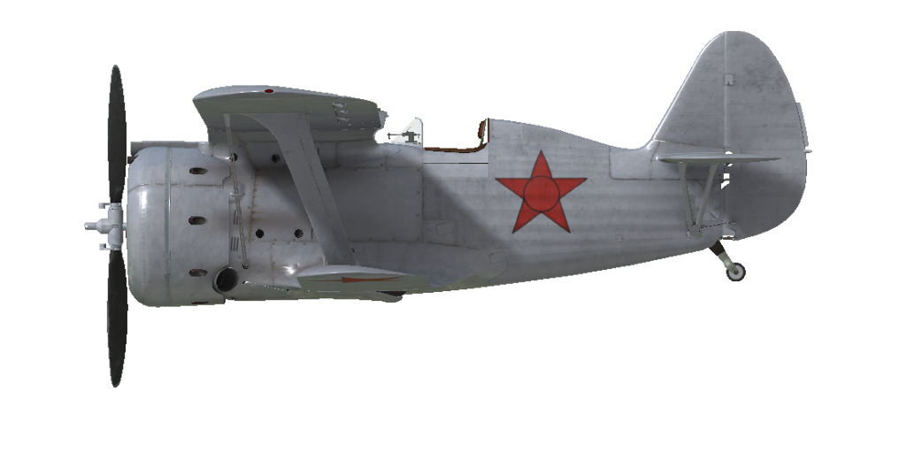

# I-153

## Descripción

Velocidad indicada de pérdida en configuración de vuelo: 114..124 km/h
Velocidad de picado límite: 550 km/h
Carga de rotura máxima (en fuerzas <i>g</i>): 12 <i>g</i>
Ángulo de ataque crítico en configuración de vuelo: 19,9°

Velocidad respecto al suelo al nivel del mar, modo motor - Impulso: 409 km/h
Velocidad máxima respecto al suelo a 1530 m, modo motor - Continuo: 411 km/h
Velocidad máxima respecto al suelo a 4850 m, modo motor - Continuo: 440 km/h

Techo de servicio: 11000 m
Tasa de ascenso al nivel del mar: 16,1 m/s
Tasa de ascenso a 4000 m: 13,1 m/s
Tasa de ascenso a 6000 m: 9,7 m/s

Viraje de máximo rendimiento al nivel del mar: 11,9 s, a 200 km/h velocidad indicada (IAS).
Viraje de máximo rendimiento a 3000 m: 15,3 s, a 200 km/h velocidad indicada (IAS).

Autonomía de vuelo a 3000 m: 1,0 h, a 300 km/h velocidad indicada (IAS).

Velocidad de despegue: 110..120 km/h
Velocidad senda de planeo: 145..160 km/h
Velocidad de aterrizaje: 105..115 km/h
Ángulo de aterrizaje: 16,3°

Nota 1: los datos están basados en la atmósfera estándar internacional (ISA).
Nota 2: diferentes rendimientos de vuelo dados para los diferentes pesos posibles del avión.
Nota 3: velocidades máximas, tasas de ascenso y tiempos de giro dados para el peso estándar del avión.
Nota 4: tasas de ascenso y tiempo de giro dados para la potencia de Continuo.

Motor:
Modelo: M-62
Potencia máxima en modo Impulso al nivel del mar: 1000 CV
Potencia máxima en modo Continuo al nivel del mar: 830 CV
Potencia máxima en modo Continuo a 1530 m: 850 CV
Potencia máxima en modo Continuo a 4200 m: 800 CV

Modos de funcionamiento motor:
Continuo (sin límite de tiempo): 2100 rpm, 900 mmHg
Impulso (hasta 5 minutos): 2200 rpm, 1050 mmHg

Temperatura nominal del aceite a la salida del motor: 60..90 °C
Temperatura máxima del aceite a la salida del motor: 125 °C
Temperatura nominal en la culata: 125..200 °C
Temperatura máxima en la culata: 205 °C

Altitud conexión compresor: 2500 m

Motor:
Modelo: M-63
Potencia máxima en modo Impulso al nivel del mar: 1100 CV
Potencia máxima en modo Continuo al nivel del mar: 930 CV
Potencia máxima en modo Continuo a 1800 m: 1000 CV
Potencia máxima en modo Continuo a 4500 m: 900 CV

Modos de funcionamiento motor:
Continuo (sin límite de tiempo): 2200 rpm, 915 mmHg
Impulso (hasta 5 minutos): 2300 rpm, 1065 mmHg

Temperatura nominal del aceite a la salida del motor: 55..90 °C
Temperatura máxima del aceite a la salida del motor: 125 °C
Temperatura nominal en la culata: 120..200 °C
Temperatura máxima en la culata: 205 °C

Altitud conexión compresor: 3000 m

Peso vacío: 1514 kg
Peso mínimo (sin munición, 10% de combustible): 1630 kg
Peso estándar: 1863 kg
Peso máximo al despegue: 2195 kg
Carga de combustible: 237 kg / 316 l
Carga útil: 681 kg

Armamento delantero:
2 ametralladoras de 7,62 mm «ShKAS», 1450 balas, 1800 balas por minuto, sincronizadas
2 ametralladoras de 7,62 mm «ShKAS», 1020 balas, 1800 balas por minuto, sincronizadas
1 ametralladora de 12,7 mm «UB», 165 balas, 1000 balas por minuto, sincronizada (modificación)

Bombas:
4 bombas de propósito general de 50 kg «FAB-50sv»
2 bombas de propósito general de 104 kg «FAB-100M»

Cohetes:
Hasta 8 cohetes de 7 kg «ROS-82», 2,52 kg de carga HE —altamente explosiva—

Longitud: 6,175 m
Envergadura alar superior: 10 m
Envergadura alar inferior: 7,5 m
Superficie de ala: 22,14 m²

Debut en combate: julio de 1939

Características operativas:
    - El motor tiene un modo de impulso. Para seleccionar el modo impulso es necesario empujar la palanca de impulso completamente hacia adelante y poner el motor M-62 a 2200 rpm (a 2300 rpm si se equipa el modelo M-63).
    - El motor tiene un compresor mecánico de dos etapas. Equipando el modelo M-63 debe conmutarse a 2500 m de altitud, con el M-63 a 3000 m de altitud.
    - El control de la mezcla del motor es automático cuando la palanca de control de la mezcla está al máximo. Es posible empobrecer manualmente la mezcla moviendo la palanca hacia posiciones por debajo del máximo. Esto también reduce el consumo de combustible durante el vuelo.
    - El motor tiene un regulador automático de las rpm que las mantiene al valor correspondiente a la posición de la palanca de control del regulador. Este regulador controla automáticamente el paso de la hélice para mantener las rpm requeridas.
    - El control de la persiana del radiador de aceite y de las persianas de admisión de aire es manual.
    - El avión no tiene compensadores de control en vuelo. Está equipado con unas aletas de compensación flexibles que pueden ser ajustadas antes del vuelo por el personal de tierra.
    - El avión cuenta con un mecanismo de control de la rueda de cola asociado a los pedales del control del timón. Por este motivo, es necesario evitar grandes movimientos de los pedales del control del timón mientras se está rodando en el suelo a altas velocidades.
    - El avión posee frenos neumáticos diferenciales en la ruedas compartidos por una palanca de freno. Para frenar ambas ruedas, se deben dejar los pedales del timón en posición neutral, mientras se pulsa la palanca de freno ubicada en la palanca de control del avión. Si se presiona la palanca de freno y se empuja un pedal del control del timón, solo la rueda de ese lado frenará y el avión comenzará a girar en esa dirección.
    - El avión tiene un indicador de combustible hidrostático que muestra el combustible total restante sólo cuando la palanca de succión manual está presionada (mantener pulsado «Mayús_Dcha + I» por defecto).
    - La cabina tiene puertas laterales que se deben cerrar antes del despegue para evitar dañarlas.
    - Cuando hay bombas instaladas existe un mando para seleccionar el número de bombas que se lanzan con tres posibilidades: lanzar una, lanzar dos en ráfaga o lanzar cuatro en ráfaga.
    - Cuando hay cohetes instalados existe un mando de lanzamiento con tres modos disponibles: disparar uno, disparar dos en ráfaga o disparar cuatro en ráfaga.
    - La mira tiene un filtro solar deslizante. También cuenta con una mira mecánica plegable de respaldo que puede emplearse si la mira principal está dañada.
    - En la configuración por defecto del avión no hay radio transmisor. Se proporciona la instalación del radiotransmisor RSI-3 como modificación.
    - La capacidad total del depósito de combustible es de 316 l (237 kg, 0,75 kg/l). La carga normal de combustible es de 200 l (150 kg).

Datos básicos y configuraciones recomendadas de los controles del avión:
1. Arranque del motor:
    - palanca de control de la mezcla: control de mezcla automático
    - aletas/persianas del carenado: cerradas, 0%
    - radiador de aceite: cerrado, 0%
    - palanca de control rpm de la hélice: 90%
    - palanca de potencia: 15%

2. Posición de la palanca de control de mezcla según momento de vuelo: control de mezcla automático

3.1 Posición de las aletas/persianas del carenado según momento de vuelo:
    - despegue: abiertas 50%
    - ascenso: abiertas 100%
    - crucero: abiertas 30% (en condiciones invernales - cerrar al 15% si necesario)
    - combate: abiertas 70%

3.2 Posición del radiador de aceite según momento de vuelo:
    - despegue: abierto 50%
    - ascenso: abierto 100%
    - crucero: abierto 60%
    - combate: abierto 100%

4. Consumo aproximado de combustible a 2000 m de altitud:
    - Modo motor - Continuo: 5,6 l/min
    - Modo motor - Impulso: 6,0 l/min

## Modificaciones
### UB de 12,7 mm (165 balas)

Ametralladora Berezin UB sincronizada de 12,7 mm con 165 balas montada en la parte superior del morro, en sustitución de las dos ShKAS montadas en esa misma parte del capó
Peso de munición: 31 kg
Peso del armamento: 24,2 kg
Pérdida de velocidad estimada: 0 km/h

### 2 bombas FAB-50sv / FAB-100M

2 bombas de propósito general de 50 kg FAB-50sv / 2 bombas de propósito general de 104 kg FAB-100M

FAB-50sv:
Peso adicional: 120 kg
Peso de munición: 104 kg
Peso de los soportes: 20 kg
Pérdida de velocidad estimada antes de soltar: 13 km/h
Pérdida de velocidad estimada tras soltar: 7 km/h

FAB-100M:
Peso adicional: 228 kg
Peso de munición: 208 kg
Peso de los soportes: 20 kg
Pérdida de velocidad estimada antes de soltar: 18 km/h
Pérdida de velocidad estimada tras soltar: 7 km/h

### 4 bombas FAB-50sv

4 bombas de propósito general de 50 kg FAB-50sv

FAB-50sv:
Peso adicional: 240 kg
Peso de munición: 200 kg
Peso de los soportes: 40 kg
Pérdida de velocidad estimada antes de soltar: 16 km/h
Pérdida de velocidad estimada tras soltar: 7 km/h

### Motor M-63

Instalación de un motor M-63
Potencia las rpm y el compresor, ampliándose el radiador de aceite a 9 pulgadas, que se reubica en la parte inferior del capó. Se aumenta el tamaño de las aberturas de refrigeración frontales en esa mitad inferior.
Ganancia de velocidad estimada: 10 km/h
Ganancia tasa de ascenso estimada: 1,5 m/s

### Radiotransmisor

Radiotransmisor RSI-3
Peso adicional: 12,6 kg
Pérdida de velocidad estimada: 0 km/h

### 8 cohetes ROS-82

8 cohetes no guiados explosivos (HE) de 82 mm ROS-82
Peso adicional: 80 kg
Peso de munición: 56 kg
Peso de los soportes: 24 kg
Pérdida de velocidad estimada antes de lanzarlos: 15 km/h
Pérdida de velocidad estimada tras lanzarlos: 8 km/h
