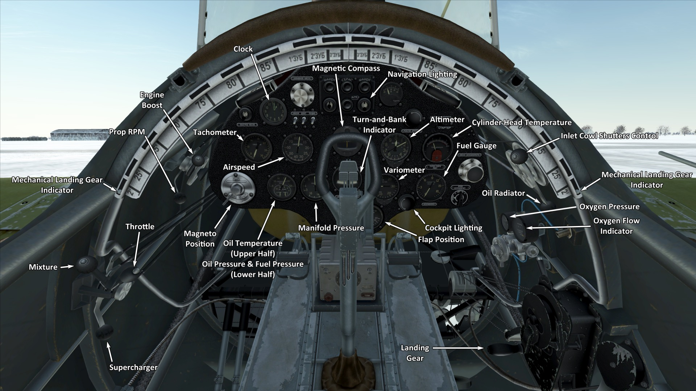

# I-16 type 24  

<table><tbody><tr><td style="text-align: center"></td><td style="text-align: center"></td></tr><tr><td style="text-align: center" colspan="2"></td></tr></tbody></table>  

飞行构型的失速指示空速：143~164 km/h  
起降构型的失速指示空速：142~163 km/h  
俯冲极速：620 km/h  
最大过载：12 G  
飞行构型失速迎角：17.6 °  
着陆构型失速迎角：15 °  
  
最大真空速，高度海平面，发动机模式——加力：448 km/h  
最大真空速，高度1800m，发动机模式——标称：460 km/h  
最大真空速，高度4500m，发动机模式——标称：490 km/h  
  
实用升限：10500 m  
海平面爬升率：16.7 m/s  
3000m时爬升率：13.8 m/s  
6000m时爬升率：8.8 m/s  
  
海平面最大性能盘旋时间：19.0 s，指示空速 230 km/h。  
3000m时最大性能盘旋时间：25.3 s，指示空速 230 km/h。  
  
3000m（9843 feet）时续航时间：0.9h，指示空速 350 km/h。  
  
起飞速度：145~175 km/h  
进近速度：185~195 km/h  
着陆速度：135~145 km/h  
着陆迎角：15.3 °  
  
注1：所提供的数据适用于国际标准大气（ISA）。  
注2：飞行性能范围基于可能的飞机质量范围。  
注3：极速、爬升率和盘旋时间基于标准飞机质量。  
注4：爬升率和盘旋时间基于加力动力。  
  
发动机：  
型号：M-63  
海平面加力模式下的最大功率：1100 HP  
海平面标称动力模式下的最大功率：930 HP  
标称模式下的最大功率，高度1800m：1000 HP  
标称模式下的最大功率，高度4500m：900 HP  
  
发动机模式：  
标称（无时间限制）：2200 RPM，915 mm Hg  
加力动力（不超过5min）：2300 RPM，1065 mm Hg  
  
发动机滑油出油口额定油温：55~90 °C  
发动机滑油出油口最高油温：125 °C  
气缸头额定温度：120~200 °C  
气缸头最高温度：205 °C  
  
机械增压器换挡高度：3000 m  
  
空重：1501 kg  
最小重量（无弹药、10%燃油）：1633 kg  
标准重量：1878 kg  
最大起飞重量：2146 kg  
燃油载荷：191 kg/260 L  
有效载荷：645 kg  
  
前射武器：  
2 x 7.62mm机枪"ShKAS"，500发，1800发/分，同步  
2 x 7.62mm机枪"ShKAS"，900发，1800发/分，机翼安装  
2 x 20mm机炮"ShVAK"，90发，800发/分，机翼安装（改装）  
  
炸弹：  
2 x 50kg 通用炸弹"FAB-50sv"  
2 x 104kg 通用炸弹"FAB-100M"  
  
火箭弹：  
最多6 x 7 kg的“ROS-82”火箭弹，高爆战斗部质量2.52 kg  
  
长度：6.04 m  
翼展：9 m  
机翼面积：14.54 m²  
  
首次投入战斗：1941年6月  
  
操作特性：  
——发动机有个加力模式。要设置加力模式需要把加力杆完全向前推，增加发动机转速到2300 RPM。  
——发动机为二级机械增压，需3000m高度时手动切换。  
——当混合比杆设置为最大时，发动机混合比控制是自动的。可以把混合比杆移动到低于最大来手动贫油混合比。这也会在飞行时降低油耗。  
——发动机转速有自动调节器，其根据调节器控制杆位置保持对应的需用转速。调节器自动控制螺旋桨桨距来保持需用转速。  
——滑油散热器叶片和风冷进气口叶片为手动控制。  
——飞机没有飞行操纵的配平。飞机装有可弯曲的配平片，可由地面人员在飞行前设置。  
——飞机襟翼和起落架的收放，是一个纯靠人工手动操作的系统，因此有必要在最终进近前就放下襟翼和起落架。着陆襟翼可以放下到不超过53°的任意角度。  
——飞机有与方向舵脚蹬相连的尾轮控制机构。因此，在地面高速移动时应避免猛踩舵。  
——飞机有独立的左右机械机轮刹车。要使用刹车，踩下方向舵脚蹬的上部。  
——飞机有个静压油量表，仅在手动抽油杆处于推进位时显示剩余的总油量。In game this happens by pressing (RShift+I by default).。  
——驾驶舱有侧门，应在起飞前关闭以免受损。  
——当炸弹被安装上后会有一个齐投控制功能，它有两种模式：单投和双弹齐投。  
——当火箭弹被安装上后会有一个齐射控制功能，它有三种发射模式：单发，双发齐射，和四发齐射。  
——射击瞄准具拥有一个滑动式的太阳滤光片。还有一个备份的折叠式机械瞄准具，可以在主瞄准具损坏时使用。  
  
Basic data and recommended positions of the aircraft controls:  
1. Starting the engine:  
	- recommended position of the mixture control lever: auto mixture control  
	- recommended position of the cowl flap control handle: 50%  
	- recommended position of the radiator control handle: 50%  
	- recommended position of the prop pitch control handle: light 90%  
	- recommended position of the throttle lever: 5%  
  
2. Recommended mixture control lever positions for various flight modes: auto mixture control  
  
3.1 Recommended positions of cowl flaps for various flight modes:  
	- takeoff: open 50%  
	- climb: open 100%  
	- cruise flight: open 30% (in winter conditions - close to 15% if necessary)  
	- combat: open 70%  
  
3.2 Recommended positions of the oil radiator control handle for various flight modes:  
	- takeoff: open 50%  
	- climb: open 100%  
	- cruise flight: open 60%  
	- combat: open 100%  
  
4. Approximate fuel consumption at 2000 m altitude:  
	- Cruise engine mode: 6.4 l/min  
	- Combat engine mode: 6.8 l/min  

## 修改  
### 2 x FAB-50sv/FAB-100M炸弹  

2 x 50kg 通用炸弹FAB-50sv/2 x 104kg 通用炸弹FAB-100M  
  
FAB-50sv:  
增加质量：120 kg  
弹药质量：104 kg  
挂架质量：20 kg  
投弹前预期速度损失：13 km/h  
投弹后预期速度损失：7 km/h  
  
FAB-100M:  
增加质量：228 kg  
弹药质量：208 kg  
挂架质量：20 kg  
投弹前预期速度损失：18 km/h  
投弹后预期速度损失：7 km/h  
  
### 4 x ROS-82火箭弹  

4 x 82mm高爆无制导火箭弹ROS-82  
增加质量：40 kg  
弹药质量：28 kg  
挂架质量：12 kg  
发射前预期速度损失：10 km/h  
发射后预期速度损失：7 km/h  
  
### 6 x ROS-82火箭弹  

6 x 82mm高爆无制导火箭弹ROS-82  
增加质量：60 kg  
弹药质量：42 kg  
挂架质量：18 kg  
发射前预期速度损失：15 km/h  
发射后预期速度损失：10 km/h  

### 2 x 20mm施瓦克机炮（180发）  

施瓦克20mm翼装机炮，每门备弹90发，替换默认的施卡斯翼装机枪  
增加质量：40 kg  
弹药质量：22 kg  
枪炮质量：98 kg  
预期速度损失：3 km/h  

### 一体式风挡  

一体式座舱前盖部分以获得更佳视野  
增加质量：0 kg  
预期速度损失：0 km/h  
