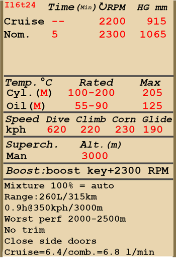

# И-16 тип 24  

<table><tbody><tr><td style="text-align: center"></td><td style="text-align: center"></tr></td></tr></tbody></table>  

Приборная скорость сваливания в полётной конфигурации: 143..164 км/ч  
Приборная скорость сваливания в посадочной конфигурации: 142..163 км/ч  
Предельная скорость в пикировании: 620 км/ч  
Разрушающая перегрузка: 12 единиц  
Угол атаки сваливания, в полётной конфигурации: 17,6 °  
Угол атаки сваливания, в посадочной конфигурации: 15 °  
  
Максимальная истинная скорость у земли, режим двигателя - форсированный: 448 км/ч  
Максимальная истинная скорость на высоте 1800 м, режим двигателя - номинал: 460 км/ч  
Максимальная истинная скорость на высоте 4500 м, режим двигателя - номинал: 490 км/ч  
  
Практический потолок: 10500 м  
Скороподъёмность у земли: 16,7 м/с  
Скороподъёмность на высоте 3000 м: 13,8 м/с  
Скороподъёмность на высоте 6000 м: 8,8 м/с  
  
Время виража предельного по тяге у земли: 19,0 с, на скорости 230 км/ч по прибору  
Время виража предельного по тяге на высоте 3000 м: 25,3 с, на скорости 230 км/ч по прибору  
  
Продолжительность полёта на высоте 3000 м: 0,9 ч, на скорости 350 км/ч по прибору  
  
Скорость взлётная: 145..175 км/ч  
Скорость на глиссаде: 185..195 км/ч  
Скорость посадочная: 135..145 км/ч  
Посадочный угол: 15,3 °  
  
Примечание 1: данные указаны для условий международной стандартной атмосферы.  
Примечание 2: диапазоны характеристик даны для допустимого диапазона масс самолёта.  
Примечание 3: максимальные скорости, скороподъемности и время виража даны для стандартной массы самолёта.  
Примечание 4: скороподъемность и время виража даны на форсированном режиме работы двигателя.  
  
Двигатель:  
Модель: М-63   
Максимальная мощность на форсированном режиме у земли: 1100 л.с.  
Максимальная мощность на номинальном режиме у земли: 930 л.с.  
Максимальная мощность на номинальном режиме на высоте 1800 м: 1000 л.с.  
Максимальная мощность на номинальном режиме на высоте 4500 м: 900 л.с.  
  
Режимы работы двигателя:  
Номинальный (время неограничено): 2200 об/мин, 915 мм рт.ст.  
Форсированный (до 5 минут): 2300 об/мин, 1065 мм рт.ст.  
  
Температура масла на выходе из двигателя номинальная: 55..90 °С  
Температура масла на выходе из двигателя предельная: 125 °С  
Температура головок номинальная: 120..200 °С  
Температура головок предельная: 205 °С  
  
Высота переключения нагнетателя: 3000 м  
  
Масса пустого самолёта: 1501 кг  
Минимальная масса (без БК, 10% топлива): 1633 кг  
Стандартная масса: 1878 кг  
Максимальная взлётная масса: 2146 кг  
Максимальный запас топлива: 191 кг / 260 л  
Максимальная полезная нагрузка: 645 кг  
  
Вооружение курсовое:  
2 x 7,62мм пулемёт "ШКАС", 500 патронов, 1800 выстр/мин, синхронизированный  
2 x 7,62мм пулемёт "ШКАС", 900 патронов, 1800 выстр/мин, крыльевой  
2 x 20мм пушка "ШВАК", 90 снарядов, 800 выстр/мин, крыльевая (модификация)  
  
Вооружение бомбовое:  
2 x 50 кг осколочно-фугасные авиабомбы "ФАБ-50св"  
2 x 104 кг осколочно-фугасные авиабомбы "ФАБ-100М"  
  
Вооружение ракетное:  
До 6 x 7 кг неуправляемых авиационных ракет "РОС-82", масса осколочно-фугасной боевой части 2,52 кг  
  
Длина: 6,04 м  
Размах крыла: 9 м  
Площадь крыла: 14,54 кв.м  
  
Начало участия в боевых действиях: июнь 1941  
  
Особенности эксплуатации:  
- Двигатель самолёта имеет форсажный режим. Для использования форсажа необходимо передвинуть рычаг форсажа полностью "от себя" и увеличить обороты двигателя до 2300 об/мин.  
- Двигатель оборудован двухступенчатым нагнетателем. Ступени нагнетателя следует переключать при пересечении высоты 3000 м.  
- Высотный корректор при установке рычага в максимально переднее положение автоматически поддерживает оптимальную топливовоздушную смесь с увеличением высоты полёта. Перемещение рычага назад позволяет обеднять смесь для снижения расхода топлива на маршруте.  
- Регулятор постоянных оборотов винта поддерживает заданные рычагом винта обороты мотора за счёт автоматического изменения шага винта.  
- Створки маслорадиатора, а также входные створки капота для воздушного охлаждения двигателя управляются вручную.  
- На самолёте нет триммеров. Регулировка планера осуществляется на земле специальными регулировочными отгибными пластинами на рулях.  
- Самолёт имеет ручной механический привод уборки и выпуска посадочных щитков и шасси, поэтому перед посадкой выпуск щитков и шасси следует осуществлять заблаговременно. Щитки можно выпустить на любой угол до 53°.  
- Самолёт имеет хвостовое колесо, управляемое совместно с рулём направления. В связи с этим при движении по ВПП с большой скоростью на взлёте или посадке следует избегать излишнего отклонения педалей.  
- Тормоза основных колёс шасси раздельные, с тросовым приводом. Торможение каждого колеса осуществляется нажатием на верхнюю часть соответствующей педали.  
- Самолёт оснащён гидростатическим указателем топлива, который показывает общее количество топлива при втягивании и удержании поршня ручного насоса. В игре поршень насоса активируется комбинацией клавиш (по умолчанию RShift+I).  
- Кабина лётчика по бортам имеет откидные створки, которые следует закрывать перед взлётом во избежание их поломки набегающим потоком воздуха.  
- Система управления крыльевыми бомбодержателями позволяет выполнять бомбометание как по одной, так и по две бомбы.  
- Для стрельбы подвесными ракетами используется электросбрасыватель, который позволяет осуществлять пуск ракет по одной, по две или по четыре в серии.  
- Прицел имеет сдвижной светофильтр. В кабине также установлен откидной дублирующий механический прицел, который используется при повреждении основного прицела.  
  
Основные данные и рекомендуемые положения органов управления самолётом:  
1. Запуск двигателя:  
	- рекомендуемое положение рукояти управления смесью: автоматическое управление смесью  
	- рекомендуемое положение рукояти управления створками капота: 50%  
	- рекомендуемое положение рукояти управления радиатором: 50%  
	- рекомендуемое положения рукояти управления шагом винта: легкий винт 90%  
	- рекомендуемое положение рычага управления двигателем: 5%  
  
2. Рекомендуемые положения рукояти смеси при различных режимах полёта: автоматическое управление смесью  
  
3.1 Рекомендуемые положения рукояти управления створками капота при различных режимах полёта:  
	- взлёт: открыто 50%  
	- набор высоты: открыто 100%  
	- крейсерский полёт: открыто 30% (зимой закрыть до 15% при необходимости)  
	- бой: открыто 70%  
  
3.2 Рекомендуемые положения рукояти управления маслорадиатором при различных режимах полёта:  
	- взлёт: открыто 50%  
	- набор высоты: открыто 100%  
	- крейсерский полёт: открыто 60%  
	- бой: открыто 100%  
  
4. Ориентировочный расход топлива на различных режимах работы на высоте 2000 м:  
	- крейсерский режим работы двигателя: 6,4 л/мин  
	- боевой режим работы двигателя: 6,8 л/мин  

## Модификации  
### 2 х ФАБ-50св / ФАБ-100М  

2 x 50 кг осколочно-фугасные авиабомбы ФАБ-50св / 2 x 104 кг осколочно-фугасные авиабомбы ФАБ-100М  
  
ФАБ-50св:  
Дополнительная масса: 120 кг  
Масса вооружения: 104 кг  
Масса держателей: 20 кг  
Ориентировочная потеря скорости до сброса: 13 км/ч  
Ориентировочная потеря скорости после сброса: 7 км/ч  
  
ФАБ-100М:  
Дополнительная масса: 228 кг  
Масса вооружения: 208 кг  
Масса держателей: 20 кг  
Ориентировочная потеря скорости до сброса: 18 км/ч  
Ориентировочная потеря скорости после сброса: 7 км/ч  

### 4 х РОС-82  

4 x 82 мм реактивных осколочных снарядов РОС-82  
Дополнительная масса: 40 кг  
Масса вооружения: 28 кг  
Масса держателей: 12 кг  
Ориентировочная потеря скорости до пуска: 10 км/ч  
Ориентировочная потеря скорости после пуска: 7 км/ч  

### 6 х РОС-82  

6 x 82 мм реактивных осколочных снарядов РОС-82  
Дополнительная масса: 60 кг  
Масса вооружения: 42 кг  
Масса держателей: 18 кг  
Ориентировочная потеря скорости до пуска: 15 км/ч  
Ориентировочная потеря скорости после пуска: 10 км/ч  

### 2 x 20-мм ШВАК (180 снарядов)  

Крыльевые 20-мм пушки ШВАК с боезапасом по 90 снарядов на каждую вместо крыльевых пулемётов ШКАС  
Дополнительная масса: 40 кг  
Масса боекомплекта: 22 кг  
Масса орудий: 98 кг  
Ориентировочная потеря скорости: 3 км/ч  
  
### Цельный козырёк  

Козырёк кабины пилота с цельным остеклением для лучшего обзора  
Дополнительная масса: 0 кг  
Ориентировочная потеря скорости: 0 км/ч  
