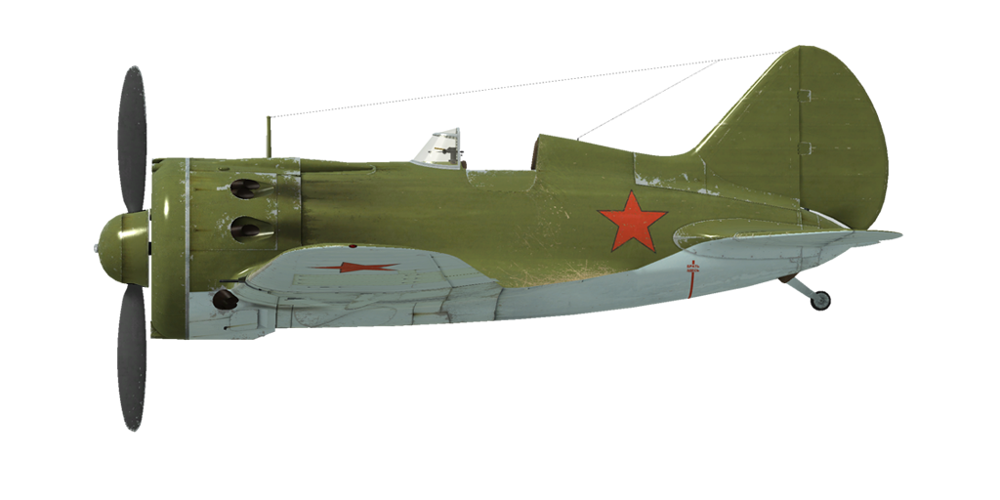

# I-16 tipo 24  
  
  
  
## Descripción  
  
Velocidad indicada de pérdida en configuración de vuelo: 143..164 km/h  
Velocidad indicada de pérdida en configuración de despegue/aterrizaje: 142..163 km/h  
Velocidad de picado límite: 620 km/h  
Carga de rotura máxima (en fuerzas <i>g</i>): 12 <i>g</i>  
Ángulo de ataque crítico en configuración de vuelo: 17,6°  
Ángulo de ataque crítico en configuración de aterrizaje: 15°  
  
Velocidad respecto al suelo al nivel del mar, modo motor - Impulso: 448 km/h  
Velocidad máxima respecto al suelo a 1800 m, modo motor - Continuo: 460 km/h  
Velocidad máxima respecto al suelo a 4500 m, modo motor - Continuo: 490 km/h  
  
Techo de servicio: 10500 m  
Tasa de ascenso al nivel del mar: 16,7 m/s  
Tasa de ascenso a 3000 m: 13,8 m/s  
Tasa de ascenso a 6000 m: 8,8 m/s  
  
Viraje de máximo rendimiento al nivel del mar: 19,0 s, a 230 km/h velocidad indicada (IAS).  
Viraje de máximo rendimiento a 3000 m: 25,3 s, a 230 km/h velocidad indicada (IAS).  
  
Autonomía de vuelo a 3000 m: 0,9 h, a 350 km/h velocidad indicada (IAS).  
  
Velocidad de despegue: 145..175 km/h  
Velocidad senda de planeo: 185..195 km/h  
Velocidad de aterrizaje: 135..145 km/h  
Ángulo de aterrizaje: 15,3°  
  
Nota 1: los datos están basados en la atmósfera estándar internacional (ISA).  
Nota 2: diferentes rendimientos de vuelo dados para los diferentes pesos posibles del avión.  
Nota 3: velocidades máximas, tasas de ascenso y tiempos de giro dados para el peso estándar del avión.  
Nota 4: tasas de ascenso y tiempo de giro dados para la potencia de Impulso.  
  
Motor:  
Modelo: M-63  
Potencia máxima en modo Impulso al nivel del mar: 1100 CV  
Potencia máxima en modo Continuo al nivel del mar: 930 CV  
Potencia máxima en modo Continuo a 1800 m: 1000 CV  
Potencia máxima en modo Continuo a 4500 m: 900 CV  
  
Modos de funcionamiento motor:  
Continuo (sin límite de tiempo): 2200 rpm, 915 mmHg  
Impulso (hasta 5 minutos): 2300 rpm, 1065 mmHg  
  
Temperatura nominal del aceite a la salida del motor: 55..90 °C  
Temperatura máxima del aceite a la salida del motor: 125 °C  
Temperatura nominal en la culata: 120..200 °C  
Temperatura máxima en la culata: 205 °C  
  
Altitud conexión compresor: 3000 m  
  
Peso vacío: 1501 kg  
Peso mínimo (sin munición, 10% de combustible): 1633 kg  
Peso estándar: 1878 kg  
Peso máximo al despegue: 2146 kg  
Carga de combustible: 191 kg / 260 l  
Carga útil: 645 kg  
  
Armamento delantero:  
2 ametralladoras de 7,62 mm «ShKAS», 500 balas, 1800 balas por minuto, sincronizadas  
2 ametralladoras de 7,62 mm «ShKAS», 900 balas, 1800 balas por minuto, montadas en ala  
2 cañones de 20 mm «SsVAK», 90 balas, 800 balas por minuto, montados en ala (modificación)  
  
Bombas:  
2 bombas de propósito general de 50 kg «FAB-50sv»  
2 bombas de propósito general de 104 kg «FAB-100M»  
  
Cohetes:  
Hasta 6 cohetes de 7 kg «ROS-82», 2,52 kg de carga HE —altamente explosiva—  
  
Longitud: 6,04 m  
Envergadura alar: 9 m  
Superficie de ala: 14,54 m²  
  
Debut en combate: junio de 1941  
  
Características operativas:  
- El motor tiene un modo de impulso. Para seleccionar el modo impulso es necesario empujar la palanca de impulso completamente hacia adelante y poner el motor a 2300 rpm.  
- El motor tiene un compresor mecánico de dos etapas que debe conmutarse a 3000 m de altitud.  
- El control de la mezcla del motor es automático cuando la palanca de control de la mezcla está al máximo. Es posible empobrecer manualmente la mezcla moviendo la palanca hacia posiciones por debajo del máximo. Esto también reduce el consumo de combustible durante el vuelo.  
- El motor tiene un regulador automático de las rpm que las mantiene al valor correspondiente a la posición de la palanca de control del regulador. Este regulador controla automáticamente el paso de la hélice para mantener las rpm requeridas.  
- El control de la persiana del radiador de aceite y de las persianas de admisión de aire es manual.  
- El avión no tiene compensadores de control en vuelo. Está equipado con unas aletas de compensación flexibles que pueden ser ajustadas antes del vuelo por el personal de tierra.  
- El avión tiene un sistema manual para el manejo de los flaps y el tren de aterrizaje, por lo que es necesario bajar los flaps y el tren antes de la aproximación final. Los flaps pueden bajarse gradualmente hasta formar un ángulo de 53º.  
- El avión cuenta con un mecanismo de control de la rueda de cola asociado a los pedales del control del timón. Por este motivo, es necesario evitar grandes movimientos de los pedales del control del timón mientras se está rodando en el suelo a altas velocidades.  
- El avión posee frenos mecánicos independientes para la rueda izquierda y derecha. Para frenar cada una de ellas es necesario empujar la parte superior del pedal del control de timón correspondiente.  
- El avión tiene un indicador de combustible hidrostático que muestra el combustible total restante sólo cuando la palanca de succión manual está presionada (mantener pulsado «Mayús_Dcha + I» por defecto).  
- La cabina tiene puertas laterales que se deben cerrar antes del despegue para evitar dañarlas.  
- Cuando hay bombas instaladas existe un mando para seleccionar el número de bombas que se lanzan con dos posibilidades: lanzar una o lanzar dos en ráfaga.  
- Cuando hay cohetes instalados existe un mando de lanzamiento con tres modos disponibles: disparar uno, disparar dos en ráfaga o disparar cuatro en ráfaga.  
- La mira tiene un filtro solar deslizante. También cuenta con una mira mecánica plegable de respaldo que puede emplearse si la mira principal está dañada.  
  
Basic data and recommended positions of the aircraft controls:  
1. Starting the engine:  
	- recommended position of the mixture control lever: auto mixture control  
	- recommended position of the cowl flap control handle: 50%  
	- recommended position of the radiator control handle: 50%  
	- recommended position of the prop pitch control handle: light 90%  
	- recommended position of the throttle lever: 5%  
  
2. Recommended mixture control lever positions for various flight modes: auto mixture control  
  
3.1 Recommended positions of cowl flaps for various flight modes:  
	- takeoff: open 50%  
	- climb: open 100%  
	- cruise flight: open 30% (in winter conditions - close to 15% if necessary)  
	- combat: open 70%  
  
3.2 Recommended positions of the oil radiator control handle for various flight modes:  
	- takeoff: open 50%  
	- climb: open 100%  
	- cruise flight: open 60%  
	- combat: open 100%  
  
4. Approximate fuel consumption at 2000 m altitude:  
	- Cruise engine mode: 6.4 l/min  
	- Combat engine mode: 6.8 l/min  
  
## Modificaciones  
  
  
### 2 bombas FAB-50sv / FAB-100M  
  
2 bombas de propósito general de 50 kg FAB-50sv / 2 bombas de propósito general de 104 kg FAB-100M  
  
FAB-50sv:  
Peso adicional: 120 kg  
Peso de munición: 104 kg  
Peso de los soportes: 20 kg  
Pérdida de velocidad estimada antes de soltar: 13 km/h  
Pérdida de velocidad estimada tras soltar: 7 km/h  
  
FAB-100M:  
Peso adicional: 228 kg  
Peso de munición: 208 kg  
Peso de los soportes: 20 kg  
Pérdida de velocidad estimada antes de soltar: 18 km/h  
Pérdida de velocidad estimada tras soltar: 7 km/h  
  
### 4 cohetes ROS-82  
  
4 cohetes no guiados explosivos (HE) de 82 mm ROS-82  
Peso adicional: 40 kg  
Peso de munición: 28 kg  
Peso de los soportes: 12 kg  
Pérdida de velocidad estimada antes de lanzarlos: 10 km/h  
Pérdida de velocidad estimada tras lanzarlos: 7 km/h  
  
### 6 cohetes ROS-82  
  
6 cohetes no guiados explosivos (HE) de 82 mm ROS-82  
Peso adicional: 60 kg  
Peso de munición: 42 kg  
Peso de los soportes: 18 kg  
Pérdida de velocidad estimada antes de lanzarlos: 15 km/h  
Pérdida de velocidad estimada tras lanzarlos: 10 km/h  
  
### 2 cañones de 20 mm ShVAK (180 balas)  
  
2 cañones de 20 mm ShVAK montados en las alas con 90 balas cada uno en lugar de las ametralladoras estándar ShKAS  
Peso adicional: 40 kg  
Peso de munición: 22 kg  
Peso del armamento: 98 kg  
Pérdida de velocidad estimada: 3 km/h  
  
### Parabrisas de una sola pieza  
  
Sección frontal de la carlinga de una sola pieza para mejorar la visibilidad  
Peso adicional: 0 kg  
Pérdida de velocidad estimada: 0 km/h  