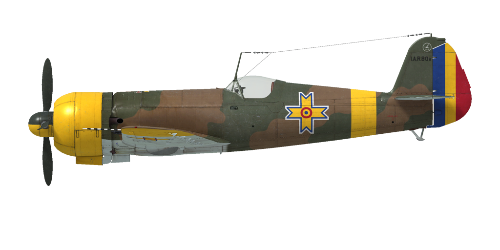
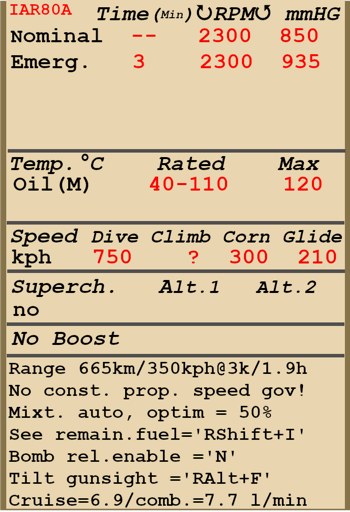

# I.A.R. 80-A  

| Image | Notes  
|:---|:---  
|  |   

## Описание  

Приборная скорость сваливания в полётной конфигурации: 151..162 км/ч  
Приборная скорость сваливания в посадочной конфигурации: 143..151 км/ч  
Предельная скорость в пикировании: 750 км/ч  
Разрушающая перегрузка: 12 единиц  
Угол атаки сваливания, в полётной конфигурации: 16,0°  
Угол атаки сваливания, в посадочной конфигурации: 13,8°  
  
Максимальная истинная скорость у земли, режим двигателя - номинальный: 433 км/ч  
Максимальная истинная скорость у земли, режим двигателя - чрезвычайный: 450 км/ч  
Максимальная истинная скорость на высоте 4700 м, режим двигателя - номинальный: 511 км/ч  
Максимальная истинная скорость на высоте 3800 м, режим двигателя - чрезвычайный: 514 км/ч  
  
Практический потолок: 10500 м  
Скороподъёмность у земли: 14,1 м/с  
Скороподъёмность на высоте 3000 м: 13,6 м/с  
Скороподъёмность на высоте 6000 м: 9,7 м/с  
  
Время виража предельного по тяге у земли: 17,8 с, на скорости 300 км/ч по прибору  
  
Продолжительность полёта на высоте 3000 м: 1,9 ч, на скорости 350 км/ч по прибору  
  
Скорость взлётная: 150...180 км/ч  
Скорость на глиссаде: 200...220 км/ч  
Скорость посадочная: 170...180 км/ч  
Посадочный угол: 14.2 °  
  
Примечание 1: данные указаны для условий международной стандартной атмосферы.  
Примечание 2: диапазоны характеристик даны для допустимого диапазона масс самолёта.  
Примечание 3: максимальные скорости, скороподъемности и время виража даны для стандартной массы самолёта.  
Примечание 4: скороподъемность и дана на номинальном режиме работы двигателя, время виража - на чрезвычайном.  
  
Двигатель:  
Модель: I.A.R. 14 K. IV. C-32  
Максимальная мощность на чрезвычайном режиме у земли: 1050 л.с.  
Максимальная мощность на чрезвычайном режиме на высоте 2700 м: 1100 л.с.  
Максимальная мощность на номинальном режиме у земли: 930 л.с.  
Максимальная мощность на номинальном режиме на высоте 3200 м: 1000 л.с.  
  
Режимы работы двигателя:  
Номинальный (время не ограничено): 2300 об/мин, наддув 850 мм.рт.ст.   
Чрезвычайный (до 3 минут): 2300 об/мин, наддув 935 мм.рт.ст.   
  
Температура масла на выходе из двигателя номинальная: 40..110 °С  
Температура масла на выходе из двигателя предельная: 120 °С  
  
Масса пустого самолёта: 1980 кг  
Минимальная масса (без БК, 10% топлива): 2293 кг  
Стандартная масса: 2650 кг  
Максимальная взлётная масса: 3030 кг  
Максимальный запас топлива: 324 кг / 450 л  
Максимальная полезная нагрузка: 1050 кг  
  
Вооружение курсовое:  
6 x 7.92мм пулемётов "FN Browning 7.92 mod 1938", 2400 патронов, 1500 выстр/мин, крыльевые  
  
или (модификация):  
4 x 7.92мм пулемётов "FN Browning 7.92 mod 1938", 1600 патронов, 1500 выстр/мин, крыльевые  
2 x 13.2мм пулемёта "FN Browning 13.2", 300 патронов, 1080 выстр/мин, крыльевые  
  
или (модификация):  
2 x 7.92мм пулемёта "FN Browning 7.92 mod 1938", 1400 патронов, 1500 выстр/мин, крыльевые  
2 x 20мм пушки "MG 151/20", 350 патронов, 700 выстр/мин, крыльевые  
  
Вооружение бомбовое (модификация):  
2 x 55 кг осколочно-фугасные авиабомбы "SC 50"  
249 кг осколочно-фугасная авиабомба "SC 250"  
  
Длина: 8,9 м  
Размах крыла: 10,5 м  
Площадь крыла: 16,1 кв.м  
  
Начало участия в боевых действиях: лето-осень 1941  
  
Особенности эксплуатации:  
- На самолёте нет регулятора постоянных оборотов винта. Управление винтом осуществляется ручным изменением шага винта с помощью переключателя на приборной доске. В игре используются команды на увеличение и уменьшение шага винта [по умолчанию RShift + +/-].  
- Из-за отсутствия автоматического регулятора постоянных оборотов, следует внимательно следить за оборотами винта, особенно при пикировании - из-за раскрутки винта при разгоне возможно превышение допустимых оборотов и выход двигателя из строя.  
- Самолёт не имеет указателя температуры головки цилиндров - только указатель температуры масла.  
- Маслорадиатор самолёта I.A.R. 80-A не имеет регулирования. В модификации I.A.R. 80-M добавляется второй, регулируемый маслорадиатор.  
- Самолёт имеет триммер руля высоты для снятия нагрузки на ручку управления.  
- Управление смесью автоматизировано, автомат поддерживает заданный состав смеси и автоматически обогащает её на малом и полном газу. Оптимальная смесь задаётся средним положением рычага управления.  
- Привод закрылков гидравлический, их можно выпустить на любой угол до 60°. В модификации пикирующего бомбардировщика полностью выпущенные закрылки используются как тормозные щитки. Указатель положения закрылков отсутствует.  
- Тормоза колёс шасси пневматические, дифференциальные: отклонение педалей при зажатом тормозе приводит к растормаживанию колеса, противоположного нажатой педали.  
- Самолёт оснащён гидростатическим указателем топлива, который показывает общее количество топлива при втягивании и удерживании поршня ручного насоса [по умолчанию RShift+I].  
- Фонарь кабины не может быть открыт на скоростях более 250 км/ч, так как зажимается потоком набегающего воздуха. На версии I.A.R. 80-M установлена аварийная пневматическая система для его открытия на большей скорости.  
- Для сброса бомб необходимо включить систему управления сбросом [по умолчанию клавиша N]. После сброса необходимо вручную отключить систему.  
- При включении системы на сброс автоматически выпускаются закрылки в качестве воздушного тормоза. Закрылки убираются автоматически или при нажатии на кнопку сброса, или при выключении системы.  
- Система управления сбросом позволяет сбрасывать или центральную бомбу, или все бомбы залпом.  
- Прицел самолёта имеет дальномерную сетку, которую можно отрегулировать на заданную базу цели и заданное расстояние до цели.  
- В версии пикирующего бомбардировщика регулируется наклон прицела [по умолчанию RAlt + F].  
- Прицел имеет сдвижной светофильтр [по умолчанию LAlt + F].  
  
Основные данные и рекомендуемые положения органов управления самолётом:  
1. Запуск двигателя:  
	- рекомендуемое положение рукояти управления смесью: 50% (автоматическое управление смесью)  
	- рекомендуемое положение рукояти управления створками капота: закрыто  
	- рекомендуемое положения рукояти управления шагом: тяжелый винт  
	- рекомендуемое положение рычага управления двигателем: 0%  
  
2. Рекомендуемые положения рукояти смеси при различных режимах полёта: 50% (автоматическое управление смесью)  
  
3. Рекомендуемые положения рукояти управления створками капота при различных режимах полёта:  
	- взлёт: открыто 100%  
	- набор высоты: открыто 100%  
	- крейсерский полёт: открыто 20% (зимой закрыть при необходимости)  
	- бой: открыто 50%  
  
4. Ориентировочный расход топлива на различных режимах работы на высоте 2000 м:  
	- крейсерский режим работы двигателя: 6,9 л/мин  
	- боевой режим работы двигателя: 7,7 л/мин  

## Модификации  
### I.A.R.80-B серия 181-200  

 Замена двух 7,92-мм пулемётов на 13,2-мм,  
новый тип заголовника,  
дополнительный силовой набор закрылка.  
Дополнительная масса: 14.7 кг  
Ориентировочная потеря скорости: 1 км/ч  
  
### I.A.R.80-M  

Смена вооружения на два 7,92-мм пулемёта и две 20-мм пушки,  
подкос стабилизатора, новый воздушный фильтр,  
второй маслорадиатор, усиленный силовой набор фюзеляжа,  
заголовник позднего типа, дополнительный силовой набор закрылков.  
Дополнительная масса: 62,2 кг  
Ориентировочная потеря скорости: 9 км/ч  
  
### I.A.R.81 серия 151-175  

Центральная (249 кг SC 250) и подкрыльевые бомбы (две 55,5 кг SC 50),  
подкос стабилизатора, дополнительный силовой набор закрылков.  
Дополнительная масса: 378,7 кг  
Масса вооружения: 358,7 кг  
Масса держателей: 20 кг  
Ориентировочная потеря скорости до сброса: 32 км/ч  
Ориентировочная потеря скорости после сброса: 13 км/ч  
