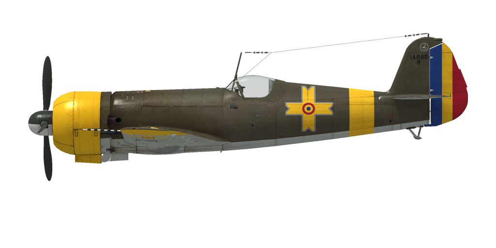

# I.A.R. 80-B  
  
  
  
## Beschreibung  
  
Überziehgeschwindigkeit in Flugkonfiguration: 151..162 km/h  
Überziehgeschwindigkeit in Landekonfiguration: 143..151 km/h  
Höchstzulässige Geschwindigkeit im Sturzflug: 750 km/h  
Bruchlastvielfache: 12 G  
Kritischer Anstellwinkel in Flugkonfiguration: 16,0°  
Kritischer Anstellwinkel in Landekonfiguration: 13,8°  
  
Höchstgeschwindigkeit in Bodennähe, Notleistung: 447 km/h  
Höchstgeschwindigkeit in 3800 m Höhe, Notleistung: 511 km/h  
  
Höchstgeschwindigkeit in Bodennähe, Kampfleistung: 427 km/h  
Höchstgeschwindigkeit in 4700 m Höhe, Kampfleistung: 505 km/h  
  
Dienstgipfelhöhe: 10500 m  
Steigleistung in Bodennähe: 13,9 m/s  
Steigleistung in 3000 m Höhe: 13,1 m/s  
Steigleistung in 6000 m Höhe: 9,4 m/s  
  
Maximale Wendegeschwindigkeit in Bodennähe: 17,8 s, bei 300 km/h IAS.  
  
Reichweite in 5000 m: 1,9 h, bei 350 km/h IAS.  
  
Startgeschwindigkeit: 150...180 km/h  
Anfluggeschwindigkeit: 200...220 km/h  
Landegeschwindigkeit: 170...180 km/h  
Sinkflugpfad: 14,2°  
  
Anmerkung 1: Die Werte gelten für Normatmosphäre (ISA).  
Anmerkung 2: Flugleistungen varrieren je nach Abfluggewicht.  
Anmerkung 3: Höchstgeschwindigkeiten, Steigleistungen und Wendegeschwindigkeiten gelten für Standard-Fluggewicht.  
Anmerkung 4: Steigraten gelten für Kampfleistung, Wendegeschwindigkeiten gelten für Notleistung.  
  
Triebwerk:  
Baumuster: I.A.R. 14 K. IV. C-32  
Notleistung in Bodennähe: 1050 PS  
Notleistung in 2700 m: 1100 PS  
Kampfleistung in Bodennähe: 930 PS  
Kampfleistung in 3200 m: 1000 PS  
  
Leistungsstufen:  
Nominal (unbegrenzt): 2300 U/min, 850 mm Hg  
Notleistung (bis zu 3 Minuten): 2300 U/min, 935 mm Hg  
  
Schmierstoffaustrittstemperatur (normal): 40..110 °C  
Schmierstoffaustrittstemperatur (höchstens): 120 °C  
  
Leergewicht: 2093 kg  
Minimalgewicht (keine Munition, 10% Treibstoff): 2522 kg  
Normalgewicht: 2745 kg  
Höchstabfluggewicht: 3030 kg  
Kraftstoffmenge: 324 kg / 450 l  
Nutzlast: 1050 kg  
  
Starre Schusswaffenanlage:  
4 x "FN Browning 7.92 mod 1938", 1600 Schuss, 1500 Schuss pro Minute, flügelmontiert  
2 x "FN Browning 13.2", 350 Schuss, 1080 Schuss pro Minute, flügelmontiert  
  
or (modification):  
4 x "FN Browning 7.92 mod 1938", 1600 Schuss, 1500 Schuss pro Minute, flügelmontiert  
2 x 20 mm MG FF, 120 Schuss, 530 Schuss pro Minute, flügelmontiert  
  
or (modification):  
2 x "FN Browning 7.92 mod 1938", 1400 Schuss, 1500 Schuss pro Minute, flügelmontiert  
2 x 20 mm MG 151/20, 350 Schuss, 700 Schuss pro Minute, flügelmontiert  
  
Abwurfwaffen (modification):  
Bis zu 2 55 kg Splitterbomben SC 50  
1 x 249 kg Mehrzweck-Sprengbomb SC 250  
  
Länge: 8,97 m  
Spannweite: 11,0 m  
Flügelfläche: 16,5 m²  
  
Erster Fronteinsatz: Autumn 1942  
  
Eigenschaften:  
- The aircraft has no constant propeller governor. The propeller speed is controlled by manually changing the propeller pitch using a switch on the instrument board (default propeller pitch commands in the sim are [RShift + +/-]).  
- Due to the absence of a constant propeller speed governor, it is necessary to carefully monitor the propeller RPM, especially in a dive - due to the spinning up of the propeller during acceleration, it is possible to exceed the maximum RPM and cause an engine failure.  
- The aircraft has no cylinder head temperature gauge - only an oil temperature gauge.  
- The oil radiator of the I.A.R. 80-B has no regulation (there is a second adjustable oil radiator on I.A.R. 80-C, I.A.R. 81-C modification).  
- The aircraft is equipped with elevator trimmer.  
- Mixture control is automated, the automatic regulator maintains the set mixture composition and automatically enriches the mixture at low and full throttle. The optimum mixture is set by the centre position of the control lever.  
- The flaps are hydraulic and can be set to any angle up to 75°. In the dive bomber version, the fully released flaps are used as air brake. There is no flap position indicator.  
- The aircraft has differential pneumatic wheel brakes with shared control lever. This means that if the brake lever is held and the rudder pedal the opposite wheel brake is gradually released causing the plane to swing to one side or the other.  
- The aircraft has a hydrostatic fuel gauge which shows total fuel remaining only when manual sucker lever is pushed in. In the sim, hold [RShift+I by default].  
- It is impossible to open or close the canopy at high speed (more than 250 km/h) due to strong airflow. The I.A.R. 80/81-С series canopy has an emergency pneumatic opening system for bailouts.  
- To drop bombs, you must switch on the bomb releasel system first [N key]. After dropping bombs, the system should be manually deactivated.  
- When the bomb release system is switched on, the flaps are automatically fully released as an air brake and retract automatically either when the bomb release button is pressed or when the system is switched off.  
- The bomb release system can either drop only the central bomb or all three bombs at once.  
- The gunsight is adjustable: both the target distance and target base can be set.  
- In the dive bomber version, the tilt of the gunsight is adjustable [RAlt + F by default].  
- The gunsight has a sliding sun-filter [LAlt + F by default].  
  
Basic data and recommended positions of the aircraft controls:  
1. Starting the engine:  
	- recommended position of the mixture control lever: 50% auto mixture control  
	- recommended position of the cowl flap control handle: close  
	- recommended position of the prop pitch control handle: heavy  
	- recommended position of the throttle lever: 0%  
  
2. Recommended mixture control lever positions for various flight modes: 50% (auto mixture control)  
  
3. Recommended positions of the cowl flap control handle for various flight modes:  
	- takeoff: open 100%  
	- climb: open 100%  
	- cruise flight: open 20% (in winter conditions - close if necessary)  
	- combat: open 50%  
  
4. Approximate fuel consumption at 2000 m altitude:  
	- Cruise engine mode: 6.9 l/min  
	- Combat engine mode: 7.7 l/min  
  
## Änderungen  
### I.A.R.80-C series 251-290  
  
Armament changed to four 7.92mm MGs and two 20mm MG FF/M guns,  
tail struts, new air filter, second oil radiator,  
sturdier fuselage and flaps.  
Zusätzliches Gewicht: 24.2 kg  
Geschwindigkeitsverlust: 12 km/h  
  
### I.A.R.81-C series 301-450  
  
Armament changed to two 7.92mm MGs and two 20mm MG151/20 guns,  
centerline (249 kg SC 250) and underwing bombs (two 55 kg SC 50),  
tail struts, sturdier flaps.  
Zusätzliches Gewicht: 426.7 kg  
Gewicht der Munition: 387.5 kg  
Gewicht der Abwurfwaffenroste: 20.0 kg  
Geschwindigkeitsverlust vor Abwurf: 41 km/h  
Geschwindigkeitsverlust nach Abwurf: 19 km/h  
