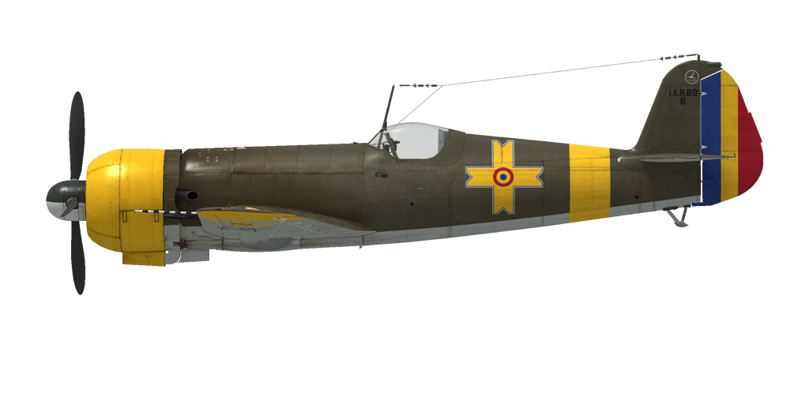

# I.A.R. 80-B  
  
  
  
## Descripción  
  
Velocidad indicada de pérdida en configuración de vuelo: 151..162 km/h  
Velocidad indicada de pérdida en configuración de despegue/aterrizaje: 143..151 km/h  
Velocidad de picado límite: 750 km/h  
Carga de rotura máxima (en fuerzas <i>g</i>): 12 <i>g</i>  
Ángulo de ataque crítico en configuración de vuelo: 16,0°  
Ángulo de ataque crítico en configuración de aterrizaje: 13,8°  
  
Velocidad respecto al suelo al nivel del mar, modo motor - Emergencia: 447 km/h  
Velocidad máxima respecto al suelo a 3800 m, modo motor - Emergencia: 511 km/h  
  
Velocidad respecto al suelo al nivel del mar, modo motor - Continuo: 427 km/h  
Velocidad máxima respecto al suelo a 4700 m, modo motor - Continuo: 505 km/h  
  
Techo de servicio: 10500 m  
Tasa de ascenso al nivel del mar: 13,9 m/s  
Tasa de ascenso a 3000 m: 13,1 m/s  
Tasa de ascenso a 6000 m: 9,4 m/s  
  
Viraje de máximo rendimiento al nivel del mar: 17,8 s, a 300 km/h velocidad indicada (IAS).  
  
Autonomía de vuelo a 3000 m: 1,9 h, a 350 km/h velocidad indicada (IAS).  
  
Velocidad de despegue: 150...180 km/h  
Velocidad senda de planeo: 200...220 km/h  
Velocidad de aterrizaje: 170...180 km/h  
Ángulo de aterrizaje: 14,2°  
  
Nota 1: los datos están basados en la atmósfera estándar internacional (ISA).  
Nota 2: diferentes rendimientos de vuelo dados para los diferentes pesos posibles del avión.  
Nota 3: velocidades máximas, tasas de ascenso y tiempos de giro dados para el peso estándar del avión.  
Nota 4: tasas de ascenso dadas para potencia en modo Continuo; tiempos de giro dados para la potencia de Emergencia.  
  
Motor:  
Modelo: I.A.R. 14 K. IV. C-32  
Potencia máxima en modo Emergencia al nivel del mar: 1050 CV  
Potencia máxima en modo Emergencia a 2700 m: 1100 CV  
Potencia máxima en modo Continuo al nivel del mar: 930 CV  
Potencia máxima en modo Continuo a 3200 m: 1000 CV  
  
Modos de funcionamiento motor:  
Continuo (sin límite de tiempo): 2300 rpm, 850 mmHg  
Emergencia (hasta 3 minutos): 2300 rpm, 935 mmHg  
  
Temperatura nominal del aceite a la salida del motor: 40..110 °C  
Temperatura máxima del aceite a la salida del motor: 120 °C  
  
Peso vacío: 2093 kg  
Peso mínimo (sin munición, 10% de combustible): 2522 kg  
Peso estándar: 2745 kg  
Peso máximo al despegue: 3030 kg  
Carga de combustible: 324 kg / 450 l  
Carga útil: 1050 kg  
  
Armamento delantero:  
4 ametralladoras de 7,92 mm «FN Browning 7.92 mod 1938», 1600 balas, 1500 balas por minuto, montadas en ala  
2 ametralladoras de 13,2 mm "FN Browning 13.2", 350 balas, 1080 balas por minuto, montadas en ala  
  
o (modificación):  
4 ametralladoras de 7,92 mm «FN Browning 7.92 mod 1938», 1600 balas, 1500 balas por minuto, montadas en ala  
2 cañones de 20 mm «MG FF», 120 balas, 530 balas por minuto, montados en ala  
  
o (modificación):  
2 ametralladoras de 7,92 mm «FN Browning 7.92 mod 1938», 1400 balas, 1500 balas por minuto, montadas en ala  
2 cañones de 20 mm «MG 151/20», 350 balas, 700 balas por minuto, montados en ala  
  
  
Bombas (modificación):  
Hasta 2 bombas de fragmentacion de 55 kg «SC 50»  
1 bomba de propósito general de 249 kg «SC 250»  
  
Longitud: 8,97 m  
Envergadura alar: 11,0 m  
Superficie de ala: 16,5 m²  
  
Debut en combate: otoño de 1942  
  
Características operativas:  
- El avión no tiene un regulador velocidad constante de la hélice. La velocidad de giro de la hélice se controla cambiando manualmente el paso de la hélice mediante un interruptor en el panel de instrumentos («Mayús_Dcha + Apóstrofe/¡» por defecto).  
- Debido a la ausencia de un regulador de velocidad constante de la hélice, es necesario vigilar cuidadosamente las rpm de la hélice, especialmente en un picado, debido al incremento de la velocidad de giro de la hélice durante la aceleración, que podría exceder las rpm máximas y causar un fallo del motor.  
- El avión no cuenta con un indicador de temperatura de la culata, solo con un indicador de temperatura del aceite.  
- El radiador de aceite del I.A.R. 80-B no tiene regulación (hay un segundo radiador de aceite regulable en la modificación I.A.R. 80-C, I.A.R. 81-C).  
- El avión cuenta con un compensador para para el «trimado» del cabeceo.  
- El control de la mezcla está automatizado, el regulador automático mantiene la composición de la mezcla ajustada y enriquece automáticamente la mezcla a baja y máxima potencia. La mezcla óptima se establece situando en la posición media la palanca de control de la mezcla.  
- Los flaps son hidráulicos y se pueden ajustar a cualquier ángulo hasta 75°. No hay indicador de posición de los flaps. En la versión de bombardero en picado (I.A.R. 81), los flaps completamente bajados se utilizan como aerofreno.  
- El avión tiene frenos de rueda neumáticos diferenciales coompartidos con un botón en la palanca de control. Si se mantiene apretado el bótón de la palanca de control con el timón en posición neutral, la dos ruedas frenan. Si se mueve el del timón a la izquierda, el freno de la rueda derecha se libera gradualmente haciendo que el avión gire a la izquierda, y viceversa.  
- El avión tiene un indicador de combustible hidrostático que muestra el combustible total restante sólo cuando la palanca de succión manual está presionada (mantener pulsado «Mayús_Dcha + I» por defecto).  
- Es imposible abrir o cerrar la cubierta por encima de los 250 km/h a causa de la intensidad del flujo del aire. La versión I.A.R. 80/81-C cuenta con un sistema de apertura neumática de emergencia que permite abrir la cubierta a velocidades superiores.  
- Para lanzar bombas, primero es necesario activar el sistema de lanzamiento de bombas («N» por defecto). Después de lanzar bombas, el sistema debe desactivarse manualmente.  
- Cuando se conecta el sistema de lanzamiento de bombas, los flaps se bajan completamente de forma automática acutando de aerofreno y se suben automáticamente cuando se pulsa el botón de lanzamiento de bombas o cuando se desconecta el propio sistema.  
- El sistema de lanzamiento de bombas puede lanzar solo la bomba central o las tres bombas a la vez.  
- La mira es ajustable: tanto la distancia como la envergadura del objetivo pueden modificarse.  
- En la versión de bombardero en picado, la inclinación de la mira es ajustable («Alt_Dcha + F» por defecto).  
- La mira tiene un filtro solar deslizante. («Alt_Izq + F» por defecto).  
  
Datos básicos y configuraciones recomendadas de los controles del avión:  
1. Arranque del motor:  
	- palanca de control de la mezcla: 50% (control de mezcla automático)  
	- aletas/persianas del carenado: cerrado  
	- palanca de control del paso de la hélice: corto (6%)  
	- palanca de potencia: 0%  
  
2. Posición de la palanca de control de mezcla según momento de vuelo: 50% (control de mezcla automático)  
  
3. Posición de las aletas/persianas de carenado según momento de vuelo:  
	- despegue: abierto 100%  
	- ascenso: abierto 100%  
	- crucero: abierto 20% (en condiciones invernales - cerrar si necesario)  
	- combate: abierto 50%  
  
4. Consumo aproximado de combustible a 2000 m de altitud:  
	- Modo motor - Crucero: 6,9 l/min  
	- Modo motor - Combate: 7,7 l/min  
  
## Modificaciones  
  
  
### I.A.R.80-C series 251-290  
  
La modificación incluye:  
- 2 cañones de 20 mm MG FF/M en sustitución de las 2 ametralladores de 13,2 mm  
- puntales en estabilizador horizontal  
- nuevo filtro de aire  
- segundo radiador de aceite (regulable)  
- fuselaje y flaps más robustos  
Peso adicional: 24,2 kg  
Pérdida de velocidad estimada: 12 km/h  
  
### I.A.R. 81-C series 301-450  
  
La modificación incluye:  
- 2 cañones de 20 mm MG 151/20 en sustitución de las 2 ametralladoras de 13,2 mm y 2 de 7,92 mm  
- bombas en panza (1 SC 250 de 249 kg) y bajo alas (2 SC 50 de 55 kg)  
- puntales en estabilizador horizontal  
- flaps más robustos  
Peso adicional: 426,7 kg  
Peso de munición: 387,5 kg  
Peso de los soportes: 20,0 kg  
Pérdida de velocidad estimada antes de soltar: 41 km/h  
Pérdida de velocidad estimada tras soltar: 19 km/h  
