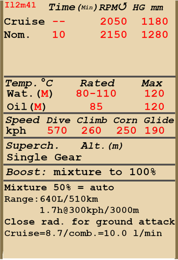

# Il-2 Mod. 1941  

  
  

## Beschreibung  

Überziehgeschwindigkeit in Flugkonfiguration: 136..156 km/h  
Überziehgeschwindigkeit in Landekonfiguration: 128..146 km/h  
  
Höchstzulässige Geschwindigkeit im Sturzflug: 570 km/h  
Bruchlastvielfache: 11.5 G  
Kritischer Anstellwinkel in Flugkonfiguration: 19.4 °  
Kritischer Anstellwinkel in Landekonfiguration: 17.5 °  
  
Höchstgeschwindigkeit in Bodennähe, Startleistung: 430 km/h  
Höchstgeschwindigkeit in Bodennähe, Nennleistung (2150 U/min): 421 km/h  
Höchstgeschwindigkeit in 2500 Höhe, Nennleistung (2150 U/min): 455 km/h  
  
Dienstgipfelhöhe: 7500 m  
Steigleistung in Bodennähe: 9.4 m/s  
Steigleistung in 3000 m Höhe: 8.9 m/s  
Steigleistung in 6000 m Höhe: 3.9 m/s  
  
Maximale Wendegeschwindigkeit in Bodennähe: 23.1 s (250 km/h IAS).  
Maximale Wendegeschwindigkeit in 3000 m Höhe: 32.6 s (250 km/h IAS).  
  
Reichweite in 5000 m: 1.7 h, bei 300 km/h IAS.  
  
Startgeschwindigkeit: 150..190 km/h  
Anfluggeschwindigkeit: 185..195 km/h  
Landegeschwindigkeit: 130..140 km/h  
Sinkflugpfad: 11.7 °  
  
Anmerkung 1: Die Werte gelten für Normatmosphäre (ISA).  
Anmerkung 2: Flugleistungen varrieren je nach Abfluggewicht.  
Anmerkung 3: Höchstgeschwindigkeiten, Steigleistungen und Wendegeschwindigkeiten gelten für Standard-Fluggewicht.  
Anmerkung 4: Steigraten gelten für Nennleistung, Wendegeschwindigkeiten gelten für Startleistung.  
  
Triebwerk:  
Baumuster: AM-38  
Startleistung in Bodennähe: 1600 PS  
Nennleistung in Bodennähe: 1500 PS  
Nennleistung in 1650 m Höhe: 1500 PS  
  
Leistungsstufen:  
Nennleistung (unbegrenzt): 2050 U/min, 1180 mm Hg  
Startleistung (bis zu 10 Minuten): 2150 U/min, 1280 mm Hg  
  
Kühlstoffaustrittstemperatur (normal): 80..110 °C  
Kühlstoffaustrittstemperatur (höchstens): 120 °C  
Schmierstoffeintrittstemperatur (normal): 40..80 °C  
Schmierstoffeintrittstemperatur (höchstens): 85 °C  
Schmierstoffaustrittstemperatur (normal): 115 °C  
Schmierstoffaustrittstemperatur (höchstens): 120 °C  
  
Laderumschalthöhe: Einganglader  
  
Leergewicht: 4242 kg  
Minimalgewicht (keine Munition, 10% Treibstoff): 4464 kg  
Normalgewicht: 5049 kg  
Höchstabfluggewicht: 5888 kg  
Kraftstoffmenge: 470 kg / 641 l  
Nutzlast: 1646 kg  
  
Starre Schusswaffenanlage:  
2 x 20 mm SchWAK, 210 Schuss, 800 Schuss pro Minute, flügelmontiert  
2 x 7.62 mm SchKAS, 750 Schuss, 1800 Schuss pro Minute, flügelmontiert  
2 x 23 mm VYa-23, 150 Schuss, 600 Schuss pro Minute, flügelmontiert (Rüstsatz)  
  
Abwurfwaffen:  
Bis zu 6 x 50 kg Mehrzweck-Sprengbomben FAB-50sv  
Bis zu 6 x 104 kg Mehrzweck-Sprengbomben FAB-100M  
2 x 254 kg Mehrzweck-Sprengbomben FAB-250sv  
  
Raketen:  
8 x 7 kg Raketen ROS-82, Sprengladung 2.5 kg  
8 x 15 kg Raketen RBS-82, Hohlladung 7.2 kg  
8 x 42 kg Raketen ROFS-132, Sprengladung 21.3 kg  
  
Länge: 11.5 m  
Spannweite: 14.6 m  
Flügelfläche: 38.5 m²  
  
Erster Fronteinsatz: Juni 1941  
  
Eigenschaften:  
- Der Motor hat eine verstärkte Zusatzleistung, welche eingeschaltet wird, indem der Hebel für die Gemischregelung in die Maximalposition geschoben wird.  
- Der Motor hat einen Einganglader, welcher nicht umgeschaltet werden muss.  
- Die Gemischverstellung erfolgt automatisch, wenn sich der Gemischhebel in der mittleren Position (50%) befindet. Es ist möglich das Gemisch abzumagern, indem der Hebel in eine Stellung unter 50% bewegt wird. Dies reduziert den Treibstoffverbrauch während des Fluges.  
- Der Motor besitzt eine automatische Drehzahlregelung, welche die Motordrehzahl je nach Hebelstellung festlegt. Der Regler verstellt automatisch den Anstellwinkel des Propellers um die erforderliche Drehzahl einzuhalten.  
- Die Verstellung Wasserkühler- und Ölkühlerklappen erfolgt manuell. Das Flugzeug hat gepanzerte Ölkühlerklappen, welche zur Vermeidung von Beschussschäden bei einem Bodenangriff geschlossen werden sollten. Nach dem Angriff ist es erforderlich die Kühlklappen wieder zu öffnen.  
- Das Flugzeug verfügt nur über eine Höhenrudertrimmung.  
- Die Landeklappen sind pneumatisch gesteuert. Die Klappen können nur vollständig ausgefahren werden, ein stufenweises Ausfahren ist nicht möglich. Aufgrund des schwachen Klappenantriebs, werden die Landeklappen bei einer Geschwindigkeit über 220 km/h durch den Luftwiderstand eingefahren. Beachte, dass die Landeklappen bei einer hohen Geschwindigkeit nicht voll ausgefahren werden. Bei einer hohen Geschwindigkeit beim Landeanflug ist es möglich, dass die Klappen direkt vor der Landung noch etwas weiter ausfahren.  
- Das Flugzeug hat eine manuelle Spornradverriegelung. Das Spornrad sollte bei längerem Geradeausrollen, sowie beim Abflug und bei der Landung verriegelt werden.  
- Das Flugzeug hat differentielle pneumatische Bremsen, die mit einem gemeinsamen Bremshebel betätigt werden. Wenn der Bremshebel gezogen und das Ruderpedal betätigt wird, wird die gegenüberliegende Bremse gelöst und das Flugzeug dreht sich zu der einen oder der anderen Seite.  
- The aircraft has a fuel gauge which shows the amount of remaining fuel in the front or bottom fuel tank depending on the switch position. Im Simulator ändert sich der Schalter durch Drücken von (Shift+I). Der Stand des hinteren Treibstofftanks wird nicht angezeigt.   
- Das Gewicht der Cockpithaube beträgt 50 kg und es gibt keine Verriegelung in geöffneter Position. Deshalb ist es möglich, dass sich die Haube selbständig bei einem längeren Sturzflug schließt. Also, it is impossible to open or close canopy at high speed due to strong airflow. Die Cockpithaube hat keine Notfallauslösung, weshalb die Geschwindigkeit vor dem Notausstieg reduziert werden muss.  
- Das Flugzeug ist mit einer gemeinsamen Steuerung für Bomben und Raketen ausgerüstet. Es gibt drei Abwurf-/Abschussarten: einzeln, zwei in einer Salve oder vier in einer Salve.  
- Das Visier ist auf einer ausfahrbaren Schiene montiert, wodurch der Pilot das Visier näher zu sich heranziehen kann um einen besseren Blick durch das Visier zu erhalten.  
  
Basic data and recommended positions of the aircraft controls:  
1. Starting the engine:  
	- recommended position of the mixture control lever: 50% (auto mixture control)  
	- recommended position of the radiators control handles: close  
	- recommended position of the prop pitch control handle: 100%  
	- recommended position of the throttle lever: 10%  
	- before taxiing, you must unlock the tailwheel  
  
2. Recommended mixture control lever positions for various flight modes: 50% (auto mixture control)  
  
3.1 Recommended positions of the oil radiator control handle for various flight modes:  
	- takeoff: open 100%  
	- climb: open 100%  
	- cruise flight: open 50-60%  
	- combat: close (to prevent combat damage)  
  
3.2 Recommended positions of the water radiator control handle for various flight modes:  
	- takeoff: open 100%  
	- climb: open 100%  
	- cruise flight: open 50-60%  
	- combat: open 100%  
  
4. Approximate fuel consumption at 2000 m altitude:  
	- Cruise engine mode: 8.7 l/min  
	- Combat engine mode: 10.0 l/min  

## Änderungen  

### 2 x Bomben, Typ FAB-250sv  

2 x 254-kg-Splitterbomben FAB-250sv  
Zusätzliches Gewicht: 538 kg  
Gewicht der Munition: 508 kg  
Gewicht der Abwurfwaffenroste: 30 kg  
Geschwindigkeitsverlust vor Abwurf: 19 km/h  
Geschwindigkeitsverlust nach Abwurf: 9 km/h  
  

### 6 x Bomben, Typ FAB-50sv / FAB-100M  

6 x 50-kg-Splitterbomben FAB-50sv / 6 x 104-kg-Splitterbomben FAB-100M  
  
FAB-50sv:  
Zusätzliches Gewicht: 300 kg  
Gewicht der Munition: 300 kg  
Geschwindigkeitsverlust vor Abwurf: 5 km/h  
Geschwindigkeitsverlust nach Abwurf: 0 km/h  
  
FAB-100M:  
Zusätzliches Gewicht: 624 kg  
Gewicht der Munition: 624 kg  
Geschwindigkeitsverlust vor Abwurf: 9 km/h  
Geschwindigkeitsverlust nach Abwurf: 0 km/h  
  

### 8 x Raketen, Typ RBS-82  

8 x ungelenkte, panzerbrechende 82-mm-Raketen, Typ RBS-82  
Zusätzliches Gewicht: 144 kg  
Gewicht der Munition: 120 kg  
Gewicht der Abwurfwaffenroste: 24 kg  
Geschwindigkeitsverlust vor dem Abfeuern: 13 km/h  
Geschwindigkeitsverlust nach dem Abfeuern: 8 km/h  
  

### 8 x Raketen ROFS-132  

8 x 132-mm-Explosivraketen ROFS-132  
Zusätzliches Gewicht: 376 kg  
Gewicht der Munition: 336 kg  
Gewicht der Abwurfwaffenroste: 40 kg  
Geschwindigkeitsverlust vor dem Abfeuern: 20 km/h  
Geschwindigkeitsverlust nach dem Abfeuern: 12 km/h  
  

### 2 x 23-mm-VYa-23-Geschütz  

2 flügelmontierte 23-mm-VYa-23-Maschinenkanonen mit je 150 Schuss  
Zusätzliches Gewicht: 110 kg  
Gewicht der Munition: 170 kg  
Gewicht der Schusswaffen: 132 kg  
Geschwindigkeitsverlust: 1 km/h  
