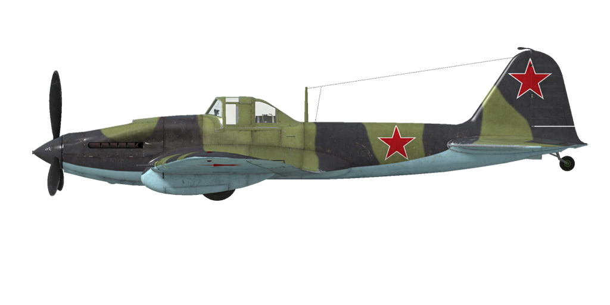

# Ил-2 мод. 1942  

  
  

## Описание  

Приборная скорость сваливания в полётной конфигурации: 138..158 км/ч  
Приборная скорость сваливания в посадочной конфигурации: 130..148 км/ч  
Предельная скорость в пикировании: 570 км/ч  
Разрушающая перегрузка: 10,5 единиц  
Угол атаки сваливания, в полётной конфигурации: 19,4 °  
Угол атаки сваливания, в посадочной конфигурации: 17,5 °  
  
Максимальная истинная скорость у земли, режим двигателя - форсированный: 400 км/ч  
Максимальная истинная скорость у земли, режим двигателя - номинал: 380 км/ч  
Максимальная истинная скорость на высоте 2500 м, режим двигателя - номинал: 414 км/ч  
  
Практический потолок: 6000 м  
Скороподъёмность у земли: 7,1 м/с  
Скороподъёмность на высоте 3000 м: 5,6 м/с  
  
Время виража предельного по тяге у земли: 25,7 с, на скорости 250 км/ч по прибору  
Время виража предельного по тяге на высоте 3000 м: 37,3 с, на скорости 250 км/ч по прибору  
  
Продолжительность полёта на высоте 3000 м: 1,7 ч, на скорости 300 км/ч по прибору  
  
Скорость взлётная: 150..190 км/ч  
Скорость на глиссаде: 185..195 км/ч  
Скорость посадочная: 135..145 км/ч  
Посадочный угол: 11,7 °  
  
Примечание 1: данные указаны для условий международной стандартной атмосферы.  
Примечание 2: диапазоны характеристик даны для допустимого диапазона масс самолёта.  
Примечание 3: максимальные скорости, скороподъемности и время виража даны для стандартной массы самолёта.  
Примечание 4: скороподъемностьи дана на номинальном режиме работы двигателя, время виража - на форсированном.  
  
Двигатель:  
Модель: АМ-38  
Максимальная мощность на форсированном режиме у земли: 1600 л.с.  
Максимальная мощность на номинальном режиме у земли: 1500 л.с.  
Максимальная мощность на номинальном режиме на высоте 1650 м: 1500 л.с.  
  
Режимы работы двигателя:  
Номинальный (время неограничено): 2050 об/мин, 1180 мм рт.ст.  
Форсированный (до 10 минут): 2150 об/мин, 1280 мм рт.ст.  
  
Температура воды на выходе из двигателя номинальная: 80..110 °С  
Температура воды на выходе из двигателя предельная: 120 °С  
Температура масла на входе в двигатель номинальная: 40..80 °С  
Температура масла на входе в двигатель предельная: 85 °С  
Температура масла на выходе из двигателя номинальная: 115 °С  
Температура масла на выходе из двигателя предельная: 120 °С  
  
Высота переключения нагнетателя: одна ступень   
  
Масса пустого самолёта: 4462 кг  
Минимальная масса (без БК, 10% топлива): 4651 кг  
Стандартная масса: 5294 кг  
Максимальная взлётная масса: 6127 кг  
Максимальный запас топлива: 535 кг / 730 л  
Максимальная полезная нагрузка: 1665 кг  
  
Вооружение курсовое:  
2 x 20мм пушка "ШВАК", 250 снарядов, 800 выстр/мин, крыльевая  
2 x 7,62мм пулемёт "ШКАС", 750 патронов, 1800 выстр/мин, крыльевой  
2 x 23мм пушка "ВЯ-23", 150 снарядов, 600 выстр/мин, крыльевая (модификация)  
2 x 37мм пушка "Ш-37", 40 снарядов, 185 выстр/мин, крыльевая (модификация)  
  
Вооружение оборонительное:  
Заднее: 7,62мм пулемёт "ШКАС", 500 патронов, 1800 выстр/мин (модификация)  
  
Вооружение бомбовое:  
До 6 x 50 кг осколочно-фугасных авиабомб "ФАБ-50св"  
До 6 x 104 кг осколочно-фугасных авиабомб "ФАБ-100М"  
2 x 254 кг осколочно-фугасные авиабомбы "ФАБ-250св"  
  
Вооружение ракетное:  
8 x 7 кг неуправляемых авиационных ракет "РОС-82", масса осколочно-фугасной боевой части 2,5 кг  
8 x 15 кг неуправляемых авиационных ракет "РБС-82", масса бронебойно-осколочно-фугасной боевой части 7,2 кг  
8 x 42 кг неуправляемых авиационных ракет "РОФС-132", масса осколочно-фугасной боевой части 21,3 кг  
  
Длина: 11,5 м  
Размах крыла: 14,6 м  
Площадь крыла: 38,5 кв.м  
  
Начало участия в боевых действиях: июнь 1942  
  
Особенности эксплуатации:  
- Двигатель самолёта имеет форсажный режим. Для использования форсажа необходимо установить рычаг высотного корректора - форсажа в положение "форсаж".  
- Двигатель оборудован одноступенчатым нагнетателем, который не требует ручного управления.  
- Высотный корректор при установке рычага в среднее положение автоматически поддерживает оптимальную топливовоздушную смесь с увеличением высоты полёта. Использование положений рычага меньших, чем среднее, позволяет обеднять смесь для снижения расхода топлива на маршруте.  
- Регулятор постоянных оборотов винта поддерживает заданные рычагом винта обороты мотора за счёт автоматического изменения шага винта.  
- Водо- и маслорадиатор имеют ручное управление створками. Створки на входе и выходе тоннеля маслорадиатора бронированные, поэтому их рекомендуется закрывать при атаке цели для уменьшения вероятности боевых повреждений маслорадиатора. После выхода из атаки необходимо снова открыть створки в требуемое положение.  
- Самолёт имеет триммер руля высоты для снятия нагрузки на ручку управления.  
- Привод посадочных щитков пневматический. По команде на выпуск щитки выпускаются полностью. Из-за небольшого давления в пневмосети выпущенные щитки могут поджиматься скоростным напором воздуха на скоростях полёта более 220км/ч. Поэтому при заходе на посадку следует помнить, что при выпуске щитков на большей скорости они могут не выпуститься на полный угол. В этом случае полный довыпуск щитков может неожиданно произойти при дальнейшем гашении скорости, например уже на выравнивании, что приведёт к взмыванию самолёта.  
- Свободно-ориентируемое хвостовое колесо может быть застопорено в положении "по полёту" при помощи рычага в кабине лётчика. Колесо необходимо застопорить при продолжительном рулении по прямой, а также перед взлётом и посадкой.  
- Тормоза колёс шасси пневматические, дифференциальные: отклонение педалей при зажатом тормозе приводит к растормаживанию колеса, противоположного нажатой педали.  
- Самолёт оснащён топливомером, который показывает остаток топлива в переднем или нижнем баке, в зависимости от положения переключателя. Выбор бака для индикации по-умолчанию производится комбинацией клавиш (RShift+I). Остаток топлива в заднем баке не контролируется.  
- Фонарь кабины имеет массу около 50 кг и не имеет фиксатора открытого положения. Поэтому при пикировании с открытым фонарём фонарь может самопроизвольно закрыться. На высоких скоростях полёта фонарь невозможно сдвинуть из-за скоростного напора воздуха. Самолёт не оборудован системой аварийного сброса фонаря, поэтому для покидания лётчиком самолёта в полёте необходимо предварительно сбросить скорость.  
- Электросбрасыватели подвесного оружия позволяют выполнять сброс бомб или пуск ракет по одной, по две или по четыре в серии.  
- Прицел установлен на подвижной штанге и может быть выдвинут в сторону лётчика для обеспечения большего угла зрения через прицел.  
  
Основные данные и рекомендуемые положения органов управления самолётом:  
1. Запуск двигателя:  
	- рекомендуемое положение рукояти управления смесью:  50% (автоматическое управление смесью)  
	- рекомендуемое положение рукояток управления радиаторами: закрыто  
	- рекомендуемое положения рукояти управления шагом: 100%  
	- рекомендуемое положение рычага управления двигателем: 10%  
	- перед рулением необходимо разблокировать колесо  
  
2. Рекомендуемые положения рукояти смеси при различных режимах полёта: 50% (автоматическое управление смесью)  
  
3.1 Рекомендуемые положения рукояти управления маслорадиатором при различных режимах полёта:  
	- взлёт: открыто 100%  
	- набор высоты: открыто 100%  
	- крейсерский полёт: открыто 50-60%  
	- бой: закрыто (для защиты радиатора от попаданий)  
  
3.2 Рекомендуемые положения рукояти управления водорадиатором при различных режимах полёта:  
	- взлёт: открыто 100%  
	- набор высоты: открыто 100%  
	- крейсерский полёт: открыто 50-60%  
	- бой: открыто 100%  
  
4. Ориентировочный расход топлива на различных режимах работы на высоте 2000 м:  
	- крейсерский режим работы двигателя: 8,9 л/мин  
	- боевой режим работы двигателя: 10,0 л/мин  

## Модификации  
### 2 x ФАБ-250св  

2 x 254 кг осколочно-фугасные авиабомбы ФАБ-250св  
Дополнительная масса: 538 кг  
Масса вооружения: 508 кг  
Масса держателей: 30 кг  
Ориентировочная потеря скорости до сброса: 18 км/ч  
Ориентировочная потеря скорости после сброса: 7 км/ч  

### 8 x РБС-82 / РОФС-132  

8 x 82 мм реактивных бронебойных снарядов РБС-82 или 8 x 132 мм реактивных осколочно-фугасных снарядов РОФС-32  
  
РБС-82:  
Дополнительная масса: 144 кг  
Масса вооружения: 120 кг  
Масса держателей: 24 кг  
Ориентировочная потеря скорости до пуска: 10 км/ч  
Ориентировочная потеря скорости после пуска: 7 км/ч  
  
РОФС-132:  
Дополнительная масса: 376 кг  
Масса вооружения: 336 кг  
Масса держателей: 40 кг  
Ориентировочная потеря скорости до пуска: 18 км/ч  
Ориентировочная потеря скорости после пуска: 9 км/ч  
  
### 2 x 37-мм пушки Ш-37  

Две 37-мм пушки Ш-37 в подвесных контейнерах с боезапасом по 40 снарядов на каждую  
Дополнительная масса: 466 кг  
Масса боекомплекта: 72 кг  
Масса орудий: 605 кг  
Ориентировочная потеря скорости: 19 км/ч  

### Задняя турельная установка  

Задняя турельная установка с 7,62-мм пулемётом ШКАС и боезапасом в 500 патронов  
Дополнительная масса: 130 кг  
Ориентировочная потеря скорости: 40 км/ч  

### 2 x 23-мм пушки ВЯ-23  

Две 23-мм крыльевые пушки ВЯ-23 с боезапасом по 150 снарядов на каждую  
Дополнительная масса: 91 кг  
Масса боекомплекта: 170 кг  
Масса орудий: 132 кг  
Ориентировочная потеря скорости: 1 км/ч  
