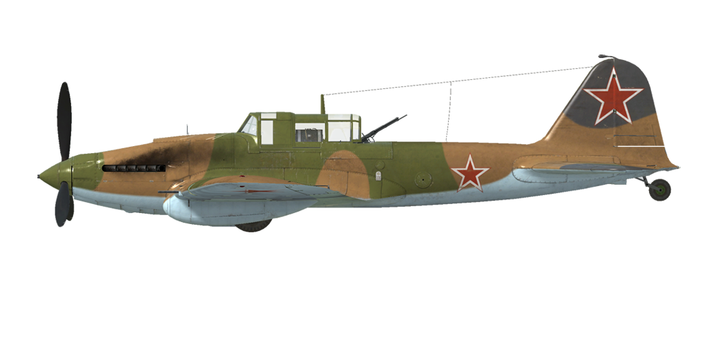

# Il-2 mod.1943

## Description

Vitesse de décrochage indiquée en configuration de vol : 144..159 km/h
Vitesse de décrochage indiquée en configuration de décollage/atterrissage : 135..152 km/h
Vitesse limite de piqué : 570 km/h
Facteur de charge maximum : 10,5 g
Angle d\attaque de décrochage en configuration de vol : 19,4 °
Angle d\attaque de décrochage indiquée en configuration d\atterrissage : 17,5 °

Vitesse sol au niveau de la mer, régime moteur - Surpuissance : 407 km/h
Vitesse sol au niveau de la mer, régime moteur - Nominal : 389 km/h
Vitesse sol maximale à 1200 m, régime moteur - Nominal : 400 km/h

Plafond opérationnel : 5600 m
Taux de montée au niveau de la mer : 7,5 m/s
Taux de montée à 3000 m : 4,2 m/s

Virage à 360° au niveau de la mer en : 26,6 s, à 250 km/h vitesse indiquée (IAS).
Virage à 360° à 3000 m : 39,3 s, à 250 km/h vitesse indiquée (IAS).

Endurance à 3000 m : 1,4 h, à 300 km/h vitesse indiquée (IAS).

Vitesse de décollage : 160..200 km/h
Vitesse d\approche : 195..205 km/h
Vitesse d\atterrissage : 145..155 km/h
Angle d\atterrissage : 11,7 °

Note 1 : les données sont indiquées à l\atmosphère standard international (ISA).
Note 2 : les performances d\endurance sont données pour plusieurs masses possibles.
Note 3 : la vitesse maximale, le taux de montée et le temps de virage sont donnés pour une masse standard.
Note 4 : le taux de montée est à régime continu, le temps de virage est en surpuissance.

Moteur :
Modèle : AM-38F
Puissance maximale en surpuissance au niveau de la mer : 1720 cv
Puissance maximale au régime continu au niveau de la mer : 1500 cv
Puissance maximale au régime continu à 750 m : 1500 cv

Performance du moteur :
Continu (durée illimitée) : 2050 tr/min, 1200 mmHg
Surpuissance (jusqu\à 5 minutes) : 2350 tr/min, 1360 mmHg

Température de fonctionnement d\eau en sortie du moteur : 80..110 °C
Température maximale d\eau en sortie du moteur : 120 °C
Température de fonctionnement d\huile à l\admission du moteur : 40..80 °C
Température maximale d\huile à l\admission du moteur : 85 °C
Température de fonctionnement d\huile en sortie du moteur : 115 °C
Température maximale d\huile en sortie du moteur : 120 °C

Altitude de changement d\étage du compresseur : étage simple

Masse à vide : 4715 kg
Masse minimale (sans munitions, 10%25 de carburant) : 5014 kg
Masse standard : 5681 kg
Masse maximale au décollage : 6375 kg
Masse de carburant : 535 kg / 730 l
Charge utile : 1660 kg

Armement offensif :
2 canons ShVAK de 20 mm, 250 coups, 800 coups par minute, dans l\aile
2 mitrailleuses ShKAS de 7,62 mm, 750 coups, 1800 coups par minute, dans l\aile
2 canons VYa-23 de 23 mm, 150 coups, 600 coups par minute, dans l\aile (modification)
2 canons NS-37 de 37 mm, 50 coups, 250 coups par minute, dans l\aile (modification)

Armement défensif :
Dorsal : mitrailleuse UBT de 12,7 mm, 150 coups, 1000 coups par minute (modification)

Bombes :
Jusqu\à 240 bombes HEAT (charge creuse) PTAB-2,5-1,5 de 1,5 kg
Jusqu\à 6 bombes d\emploi général FAB-50sv de 50 kg
Jusqu\à 6 bombes d\emploi général FAB-100M de 104 kg
2 bombes d\emploi général FAB-250sv de 254 kg 

Roquettes:
4 roquettes ROS-82 de 7 kg, charge militaire HE (explosif) de 2,5 kg
4 roquettes RBS-82 de 15 kg, charge militaire HEAT (charge creuse) de 7,2 kg
4 roquettes ROFS-132 de 42 kg, charge militaire HE (explosif) de 21,3 kg

Longueur : 11,5 m
Envergure : 14,6 m
Surface alaire : 38,5 m²

Premier engagement : précoce 1943

Caractéristiques
- Le moteur possède un mode de surpuissance (boost) qui est activé lorsque le levier de commande du mélange est placé en position maximale.
- Le moteur est pourvu d\un compresseur mécanique à un étage qui ne nécessite pas de commande manuelle.
- Le mélange en carburant est automatique lorsque la manette est placée dans une position intermédiaire (50%25) Il est possible d\agir manuellement lorsque la manette est positionnée sur une graduation inférieure à 50%25. Il permet aussi de réduire la consommation durant le vol.
- Il y a un régulateur de tours moteur, les RPM sont ainsi maintenus à la bonne valeur en fonction de la position du levier du régulateur. Le régulateur contrôle automatiquement le pas d\hélice afin de maintenir les RPM demandés.
- Les coommandes de fermeture des volets de radiateurs d\eau et d\huile sont manuelles. L\avion possède des volets de radiateur d\huile blindés qui doivent être fermés au début d\une attaque au sol afin de réduire les risques d\endommagement pendant le combat. Après avoir terminé l\attaque, il est nécessaire de rouvrir les volets dans la position requise.
- L\avion n\a qu\un trim de tangage.
- Landing flaps have a pneumatic actuator. Flaps can be extended fully or to takeoff position - 17°, gradual extending is impossible. Due to the weak force of the actuator the extended landing flaps may be pressed upwards by the airflow if the airspeed is more than 220 km/h. Remember that the flaps will not extend fully in case of high speed. In case of a high-speed landing approach the flaps may extend a few steps further right before the landing which will cause the aircraft to shoot upwards.
- L\avion est muni d\une roulette de queue verouillable manuelement. La roulette doit être verrouillée en roulant droit sur une longue distance, avant le décollage et l\atterrissage.
- L\avion a des freins pneumatiques différentiels de roue avec un levier de commande partagé. Cela signifie que si le levier de frein est maintenu, et que la pédale de gouvernail qui freine la roue opposé est progressivement libérée, cela fera tourner d\un côté ou de l\autre.
- L\avion possède une jauge de carburant qui indique la quantité de carburant restant dans le réservoir de carburant avant ou en bas en fonction de la position du commutateur. En jeu, le commutateur de sélection de réservoir de carburant change de lui-même pendant le vol horizontal toutes les 10 secondes.Le niveau du réservoir arrière n\est pas indiqué. 
- La verrière pèse 50 Kg et ne possède pas de verouillage en position ouverte, ce qui fait qu\elle peut se fermer lors d\un piqué accentué. Also, it is impossible to open or close canopy at high speed due to strong airflow. La verrière n\a pas de systême d\éjection d\urgence, il faut donc réduire la vitesse pour évacuer l\avion.
- L\avion est équipé d\un contrôleur de salve qui controle à la fois les bombes et les roquettes, il a trois modes de lancement / tir : lancement unique, lancer par deux dans une salve ou lancer par quatre dans une salve.
- The mechanical gun sight "Visier Vladimirova" allows aiming rockets and guns at ground and air targets and horizontal bombing at certain speeds and altitudes.

## Modifications

&name=2 bombes FAB-250sv

2 bombes d’emploi général FAB-250sv de 254 kg
Masse supplémentaire : 538 kg
Masse des munitions : 508 kg
Masse des pylones : 30 kg
Perte estimée de vitesse avant le largage : 18 km/h
Perte estimée de vitesse après le largage : 7 km/h
&name=2 NS-37de 37 mm

2 nacelles avec canons NS-37de 37 mm et 50 obus chaque
Masse supplémentaire : 260 kg
Masse des munitions : 90 kg
Masse des canons : 340 kg
Perte estimée de vitesse : 15 km/h
### 192(240) bombes PTAB-2.5-1.5

192(240) bombes d’emploi général PTAB-2.5-1.5 de 1.5 kg
Masse supplémentaire : 308(380) kg
Masse des munitions : 288(360) kg
Masse des pylones : 20 kg
Perte estimée de vitesse avant le largage : 5 km/h
Perte estimée de vitesse après le largage : 0 km/h
### 4 roquettes RBS-82 / ROFS-132 

4 roquettes anti blindage non guidées RBS-82 de 82 mm ou 4 roquettes explosives brisantes non guidées ROFS-132 de 132 mm

RBS-82:
Masse supplémentaire : 84 kg
Masse des munitions : 60 kg
Masse des rails : 24 kg
Perte estimée de vitesse avant le lancement : 5 km/h
Perte estimée de vitesse après le lancement : 4 km/h

ROFS-132:
Masse supplémentaire : 188 kg
Masse des munitions : 168 kg
Masse des rails : 20 kg
Perte estimée de vitesse avant le lancement : 9 km/h
Perte estimée de vitesse après le lancement : 5 km/h
&name=2 VYa-23 de 23 mm

2 canons VYa-23 de 23 mm montés dans les ailes et 150 obus chaque
Masse supplémentaire : 91 kg
Masse des munitions : 170 kg
Masse des canons : 132 kg
Perte estimée de vitesse : 1 km/h
