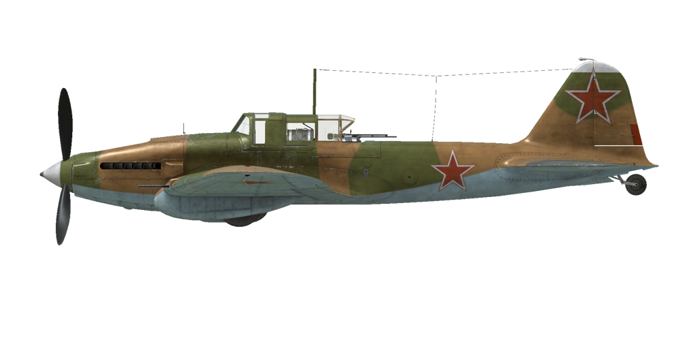

# Il-2 mod.1944  

  

## 描述  

飞行构型的失速指示空速：152~167 km/h  
起降构型的失速指示空速：140~157 km/h  
俯冲极速：570 km/h  
最大过载：10.5 G  
飞行构型失速迎角：19.8 °  
着陆构型失速迎角：17.9 °  
  
最大真空速，高度海平面，发动机模式——加力：412 km/h  
最大真空速，高度海平面，发动机模式——标称：391 km/h  
最大真空速，高度1200m，发动机模式——标称：386 km/h  
  
实用升限：5600 m  
海平面爬升率：7.35 m/s  
3000m时爬升率：4.1 m/s  
  
海平面最大性能盘旋时间：27.2 s，250 km/h 指示空速。  
3000m时最大性能盘旋时间：37.1 s，250 km/h 指示空速。  
  
3000m（9843 feet）时续航时间：1.4h，300 km/h 指示空速。  
  
起飞速度：160~200 km/h  
进近速度：195~205 km/h  
着陆速度：145~155 km/h  
着陆迎角：11.7 °  
  
注1：所提供的数据适用于国际标准大气（ISA）。  
注2：飞行性能范围基于可能的飞机质量范围。  
注3：极速、爬升率和盘旋时间基于标准飞机质量。  
注4：爬升率基于标称动力，盘旋时间基于加力动力。  
  
发动机：  
型号：AM-38F  
海平面加力模式下的最大功率：1720 HP  
海平面标称动力模式下的最大功率：1500 HP  
标称模式下的最大功率，高度750m：1500 HP  
  
发动机模式：  
标称（无时间限制）：2050 RPM，1200 mm Hg  
加力动力（不超过5min）：2350 RPM，1360 mm Hg  
  
发动机液冷出水口额定水温：80~110 °C  
发动机液冷出水口最高水温：120 °C  
发动机滑油进油口额定油温：40~80 °C  
发动机滑油进油口最高油温：85 °C  
发动机滑油出油口额定油温：115 °C  
发动机滑油出油口最高油温：120 °C  
  
机械增压器换挡高度：单级  
  
空重：4717 kg  
最小重量（无弹药、10%燃油）：5068 kg  
标准重量：5763 kg  
最大起飞重量：6387 kg  
燃油载荷：535 kg/730 L  
有效载荷：1670 kg  
  
前射武器：  
2 x 23mm机炮"VYa-23"，150发，600发/分，机翼安装  
2 x 7.62mm机枪"ShKAS"，750发，1800发/分，机翼安装  
  
防御武器：  
后射武器: 12.7mm机枪"UBT"，150发，1000发/分（改装）  
  
炸弹：  
最多240 x 1.5 kg破甲炸弹 "PTAB-2，5-1，5"  
最多6 x 50kg 通用炸弹"FAB-50sv"  
最多6 x 104kg 通用炸弹"FAB-100M"  
2 x 254kg 通用炸弹"FAB-250sv"  
  
火箭弹：  
4 x 7 kg火箭弹 "M-8"，高爆战斗部质量 2 kg  
4 x 15 kg火箭弹 "RBS-82"，破甲战斗部质量 7.2 kg  
4 x 42.5 kg火箭弹 "M-13UK"，高爆战斗部质量 21.3 kg  
  
长度：11.5 m  
翼展：14.6 m  
机翼面积：38.5 m²  
  
首次投入战斗：1944春  
  
操作特性：  
——发动机有个加力模式，通过把混合比控制杆设置到最大位置接通。  
——发动机为单级机械增压，无需手动操作。  
——当混合比杆设置为中间（50%）位置时发动机混合比控制是自动的。可以通过移动混合比控制低于50%来手动贫油混合比。这也会在飞行时降低油耗。  
——发动机转速有自动调节器，其根据调节器控制杆位置保持对应的需用转速。调节器自动控制螺旋桨桨距来保持需用转速。  
——水冷和滑油散热器风门是手动控制的。飞机的滑油散热器风门有装甲防护，应当在对地攻击开始时候关闭以避免受损。在攻击结束后，应当重新打开风门到需要位置。  
——飞机仅有俯仰飞行操纵的配平。  
——着陆襟翼由冷气驱动。襟翼可以完全放下或到起飞位置的17°，不可无级放下。由于致动器放下襟翼的力较弱，当空速大于220km/h时，气流会把襟翼压回收起位置。因此，请记住襟翼在高速时无法完全放下。在高速着陆进近时襟翼可能在着陆前分阶段放下，导致飞机目测高。  
——飞机有手动尾轮锁。在起飞前和着陆后的长距离直线滑行时应锁尾轮。  
——飞机有共用一个控制杆的差动气压机轮刹车。这意味着捏住刹车踩舵，反向一侧的机轮刹车会逐渐释放，导致飞机转向踩舵一侧。  
——飞机有油量表，会根据开关位置显示前部或底部油箱的剩余油量。在游戏中，按下（RShift+I）可改变燃油指示器开关。后部油箱油量没有指示。  
——驾驶舱的座舱盖重量是50kg，在打开位置时没有锁，因此在大角度俯冲时座舱盖可能会自动关上。由于强气流，座舱盖也无法在高速时开闭。座舱盖只能应急抛弃，所以跳伞之前需先减速。  
——飞机装有炸弹和火箭弹联合齐投/齐射控制器，其有三个投放/开火模式：单发、双发齐射和四发齐射。  
——机械瞄准具“维西尔·弗拉基 m尔罗娃（Visier Vladimirova）”可以用作火箭弹和机炮的对地和对空目标瞄准，以及某些速度和高度时的水平轰炸瞄准。  
  
Basic data and recommended positions of the aircraft controls:  
1. Starting the engine:  
	- recommended position of the mixture control lever: 50% (auto mixture control)  
	- recommended position of the radiators control handles: close  
	- recommended position of the prop pitch control handle: 100%  
	- recommended position of the throttle lever: 10%  
	- before taxiing, you must unlock the tailwheel  
  
2. Recommended mixture control lever positions for various flight modes: 50% (auto mixture control)  
  
3.1 Recommended positions of the oil radiator control handle for various flight modes:  
	- takeoff: open 100%  
	- climb: open 100%  
	- cruise flight: open 50-60%  
	- combat: close (to prevent combat damage)  
  
3.2 Recommended positions of the water radiator control handle for various flight modes:  
	- takeoff: open 100%  
	- climb: open 100%  
	- cruise flight: open 60-70%  
	- combat: open 100%  
  
4. Approximate fuel consumption at 2000 m altitude:  
	- Cruise engine mode: 9.6 l/min  
	- Combat engine mode: 11.4 l/min  

## 修改  
### 2 x FAB-250sv炸弹  

2 x 254kg 通用炸弹FAB-250sv  
增加质量：538 kg  
弹药质量：508 kg  
挂架质量：30 kg  
投弹前预期速度损失：18 km/h  
投弹后预期速度损失：7 km/h  

### 192(240) x PTAB-2.5-1.5 炸弹  

192(240) x 1.5 kg 破甲炸弹PTAB-2.5-1.5  
增加质量：308(380) kg  
弹药质量：288(360) kg  
挂架质量：20 kg  
投弹前预期速度损失：5 km/h  
投弹后预期速度损失：0 km/h  
  
### 4 x RBS-82/M-13UK火箭弹  

4 x 82mm穿甲无制导火箭弹RBS-82/4 x 132mm高爆无制导火箭弹M-13UK  
  
RBS-82:  
增加质量：60 kg  
弹药质量：48 kg  
挂架质量：12 kg  
发射前预期速度损失：5 km/h  
发射后预期速度损失：4 km/h  
  
M-13UK:  
增加质量：190 kg  
弹药质量：170 kg  
挂架质量：20 kg  
发射前预期速度损失：6 km/h  
发射后预期速度损失：5 km/h  
