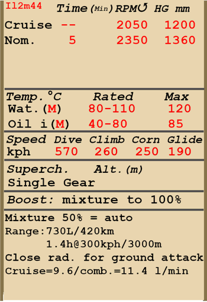

# Il-2 Mod. 1944  

<table><tbody><tr><td style="text-align: center"></td><td style="text-align: center"></td></tr></td></tr></tbody></table>  

Überziehgeschwindigkeit in Flugkonfiguration: 152..167 km/h  
Überziehgeschwindigkeit in Landekonfiguration: 140..157 km/h  
Höchstzulässige Geschwindigkeit im Sturzflug: 570 km/h  
Bruchlastvielfache: 10.5 G  
Kritischer Anstellwinkel in Flugkonfiguration: 19.8 °  
Kritischer Anstellwinkel in Landekonfiguration: 17.9 °  
  
Höchstgeschwindigkeit in Bodennähe, Startleistung: 412 km/h  
Höchstgeschwindigkeit in Bodennähe, Nennleistung: 391 km/h  
Höchstgeschwindigkeit in 1200 m Höhe, Nennleistung: 386 km/h  
  
Dienstgipfelhöhe: 5600 m  
Steigleistung in Bodennähe: 7.35 m/s  
Steigleistung in 3000 m Höhe: 4.1 m/s  
  
Maximale Wendegeschwindigkeit in Bodennähe: 27.2 s (250 km/h IAS).  
Maximale Wendegeschwindigkeit in 3000 m Höhe: 37.1 s (250 km/h IAS).  
  
Reichweite in 3000 m: 1.4 h, bei 300 km/h IAS.  
  
Startgeschwindigkeit: 160..200 km/h  
Anfluggeschwindigkeit: 195..205 km/h  
Landegeschwindigkeit: 145..155 km/h  
Sinkflugpfad: 11.7 °  
  
Anmerkung 1: Die Werte gelten für Normatmosphäre (ISA).  
Anmerkung 2: Flugleistungen varrieren je nach Abfluggewicht.  
Anmerkung 3: Höchstgeschwindigkeiten, Steigleistungen und Wendegeschwindigkeiten gelten für Standard-Fluggewicht.  
Anmerkung 4: Steigraten gelten für Nennleistung, Wendegeschwindigkeiten gelten für Startleistung.  
  
Triebwerk:  
Baumuster: AM-38F  
Startleistung in Bodennähe: 1720 PS  
Nennleistung in Bodennähe: 1500 PS  
Nennleistung in 750 m Höhe: 1500 PS  
  
Leistungsstufen:  
Nennleistung (unbegrenzt): 2050 U/min, 1200 mm Hg  
Startleistung (bis zu 5 Minuten): 2350 U/min, 1360 mm Hg  
  
Kühlstoffaustrittstemperatur (normal): 80..110 °C  
Kühlstoffaustrittstemperatur (höchstens): 120 °C  
Schmierstoffeintrittstemperatur (normal): 40..80 °C  
Schmierstoffeintrittstemperatur (höchstens): 85 °C  
Schmierstoffaustrittstemperatur (normal): 115 °C  
Schmierstoffaustrittstemperatur (höchstens): 120 °C  
  
Laderumschalthöhe: Einganglader  
  
Leergewicht: 4717 kg  
Minimalgewicht (keine Munition, 10% Treibstoff): 5068 kg  
Normalgewicht: 5763 kg  
Höchstabfluggewicht: 6387 kg  
Kraftstoffmenge: 535 kg / 730 l  
Nutzlast: 1670 kg  
  
Starre Schusswaffenanlage:  
2 x 23 mm VYa-23, 150 Schuss, 600 Schuss pro Minute, flügelmontiert  
2 x 7.62 mm SchKAS, 750 Schuss, 1800 Schuss pro Minute, flügelmontiert  
  
Abwehrbewaffnung:  
Rückwärts: 12.7 mm UBT, 150 Schuss, 1000 Schuss pro Minute (Rüstsatz)  
  
Abwurfwaffen:  
Bis zu 240 x 1.5 kg Hohlladungsbomben PTAB-2,5-1,5  
Bis zu 6 x 50 kg Mehrzweck-Sprengbomben FAB-50sv  
Bis zu 6 x 104 kg Mehrzweck-Sprengbomben FAB-100M  
2 x 254 kg Mehrzweck-Sprengbomben FAB-250sv  
  
Raketen:  
4 x 7 kg Raketen M-8, Sprengladung 2 kg  
4 x 15 kg Raketen RBS-82, Hohlladung 7.2 kg  
4 x 42.5 kg Raketen M-13UK, Sprengladung 21.3 kg  
  
Länge: 11.5 m  
Spannweite: 14.6 m  
Flügelfläche: 38.5 m²  
  
Erster Fronteinsatz: Frühjahr 1944  
  
Eigenschaften:  
- Der Motor hat eine verstärkte Zusatzleistung, welche eingeschaltet wird, indem der Hebel für die Gemischregelung in die Maximalposition geschoben wird.  
- Der Motor hat einen Einganglader, welcher nicht umgeschaltet werden muss.  
- Die Gemischverstellung erfolgt automatisch, wenn sich der Gemischhebel in der mittleren Position (50%) befindet. Es ist möglich das Gemisch abzumagern, indem der Hebel in eine Stellung unter 50% bewegt wird. Dies reduziert den Treibstoffverbrauch während des Fluges.  
- Der Motor besitzt eine automatische Drehzahlregelung, welche die Motordrehzahl je nach Hebelstellung festlegt. Der Regler verstellt automatisch den Anstellwinkel des Propellers um die erforderliche Drehzahl einzuhalten.  
- Die Verstellung Wasserkühler- und Ölkühlerklappen erfolgt manuell. Das Flugzeug hat gepanzerte Ölkühlerklappen, welche zur Vermeidung von Beschussschäden bei einem Bodenangriff geschlossen werden sollten. Nach dem Angriff ist es erforderlich die Kühlklappen wieder zu öffnen.  
- Das Flugzeug verfügt nur über eine Höhenrudertrimmung.  
- Die Landeklappen haben ein pneumatisches Verstellteil. Die Klappen können voll oder in Startposition - 17° ausgefahren werden, stufenloses Ausfahren ist nicht möglich. Aufgrund der geringen Kraft des Stellteils könnten die ausgefahrenen Klappen durch den Luftstrom hochgedrückt werden, wenn die Geschwindigkeit höher als 220 km/h ist. Es ist zu bedenken, dass im Falle hoher Geschwindigkeit die Klappen nicht voll ausfahren. Im Falle eines Landeanflugs mit hoher Geschwindigkeit könnten die Klappen kurz vor der Landung etwas weiter ausfahren, was zu einem plötzlichen Aufsteigen des Flugzeugs führt.  
- Das Flugzeug hat eine manuelle Spornradverriegelung. Das Spornrad sollte bei längerem Geradeausrollen, sowie beim Abflug und bei der Landung verriegelt werden.  
- Das Flugzeug hat differentielle pneumatische Bremsen, die mit einem gemeinsamen Bremshebel betätigt werden. Wenn der Bremshebel gezogen und das Ruderpedal betätigt wird, wird die gegenüberliegende Bremse gelöst und das Flugzeug dreht sich zu der einen oder der anderen Seite.  
- Das Flugzeug hat eine Anzeige, welche den Treibstoffstand des vorderen und unteren Tanks je nach Position des Treibstoffstandschalters anzeigt. Im Simulator ändert sich der Schalter durch Drücken von (Shift+I). Der Stand des hinteren Treibstofftanks wird nicht angezeigt.   
- Das Gewicht der Cockpithaube beträgt 50 kg und es gibt keine Verriegelung in geöffneter Position. Deshalb ist es möglich, dass sich die Haube selbständig bei einem längeren Sturzflug schließt. Also, it is impossible to open or close canopy at high speed due to strong airflow. Die Cockpithaube hat keine Notfallauslösung, weshalb die Geschwindigkeit vor dem Notausstieg reduziert werden muss.  
- Das Flugzeug ist mit einer gemeinsamen Steuerung für Bomben und Raketen ausgerüstet. Es gibt drei Abwurf-/Abschussarten: einzeln, zwei in einer Salve oder vier in einer Salve.  
- Das mechanische Visier "Visier Vladimirova" ermöglicht das Zielen von Raketen und Geschützen auf Boden- und Luftziele und horizontales Bomben bei bestimmten Geschwindigkeiten und Höhen.  
  
Basic data and recommended positions of the aircraft controls:  
1. Starting the engine:  
	- recommended position of the mixture control lever: 50% (auto mixture control)  
	- recommended position of the radiators control handles: close  
	- recommended position of the prop pitch control handle: 100%  
	- recommended position of the throttle lever: 10%  
	- before taxiing, you must unlock the tailwheel  
  
2. Recommended mixture control lever positions for various flight modes: 50% (auto mixture control)  
  
3.1 Recommended positions of the oil radiator control handle for various flight modes:  
	- takeoff: open 100%  
	- climb: open 100%  
	- cruise flight: open 50-60%  
	- combat: close (to prevent combat damage)  
  
3.2 Recommended positions of the water radiator control handle for various flight modes:  
	- takeoff: open 100%  
	- climb: open 100%  
	- cruise flight: open 60-70%  
	- combat: open 100%  
  
4. Approximate fuel consumption at 2000 m altitude:  
	- Cruise engine mode: 9.6 l/min  
	- Combat engine mode: 11.4 l/min  

## Änderungen  

### 2 x Bomben, Typ FAB-250sv  

2 x 254-kg-Splitterbomben FAB-250sv  
Zusätzliches Gewicht: 538 kg  
Gewicht der Munition: 508 kg  
Gewicht der Abwurfwaffenroste: 30 kg  
Geschwindigkeitsverlust vor Abwurf: 18 km/h  
Geschwindigkeitsverlust nach Abwurf: 7 km/h  
  
### 192(240) x Bomben, Typ PTAB-2.5-1.5  

192(240) x 1.5-kg-Splitterbomben PTAB-2.5-1.5  
Zusätzliches Gewicht: 308(380) kg  
Gewicht der Munition: 288(360) kg  
Gewicht der Abwurfwaffenroste: 20 kg  
Geschwindigkeitsverlust vor Abwurf: 5 km/h  
Geschwindigkeitsverlust nach Abwurf: 0 km/h  
  
### 4 x Raketen, Typ RBS-82 / M-13UK  

4 x 82mm panzerbrechende ungelenkte Raketen RBS-82 oder 4 x 132mm hochexplosive ungelenkte Raketen M-13UK  
  
RBS-82:  
Zusätzliches Gewicht: 60 kg  
Gewicht der Munition: 48 kg  
Gewicht der Abwurfwaffenroste: 12 kg  
Geschwindigkeitsverlust vor dem Abfeuern: 5 km/h  
Geschwindigkeitsverlust nach dem Abfeuern: 4 km/h  
  
M-13UK:  
Zusätzliches Gewicht: 190 kg  
Gewicht der Munition: 170 kg  
Gewicht der Abwurfwaffenroste: 20 kg  
Geschwindigkeitsverlust vor dem Abfeuern: 6 km/h  
Geschwindigkeitsverlust nach dem Abfeuern: 5 km/h  
