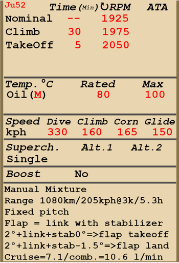

# Ju 52/3m g4e  

  
  

## Описание  

Приборная скорость сваливания в полётной конфигурации: 105..117 км/ч  
Приборная скорость сваливания в посадочной конфигурации: 92..109 км/ч  
Предельная скорость в пикировании: 330 км/ч  
Разрушающая перегрузка: 4,0 единиц  
Угол атаки сваливания, в полётной конфигурации: 20 °  
Угол атаки сваливания, в посадочной конфигурации: 17,2 °  
  
Максимальная истинная скорость у земли, режим двигателя - набор высоты: 260 км/ч  
Максимальная истинная скорость на высоте 3000 м, режим двигателя - набор высоты: 258 км/ч  
Максимальная истинная скорость на высоте 6000 м, режим двигателя - набор высоты: 241 км/ч  
  
Практический потолок: 6800 м  
Скороподъёмность у земли: 6,9 м/с  
Скороподъёмность на высоте 3000 м: 4,2 м/с  
Скороподъёмность на высоте 6000 м: 1,4 м/с  
  
Время виража предельного по тяге у земли: 24,0 с, на скорости 165 км/ч по прибору  
Время виража предельного по тяге на высоте 3000 м: 35,4 с, на скорости 165 км/ч по прибору  
  
Продолжительность полёта на высоте 3000 м: 5,3 ч, на скорости 205 км/ч по прибору  
  
Скорость взлётная: 100..120 км/ч  
Скорость на глиссаде: 140..155 км/ч  
Скорость посадочная: 95..110 км/ч  
Посадочный угол: 11,7 °  
  
Примечание 1: данные указаны для условий международной стандартной атмосферы.  
Примечание 2: диапазоны характеристик даны для допустимого диапазона масс самолёта.  
Примечание 3: максимальные скорости, скороподъемности и время виража даны для стандартной массы самолёта.  
Примечание 4: скороподъемность дана на режиме работы двигателя "набор высоты", время виража - на взлётном.  
  
Двигатель:  
Модель: BMW-132a  
Максимальная мощность на взлётном режиме у земли: 640 л.с.  
Максимальная мощность на взлётном режиме на высоте 900 м: 660 л.с.  
Максимальная мощность на режиме набора высоты у земли: 575 л.с.  
Максимальная мощность на режиме набора высоты на высоте 900 м: 590 л.с.  
  
Режимы работы двигателя:  
Номинальный (время неограничено): 1925 об/мин  
Набор высоты (до 30 минут): 1975 об/мин  
Взлётный (до 5 минут): 2050 об/мин  
  
Температура масла на входе в двигатель номинальная: 60 °С  
Температура масла на входе в двигатель предельная: 80 °С  
Температура масла на выходе из двигателя номинальная: 80 °С  
Температура масла на выходе из двигателя предельная: 100 °С  
  
Масса пустого самолёта: 6305 кг  
Минимальная масса (без БК, 10% топлива): 7017 кг  
Стандартная масса: 10003 кг  
Максимальная взлётная масса: 11333 кг  
Максимальный запас топлива: 1824 кг / 2400 л  
Максимальная полезная нагрузка: 5028 кг  
  
Вооружение оборонительное:  
Верхнее: 7,92мм пулемёт "MG 15", 1125 патронов, 1000 выстр/мин  
  
Длина: 18,9 м  
Размах крыла: 29,25 м  
Площадь крыла: 111,5 кв.м  
  
Начало участия в боевых действиях: 1936  
  
Особенности эксплуатации:  
- Двигатель оборудован одноступенчатым нагнетателем, который не требует ручного управления.  
- Высотный корректор топливовоздушной смеси имеет ручное управление. С увеличением высоты полёта более 1 км необходимо обеднять смесь для оптимальной работы мотора. Также ручное обеднение смеси позволяет снизить расход топлива на маршруте.  
- На самолёте установлены винты фиксированного шага. Управление тягой двигателей осуществляется только рычагами газа, при этом используется ограниченный диапазон хода рычагов: от 25% (малый газ) до 100% (максимальный режим работы двигателя). Диапазон хода рычагов газа от 0% до 20% используется для управления тормозами колёс шасси. Для контроля режима работы двигателей самолёт оборудован только указателями оборотов.  
- Кран перепуска маслорадиатора и створки капота имеют ручное управление.  
- Педали управления в кабине оснащены регулируемым загрузочным механизмом для снятия нагрузки на педалях.  
- Самолёт имеет управляемый вручную переставной стабилизатор. Полётное положение стабилизатора около +2° (на пикирование), взлётное: 0°, посадочное: -1,5° (на кабрирование). Также можно пользоваться им как триммером, уменьшая усилия на штурвале управления в полёте.  
- Механический привод выпуска закрылков самолёта управляется совместно со стабилизатором, для чего имеется механизм сцепления и разрыва связи управления закрылками (управляется клавишами уборки/выпуска закрылков). Следует избегать отклонений от стандартного алгоритма использования закрылков и стабилизатора, т.к. это может привести к блокированию управления ими.  
- Перед взлётом следует сначала установить стабилизатор в полётное положение +2°, затем включить сцепление привода закрылков, после чего установить стабилизатор во взлётное положение 0°. Закрылки при этом будут выпущены на угол 25°.  
- После взлёта следует переместить стабилизатор назад в полётное положение, при этом закрылки должны полностью убраться. После этого следует выключить сцепление привода закрылков.  
- Перед посадкой следует установить стабилизатор в полётное положение +2°, включить сцепление привода закрылков, после чего установить стабилизатор в посадочное положение -1,5°. Закрылки при этом будут полностью выпущены на угол 40°.  
- Хвостовое колесо свободно ориентируемо, стопора не имеет. В связи с этим при движении по ВПП с большой скоростью на взлёте или посадке следует уверенно и аккуратно работать педалями, своевременно парируя стремление самолёта к развороту.  
- Самолёт имеет раздельное управление пневматическими тормозами левого и правого колёс шасси. Торможение левого колеса осуществляется перемещением рычага газа левого двигателя назад от 20% хода рычага. Торможение правого колеса осуществляется перемещением рычага газа правого двигателя назад от 20% хода рычага. Перемещение рычага центрального двигателя назад от 20% хода рычага одновременно затормаживает и левое и правое колёса шасси. Максимальная эффективность торможения достигается при перемещении рычагов газа на нижний (задний) упор. В игре дополнительно возможно управление положением левого и правого рычагов газа с помощью команд управления тормозами колёс.  
- Самолёт оборудован гидравлическим стояночным тормозом заднего колеса шасси.  
- Самолёт оснащён отдельными механическими поплавковыми топливомерами для левой и правой групп баков, расположенных снаружи кабины на левой и правой мотогондолах.  
- Самолёт оснащён отдельными механическими поплавковыми указателями уровня масла для каждого двигателя, расположенных снаружи кабины на трёх мотогондолах.  
- Для разгрузки груза самолёт оборудован грузовыми дверьми, которые могут быть открыты только на земле.  
- Для выполнения заданий по сбросу парашютистов или транспортных парашютных контейнеров с самолёта снимается левая пассажирская дверь. Для десантирования следует использовать клавишу сброса бомб.  
  
Основные данные и рекомендуемые положения органов управления самолётом:  
1. Запуск двигателя:  
	- рекомендуемое положение рукояти управления смесью:  100%  
	- рекомендуемое положение рукояти управления створками капота: закрыто  
	- рекомендуемое положение рукояти управления радиаторами:закрыто  
	- рекомендуемое положения рукояти управления шагом: фиксированный шаг  
	- рекомендуемое положение рычага управления двигателем: 35%  
	- перед рулением необходимо снять самолёт со стояночного тормоза  
  
2. Рекомендуемые положения рукояти смеси при различных режимах полёта: / управление смесью отсутствует  
	- При работе мотора на малом газу у земли ручка смеси должна быть в положении около 75%.  
	- При работе мотора на полном газу у земли ручка смеси должна быть в положении 80-90%.  
	- По мере набора высоты высотный корректор прикрывается.  
  
3.1 Рекомендуемые положения рукояти управления створками капота при различных режимах полёта:  
	- взлёт: открыто  
	- крейсерский полёт: открыто 50%  
	- бой: открыто 50%  
  
3.2 Рекомендуемые положения рукояти управления радиаторами при различных режимах полёта:  
	- взлёт: открыто  
	- крейсерский полёт: открыто 50%  
	- бой: открыто 50%  
  
4. Ориентировочный расход топлива на различных режимах работы на высоте 2000 м:  
	- крейсерский режим работы двигателя: 7,1 л/мин  
	- боевой режим работы двигателя: 10,6 л/мин  

## Модификации  
### 2300 кг груз военного назначения  

2300 кг груз военного назначения в фюзеляже самолёта  
Дополнительная масса: 2300 кг  
Ориентировочная потеря скорости: 2 км/ч  
  
### 10 контейнеров MAB 250  

10 сбрасываемых 250 кг парашютных транспортных контейнеров MAB 250  
Дополнительная масса: 2550 кг  
Масса контейнеров: 2500 кг  
Масса держателей: 50 кг  
Ориентировочная потеря скорости до сброса: 2 км/ч  
Ориентировочная потеря скорости после сброса: 0 км/ч  

### 12 парашютистов  

12 парашютистов с амуницией  
Дополнительная масса: 1200 кг  
Ориентировочная потеря скорости до сброса: 2 км/ч  
Ориентировочная потеря скорости после сброса: 0 км/ч  

### Задняя турельная установка  

Задняя турельная установка с 7,92-мм пулемётом MG 15 и боезапасом в 1125 патронов  
Дополнительная масса: 130 кг  
Ориентировочная потеря скорости: 4 км/ч  
