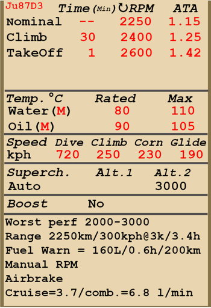

# Ju 87 D-3  

| Image | Notes  
|:---|:---  
|  |   

## 描述  

飞行构型的失速指示空速：137~176 km/h  
起降构型的失速指示空速：123~155 km/h  
  
俯冲极速：650 km/h  
最大过载：9 G  
飞行构型失速迎角：19.9 °  
着陆构型失速迎角：18 °  
  
最大真空速，高度海平面，发动机模式——爬升：367 km/h  
最大真空速，高度2000m，发动机模式——爬升：389 km/h  
最大真空速，高度6000m，发动机模式——爬升：422 km/h  
  
实用升限：7000 m  
海平面爬升率：8 m/s  
3000m时爬升率：7 m/s  
6000m时爬升率：2.5 m/s  
  
海平面最大性能盘旋时间：22.2 s，指示空速 230 km/h。  
3000m时最大性能盘旋时间：31.3 s，指示空速 230 km/h。  
  
3000m（9843 feet）时续航时间：3.4h，指示空速 300 km/h。  
  
起飞速度：140~170 km/h  
进近速度：180~195 km/h  
着陆速度：125~145 km/h  
着陆迎角：11 °  
  
注1：所提供的数据适用于国际标准大气（ISA）。  
注2：飞行性能范围基于可能的飞机质量范围。  
注3：极速、爬升率和盘旋时间基于标准飞机质量。  
注4：爬升率基于爬升动力，盘旋时间基于起飞动力。  
  
发动机：  
型号：Jumo-211J  
海平面起飞模式下的最大功率 1420 HP  
海平面爬升模式下的最大功率：1190 HP  
爬升模式下的最大功率，高度1500m：1260 HP  
爬升模式下的最大功率，高度4900m：1180 HP  
  
发动机模式：  
标称（无时间限制）：2250 RPM，1.15 ATA  
爬升动力（不超过30min）：2400 RPM，1.25 ATA  
起飞动力（不超过1min）：2600 RPM，1.42 ATA  
  
发动机液冷出水口额定水温：80 °C  
发动机液冷出水口最高水温：110 °C  
发动机滑油出油口额定油温：90 °C  
发动机滑油出油口最高油温：105 °C  
  
机械增压器换挡高度：自动   
  
空重：3930 kg  
最小重量（无弹药、10%燃油）：4250 kg  
标准重量：4835 kg  
最大起飞重量：6684 kg  
燃油载荷：626 kg/840 L  
有效载荷：2754 kg  
  
前射武器：  
2 x 7.92mm机枪"MG 17"，1000发，1200发/分，机头安装  
12 x 7.92mm机枪"MG 81"，250发，1600发/分，机翼安装（改装）  
2 x 37mm机炮"BK 3.7"，12发，160发/分，机翼安装（改装）  
  
防御武器：  
后射：2 x 7.92mm机枪"MG 81"，500发，1600发/分  
  
炸弹：  
最多4 x 66kg 通用炸弹"SD 70"  
最多3 x 249kg 通用炸弹"SC 250"  
500kg 通用炸弹"SC 500"  
1090kg 通用炸弹"SC 1000"  
1780kg 通用炸弹"SC 1800"  
  
长度：11 m  
翼展：13.8 m  
机翼面积：31.9 m²  
  
首次投入战斗：1942年3月  
  
操作特性：  
—该发动机具有带自动开关系统的二级机械增压器，可根据高度和发动机转速来切换。也可以手动将其切换到一档。  
—发动机混合比控制是自动的。  
—发动机转速有自动调节器，其根据调节器控制杆位置保持对应的需用转速。调节器自动控制螺旋桨桨距来保持需用转速。  
—水冷和滑油散热器风门是手动控制的。  
—飞机仅有俯仰和偏航飞行操纵的配平。  
—飞机有位于翼下的栅栏式减速板，用于在大角度俯冲轰炸时减缓下降率。  
—飞机的液压驱动着陆襟翼有三个的固定位置：收起、起飞（25°）和着陆（50°）。襟翼指示灯位于油门附近的左侧面板上。  
—飞机还装有差动副翼，会与襟翼同步放下。  
—飞机拥有一个可自动控制的水平安定面。自动控制系统根据着陆襟翼放下的角度来调节安定面的角度。安定面控制灯在油门杆边上。  
—飞机有独立的左右液压机轮刹车。要使用刹车，踩下方向舵脚蹬的上部。  
—飞机有个油量表，根据开关位置显示左侧和右侧油箱里的剩余油量。在游戏中，按下（RShift+I）可改变燃油指示器开关。飞机还有机内油箱的指示灯和每个油箱的低油量警告灯（160 L）。  
—由于强气流，高速时无法开闭座舱盖。因后部机枪连接在座舱盖上，当座舱盖打开后，后部机枪无法使用。座舱盖配有紧急抛弃系统，用于跳伞。  
—飞机的驾驶舱地板上有窗口，可以使用炸弹舱门指令打开。  
—飞机装有齐投控制，其允许飞行员选择使用哪些挂弹架（中央、左翼和右翼）和切换炸弹齐投（单投或挂架上的炸弹全投）。  
—射击瞄准具拥有一个滑动式的太阳滤光片。  
—飞机装备有俯冲系统。当俯冲系统启用时，减速板展开，飞机进入俯冲。然后可以通过按下投弹按钮或收回减速板改出俯冲。俯冲系统控制是独立的：右升降舵上的配平片由俯冲系统控制，而飞行员控制左升降舵上的配平片。因此飞行员和俯冲系统的配平输入是相互独立的。当俯冲系统运作时，游戏不会提示配平位置变化。  
  
Basic data and recommended positions of the aircraft controls:  
1. Starting the engine:  
	- recommended position of the mixture control lever: auto mixture control  
	- recommended position of the radiators control handle: close  
	- recommended position of the prop pitch control handle: light  
	- recommended position of the throttle lever: 0%  
	- before taxiing, you must unlock the tailwheel  
  
2. Recommended mixture control lever positions for various flight modes: auto mixture control  
  
3.1 Recommended positions of the oil radiator control handle for various flight modes:  
	- takeoff: open 50%  
	- climb: open 100%  
	- cruise flight: open 40% (in winter conditions - open 20%)  
	- combat: open 50%  
  
3.2 Recommended positions of the water radiator control handle for various flight modes:  
	- takeoff: open 50%  
	- climb: open 100%  
	- cruise flight: open 40% (in winter conditions - close if necessary)  
	- combat: open 50%  
  
4. Approximate fuel consumption at 2000 m altitude:  
	- Cruise engine mode: 3.7 l/min  
	- Combat engine mode: 6.8 l/min  

## 修改  
### 附加装甲板  

附加的飞行员防护：座舱以及座舱盖两侧的装甲钢板  
增加质量：60 kg  
预期速度损失：0 km/h  

### 2 x 37mm 3.7cm BK机炮吊舱  

两个装有37mm机炮3.7cm BK的机炮吊舱，每个备弹12发  
增加质量：793 kg  
弹药质量：31 kg  
枪炮质量：840 kg  
预期速度损失：33 km/h  

### SC 1800heavy bomb  

1780kg 通用炸弹SC 1800  
增加质量：1780 kg  
弹药质量：1780 kg  
投弹前预期速度损失：28 km/h  
投弹后预期速度损失：0 km/h  

### 蜂鸣器  

特殊叶轮驱动的用于在俯冲攻击中打击敌方士气的蜂鸣器  
增加质量：9 kg  
预期速度损失：12 km/h  

### 机枪吊舱  

两个装有3个双7.92mm MG-81Z机枪的机枪吊舱，每个吊舱备弹1500发  
增加质量：369 kg  
弹药质量：89 kg  
枪炮质量：280 kg  
预期速度损失：31 km/h  
