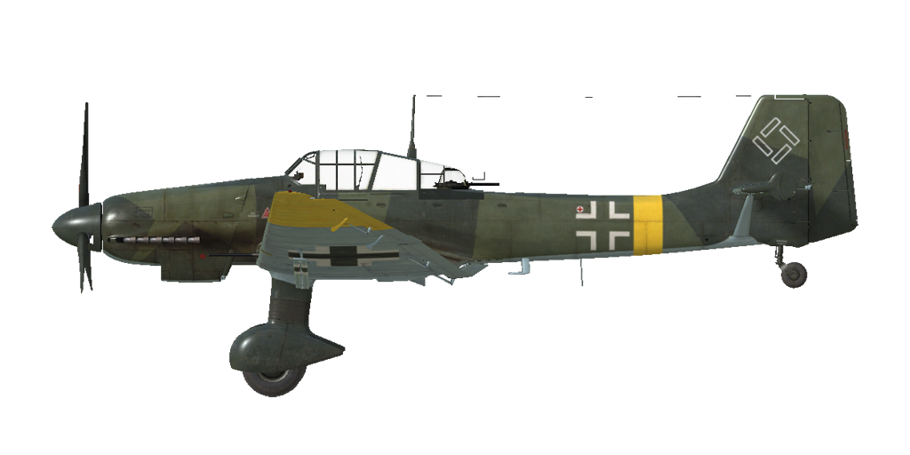

# Ju 87 D-5  
  
  
  
## Description  
  
Vitesse de décrochage indiquée en configuration de vol : 137..176 km/h  
Vitesse de décrochage indiquée en configuration de décollage/atterrissage : 123..155 km/h  
  
Vitesse limite de piqué : 650 km/h  
Facteur de charge maximum : 9 g  
Angle d\attaque de décrochage en configuration de vol : 19,9 °  
Angle d\attaque de décrochage indiquée en configuration d\atterrissage : 18 °  
  
Vitesse sol au niveau de la mer, régime moteur - Montée : 391 km/h  
Vitesse sol maximale à 2000 m, régime moteur - Montée : 418 km/h  
Vitesse sol maximale à 6000 m, régime moteur - Montée : 441 km/h  
  
Plafond opérationnel : 7000 m  
Taux de montée au niveau de la mer : 7,8 m/s  
Taux de montée à 3000 m : 7,2 m/s  
Taux de montée à 6000 m : 5,3 m/s  
  
Virage à 360° au niveau de la mer en : 22,2 s, à 230 km/h vitesse indiquée (IAS).  
Virage à 360° à 3000 m : 31,3 s, à 230 km/h vitesse indiquée (IAS).  
  
Endurance à 3000 m : 3,4 h, à 300 km/h vitesse indiquée (IAS).  
  
Vitesse de décollage : 140..170 km/h  
Vitesse d\approche : 180..195 km/h  
Vitesse d\atterrissage : 125..145 km/h  
Angle d\atterrissage : 11 °  
  
Note 1 : les données sont indiquées à l\atmosphère standard international (ISA).  
Note 2 : les performances d\endurance sont données pour plusieurs masses possibles.  
Note 3 : la vitesse maximale, le taux de montée et le temps de virage sont donnés pour une masse standard.  
Note 4 : le taux de montée est à régime de montée, le temps de virage est à régime décollage.  
  
Moteur :  
Modèle : Jumo-211J  
Puissance maximale au régime de décollage au niveau de la mer : 1420 cv  
Puissance maximale au régime de montée au niveau de la mer : 1190 cv  
Puissance maximale au régime de montée à 1500 m : 1260 cv  
Puissance maximale au régime de montée à 4900 m : 1180 cv  
  
Performance du moteur :  
Continu (durée illimitée) : 2250 tr/min, 1,15 ata  
Montée (jusqu\à 30 minutes) : 2400 tr/min, 1,25 ata  
Décollage (jusqu\à 1 minute) : 2600 tr/min, 1,42 ata  
  
Modèle : Jumo-211P  
Puissance maximale au régime de décollage au niveau de la mer : 1500 cv  
Puissance maximale au régime de montée au niveau de la mer : 1190 cv  
Puissance maximale au régime de montée à 1500 m : 1260 cv  
Puissance maximale au régime de montée à 4900 m : 1180 cv  
  
Performance du moteur :  
Continu (durée illimitée) : 2250 tr/min, 1,15 ata  
Montée (jusqu\à 30 minutes) : 2500 tr/min, 1,32 ata  
Décollage (jusqu\à 1 minute) : 2700 tr/min, 1,45 ata  
  
Température de fonctionnement d\eau en sortie du moteur : 80 °C  
Température maximale d\eau en sortie du moteur : 110 °C  
Température de fonctionnement d\huile en sortie du moteur : 90 °C  
Température maximale d\huile en sortie du moteur : 105 °C  
  
Altitude de changement d\étage du compresseur : automatique   
  
Masse à vide : 4105 kg  
Masse minimale (sans munitions, 10% de carburant) : 4425 kg  
Masse standard : 5010 kg  
Masse maximale au décollage : 6684 kg  
Masse de carburant : 626 kg / 840 l  
Charge utile : 2579 kg  
  
Armement offensif :  
2 canons MG 151/20 de 20 mm, 1000 coups, 700 coups par minute, dans l\aile  
12 mitrailleuses MG 81 de 7,92 mm, 250 coups, 1600 coups par minute, dans l\aile (modification)  
2 canons BK 3.7 de 37 mm, 12 coups, 160 coups par minute, dans l\aile (modification)  
  
Armement défensif :  
Dorsal : 2 mitrailleuses MG 81 de 7,92 mm, 1400 coups, 1600 coups par minute  
  
Bombes :  
Jusqu\à 8 bombes à fragmentation SD 70 de 66 kg  
Jusqu\à 3 bombes d\emploi général SC 250 de 249 kg   
Jusqu\à 3 bombes d\emploi général SC 500 de 500 kg  
1 bombe d\emploi général SC 1000 de 1090 kg  
1 bombe d\emploi général SC 1800 de 1780 kg  
  
Longueur : 11 m  
Envergure : 13,8 m  
Surface alaire : 31,9 m²  
  
Premier engagement : été 1942  
  
Caractéristiques  
- Chaque moteur dispose d\un compresseur mécanique à deux étages et d\un système de commutation automatique qui modifie les rapports en fonction de l\altitude et du nombre de tours/moteur. Il peut également être manuellement réglé sur le premier rapport.  
- La commande de mélange est automatique.  
- Il y a un régulateur de tours moteur, les RPM sont ainsi maintenus à la bonne valeur en fonction de la position du levier du régulateur. Le régulateur contrôle automatiquement le pas d\hélice afin de maintenir les RPM demandés.  
- Les volets de radiateurs d\eau et d\huile sont commandés manuellement.  
- L\avion n\a q\un trim de tangage et de lacet.  
- L\avion a des aérofreins de type clôture qui sont situés sous l\aile, et utilisés pour ralentir la descente lors d\un bombardement en piqué.  
- L\avion a des volets d\atterrissage hydrauliques avec trois positions fixes: rétracté, décollage (25 °) et atterrissage (40 °). Les voyants de volets sont situés sur le panneau gauche près de la manette des gaz.  
- L\avion est également équipé d\ailerons différentiels qui sont abaissés en synchronisation avec les volets.  
- L\avion possède un stabilisateur horizontal commandé automatiquement. Un système de commande automatique ajuste l\angle du stabilisateur en fonction de l\angle d\ouverture des volets d\atterrissage. Les témoins lumineux de commande du stabilisateur sont situés à proximité de la manette des gaz.  
- L\avion est muni d\une roulette de queue verouillable manuelement. La roulette doit être verrouillée en roulant droit sur une longue distance, avant le décollage et l\atterrissage.  
- L\avion a des commandes de frein hydrauliques à gauche et à droite qui sont indépendantes. Pour freiner, poussez la partie supérieure de la pédale de direction.  
- L\avion a une jauge de carburant qui montre le carburant restant dans les réservoirs de carburant gauche et droit en fonction de la position du commutateur. In game the fuel indicator switch changes by pressing (RShift+I). De plus, l\avion dispose de voyants lumineux lorsque les réservoirs intérieurs sont pleins, et d\un témoin d\avertissement d\un niveau de carburant bas (160 litres) pour chaque réservoir.  
- Il est impossible d\ouvrir ou de fermer la verrière à grande vitesse en raison d\un fort flux d\air Quand la verrière est ouverte, il est impossible d\utiliser la mitrailleuse arrière, car elle est relié à la verrière La verrière a un système d\éjection d\urgence dans le cas où vous devriez évacuer l\avion en plain vol.  
- L\avion est équipé d\un sélecteur de mode largage, qui permet au pilote de choisir quel ratelier il va utiliser (central, aile droite ou gauche) et le mode de largage (unitaire ou toutes les bombes du ratelier).  
- Le viseur a un filtre solaire coulissant.  
- The aircraft is equipped with dive system. When the dive system is engaged, the plane enters a dive when the air brakes are extended and will recover from the dive either by pressing the bomb drop button or when the air brakes are retracted. The dive system controls are separate: the trimmer tab on the right elevator is controlled by the dive system while the pilot controls the trimmer tab on the left elevator. Therefore the pilot input and dive system input of the trimmers are independent, and when the dive system is in operation, there is no indication of a trimmer position change in the technochat.  
- The aircraft has dive bombsight Stuvi 5B. Pilot should set target height above sea level (RShift + Period/Semicolon) and wind speed (RAlt + Period/Semicolon) before initiating the dive.  
- The aircraft can be equipped with a Landing gear jettison, which is performed using the key combination (LShift+D).  
  
Basic data and recommended positions of the aircraft controls:  
1. Starting the engine:  
	- recommended position of the mixture control lever: auto mixture control  
	- recommended position of the radiators control handle: close  
	- recommended position of the prop pitch control handle: light  
	- recommended position of the throttle lever: 0%  
	- before taxiing, you must unlock the tailwheel  
  
2. Recommended mixture control lever positions for various flight modes: auto mixture control  
  
3.1 Recommended positions of the oil radiator control handle for various flight modes:  
	- takeoff: open 50%  
	- climb: open 100%  
	- cruise flight: open 40% (in winter conditions - open 20%)  
	- combat: open 50%  
  
3.2 Recommended positions of the water radiator control handle for various flight modes:  
	- takeoff: open 50%  
	- climb: open 100%  
	- cruise flight: open 40% (in winter conditions - close if necessary)  
	- combat: open 50%  
  
4. Approximate fuel consumption at 2000 m altitude:  
	- Cruise engine mode: 3.7 l/min  
	- Combat engine mode: 6.8 l/min  
  
## Modifications  
  
### Blindage additionnel  
  
Protection supplémentaires pour le pilote: plaques blindées de chaque côté de la verrière  
Masse supplémentaire : 60 kg  
Perte estimée de vitesse : 0 km/h  
  
  
### 2 x 3.7cm BK de 37 mm  
  
2 nacelles avec canons automatiques 3.7cm BK de 37 mm et 12 obus chaque  
Masse supplémentaire : 793 kg  
Masse des munitions : 31 kg  
Masse des canons : 840 kg  
Perte estimée de vitesse : 33 km/h  
  
### Exhaust flame suppressors  
  
Installation of engine exhaust flame suppressors  
Additional mass: 20 kg  
Estimated speed loss: 0 km/h  
  
### Landing gear jettison  
  
Landing gear jettison by detonating a pyropatron to perform an emergency belly landing on unfavorable terrain.  
Estimated weight loss: 212 kg  
  
### Jumo 211P Engine  
  
Jumo 211P engine has increased boost pressure in takeoff and climb modes compared to the Jumo 211J engine.  
The increase in engine power compared to the Jumo 211J is approximately 80 hp.  
  
  
### Bombe lourde SC 1800  
  
Bombe d’emploi général SC 1800 de 1780 kg  
Masse supplémentaire : 1780 kg  
Masse des munitions : 1780 kg  
Perte estimée de vitesse avant le largage : 28 km/h  
Perte estimée de vitesse après le largage : 0 km/h  
  
### Stuvi 5B Gunsight  
  
Stuvi 5B Gunsight  
Additional mass: 13 kg  
Estimated speed loss: 0 km/h  
  
  
### Nacelles mitrailleuses WB 81B  
  
2 nacelles avec 3 doubles mitrailleuses MG-81Z de 7,92 mm et 1500 cartouches chaque  
Masse supplémentaire : 369 kg  
Masse des munitions : 89 kg  
Masse des mitrailleuses : 280 kg  
Perte estimée de vitesse : 31 km/h  
