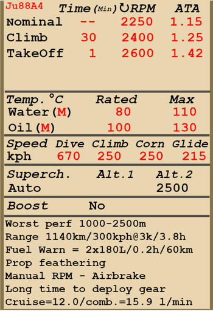

# Ju 88 A-4  

<table><tbody><tr><td style="text-align: center"></td><td style="text-align: center"></td></tr></tbody></table>  

Vitesse de décrochage indiquée en configuration de vol : 188..205 km/h  
Vitesse de décrochage indiquée en configuration de décollage/atterrissage : 158..185 km/h  
Vitesse limite de piqué : 670 km/h  
Facteur de charge maximum : 8,0 g  
Angle d\attaque de décrochage en configuration de vol : 21,0 °  
Angle d\attaque de décrochage indiquée en configuration d\atterrissage : 16,6 °  
  
Vitesse sol au niveau de la mer, régime moteur - Montée : 424 km/h  
Vitesse sol maximale à 2000 m, régime moteur - Montée : 462 km/h  
Vitesse sol maximale à 5000 m, régime moteur - Montée : 486 km/h  
  
Plafond opérationnel : 7500 m  
Taux de montée au niveau de la mer : 7,0 m/s  
Taux de montée à 3000 m : 5,1 m/s  
Taux de montée à 6000 m : 3,4 m/s  
  
Virage à 360° au niveau de la mer en : 33,0 s, à 250 km/h vitesse indiquée (IAS).  
Virage à 360° à 3000 m : 50,5 s, à 250 km/h vitesse indiquée (IAS).  
  
Endurance à 3000 m : 3,8 h, à 300 km/h vitesse indiquée (IAS).  
  
Vitesse de décollage : 170..210 km/h  
Vitesse d\approche : 210..220 km/h  
Vitesse d\atterrissage : 150..160 km/h  
Angle d\atterrissage : 9 °  
  
Note 1 : les données sont indiquées à l\atmosphère standard international (ISA).  
Note 2 : les performances d\endurance sont données pour plusieurs masses possibles.  
Note 3 : la vitesse maximale, le taux de montée et le temps de virage sont donnés pour une masse standard.  
Note 4 : le taux de montée est à régime de montée, le temps de virage est à régime décollage.  
  
Moteur :  
Modèle : Jumo-211J  
Puissance maximale au régime de décollage au niveau de la mer : 1420 cv  
Puissance maximale au régime de montée au niveau de la mer : 1190 cv  
Puissance maximale au régime de montée à 1500 m : 1260 cv  
Puissance maximale au régime de montée à 4900 m : 1180 cv  
  
Performance du moteur :  
Continu (durée illimitée) : 2250 tr/min, 1,15 ata  
Montée (jusqu\à 30 minutes) : 2400 tr/min, 1,25 ata  
Décollage (jusqu\à 1 minute) : 2600 tr/min, 1,42 ata  
  
Température de fonctionnement d\eau en sortie du moteur : 80 °C  
Température maximale d\eau en sortie du moteur : 110 °C  
Température de fonctionnement d\huile en sortie du moteur : 100 °C  
Température maximale d\huile en sortie du moteur : 130 °C  
  
Altitude de changement d\étage du compresseur : automatique   
  
Masse à vide : 8619 kg  
Masse minimale (sans munitions, 10% de carburant) : 9458 kg  
Masse standard : 12110 kg  
Masse maximale au décollage : 13655 kg  
Masse de carburant : 1277 kg / 1680 l  
Charge utile : 5036 kg  
  
Armement défensif :  
Nez : mitrailleuse MG 81 de 7,92 mm, 750 coups, 1600 coups par minute  
Dorsal : mitrailleuse MG 81 de 7,92 mm, 1000 coups, 1600 coups par minute  
Ventral : 2 mitrailleuses MG 81 de 7,92 mm, 950 coups, 1600 coups par minute  
  
Bombes :  
Jusqu\à 44 bombes d\emploi général SC 50 de 55 kg  
Jusqu\à 6 bombes d\emploi général SC 250 de 249 kg  
Jusqu\à 4 bombes d\emploi général SC 500 de 500 kg  
Jusqu\à 2 bombes d\emploi général SC 1000 de 1090 kg  
1 bombe d\emploi général SC 1800 de 1780 kg  
  
Longueur : 14,3 m  
Envergure : 20,02 m  
Surface alaire : 52,7 m²  
  
Premier engagement : juin 1941  
  
Caractéristiques  
- Chaque moteur dispose d\un compresseur mécanique à deux étages et d\un système de commutation automatique qui modifie les rapports en fonction de l\altitude et du nombre de tours/moteur. Il peut également être manuellement réglé sur le premier rapport.  
- La commande de mélange est automatique.  
- Il y a un régulateur de tours moteur, les RPM sont ainsi maintenus à la bonne valeur en fonction de la position du levier du régulateur. Le régulateur contrôle automatiquement le pas d\hélice afin de maintenir les RPM demandés.  
- Les hélices ont un système de mise en drapeau qui doit être activé en cas de dommages au moteur pour réduire la traînée de l\hélice en rotation.  
- Les volets de radiateurs d\eau et d\huile sont couplés aux volets de sortie du capot moteur et sont actionnés manuellement. Par temps froid, le personnel au sol peut installer des volets fixes supplémentaires sur la prise d\air des radiateurs d\huile pour éviter le gel de l\huile.  
- L\avion a un trim pour toutes les commandes de vol: le tangage, le roulis et le lacet.  
- L\avion a des aérofreins de type clôture qui sont situés sous l\aile, et utilisés pour ralentir la descente lors d\un bombardement en piqué.  
- L\avion a des volets d\atterrissage hydrauliques avec trois positions fixes: rétracté, décollage (25 °) et atterrissage (50 °). Les voyants de volets sont situés sur le panneau gauche.  
- L\avion possède un stabilisateur horizontal commandé automatiquement. Un système de commande automatique ajuste l\angle du stabilisateur en fonction de l\angle d\ouverture des volets d\atterrissage. Les témoins lumineux de la commande du stabilisateur sont situés à proximité des indicateurs lumineux des volets.  
- L\avion est également équipé d\ailerons différentiels qui sont abaissés en synchronisation avec les volets.  
- Sortir le train d\atterrissage prend du temps, c\est pour cela qu\il faut sortir le train bien avant l\approche finale.  
- La roulette de queue de l\avion tourne librement et n\est pas verouillable. Pour cette raison, il est nécessaire d\utiliser le palonnier avec confiance et précision pendant le décollage et l\atterrissage.  
- L\avion a des commandes de frein hydrauliques à gauche et à droite qui sont indépendantes. Pour freiner, poussez la partie supérieure de la pédale de direction.  
- L\avion a des jauges de carburant dédiées pour les groupes de réservoirs de carburant gauche et droit, et il y a un commutateur qui permet de sélectionner le groupe de réservoirs de carburant interne et externe. En jeu, l\indicateur de carburant change en appuyant sur (RShift + I). De plus, l\avion dispose d\un témoin d\avertissement de niveau bas de carburant (180 litres) pour les réservoirs internes.  
- L\ est équipé d\un contrôleur de salve automatique pour les bombes, il vous permet de sélectionner le ratelier à bombe à utiliser (interne ou externe) et de choisir entre différentes quantités de salve. Il y a aussi un contrôleur pour un retard de largage entre chaque bombe dans la salve.  
- The aircraft is equipped with dive system. When the dive system is engaged, the plane enters a dive when the air brakes are extended or when the dive button (LCtrl + D by default) is pressed. The plane will recover from the dive either by pressing the bomb drop button or by pressing the dive button (LCtrl + D by default). The dive system will return to the neutral position of the elevator trim, while the full range of trimmer travel from the pilot’s input is preserved. Therefore the pilot input and dive system input of the trimmers are independent, and when the dive system is in operation, there is no indication of a trimmer position change in the technochat. Also, the elevator trim is automatically shifted when the stabilizer is moved to the landing position (when flaps are released to the landing position). This also shifts the trim back to the neutral position.  
  
Basic data and recommended positions of the aircraft controls:  
1. Starting the engine:  
	- recommended position of the mixture control lever: auto mixture control  
	- recommended position of the cowl flap control handle: close  
	- recommended position of the prop pitch control handle: heavy  
	- recommended position of the throttle lever: 10%  
  
2. Recommended mixture control lever positions for various flight modes: auto mixture control  
  
3. Recommended positions of the outlet cowl flap control handle for various flight modes:  
	- takeoff: open 100%  
	- climb: open 100%  
	- cruise flight: open 20% (in winter conditions - close if necessary)  
	- combat: open 50% (in winter conditions - close if necessary)  
  
4. Approximate fuel consumption at 2000 m altitude:  
	- Cruise engine mode: 12.0 l/min  
	- Combat engine mode: 15.9 l/min  

## Modifications  

### 2 bombes lourde SC 1000  

2 bombes d’emploi général SC 1000 de 1090 kg  
Masse supplémentaire : 2180 kg  
Masse des munitions : 2180 kg  
Perte estimée de vitesse avant le largage : 26 km/h  
Perte estimée de vitesse après le largage : 0 km/h  
  

### Bombe lourde SC 1800   

Bombe d’emploi général SC 1800 de 1780 kg  
Masse supplémentaire : 1780 kg  
Masse des munitions : 1780 kg  
Perte estimée de vitesse avant le largage : 27 km/h  
Perte estimée de vitesse après le largage : 0 km/h  
  

### 6 bombes SC 250  

6 bombes d’emploi général SC 250 de 249 kg (+2 une aile)  
Masse supplémentaire : 1544 kg  
Masse des munitions : 1494 kg  
Masse des pylones : 50 kg  
Perte estimée de vitesse avant le largage : 42 km/h  
Perte estimée de vitesse après le largage : 5 km/h  
  

### 4 bombes SC 500  

4 bombes d’emploi général SC 500 de 500 kg  
Masse supplémentaire : 2000 kg  
Masse des munitions : 2000 kg  
Perte estimée de vitesse avant le largage : 35 km/h  
Perte estimée de vitesse après le largage : 0 km/h  
  

### 44 bombes SC 50  

44 bombes d’emploi général SC 50 de 55 kg  
Masse supplémentaire : 2640 kg  
Masse des munitions : 2420 kg  
Masse des pylones : 220 kg  
Perte estimée de vitesse avant le largage : 84 km/h  
Perte estimée de vitesse après le largage : 47 km/h  
