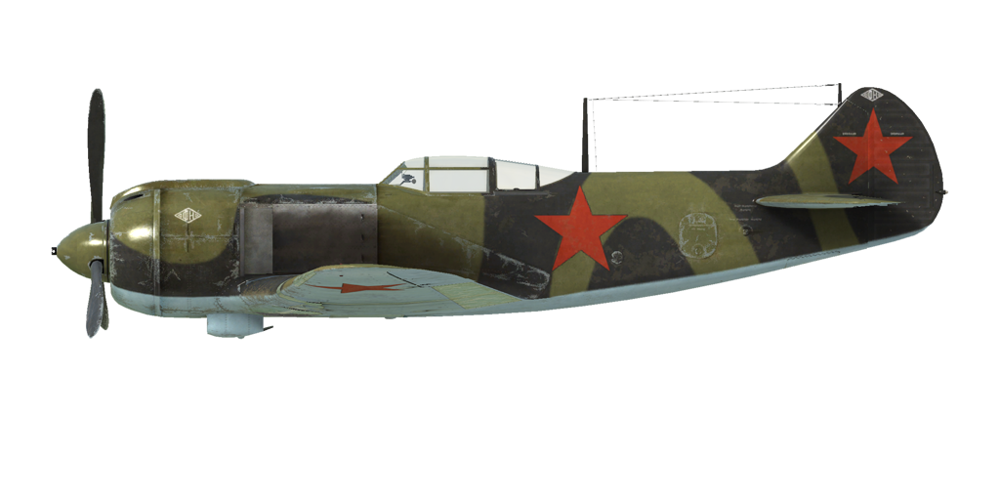

# La-5FN ser.2  

<table><tbody><tr><td style="text-align: center"></td><td style="text-align: center"></td></tr></tbody></table>  

飞行构型的失速指示空速：168~185 km/h  
起降构型的失速指示空速：147~159 km/h  
俯冲极速：720 km/h  
最大过载：10 G  
飞行构型失速迎角：22.2 °  
着陆构型失速迎角：15.0 °  
  
最大真空速，高度海平面，发动机模式——标称：552 km/h  
最大真空速，高度海平面，发动机模式——加力：583 km/h  
最大真空速，高度2500m，发动机模式——标称：605 km/h  
最大真空速，高度6000m，发动机模式——标称：646 km/h  
  
实用升限：10500 m  
海平面爬升率：20 m/s  
3000m时爬升率：16.7 m/s  
6000m时爬升率：12.5 m/s  
  
海平面最大性能盘旋时间：21.0 s，指示空速 320 km/h。  
3000m时最大性能盘旋时间：28.0 s，指示空速 340 km/h。  
  
3000m（9843 feet）时续航时间：2.0h，指示空速 350 km/h。  
  
起飞速度：175~195 km/h  
进近速度：200~210 km/h  
着陆速度：150~160 km/h  
着陆迎角：13 °  
  
注1：所提供的数据适用于国际标准大气（ISA）。  
注2：飞行性能范围基于可能的飞机质量范围。  
注3：极速、爬升率和盘旋时间基于标准飞机质量。  
注4：爬升率和盘旋时间基于加力动力。  
  
发动机：  
型号：M-82FN  
海平面加力模式下的最大功率：1850 HP  
海平面标称动力模式下的最大功率：1560 HP  
标称模式下的最大功率，高度1550m：1630 HP  
标称模式下的最大功率，高度4800m：1460 HP  
  
发动机模式：  
标称（无时间限制）：2400 RPM，1000 mm Hg  
加力动力（不超过10min）：2500 RPM，1180 mm Hg  
  
发动机滑油进油口额定油温：65~75 °C  
发动机滑油进油口最高油温：85 °C  
气缸头额定温度：180~215 °C  
气缸头最高温度：250 °C  
  
机械增压器换挡高度：3500 m  
  
空重：2655 kg  
最小重量（无弹药、10%燃油）：2929 kg  
标准重量：3305 kg  
最大起飞重量：3544 kg  
燃油载荷：334 kg/464 L  
有效载荷：896 kg  
  
前射武器：  
2 x 20mm机炮"施瓦克"，备弹每门170发，射速800发/分  
  
炸弹：  
2 x 50kg 通用炸弹"FAB-50sv"  
2 x 104kg 通用炸弹"FAB-100M"  
  
长度：8.672 m  
翼展：9.8 m  
机翼面积：17.51 m²  
  
首次投入战斗：1943年6月  
  
操作特性：  
—该发动机具有加力模式。启用加力需增大进气压力到1180 mm Hg。加力仅在一级增压上有效。  
—发动机为二级机械增压，需3500m高度时手动切换。  
—发动机转速有自动调节器，其根据调节器控制杆位置保持对应的需用转速。调节器自动控制螺旋桨桨距来保持需用转速。  
—滑油散热器、风冷散热器进气口和出气口为手动控制。  
—散热器进气口应该时刻保持开放除非发动机有可能发生过冷停车，比如在收节流阀到慢车俯冲时，散热器进气口才应关闭。  
—飞机装备有升降舵和方向舵配平。  
—飞机有自动缝翼。当攻角持续增大时会自动展开，使失速前的操纵更柔和。  
—着陆襟翼由液压机构控制，可展开至0-60°之间的任意角度。  
—该机没有配备尾轮锁。因此在起飞和着陆时需注意操作方向舵控制偏航。  
—飞机有共用一个控制杆的差动气压机轮刹车。捏住刹车踩舵，反向一侧的机轮刹车会逐渐释放，导致飞机转向踩舵一侧。  
—飞机有油量表显示剩余的总油量。  
—座舱盖无法在高速时开闭。座舱盖只能应急抛弃，所以跳伞之前需先减速。  
—炸弹挂架的控制系统只允许单颗投放。  
  
基本飞行参数和推荐:  
1. 发动机启机:  
	- 推荐油气混合比: 无混合比控制  
	- 推荐散热器出风口龙鳞片位置: 开启  
	- 推荐散热器位置: 关闭  
	- 推荐发动机转速: 100%  
	- 推荐节流阀位置: 0%  
  
2. 各种工况下的油气混合比推荐位置: 无混合比控制  
  
3.1 各种工况下的散热器出风口龙鳞片推荐位置:  
	- 起飞: 开启  
	- 爬升: 开启  
	- 巡航: 开启(冬季时如有必要可调整至百分之50避免发动机过冷)  
	- 战斗: 开启  
  
3.2 各种工况下的散热器出风口龙鳞片推荐位置:  
	- 起飞: 开启 100%  
	- 爬升: 开启 100%  
	- 巡航: 开启 20%(冬季时如有必要可关闭)  
	- 战斗: 开启 60%  
  
3.3 各种工况下的滑油散热器推荐位置:  
	- 起飞: 开启 50%  
	- 爬升: 开启 100%  
	- 巡航: 开启 20%(冬季时如有必要可关闭)  
	- 战斗: 开启 50%  
4.  海拔2000米飞行时的大致油耗:  
	- 发动机巡航模式: 3.6 升/min  
	- 发动机战斗模式: 12.3 升/min  

## 修改  
### 特殊枪炮弹药装载  

装载种类：仅穿甲（AP）或高爆（HE）弹药  

### 2 x FAB-100M炸弹  

2 x 104kg 通用炸弹FAB-100M  
增加质量：228 kg  
弹药质量：208 kg  
挂架质量：20 kg  
投弹前预期速度损失：27 km/h  
投弹后预期速度损失：12 km/h  

### 2 x FAB-50sv炸弹  

2 x 50kg 通用炸弹FAB-50sv  
增加质量：120 kg  
弹药质量：100 kg  
挂架质量：20 kg  
投弹前预期速度损失：20 km/h  
投弹后预期速度损失：12 km/h  

### 着陆灯  

夜间飞行用的着陆灯  
增加质量：2 kg  
预期速度损失：0 km/h  

### 后视镜  

后视镜  
增加质量：1 kg  
预期速度损失：0 km/h  

### RPK-10 无线电归航指示仪  

无线电归航指示仪  
增加质量：10 kg  
预期速度损失：0 km/h  
