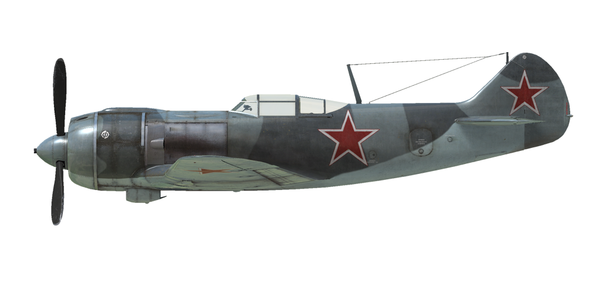

# La-5F ser.38  

| Image | Notes  
|:---|:---  
|  |   

## Descripción  

Velocidad indicada de pérdida en configuración de vuelo: 165..183 km/h  
Velocidad indicada de pérdida en configuración de despegue/aterrizaje: 147..162 km/h  
Velocidad de picado límite: 720 km/h  
Carga de rotura máxima (en fuerzas <i>g</i>): 10 <i>g</i>  
Ángulo de ataque crítico en configuración de vuelo: 22,7°  
Ángulo de ataque crítico en configuración de aterrizaje: 15,1°  
  
Velocidad respecto al suelo al nivel del mar, modo motor - Continuo: 552 km/h  
Velocidad máxima respecto al suelo a 3000 m, modo motor - Continuo: 580 km/h  
Velocidad máxima respecto al suelo a 6000 m, modo motor - Continuo: 597 km/h  
  
Techo de servicio: 10000 m  
Tasa de ascenso al nivel del mar: 19,5 m/s  
Tasa de ascenso a 3000 m: 14,4 m/s  
Tasa de ascenso a 6000 m: 9,5 m/s  
  
Viraje de máximo rendimiento al nivel del mar: 20,8 s, a 300 km/h velocidad indicada (IAS).  
Viraje de máximo rendimiento a 3000 m: 29,0 s, a 320 km/h velocidad indicada (IAS).  
  
Autonomía de vuelo a 3000 m: 1,7 h, a 350 km/h velocidad indicada (IAS).  
  
Velocidad de despegue: 170..200 km/h  
Velocidad senda de planeo: 200..210 km/h  
Velocidad de aterrizaje: 150..160 km/h  
Ángulo de aterrizaje: 13°  
  
Nota 1: los datos están basados en la atmósfera estándar internacional (ISA).  
Nota 2: diferentes rendimientos de vuelo dados para los diferentes pesos posibles del avión.  
Nota 3: velocidades máximas, tasas de ascenso y tiempos de giro dados para el peso estándar del avión.  
Nota 4: tasas de ascenso y tiempo de giro dados para la potencia en Continuo.  
  
Motor:  
Modelo: M-82F  
Potencia máxima en modo Continuo al nivel del mar: 1700 CV  
Potencia máxima en modo Continuo a 2100 m: 1550 CV  
Potencia máxima en modo Continuo a 5400 m: 1335 CV  
  
Modos de funcionamiento motor:  
Continuo (sin límite de tiempo): 2400 rpm, 1140 mmHg  
  
Temperatura nominal del aceite a la salida del motor: 55..90 °C  
Temperatura máxima del aceite a la salida del motor: 125 °C  
Temperatura nominal en la culata: 140..210 °C  
Temperatura máxima en la culata: 250 °C  
  
Altitud conexión compresor: 3500 m  
  
Peso en vacío: 2584 kg  
Peso mínimo (sin munición, 10% de combustible): 2844 kg  
Peso estándar: 3220 kg  
Peso máximo al despegue: 3460 kg  
Carga de combustible: 334 kg / 464 l  
Carga útil: 876 kg  
  
Armamento delantero:  
2 cañones de 20 mm «ShVAK», 170 balas, 800 balas por minuto, sincronizados  
  
Bombas:  
2 bombas de propósito general de 50 kg «FAB-50sv»  
2 bombas de propósito general de 104 kg «FAB-100M»  
  
Longitud: 8,672 m  
Envergadura alar: 9,8 m  
Superficie de ala: 17,51 m²  
  
Debut en combate: septiembre de 1943  
  
Características operativas:  
- El controlador de impulso del avión funciona solo como un limitador de sobrealimentación. El regulador limita la presión en el colector a 950 mm Hg y cuando se empuja el pomo de impulso el regulador habilita que la presión pueda llegar hasta los 1140 mm Hg.  
- El motor tiene un compresor mecánico de dos etapas que debe conmutarse a 3500 m de altitud.  
- El control de la mezcla del motor es automático cuando la palanca de mezcla está en la posición más atrasada. Es posible modificar manualmente la mezcla moviendo la palanca hacia delante para reducir el consumo de combustible durante el vuelo.  
- El motor tiene un regulador automático de las rpm que las mantiene al valor correspondiente a la posición de la palanca de control del regulador. Este regulador controla automáticamente el paso de la hélice para mantener las rpm requeridas.  
- Las persianas del radiador de aceite y las de las de entrada y salida del aire se controlan de forma manual.  
- Las persianas de admisión de aire deben estar siempre abiertas. Solo deben cerrarse cuando haya alguna posibilidad de enfriamiento excesivo del motor, por ejemplo, en un picado con el motor al ralentí.  
- El avión cuenta únicamente con compensadores de control en vuelo para el cabeceo y la guiñada.  
- El avión tiene slats automáticos en las alas. Se despliega cuando se incrementa un ángulo de ataque muy elevado, haciendo que la entrada en pérdida sea más suave.  
- Los flaps tienen un accionador hidraúlico y pueden bajarse gradualmente hasta formar un ángulo de 60°.  
- La rueda de cola del avión gira libremente sin posibilidad de bloqueo. Por ello, es necesario manejar los pedales del timón con seguridad y precisión durante el despegue y aterrizaje.  
- El avión posee frenos neumáticos diferenciales en la ruedas compartidos por una palanca de freno. Cuando se tira de la palanca del freno y se pisa un pedal del control del timón el freno opuesto se libera y el avión comienza a girar en un sentido u otro.  
- El avión cuenta con un indicador de combustible que muestra el nivel de combustible remanente.  
- La cubierta de la cabina cuenta con un inmovilizador bastante flojo para asegurar su posición cuando está abierta, por lo que puede llegar a cerrarse por sí sola en un picado muy profundo. Además, es imposible abrir o cierrar la cubierta a altas velocidades debido al intenso flujo de aire. La cubierta no tiene desbloqueo de emergencia, así que para poder saltar es necesario reducir la velocidad.  
- El sistema de control del anclaje de las bombas solo permite el lanzamiento de las dos bombas a la vez.  
  
Datos básicos y configuraciones recomendadas de los controles del avión:  
1. Arranque del motor:  
	- palanca de control de la mezcla: posición más retrasada, 100% (control de mezcla automático)  
	- aletas/persianas del carenado: abiertas  
	- aleta/persiana del radiador de aceite: cerrado  
	- palanca de control rpm de la hélice: 0%  
	- palanca de potencia: 0%  
  
2. Posición de la palanca de control de mezcla según momento de vuelo: 100% (control de mezcla automático)  
  
3.1 Posición de las aletas/persianas admisión del carenado según momento de vuelo:  
	- despegue: abiertas  
	- ascenso: abiertas  
	- crucero: abiertas (en condiciones invernales - situar al 50% si necesario)  
	- combate: abiertas  
  
3.2 Posición de las aletas/persianas salida  
	- ascenso: abiertas 100%  
	- crucero: abiertas 20% (en condiciones invernales - cerrar si necesario)  
	- combate: abiertas 60%  
  
3.3 Posición del radiador de aceite según momento de vuelo:  
	- despegue: abierto 50%  
	- ascenso: abierto 100%  
	- crucero: abierto 20% (en condiciones invernales - cerrar si necesario)  
	- combate: abierto 50%  
  
4. Consumo aproximado de combustible a 2000 m de altitud:  
	- Modo motor - Crucero: 5,0 l/min  

## Modificaciones  
### Munición especial  

Variantes de equipamiento: balas antiblindaje (AP) o altamente explosivas (HE)  

### 2 bombas FAB-100M  

2 bombas de propósito general de 104 kg FAB-100M  
Peso adicional: 228 kg  
Peso de munición: 208 kg  
Peso de los soportes: 20 kg  
Pérdida de velocidad estimada antes de soltar: 27 km/h  
Pérdida de velocidad estimada tras soltar: 12 km/h  

### 2 bombas FAB-50sv  

2 bombas de propósito general de 50 kg FAB-50sv  
Peso adicional: 120 kg  
Peso de munición: 100 kg  
Peso de los soportes: 20 kg  
Pérdida de velocidad estimada antes de soltar: 20 km/h  
Pérdida de velocidad estimada tras soltar: 12 km/h  
  
### Luz de aterrizaje  

Luz de aterrizaje para los vuelos nocturnos  
Peso adicional: 2 kg  
Pérdida de velocidad estimada: 0 km/h  
  
### Espejo  

Espejo para ver qué sucede detrás del avión  
Peso adicional: 1 kg  
Pérdida de velocidad estimada: 0 km/h  
  
### RPK-10  

Radiogoniómetro para navegación con radiobalizas  
Peso adicional: 10 kg  
Pérdida de velocidad estimada: 0 km/h  
