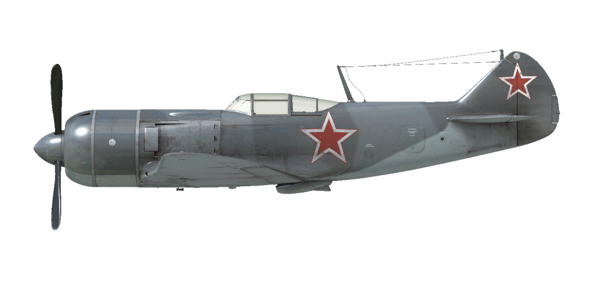
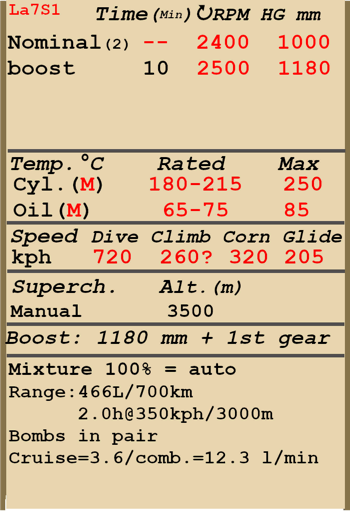

# Ла-7 1 серии  

<table><tbody><tr><td style="text-align: center"></td><td style="text-align: center"></td></tr></tbody></table>  

Приборная скорость сваливания в полётной конфигурации: 168..185 км/ч  
Приборная скорость сваливания в посадочной конфигурации: 147..159 км/ч  
Предельная скорость в пикировании: 720 км/ч  
Разрушающая перегрузка: 10 единиц  
Угол атаки сваливания, в полётной конфигурации: 22,2 °  
Угол атаки сваливания, в посадочной конфигурации: 15,0 °  
  
Максимальная истинная скорость у земли, режим двигателя - форсированный: 603 км/ч  
Максимальная истинная скорость на высоте 2500 м, режим двигателя - номинал: 641 км/ч  
Максимальная истинная скорость на высоте 6000 м, режим двигателя - номинал: 665 км/ч  
  
Практический потолок: 10500 м  
Скороподъёмность на высоте 1000 м: 24 м/с  
  
Время виража предельного по тяге у земли: 21,0 с, на скорости 320 км/ч по прибору  
Время виража предельного по тяге на высоте 3000 м: 28,0 с, на скорости 340 км/ч по прибору  
  
Продолжительность полёта на высоте 3000 м: 2,0 ч, на скорости 350 км/ч по прибору  
  
Скорость взлётная: 175..195 км/ч  
Скорость на глиссаде: 200..210 км/ч  
Скорость посадочная: 150..160 км/ч  
Посадочный угол: 13 °  
  
Примечание 1: данные указаны для условий международной стандартной атмосферы.  
Примечание 2: диапазоны характеристик даны для допустимого диапазона масс самолёта.  
Примечание 3: максимальные скорости, скороподъемности и время виража даны для стандартной массы самолёта.  
Примечание 4: скороподъемность и время виража даны на форсированном режиме работы двигателя.  
  
Двигатель:  
Модель: М-82ФН  
Максимальная мощность на форсированном режиме у земли: 1850 л.с.  
Максимальная мощность на номинальном режиме у земли: 1560 л.с.  
Максимальная мощность на номинальном режиме на высоте 1550 м: 1630 л.с.  
Максимальная мощность на номинальном режиме на высоте 4800 м: 1460 л.с.  
  
Режимы работы двигателя:  
Номинальный (время неограничено): 2400 об/мин, 1000 мм рт.ст.  
Форсированный (до 10 минут): 2500 об/мин, 1180 мм рт.ст.  
  
Температура масла на входе в двигатель номинальная: 65..75 °С  
Температура масла на входе в двигатель предельная: 85 °С  
Температура головок номинальная: 180..215 °С  
Температура головок предельная: 250 °С  
  
Высота переключения нагнетателя: 3500 м  
  
Масса пустого самолёта: 2588 кг  
Минимальная масса (без БК, 10% топлива): 2771 кг  
Стандартная масса: 3233 кг  
Максимальная взлётная масса: 3461 кг  
Максимальный запас топлива: 342 кг / 466 л  
Максимальная полезная нагрузка: 783 кг  
  
Вооружение курсовое:  
2 x 20мм пушка "ШВАК", 170 снарядов, 800 выстр/мин, синхронизированная  
3 x 20мм пушка "Б-20", 130 патронов, 800 выстр/мин, синхронизированная (модификация)  
  
Вооружение бомбовое:  
2 x 50 кг осколочно-фугасные авиабомбы "ФАБ-50св"  
2 x 104 кг осколочно-фугасные авиабомбы "ФАБ-100М"  
  
Длина: 8,640 м  
Размах крыла: 9,8 м  
Площадь крыла: 17,51 кв.м  
  
Начало участия в боевых действиях: май-июнь 1944  
  
Особенности эксплуатации:  
- Двигатель самолёта имеет форсажный режим. Для использования форсажа необходимо увеличить наддув до 1180 мм рт.ст. На 2-й скорости нагнетателя форсажный режим не работает.  
- Регулятор наддува на самолёте работает лишь как ограничитель взлётного наддува, так как на 1-ой скорости нагнетателя автоматически включается рычаг форсажа.  
- Двигатель оборудован двухступенчатым нагнетателем. Ступени нагнетателя следует переключать при пересечении высоты 3500 м.  
- Регулятор постоянных оборотов винта поддерживает заданные рычагом винта обороты мотора за счёт автоматического изменения шага винта.  
- Створки маслорадиатора, а также входные и выходные створки капота для воздушного охлаждения двигателя управляются вручную.  
- Жалюзи (входные створки) капота двигателя должны быть всегда открыты. Закрывать их следует только при опасности переохладить двигатель - например, при снижении с большой высоты на малом газе.  
- Самолёт оснащён триммером руля высоты и руля направления.  
- На самолёте установлены автоматические предкрылки, это позволяет несколько увеличить критический угол атаки и сделать выход на режим сваливания более "мягким".  
- Привод посадочных щитков гидравлический. Щитки можно выпустить на любой угол до 60°.  
- Хвостовое колесо свободно ориентируемо, стопора не имеет. В связи с этим при движении по ВПП с большой скоростью на взлёте или посадке следует уверенно и аккуратно работать педалями, своевременно парируя стремление самолёта к развороту.  
- Тормоза колёс шасси пневматические, дифференциальные: отклонение педалей при зажатом тормозе приводит к растормаживанию колеса, противоположного нажатой педали.  
- Самолёт оснащён топливомером, показывающим общий остаток топлива.  
- На высоких скоростях полёта фонарь невозможно сдвинуть из-за скоростного напора воздуха. Самолёт не оборудован системой аварийного сброса фонаря, поэтому для покидания лётчиком самолёта в полёте необходимо предварительно сбросить скорость.  
- Система управления крыльевыми бомбодержателями позволяет сбрасывать бомбы только по две.  
  
Основные данные и рекомендуемые положения органов управления самолётом:  
1. Запуск двигателя:  
	- рекомендуемое положение рукояти управления смесью: управление смесью отсутствует  
	- рекомендуемое положение рукояти управления створками капота: открыто  
	- рекомендуемое положение рукояти управления радиаторами: закрыто  
	- рекомендуемое положения рукояти управления шагом: 100%  
	- рекомендуемое положение рычага управления двигателем: 0%  
  
2. Рекомендуемые положения рукояти смеси при различных режимах полёта: управление смесью отсутствует  
  
3.1 Рекомендуемые положения рукояти управления входными створками капота (жалюзи) при различных режимах полёта:  
	- взлёт: открыто  
	- набор высоты: открыто  
	- крейсерский полёт: открыто  
	- бой: открыто  
  
3.2 Рекомендуемые положения рукояти управления выходными створками капота при различных режимах полёта:  
	- взлёт: открыто 100%  
	- набор высоты: открыто 100%  
	- крейсерский полёт: открыто 20% (зимой закрыть при необходимости)  
	- бой: открыто 60%  
  
3.3 Рекомендуемые положения рукояти управления маслорадиатором при различных режимах полёта:  
	- взлёт: открыто 50%  
	- набор высоты: открыто 100%  
	- крейсерский полёт: открыто 20% (зимой закрыть при необходимости)  
	- бой: открыто 50%  
  
4. Ориентировочный расход топлива на различных режимах работы на высоте 2000 м:  
	- крейсерский режим работы двигателя: 3,6 л/мин  
	- боевой режим работы двигателя: 12,3 л/мин  

## Модификации  
### 3х 20мм Б-20  

3 20мм пушки Б-20 с боезапасом по 130 патронов на каждый вместо 2 стандартных пушек 20мм ШВАК.  
Дополнительная масса: 5 кг  
Масса боекомплекта: 87 кг  
Масса орудий: 76,5 кг  

### 2 х ФАБ-100М  

2 x 104 кг осколочно-фугасные авиабомбы ФАБ-100М  
Дополнительная масса: 228 кг  
Масса вооружения: 208 кг  
Масса держателей: 20 кг  
Ориентировочная потеря скорости до сброса: 20 км/ч  
Ориентировочная потеря скорости после сброса: 12 км/ч  

### 2 х ФАБ-50св  

2 x 50 кг осколочно-фугасные авиабомбы ФАБ-50св  
Дополнительная масса: 120 кг  
Масса вооружения: 100 кг  
Масса держателей: 20 кг  
Ориентировочная потеря скорости до сброса: 20 км/ч  
Ориентировочная потеря скорости после сброса: 12 км/ч  
  
### Фара  

Посадочная фара для ночных полётов  
Дополнительная масса: 2 кг  
Ориентировочная потеря скорости: 0 км/ч  
  
### Зеркало  

Зеркало обзора задней полусферы  
Дополнительная масса: 1 кг  
Ориентировочная потеря скорости: 0 км/ч  
  
### Прицел ПКИ  

Коллиматорный прицел истребителя  
Дополнительная масса: 0.5 кг  
Ориентировочная потеря скорости: 0 км/ч  
  
### РПК-10  

Радиополукомпас для навигации по радиомаякам  
Дополнительная масса: 10 кг  
Ориентировочная потеря скорости: 0 км/ч  
