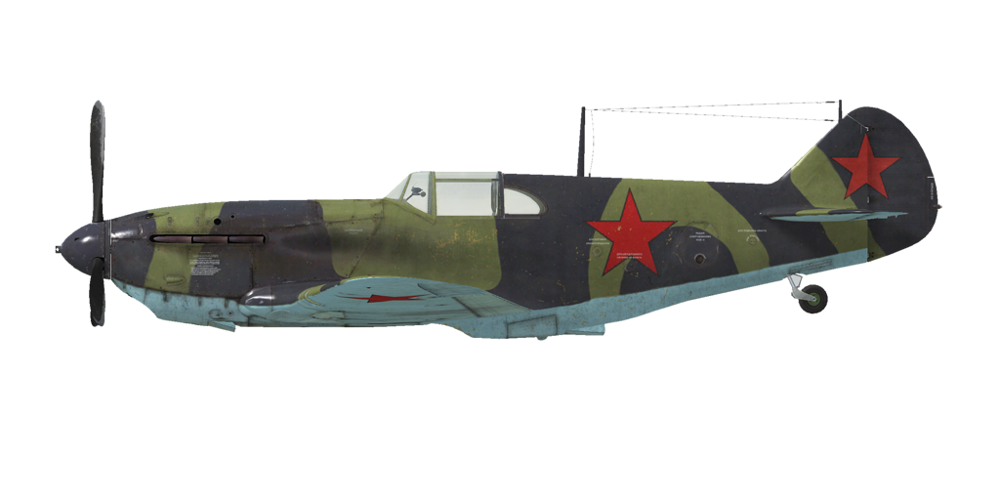

# LaGG-3 ser.29

## Description

Indicated stall speed in flight configuration: 163..189 km/h
Indicated stall speed in takeoff/landing configuration: 138..168 km/h
Dive speed limit: 750 km/h
Maximum load factor: 11 G
Stall angle of attack in flight configuration: 18 °
Stall angle of attack in landing configuration: 15 °

Maximum true air speed at sea level, engine mode - Nominal: 505 km/h
Maximum true air speed at 2000 m, engine mode - Nominal: 548 km/h
Maximum true air speed at 4000 m, engine mode - Nominal: 573 km/h

Service ceiling: 10500 m
Climb rate at sea level: 14.9 m/s
Climb rate at 3000 m: 13.3 m/s
Climb rate at 6000 m: 8 m/s

Maximum performance turn at sea level: 22.2 s, at 280 km/h IAS.
Maximum performance turn at 3000 m: 28.9 s, at 270 km/h IAS.

Flight endurance at 3000 m: 2.2 h, at 350 km/h IAS.

Takeoff speed: 165..200 km/h
Glideslope speed: 200..210 km/h
Landing speed: 140..160 km/h
Landing angle: 12.8 °

Note 1: the data provided is for international standard atmosphere (ISA).
Note 2: flight performance ranges are given for possible aircraft mass ranges.
Note 3: maximum speeds, climb rates and turn times are given for standard aircraft mass.
Note 4: climb rates and turn times are given for Nominal power.

Engine:
Model: M-105PF
Maximum power in Nominal mode at sea level: 1200 HP
Maximum power in Nominal mode at 800 m: 1260 HP
Maximum power in Nominal mode at 2700 m: 1200 HP

Engine modes:
Nominal (unlimited time): 2700 RPM, 1050 mm Hg

Water rated temperature in engine output: 90..100 °C
Water maximum temperature in engine output: 110 °C
Oil rated temperature in engine output: 90..100 °C
Oil maximum temperature in engine output: 115 °C

Supercharger gear shift altitude: 2500 m

Empty weight: 2620 kg
Minimum weight (no ammo, 10%25 fuel): 2773 kg
Standard weight: 3157 kg
Maximum takeoff weight: 3701 kg
Fuel load: 348 kg / 467 l
Useful load: 1081 kg

Forward-firing armament:
20mm gun "SsVAK", 160 rounds, 800 rounds per minute, nose-mounted
12.7mm machine gun "UB", 200 rounds, 1000 rounds per minute, synchronized
23mm gun "VYa-23", 90 rounds, 600 rounds per minute, nose-mounted (modification)
37mm gun "Sh-37", 20 rounds, 185 rounds per minute, nose-mounted (modification)

Bombs:
2 x 50 kg general purpose bombs "FAB-50sv"
2 x 104 kg general purpose bombs "FAB-100M"

Rockets:
6 x 7 kg rockets "ROS-82", HE payload mass 2.52 kg

Length: 8.84 m
Wingspan: 9.8 m
Wing surface: 17.51 m²

Combat debut: May 1942

Operation features:
- Engine has a two-stage mechanical supercharger which must be manually switched at 2500m altitude.
- Engine mixture control is manual; it is necessary to lean the mixture if altitude is more than 3-4 km for optimal engine operation. Also, leaning the mixture allows a reduction in fuel consumption during flight.
- Engine RPM has an automatic governor and it is maintained at the required RPM corresponding to the governor control lever position. The governor automatically controls the propeller pitch to maintain the required RPM.
- Water and oil radiator shutters are controlled manually.
- Airplane has trimmers for all flight-controls: pitch, roll and yaw.
- Landing flaps have a hydraulic actuator and they can be extended to any angle up to 60°.
- Airplane tail wheel rotates freely and does not have a lock. For this reason, it is necessary to confidently and accurately operate the rudder pedals during the takeoff and landing.
- Airplane has differential pneumatic wheel brakes with shared control lever. This means that if the brake lever is held and the rudder pedal the opposite wheel brake is gradually released causing the plane to swing to one side or the other.
- Airplane has a fuel gauge which shows total remaining fuel.
- Cockpit canopy has a weak lock when in the opened position, for this reason the canopy may spontaneously close in a deep dive. It is impossible to open or close the canopy at high speed due to strong airflow. The canopy has no emergency release, so bail out requires the speed drop before it.
- The control system for the bomb rack only allows to drop bombs one by one.
- When rockets are installed there is a salvo controller, it has three launch modes: single fire, fire two in a salvo or fire four in a salvo.

## Modifications

### 2 x FAB-100M bombs

2 x 104 kg General Purpose Bombs FAB-100M
Additional mass: 228 kg
Ammunition mass: 208 kg
Racks mass: 20 kg
Estimated speed loss before drop: 27 km/h
Estimated speed loss after drop: 12 km/h

### 2 x FAB-50sv bombs

2 x 50 kg General Purpose Bombs FAB-50sv
Additional mass: 120 kg
Ammunition mass: 100 kg
Racks mass: 20 kg
Estimated speed loss before drop: 20 km/h
Estimated speed loss after drop: 12 km/h

### 6 x ROS-82 rockets

6 x 82mm High Explosive unguided rockets ROS-82
Additional mass: 60 kg
Ammunition mass: 42 kg
Racks mass: 18 kg
Estimated speed loss before launch: 23 km/h
Estimated speed loss after launch: 17 km/h

### 37mm Sh-37 gun

Sh-37 37mm motor-gun with 20 rounds
Additional mass: 117 kg
Ammunition mass: 36 kg
Gun mass: 169 kg
Estimated speed loss: 2 km/h

### 23mm VYa-23 gun

VYa-23 23mm motor-gun with 90 rounds
Additional mass: 35 kg
Ammunition mass: 45 kg
Gun mass: 66 kg
Estimated speed loss: 0 km/h