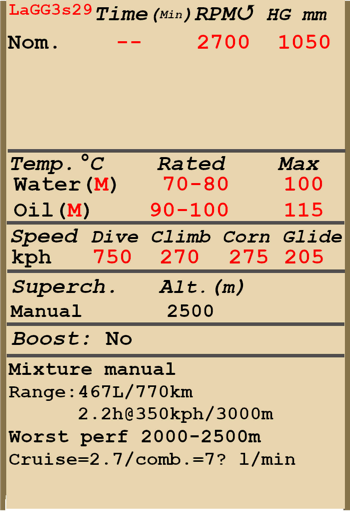
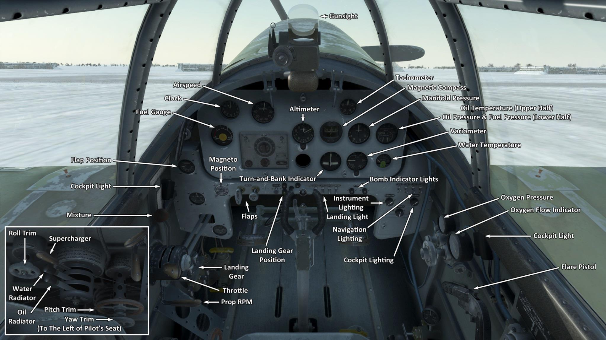

# ЛаГГ-3 29 серии  

<table><tbody><tr><td style="text-align: center"></td><td style="text-align: center"></td></tr><tr><td style="text-align: center" colspan="2"></td></tr></tbody></table>  

## Описание  

Приборная скорость сваливания в полётной конфигурации: 163..189 км/ч  
Приборная скорость сваливания в посадочной конфигурации: 138..168 км/ч  
Предельная скорость в пикировании: 750 км/ч  
Разрушающая перегрузка: 11 единиц  
Угол атаки сваливания, в полётной конфигурации: 18 °  
Угол атаки сваливания, в посадочной конфигурации: 15 °  
  
Максимальная истинная скорость у земли, режим двигателя - номинал: 505 км/ч  
Максимальная истинная скорость на высоте 2000 м, режим двигателя - номинал: 548 км/ч  
Максимальная истинная скорость на высоте 4000 м, режим двигателя - номинал: 573 км/ч  
  
Практический потолок: 10500 м  
Скороподъёмность у земли: 14,9 м/с  
Скороподъёмность на высоте 3000 м: 13,3 м/с  
Скороподъёмность на высоте 6000 м: 8 м/с  
  
Время виража предельного по тяге у земли: 22,2 с, на скорости 280 км/ч по прибору  
Время виража предельного по тяге на высоте 3000 м: 28,9 с, на скорости 270 км/ч по прибору  
  
Продолжительность полёта на высоте 3000 м: 2,2 ч, на скорости 350 км/ч по прибору  
  
Скорость взлётная: 165..200 км/ч  
Скорость на глиссаде: 200..210 км/ч  
Скорость посадочная: 140..160 км/ч  
Посадочный угол: 12,8 °  
  
Примечание 1: данные указаны для условий международной стандартной атмосферы.  
Примечание 2: диапазоны характеристик даны для допустимого диапазона масс самолёта.  
Примечание 3: максимальные скорости, скороподъемности и время виража даны для стандартной массы самолёта.  
Примечание 4: скороподъемность и время виража даны на номинальном режиме работы двигателя.  
  
Двигатель:  
Модель: М-105ПФ  
Максимальная мощность на номинальном режиме у земли: 1200 л.с.  
Максимальная мощность на номинальном режиме на высоте 800 м: 1260 л.с.  
Максимальная мощность на номинальном режиме на высоте 2700 м: 1200 л.с.  
  
Режимы работы двигателя:  
Номинальный (время неограничено): 2700 об/мин, 1050 мм рт.ст.  
  
Температура воды на выходе из двигателя номинальная: 90..100 °С  
Температура воды на выходе из двигателя предельная: 110 °С  
Температура масла на выходе из двигателя номинальная: 90..100 °С  
Температура масла на выходе из двигателя предельная: 115 °С  
  
Высота переключения нагнетателя: 2500 м  
  
Масса пустого самолёта: 2620 кг  
Минимальная масса (без БК, 10% топлива): 2773 кг  
Стандартная масса: 3157 кг  
Максимальная взлётная масса: 3701 кг  
Максимальный запас топлива: 348 кг / 467 л  
Максимальная полезная нагрузка: 1081 кг  
  
Вооружение курсовое:  
20мм пушка "ШВАК", 160 снарядов, 800 выстр/мин, носовая  
12,7мм пулемёт "УБ", 200 патронов, 1000 выстр/мин, синхронизированный  
23мм пушка "ВЯ-23", 90 снарядов, 600 выстр/мин, носовая (модификация)  
37мм пушка "Ш-37", 20 снарядов, 185 выстр/мин, носовая (модификация)  
  
Вооружение бомбовое:  
2 x 50 кг осколочно-фугасные авиабомбы "ФАБ-50св"  
2 x 104 кг осколочно-фугасные авиабомбы "ФАБ-100М"  
  
Вооружение ракетное:  
6 x 7 кг неуправляемых авиационных ракет "РОС-82", масса осколочно-фугасной боевой части 2,52 кг  
  
Длина: 8,84 м  
Размах крыла: 9,8 м  
Площадь крыла: 17,51 кв.м  
  
Начало участия в боевых действиях: май 1942  
  
Особенности эксплуатации:  
- Двигатель оборудован двухступенчатым нагнетателем. Ступени нагнетателя следует переключать при пересечении высоты 2500 м.  
- Высотный корректор топливовоздушной смеси имеет ручное управление. С увеличением высоты полёта более 3-4 км необходимо обеднять смесь для оптимальной работы мотора. Также ручное обеднение смеси позволяет снизить расход топлива на маршруте.  
- Регулятор постоянных оборотов винта поддерживает заданные рычагом винта обороты мотора за счёт автоматического изменения шага винта.  
- Водо- и маслорадиатор имеют ручное управление створками.  
- Самолёт оснащён триммерами во всех трёх каналах управления.  
- Привод посадочных щитков гидравлический. Щитки можно выпустить на любой угол до 60°.  
- Хвостовое колесо свободно ориентируемо, стопора не имеет. В связи с этим при движении по ВПП с большой скоростью на взлёте или посадке следует уверенно и аккуратно работать педалями, своевременно парируя стремление самолёта к развороту.  
- Тормоза колёс шасси пневматические, дифференциальные: отклонение педалей при зажатом тормозе приводит к растормаживанию колеса, противоположного нажатой педали.  
- Самолёт оснащён топливомером, показывающим общий остаток топлива.  
- Фонарь кабины имеет слабый фиксатор открытого положения, поэтому при пикировании с открытым фонарём фонарь может самопроизвольно закрыться. На высоких скоростях полёта фонарь невозможно сдвинуть из-за скоростного напора воздуха. Самолёт не оборудован системой аварийного сброса фонаря, поэтому для покидания лётчиком самолёта в полёте необходимо предварительно сбросить скорость.  
- Система управления крыльевыми бомбодержателями позволяет сбрасывать бомбы только по две.  
- Для стрельбы подвесными ракетами используется электросбрасыватель, который позволяет осуществлять пуск ракет по одной, по две или по четыре в серии.  
  
Основные данные и рекомендуемые положения органов управления самолётом:  
1. Запуск двигателя:  
	- рекомендуемое положение рукояти управления смесью: 100%  
	- рекомендуемое положение рукояти управления маслорадиатором: открыто  
	- рекомендуемое положение рукояти управления водорадиатором: закрыто  
	- рекомендуемое положения рукояти управления шагом: 100%  
	- рекомендуемое положение рычага управления двигателем: 10%  
  
2. Рекомендуемые положения рукояти смеси при различных режимах полёта:  
	- При работе мотора на малом газу у земли ручка смеси должна быть в положении около 50%.  
	- При работе мотора на полном газу у земли ручка смеси должна быть в положении 75-80%.  
	- По мере набора высоты высотный корректор прикрывается. На 8-9км высоты высотный корректор закрывается до 0%.  
  
3.1 Рекомендуемые положения рукояти управления маслорадиатором при различных режимах полёта:  
	- взлёт: открыто 100%  
	- набор высоты: открыто 100%  
	- крейсерский полёт: открыто 40%  
	- бой: открыто 100%  
  
3.2 Рекомендуемые положения рукояти управления водорадиатором при различных режимах полёта:  
	- взлёт: открыто 100%  
	- набор высоты: открыто 100%  
	- крейсерский полёт: открыто 50%  
	- бой: открыто 80%  
  
4. Ориентировочный расход топлива на различных режимах работы на высоте 2000 м:  
	- крейсерский режим работы двигателя: 2,7 л/мин  

## Модификации  
### 2 х ФАБ-100М  

2 x 104 кг осколочно-фугасные авиабомбы ФАБ-100М  
Дополнительная масса: 228 кг  
Масса вооружения: 208 кг  
Масса держателей: 20 кг  
Ориентировочная потеря скорости до сброса: 20 км/ч  
Ориентировочная потеря скорости после сброса: 12 км/ч  

### 2 х ФАБ-50св  

2 x 50 кг осколочно-фугасные авиабомбы ФАБ-50св  
Дополнительная масса: 120 кг  
Масса вооружения: 100 кг  
Масса держателей: 20 кг  
Ориентировочная потеря скорости до сброса: 20 км/ч  
Ориентировочная потеря скорости после сброса: 12 км/ч  

### 6 х РОС-82  

6 x 82 мм реактивных осколочных снарядов РОС-82  
Дополнительная масса: 60 кг  
Масса вооружения: 42 кг  
Масса держателей: 18 кг  
Ориентировочная потеря скорости до пуска: 23 км/ч  
Ориентировочная потеря скорости после пуска: 17 км/ч  

### 37-мм мотор-пушка Ш-37  

37-мм мотор-пушка Ш-37 с боезапасом 20 снарядов  
Дополнительная масса: 117 кг  
Масса боекомплекта: 36 кг  
Масса орудия: 169 кг  
Ориентировочная потеря скорости: 2 км/ч  

### 23-мм мотор-пушка ВЯ-23  

23-мм мотор-пушка ВЯ-23 с боезапасом 90 снарядов  
Дополнительная масса: 35 кг  
Масса боекомплекта: 45 кг  
Масса орудия: 66 кг  
Ориентировочная потеря скорости: 0 км/ч  
