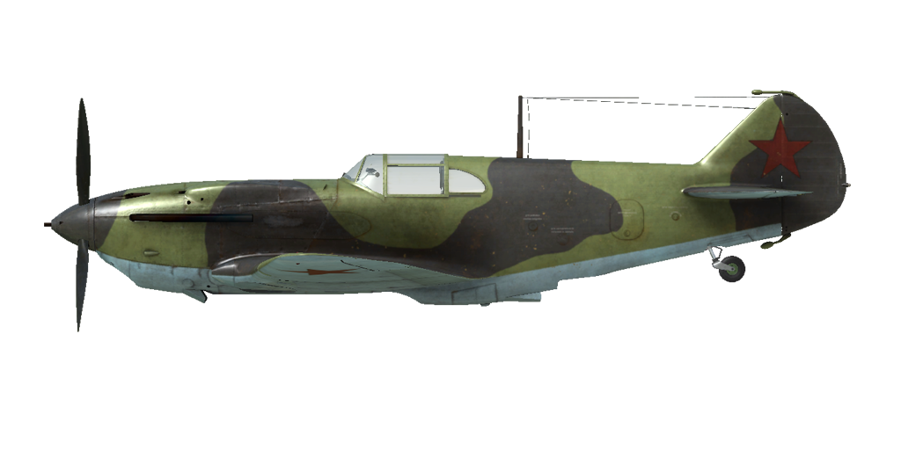

# LaGG-3ser.4  
  
  
  
## 描述  
  
飞行构型的失速指示空速：167~193 km/h  
起降构型的失速指示空速：142~170 km/h  
俯冲极速：750 km/h  
最大过载：11 G  
飞行构型失速迎角：17.9 °  
着陆构型失速迎角：15.2 °  
  
最大真空速，高度海平面，发动机模式——起飞：475 km/h  
最大真空速，高度海平面，发动机模式——标称：465 km/h  
最大真空速，高度2000m，发动机模式——标称：506 km/h  
最大真空速，高度4000m，发动机模式——标称：523 km/h  
  
实用升限：9700 m  
海平面爬升率：12.5 m/s  
3000m时爬升率：11.2 m/s  
6000m时爬升率：7.9 m/s  
  
海平面最大性能盘旋时间：22.3 s，指示空速 280 km/h。  
3000m时最大性能盘旋时间：29.1 s，指示空速 270 km/h。  
  
3000m（9843 feet）时续航时间：2.0h，指示空速 350 km/h。  
  
起飞速度：165~200 km/h  
进近速度：190~210 km/h  
着陆速度：140~160 km/h  
着陆迎角：13.0 °  
  
注1：所提供的数据适用于国际标准大气（ISA）。  
注2：飞行性能范围基于可能的飞机质量范围。  
注3：极速、爬升率和盘旋时间基于标准飞机质量。  
注4：爬升率和盘旋时间基于标称动力。  
  
发动机：  
型号：M-105P  
海平面起飞模式下的最大功率 1100 HP  
海平面标称动力模式下的最大功率：1020 HP  
标称模式下的最大功率，高度2000m：1100 HP  
标称模式下的最大功率，高度4000m：1050 HP  
  
发动机模式：  
标称（无时间限制）：2700 RPM，1050 mm Hg  
起飞动力（不超过5min）：2600 RPM，950 mm Hg  
  
发动机液冷出水口额定水温：90~100 °C  
发动机液冷出水口最高水温：110 °C  
发动机滑油出油口额定油温：90~100 °C  
发动机滑油出油口最高油温：115 °C  
  
机械增压器换挡高度：3700 m  
  
空重：2705 kg  
最小重量（无弹药、10%燃油）：2855 kg  
标准重量：3280 kg  
最大起飞重量：3370 kg  
燃油载荷：348 kg/467 L  
有效载荷：665 kg  
  
前射武器：  
20mm机炮"ShVAK"，150发，800发/分，机头安装  
12.7mm机枪"UB"，200发，1000发/分，同步  
2 x 7.62mm机枪"ShKAS"，1300发，1800发/分，同步  
  
火箭弹：  
8 x 7 kg的“ROS-82”火箭弹，高爆战斗部质量2.52 kg  
  
长度：8.82 m  
翼展：9.8 m  
机翼面积：17.5 m²  
  
首次投入战斗：1941年7月  
  
操作特性：  
—发动机为二级机械增压，需3700m高度时手动切换。  
—发动机混合比控制是手动的；如果高度高于3-4 km，需要贫油混合比来优化发动机运行。而且，贫油混合比还可以降低飞行中的油耗。  
—发动机转速有自动调节器，其根据调节器控制杆位置保持对应的需用转速。调节器自动控制螺旋桨桨距来保持需用转速。  
- Water radiator shutter control is manual. Oil radiator shutter is fixed.  
—飞机的所有飞行操纵均有配平：俯仰、滚转和偏航。  
—着陆襟翼由液压机构控制，可展开至0-60°之间的任意角度。  
——飞机有手动尾轮锁。在起飞前和着陆后的长距离直线滑行时应锁尾轮。  
—飞机有共用一个控制杆的差动气压机轮刹车。这意味着捏住刹车踩舵，反向一侧的机轮刹车会逐渐释放，导致飞机转向踩舵一侧。  
—飞机有油量表显示剩余的总油量。  
—驾驶舱的座舱盖在打开位置时锁定较弱，因此在大角度俯冲时座舱盖可能会自动关上。由于强气流，高速时无法开闭座舱盖。座舱盖只能应急抛弃，所以跳伞之前需先减速。  
—当火箭弹被安装上后会有一个齐射控制功能，它有三种发射模式：单发，双发齐射，和四发齐射。  
  
Basic data and recommended positions of the aircraft controls:  
1. Starting the engine:  
	- recommended position of the mixture control lever: 100%  
	- recommended position of the water radiator control handle: close  
	- recommended position of the prop pitch control handle: 100%  
	- recommended position of the throttle lever: 10%  
  
2. Recommended mixture control lever positions for various flight modes:  
	- When running the engine at low throttle near the ground, the mixture knob should be in the position of about 50%.  
	- When the engine is running at full throttle near the ground, the mixture knob should be in the 75-80% position.  
	- As you gain altitude, you will need to adjust the fuel mixture. At 8-9 km altitude, the mixture lever should be at 0%.  
  
3. Recommended positions of the water radiator control handle for various flight modes:  
	- takeoff: open 100%  
	- climb: open 100%  
	- cruise flight: open 50%  
	- combat: open 80%  
  
4. Approximate fuel consumption at 2000 m altitude:  
	- Cruise engine mode: 2.7 l/min  
  
## 修改  
  
  
### RPK-10 无线电罗盘  
  
用于无线电信标导航的固定环形无线电罗盘  
增加质量：10 kg  
预期速度损失：0 km/h  
  
### 8 x ROS-82火箭弹  
  
8 x 82mm高爆无制导火箭弹ROS-82  
增加质量：80 kg  
弹药质量：56 kg  
挂架质量：24 kg  
发射前预期速度损失：25 km/h  
发射后预期速度损失：19 km/h  