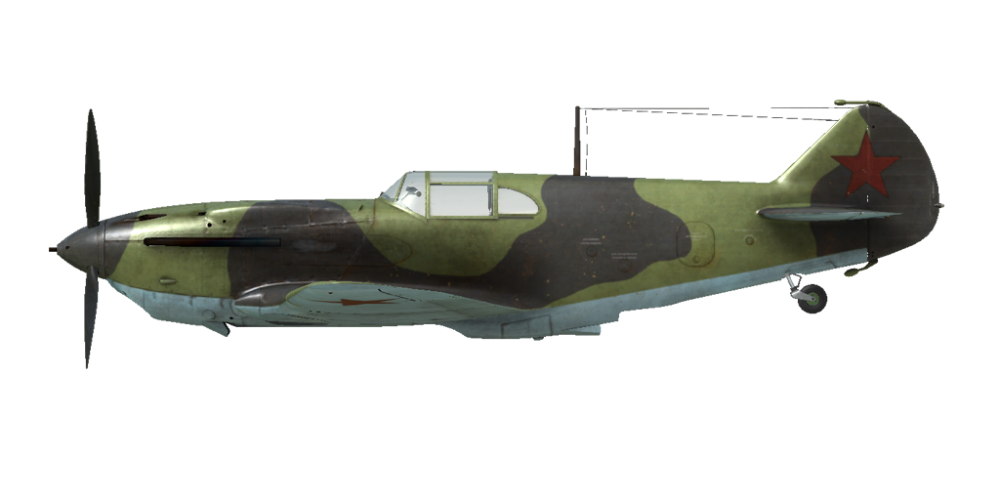
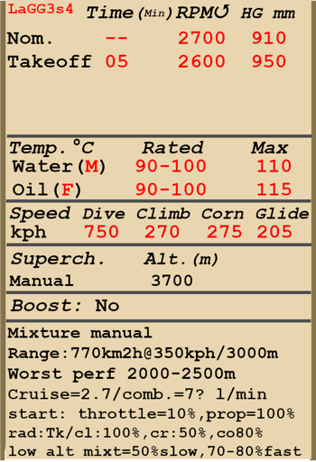

# LaGG-3 ser.4  

  
  

## Description  

Indicated stall speed in flight configuration: 167..193 km/h  
Indicated stall speed in takeoff/landing configuration: 142..170 km/h  
Dive speed limit: 750 km/h  
Maximum load factor: 11 G  
Stall angle of attack in flight configuration: 17.9 °  
Stall angle of attack in landing configuration: 15.2 °  
  
Maximum true air speed at sea level, engine mode - Take-off: 475 km/h  
Maximum true air speed at sea level, engine mode - Nominal: 465 km/h  
Maximum true air speed at 2000 m, engine mode - Nominal: 506 km/h  
Maximum true air speed at 4000 m, engine mode - Nominal: 523 km/h  
  
Service ceiling: 9900 m  
Climb rate at sea level: 12.5 m/s  
Climb rate at 3000 m: 11.2 m/s  
Climb rate at 6000 m: 7.9 m/s  
  
Maximum performance turn at sea level: 22.3 s, at 280 km/h IAS.  
Maximum performance turn at 3000 m: 29.1 s, at 270 km/h IAS.  
  
Flight endurance at 3000 m: 2.0 h, at 350 km/h IAS.  
  
Takeoff speed: 165..200 km/h  
Glideslope speed: 190..210 km/h  
Landing speed: 140..160 km/h  
Landing angle: 13.0 °  
  
Note 1: the data provided is for international standard atmosphere (ISA).  
Note 2: flight performance ranges are given for possible aircraft mass ranges.  
Note 3: maximum speeds, climb rates and turn times are given for standard aircraft mass.  
Note 4: climb rates are given for Nominal power, turn times are given for Take-off power.  
  
Engine:  
Model: M-105P  
Maximum power in Maximum Possible power mode at sea level: 1100 HP  
Maximum power in Nominal mode at sea level: 1020 HP  
Maximum power in Nominal mode at 2000 m: 1100 HP  
Maximum power in Nominal mode at 4000 m: 1050 HP  
  
Engine modes:  
Nominal (unlimited time): 2700 RPM, 910 mm Hg  
Take-off power (up to 5 minutes): 2600 RPM, 950 mm Hg  
  
Water rated temperature in engine output: 90..100 °C  
Water maximum temperature in engine output: 110 °C  
Oil rated temperature in engine output: 90..100 °C  
Oil maximum temperature in engine output: 115 °C  
  
Supercharger gear shift altitude: 3700 m  
  
Empty weight: 2705 kg  
Minimum weight (no ammo, 10% fuel): 2855 kg  
Standard weight: 3280 kg  
Maximum takeoff weight: 3370 kg  
Fuel load: 348 kg / 467 l  
Useful load: 665 kg  
  
Forward-firing armament:  
20mm gun "ShVAK", 150 rounds, 800 rounds per minute, nose-mounted  
12.7mm machine gun "UB", 200 rounds, 1000 rounds per minute, synchronized  
2 x 7.62mm machine gun "ShKAS", 1300 rounds, 1800 rounds per minute, synchronized upper  
  
Rockets:  
8 x 7 kg rockets "ROS-82", HE payload mass 2.52 kg  
  
Length: 8.82 m  
Wingspan: 9.8 m  
Wing surface: 17.5 m²  
  
Combat debut: July 1941  
  
Operation features:  
- The engine has a two-stage mechanical supercharger which must be manually switched at 3700m altitude.  
- Engine mixture control is manual, it is necessary to lean the mixture if altitude is more than 3-4 km for optimal engine operation. Also, leaning the mixture allows a reduction in fuel consumption during flight.  
- Engine RPM has an automatic governor and it is maintained at the required RPM corresponding to the governor control lever position. The governor automatically controls the propeller pitch to maintain the required RPM.  
- Water radiator shutter control is manual. Oil radiator shutter is fixed.  
- The aircraft has trimmers for all flight-controls: pitch, roll and yaw.  
- Landing flaps have a hydraulic actuator and they can be extended to any angle up to 60°.  
- The aircraft has a manual tailwheel lock. Wheel should be locked when taxiing straight for a long distance and before takeoff and landing.  
- The aircraft has differential pneumatic wheel brakes with shared control lever. This means that if the brake lever is held and the rudder pedal the opposite wheel brake is gradually released causing the plane to swing to one side or the other.  
- The aircraft has a fuel gauge which shows total remaining fuel.  
- Cockpit canopy has a weak lock when in the opened position, for this reason the canopy may spontaneously close in a deep dive. It is impossible to open or close the canopy at high speed due to strong airflow. The canopy has no emergency release, so bail out requires the speed drop before it.  
- When rockets are installed there is a salvo controller, it has three launch modes: single fire, fire two in a salvo or fire four in a salvo.  
  
Basic data and recommended positions of the aircraft controls:  
1. Starting the engine:  
	- recommended position of the mixture control lever: 100%  
	- recommended position of the water radiator control handle: close  
	- recommended position of the prop pitch control handle: 100%  
	- recommended position of the throttle lever: 10%  
  
2. Recommended mixture control lever positions for various flight modes:  
	- When running the engine at low throttle near the ground, the mixture knob should be in the position of about 50%.  
	- When the engine is running at full throttle near the ground, the mixture knob should be in the 75-80% position.  
	- As you gain altitude, you will need to adjust the fuel mixture. At 8-9 km altitude, the mixture lever should be at 0%.  
  
3. Recommended positions of the water radiator control handle for various flight modes:  
	- takeoff: open 100%  
	- climb: open 100%  
	- cruise flight: open 50%  
	- combat: open 80%  
  
4. Approximate fuel consumption at 2000 m altitude:  
	- Cruise engine mode: 2.7 l/min  

## Modifications  
### RPK-10  

Fixed loop radio compass for navigation with radio beacons  
Additional mass: 10 kg  
Estimated speed loss: 0 km/h  
  
### 8 x ROS-82 rockets  

8 x 82mm High Explosive unguided rockets ROS-82  
Additional mass: 80 kg  
Ammunition mass: 56 kg  
Racks mass: 24 kg  
Estimated speed loss before launch: 25 km/h  
Estimated speed loss after launch: 19 km/h  
