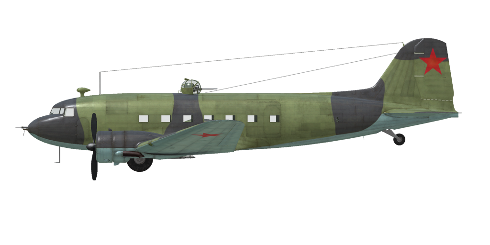
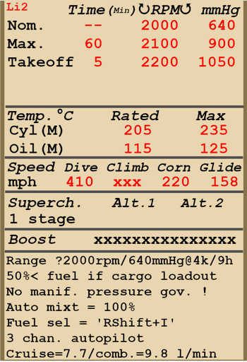

# Ли-2  

<table><tbody><tr><td style="text-align: center"></td><td style="text-align: center"></td></tr></td></tr></tbody></table>  

Приборная скорость сваливания в полётной конфигурации: 115...135 км/ч  
Приборная скорость сваливания в посадочной конфигурации: 105...120 км/ч  
Предельная скорость в пикировании: 410 км/ч  
Разрушающая перегрузка: 5,0 единиц  
Угол атаки сваливания, в полётной конфигурации: 13 °  
Угол атаки сваливания, в посадочной конфигурации: 12,5 °  
  
Максимальная истинная скорость у земли, режим двигателя - взлётный: 322 км/ч  
Максимальная истинная скорость на высоте 900 м, режим двигателя взлётный: 333 км/ч  
  
Максимальная истинная скорость у земли, режим двигателя - номинальный: 303 км/ч  
Максимальная истинная скорость на высоте 1700 м, режим двигателя - номинальный: 320 км/ч  
  
Практический потолок: 5500 м  
Скороподъёмность у земли: 4,0 м/с   
Скороподъёмность на высоте 3000 м: 2,5 м/с   
  
Время виража предельного по тяге у земли: 25,5 с, на скорости 220 км/ч по прибору  
  
Максимальная продолжительность полёта на высоте 4000 м: 9 ч, при режиме работы двигателя 70% от номинала (n = 2000 об/мин, Pк = 640 мм. рт. ст.)  
  
Скорость взлётная: 120...130 км/ч  
Скорость на глиссаде: 150...165 км/ч  
Скорость посадочная: 105...115 км/ч  
Посадочный угол: 11,5 °  
  
Примечание 1: данные указаны для условий международной стандартной атмосферы.  
Примечание 2: диапазоны характеристик даны для допустимого диапазона масс самолёта.  
Примечание 3: максимальные скорости, скороподъемности даны для максимальной взлётной массы самолёта.  
Примечание 4: скороподъемность дана на режиме работы двигателя "номинальный".  
  
Двигатель:  
Модель: М-62ИР  
Максимальная мощность на взлётном режиме у земли: 1000 л.с.  
Максимальная мощность на номинальном режиме у земли: 820 л.с.  
  
Максимальная мощность на номинальном режиме на высоте 1700 м: 840 л.с.  
  
Режимы работы двигателя:  
Взлётный (до 5 минут): 2200 об/мин, 1050 мм. рт. ст.  
Номинальный: 2100 об/мин, 900 мм. рт. ст.  
  
Температура масла на выходе из двигателя рекомендуемая: 115 °С  
Температура масла на выходе из двигателя максимально допустимая (не более 10 мин): 125 °С  
Температура головок нормальная: 205 °С  
Температура головок максимально допустимая (при работе на взлётном режиме не более 5 мин.): 235 °С  
  
Масса пустого самолёта: 7526 кг  
Максимальная взлётная масса: 11600 кг  
Максимальный запас топлива: 3110 л  
Максимальная полезная нагрузка: 4074 кг  
  
Вооружение курсовое:  
7,62мм пулемёт "ШКАС", 450 патронов, 1800 выстр/мин, носовой  
  
Вооружение оборонительное:  
Верхнее: 12,7мм пулемёт УБТ в турели УТК-1, 230 патронов, 1000 выстр/мин  
Боковое: два бортовых 7,62мм пулемёта "ШКАС", по 500 патронов, 1800 выстр/мин  
  
Вооружение бомбовое:  
До четырёх 254 кг осколочно-фугасных авиабомб "ФАБ-250св"  
или двух 512 кг осколочно-фугасных авиабомб "ФАБ-500М"  
  
Длина: 19,65 м  
Размах крыла: 28,81 м  
Площадь крыла: 91,7 кв.м  
  
Начало участия в боевых действиях: осень 1942  
  
- ВАЖНО: для грузового варианта рекомендуется брать не более 50% топлива, чтобы не превышать максимальную взлётную массу.  
- На самолёте отсутствует регулятор постоянного наддува, поэтому давление наддува зависит не только от положения РУД но также от числа оборотов мотора и высоты полёта. Поэтому следует уделять повышенное внимание контролю наддува по указателю во избежание повреждения двигателя.  
- Самолёт оборудован ручным высотным корректором. Для снижения расхода топлива на маршруте можно обеднять состав смеси, перемещая рычаги управления смесью от себя. При этом нужно контролировать состав смеси по показаниям альфометров и следить за температурой головок двигателей. Максимальное обогащение смеси осуществляется установкой рычагов в положение «на себя» и используется при запуске двигателей.  
- Регулятор постоянных оборотов винта поддерживает заданные рычагом винта обороты мотора за счёт автоматического изменения шага винта.  
- Регулировка температуры масла осуществляется вручную, путём открытия и закрытия створок маслорадиатора.  
- Для предотвращения переохлаждения двигателя самолёт оснащен входными створками капотов двигателя, управляемыми вручную.  
- Самолёт оснащён триммерами во всех трёх каналах управления.  
- Привод посадочных щитков гидравлический. Щитки можно выпустить на любой угол до 50°.  
- Самолёт имеет раздельное управление гидравлическими тормозами левого и правого колёс шасси. Торможение каждого колеса осуществляется нажатием на верхнюю часть соответствующей педали.  
- Самолёт оборудован стояночным тормозом.  
- Самолёт оснащён посадочными фарами и АНО.  
- Двигатель оборудован одноступенчатым нагнетателем.  
- Самолёт оборудован указателем топлива, который может показывать остаток топлива в каждом из баков. Выбор бака для индикации по-умолчанию производится комбинацией клавишь (RShift+I).  
- Свободно-ориентируемое хвостовое колесо может быть застопорено при помощи рычага в кабине лётчика. Колесо необходимо застопорить при продолжительном рулении по прямой, а также перед взлётом и посадкой.  
- Самолёт оборудован трехканальным автопилотом (RAlt + A). Пилот имеет возможность корректировать стабилизируемые углы курса (RAlt + Left/Right), тангажа (RAlt + Up/Down) и крена (RShift + Left/Right).  
- Для разгрузки груза самолёт оборудован грузовыми дверьми, которые могут быть открыты только на земле.  
- При выполнении заданий по десантированию парашютистов или транспортных парашютных контейнеров, размещённых в салоне самолёта, сначала нужно открыть боковую дверь клавишей «открыть бомболюки» (N по умолчанию), а затем использовать клавишу сброса бомб (B по умолчанию) для начала сброса.  
  
Основные данные и рекомендуемые положения органов управления самолётом:  
1. Запуск двигателя:  
	- рекомендуемое положение рукояти управления смесью: на себя  
	- рекомендуемое положение рукояти управления створками капота: закрыто  
	- рекомендуемое положение рукояти управления радиаторами: открыто 50%  
	- рекомендуемое положения рукояти управления шагом: тяжелый винт  
	- рекомендуемое положение рычага управления двигателем: 15%  
	- перед рулением необходимо разблокировать колесо  
	- перед рулением необходимо снять самолёт со стояночного тормоза  
  
2. Рекомендуемые положения рукояти смеси при различных режимах полёта:  
	- При работе мотора на малом газу у земли ручка смеси должна быть в положении около 60%.  
	- При работе мотора на полном газу у земли ручка смеси должна быть в положении 40-50%.  
	- По мере набора высоты высотный корректор прикрывается.  
  
3.1 Рекомендуемые положения рукояти управления створками капота при различных режимах полёта:  
	- взлёт: открыто 100%  
	- набор высоты: открыто 100%  
	- крейсерский полёт: открыто 50% (зимой закрыть при необходимости)  
	- бой: открыто 50%  
  
3.2 Рекомендуемые положения рукояти управления маслорадиаторами при различных режимах полёта:  
	- взлёт: открыто 50%  
	- набор высоты: открыто 100%  
	- крейсерский полёт: открыто 40% (зимой закрыть при необходимости)  
	- бой: открыто 50%  
  
4. Ориентировочный расход топлива на различных режимах работы на высоте 2000 м:  
	- крейсерский режим работы двигателя: 7,7 л/мин  
	- боевой режим работы двигателя: 9,8 л/мин  

## Модификации  
### Бомбардировщик  

4 x 254 кг осколочно-фугасные авиабомбы ФАБ-250св  
Дополнительная масса: 1076 кг  
Масса вооружения: 1016 кг  
Масса держателей: 60 кг  
Ориентировочная потеря скорости до сброса: 13 км/ч  
Ориентировочная потеря скорости после сброса: 2 км/ч  
или  
2 x 512 кг осколочно-фугасные авиабомбы ФАБ-500М  
Дополнительная масса: 1084 кг  
Масса вооружения: 1024 кг  
Масса держателей: 60 кг  
Ориентировочная потеря скорости до сброса: 17 км/ч  
Ориентировочная потеря скорости после сброса: 2 км/ч  
  
### 2200 кг груз военного назначения  

2200 кг груз военного назначения в фюзеляже самолёта  
Дополнительная масса: 2200 кг  
Ориентировочная потеря скорости: 6 км/ч  
  
### 14 контейнеров ПД-ММ внутри  

14 сбрасываемых 125,7 кг парашютных контейнеров ПД-ММ внутри фюзеляжа  
Дополнительная масса: 1760 кг  
Масса контейнеров: 1760 кг  
Ориентировочная потеря скорости до сброса: 5 км/ч  
Ориентировочная потеря скорости после сброса: 0 км/ч  
  
### 6 контейнеров ПД-ММ  

6 сбрасываемых 125,7 кг парашютных контейнеров ПД-ММ  
Дополнительная масса: 814 кг  
Масса контейнеров: 754 кг  
Масса держателей: 60 кг  
Ориентировочная потеря скорости до сброса: 20 км/ч  
Ориентировочная потеря скорости после сброса: 2 км/ч  

### 16 парашютистов  

16 парашютистов с амуницией  
Дополнительная масса: 1600 кг  
Ориентировочная потеря скорости до сброса: 7 км/ч  
Ориентировочная потеря скорости после сброса: 0 км/ч  
