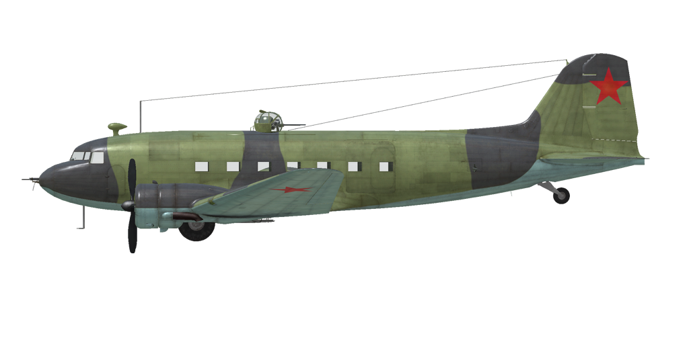

# Li-2  

  
  

## Descripción  

Velocidad indicada de pérdida en configuración de vuelo: 115..135 km/h  
Velocidad indicada de pérdida en configuración de despegue/aterrizaje: 105..120 km/h  
Velocidad de picado límite: 410 km/h  
Carga de rotura máxima (en fuerzas <i>g</i>): 5 <i>g</i>  
Ángulo de ataque crítico en configuración de vuelo: 13°  
Ángulo de ataque crítico en configuración de aterrizaje: 12,5°  
  
Velocidad respecto al suelo al nivel del mar, modo motor - Despegue: 322 km/h  
Velocidad máxima respecto al suelo a 900 m, modo motor - Despegue: 333 km/h  
  
Velocidad respecto al suelo al nivel del mar, modo motor - Máximo ahorro: 303 km/h  
Velocidad máxima respecto al suelo a 1700 m, modo motor - Máximo ahorro: 320 km/h  
  
Techo de servicio: 5500 m  
Tasa de ascenso al nivel del mar: 4,0 m/s  
Tasa de ascenso a 3000 m: 2,5 m/s  
  
Viraje de máximo rendimiento al nivel del mar: 25,5 s, a 220 km/h velocidad indicada (IAS).  
  
Autonomía de vuelo a 4000 m: 9 h, a 2000 rpm y 640 mmHg (motor al 70%).  
  
Velocidad de despegue: 120..130 km/h  
Velocidad senda de planeo: 150..165 km/h  
Velocidad de aterrizaje: 105..115 km/h  
Ángulo de aterrizaje: 11,5°  
  
Nota 1: los datos están basados en la atmósfera estándar internacional (ISA).  
Nota 2: diferentes rendimientos de vuelo dados para los diferentes pesos posibles del avión.  
Nota 3: velocidades máximas, tasas de ascenso y tiempos de giro dados para el peso máximo al despegue.  
Nota 4: tasas de ascenso y tiempos de giro están dados para el modo motor - Máximo continuo.  
  
Motor:  
Modelo: M-62IR  
Potencia máxima en modo Despegue al nivel del mar: 1000 CV  
Potencia máxima en modo Máximo continuo (nominal) al nivel del mar: 820 CV  
  
Potencia máxima en modo Máximo continuo (nominal) a 1700 m: 840 CV  
  
Modos de funcionamiento motor:  
Despegue (hasta 5 minutos): 2200 rpm, 1050 mmHg  
Máximo continuo (nominal, sin límite de tiempo): 2100 rpm, 900 mmHg  
  
Temperatura nominal del aceite a la salida del motor: 115 °C  
Temperatura máxima del aceite a la salida del motor: 125 °C  
Temperatura nominal en la culata: 205 °C  
Temperatura máxima en la culata: 235 °C  
  
Peso vacío: 7526 kg  
Peso máximo al despegue: 11600 kg  
Carga de combustible: 3110 l  
Carga útil máxima: 4074 kg  
  
Armamento delantero:  
Ametralladora de 7,62 mm «ShKAS», 450 balas, 1800 balas por minuto, en morro  
  
Armamento defensivo:  
Dorso: Ametralladora de 12,7 mm «UBT» en torreta UTK-1, 230 balas, 1000 balas por minuto  
Izquierda: ametralladora de 7,62 mm «ShKAS», 500 balas, 1800 balas por minuto  
Derecha: ametralladora de 7,62 mm «ShKAS», 500 balas, 1800 balas por minuto  
  
Bombas:  
Hasta 4 bombas de propósito general de 254 kg «FAB-250sv»  
Hasta 2 bombas de propósito general de 512 kg «FAB-500M»  
  
Longitud: 19,65 m  
Envergadura alar: 28,81 m  
Superficie de ala: 91,7 m²  
  
Debut en combate: otoño de 1942  
  
Características operativas:  
- IMPORTANTE: se recomienda no llevar más del 50% de combustible cuando se lleve cargamento, para no exceder el peso máximo al despegue.  
- El motor no tiene regulador automático de la presión en el colector. Esta presión no depende solo de la posición de la palanca de potencia, sino también de las rpm y la altitud. Por ello, es necesario revisar a menudo la presión en el colector para no dañar el motor.  
- El avión está equipado con un corrector manual de altitud. Para reducir el consumo de combustible en ruta, es posible empobrecer la mezcla moviendo las palancas de control de la mezcla. En este caso, es necesario controlar la composición de la mezcla mediante las lecturas del «alfámetro» y vigilar la temperatura de la culata del motor. El enriquecimiento máximo de la mezcla se realiza colocando las palancas en la posición «hacia el piloto» y se utiliza al arrancar los motores.  
- El motor tiene un regulador automático de las rpm que las mantiene al valor correspondiente a la posición de la palanca de control del regulador. Este regulador controla automáticamente el paso de la hélice para mantener las rpm requeridas.  
- La temperatura del aceite se regula manualmente abriendo y cerrando las persianas del radiador de aceite.  
- Para evitar el sobreenfriamiento del motor, la aeronave está equipada con aletas de entrada al capó del motor de accionamiento manual.  
- El avión tiene compensadores para todos los controles de vuelo: cabeceo, alabeo y guiñada.  
- Los flaps tienen un accionador hidraúlico y pueden bajarse gradualmente hasta formar un ángulo de 50°.  
- El avión posee unos controles hidráulicos independientes para el frenado de la rueda izquierda y derecha. Para frenar cada una de ellas es necesario empujar la parte superior del pedal del control de timón correspondiente.  
- El avión está equipado con un sistema de freno de estacionamiento.  
- El avión está equipado con luces de aterrizaje y navegación.  
- El motor tiene un compresor mecánico de una etapa.  
- El avión cuenta con un indicador de combustible que muestra la cantidad de combustible remanente en los depósitos dependiendo de la posición del selector. En la simulación el selector conmuta de posición entre depósitos presionando «Mayús_Dcha + I».  
- El avión cuenta con un control manual para bloquear la rueda de cola. Se debe bloquear la rueda cuando se vaya a rodar en línea recta durante un tramo largo y antes del despegue y aterrizaje.  
- El avión está equipado con un sistema de piloto automático de tres canales (interruptor principal «Alt_Dcha + A»). El piloto tiene la capacidad de ajustar el rumbo (control guiñada con «Alt_Dcha + Flecha Izquierda/Derecha»), los ángulos del estabilizador (control cabeceo con «Alt_Dcha + Flecha Arriba/Abajo») y los ángulos del inclinación (control cabeceo con «Mayús_Dcha + Flecha Izquierda/Derecha»).  
- La puertas de la zona de carga solo se pueden abrir en tierra.  
- Para el lanzamiento de los paracaidistas o el cargamento almacenado en el interior, es necesario abrir previamente la puerta lateral (botón compuerta de bombas, «N» por defecto) y después pulsar el botón de arrojar bombas («B» por defecto) para ordenar el salto o lanzamiento.  
  
Datos básicos y configuraciones recomendadas de los controles del avión:  
1. Arranque de los motores:  
	- palancas de control de la mezcla: «hacia el piloto»  
	- aletas/persianas de admisión del carenado: cerradas  
	- radiadores de aceite: abiertos 50%  
	- palancass de control rpm de las hélices: 0%  
	- palancass de potencia: 15%  
	- antes de empezar a rodar, desbloquear rueda de cola  
	- antes de empezar a rodar, quitar el freno de estacionamiento  
  
2. Posición de la palanca de control de mezcla según momento de vuelo:  
	- Cuando el motor funciona a baja potencia cerca del suelo, las palancas de control de la mezcla deben estar sobre el 60%.  
	- Cuando el motor funciona a máxima potencia cerca del suelo, las palancas de control de la mezcla deben estar entre el 40-50%.  
	- A medida que se gana altura, se debe ir empobreciendo la mezcla.  
  
3.1 Posición de las aletas/persianas de admisión de los carenados según momento de vuelo:  
	- despegue: abiertas 100%  
	- ascenso: abiertas 100%  
	- crucero: abiertas 50% (en condiciones invernales - cerrar si necesario)  
	- combate: abiertas 50%  
  
3.2 Posición de las aletas/persianas de radiadores de aceite según momento de vuelo:  
	- despegue: abiertas 50%  
	- ascenso: abiertas 100%  
	- crucero: abiertas 40% (en condiciones invernales - cerrar si necesario)  
	- combate: abiertas 50%  
  
4. Consumo aproximado de combustible a 2000 m de altitud:  
	- Modo motor - Crucero: 7,7 l/min  
	- Modo motor - Combate: 9,8 l/min  

## Modificaciones  
### Carga de bombas  

4 bombas de propósito general de 254 kg FAB-250sv  
Peso adicional: 1076 kg  
Peso de munición: 1016 kg  
Peso de los soportes: 60 kg  
Pérdida de velocidad estimada antes de soltar: 13 km/h  
Pérdida de velocidad estimada tras soltar: 2 km/h  
  
2 bombas de propósito general de 512 kg FAB-500M  
Peso adicional: 1084 kg  
Peso de munición: 1024 kg  
Peso de los soportes: 60 kg  
Pérdida de velocidad estimada antes de soltar: 17 km/h  
Pérdida de velocidad estimada tras soltar: 2 km/h  
  
### 2200 kg de carga en cajas  

2200 kg de cargamento militar en cajas  
Peso adicional: 2200 kg  
Pérdida de velocidad estimada: 6 km/h  
  
### 14 contenedores lanzables PD-MM (interior)  

14 contenedores de transporte de 125 kg con paracaídas PD-MM  
en el compartimento interior de carga  
Peso adicional: 1760 kg  
Peso de contenedores: 1760 kg  
Pérdida de velocidad estimada antes de soltar: 5 km/h  
Pérdida de velocidad estimada tras soltar: 0 km/h  
  
### 6 contenedores lanzables PD-MM  

6 contenedores de transporte de 125 kg con paracaídas PD-MM  
Peso adicional: 814 kg  
Peso de contenedores: 754 kg  
Peso de los soportes: 60 kg  
Pérdida de velocidad estimada antes de soltar: 20 km/h  
Pérdida de velocidad estimada tras soltar: 2 km/h  
  
### 16 paracaidistas  

16 paracaidistas armados  
Peso adicional: 1600 kg  
Pérdida de velocidad estimada antes de soltar: 7 km/h  
Pérdida de velocidad estimada tras soltar: 0 km/h  
