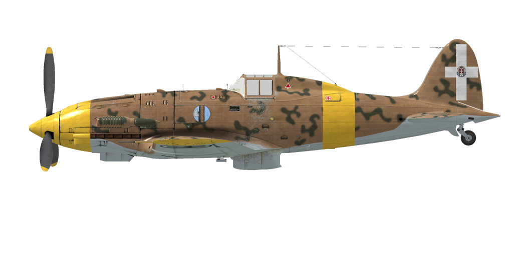

# MC.202 Brh.VIII

## Beschreibung

Überziehgeschwindigkeit in Flugkonfiguration: 151..166 km/h
Überziehgeschwindigkeit in Landekonfiguration: 139..152 km/h
Höchstzulässige Geschwindigkeit im Sturzflug: 850 km/h
Bruchlastvielfache: 14.8 G
Kritischer Anstellwinkel in Flugkonfiguration: 19.6 °
Kritischer Anstellwinkel in Landekonfiguration: 17.4 °

Höchstgeschwindigkeit in Bodennähe, Kampfleistung: 500 km/h
Höchstgeschwindigkeit in 2000 m Höhe, Kampfleistung: 543 km/h
Höchstgeschwindigkeit in 5000 m Höhe, Kampfleistung: 604 km/h

Dienstgipfelhöhe: 11300 m
Steigleistung in Bodennähe: 17.3 m/s
Steigleistung in 3000 m Höhe: 15.1 m/s
Steigleistung in 6000 m Höhe: 10.6 m/s

Maximale Wendegeschwindigkeit in Bodennähe: 22.6 s (270 km/h IAS).
Maximale Wendegeschwindigkeit in 3000 m Höhe: 28.2 s (270 km/h IAS).

Reichweite in 5000 m: 2.2 h, bei 350 km/h IAS.

Startgeschwindigkeit: 160..190 km/h
Anfluggeschwindigkeit: 190..200 km/h
Landegeschwindigkeit: 140..150 km/h
Sinkflugpfad: 13.9 °

Anmerkung 1: Die Werte gelten für Normatmosphäre (ISA).
Anmerkung 2: Flugleistungen varrieren je nach Abfluggewicht.
Anmerkung 3: Höchstgeschwindigkeiten, Steigleistungen und Wendegeschwindigkeiten gelten für Standard-Fluggewicht.
Anmerkung 4: Steigraten gelten für Kampfleistung, Wendegeschwindigkeiten gelten für Startleistung.

Triebwerk:
Baumuster: RA.1000
Startleistung in Bodennähe: 1175 PS
Kampfleistung in Bodennähe: 1050 PS
Kampfleistung in 3700 m Höhe: 1100 PS

Leistungsstufen:
Nennleistung (unbegrenzt): 2200 U/min, 1.23 ata
Kampfleistung (bis zu 5 Minuten): 2400 U/min, 1.35 ata
Startleistung (bis zu 1 Minute): 2500 U/min, 1.45 ata

Kühlstoffeintrittstemperatur (normal): 70..80 °C
Kühlstoffaustrittstemperatur (normal): 94 °C
Kühlstoffaustrittstemperatur (höchstens): 100 °C
Schmierstoffeintrittstemperatur (normal): 60..75 °C
Schmierstoffeintrittstemperatur (höchstens): 85 °C
Schmierstoffaustrittstemperatur (normal): 90..100 °C
Schmierstoffaustrittstemperatur (höchstens): 110 °C

Laderumschalthöhe: Stufenlose hydraulische Kupplung 

Leergewicht: 2448 kg
Minimalgewicht (keine Munition, 10%25 Treibstoff): 2622 kg
Normalgewicht: 2967 kg
Höchstabfluggewicht: 3197 kg
Kraftstoffmenge: 307 kg / 430 l
Nutzlast: 749 kg

Starre Schusswaffenanlage:
2 x 12.7 mm Breda SAFAT 12.7, 400 Schuss, 700 Schuss pro Minute, gesteuert schießend
2 x 7.7 mm Breda SAFAT 7.7, 500 Schuss, 900 Schuss pro Minute, flügelmontiert (Rüstsatz)
2 x 20 mm MG 151/20, 135 Schuss, 700 Schuss pro Minute, flügelmontiert (Rüstsatz)

Abwurfwaffen:
2 x 50 kg Mehrzweck-Sprengbomben 50-T
2 x 100 kg Mehrzweck-Sprengbomben 100-T

Länge: 8.85 m
Spannweite: 10.58 m
Flügelfläche: 16.8 m²

Erster Fronteinsatz: Juni 1942

Eigenschaften:
- Der Schubhebel ist seitenverkehrt: zurück = voller Schub, vorwärts = Leerlauf.
- Der Motor besitzt eine automatische Gemischregelung, sowie eine barometrisch geregelte hydraulische Kupplung für den Schaltlader, sodass keine manuelle Regelung erforderlich ist.
- Der Drehzahlregler hat zwei verschiedene Einstellungen: 2200 U/min - Normalleistung, 2400 U/min - Zusatzleistung. Außerdem ist es möglich, den Drehzahlregler auszuschalten und den Propeller-Anstellwinkel manuell zu regeln.
- Die Verstellung der Wasserkühler- und Ölkühlerklappen erfolgt manuell.
- Das Flugzeug hat keine Vorrichtungen zur Trimmung während des Fluges. Das Flugzeug besitzt Trimmkannten, welche vor dem Flug von dem Bodenpersonal angepasst werden können.
- Das Flugzeug hat asymmetrische Flügel für den Ausgleich der Rollbewegung: der linke Flügel ist 20 cm länger als der rechte Flügel.
- Das Flugzeug hat ein manuell verstellbares Höhenleitwerk. Es sollte vor Start und Landung eingestellt werden. Es kann auch während des Flugzeug zur Trimmung des Flugzeugs verstellt werden. Vor einem längeren Sturzflug sollte das Leitwerk so eingestellt werden, dass der Pilot den Steuerknüppel nach vorne drücken muss, um das Flugzeug im Sturzflug zu halten.
- Die Landeklappen sind hydraulisch geregelt und können bis zu einem Winkel von 45° ausgefahren werden. Die Mechanik der Landeklappen enthält eine "pneumatische Feder", welche es erlaubt, dass die Klappen bei Geschwindigkeiten über 200 km/h durch den Luftwiderstand eingefahren werden.
- Das Flugzeug hat eine manuelle Spornradverriegelung. Das Spornrad sollte bei längerem Geradeausrollen, sowie beim Abflug und bei der Landung verriegelt werden.
- Das Flugzeug hat differentielle pneumatische Bremsen, die mit einem gemeinsamen Bremshebel betätigt werden. Wenn der Bremshebel gezogen und das Ruderpedal betätigt wird, wird die gegenüberliegende Bremse gelöst und das Flugzeug dreht sich zu der einen oder der anderen Seite.
- Das Flugzeug hat eine Tankanzeige, welche nur den Treibstoffstand des vorderen Treibstofftanks anzeigt.
- Aufgrund der Bauart der Cockpithaube ist es nicht möglich, diese während des Fluges zu öffnen. Um eine Beschädigung zu vermeiden, sollte die Haube vor dem Start geschlossen werden. Die Cockpithaube kann für den Notausstieg abgeworfen werden.
- Die Abwurfmechanik der Bomben erlaubt nur das einzelne Abwerfen der Bomben.
- Das Visier ist mit einen Sonnenfilter ausgestattet. Für den Fall, dass das Visier beschädigt wird, steht ein mechanisches Hilfsvisier zur Verfügung.

## Änderungen

&name=2 x Bomben, Typ 100-T

100-kg-Splitterbombe 100-T
Zusätzliches Gewicht: 220 kg
Gewicht der Munition: 200 kg
Gewicht der Abwurfwaffenroste: 20 kg
Geschwindigkeitsverlust vor Abwurf: 20 km/h
Geschwindigkeitsverlust nach Abwurf: 7 km/h
&name=2 x Bomben, Typ 50-T

2 x 55-kg-Splitterbomben 50-T
Zusätzliches Gewicht: 130 kg
Gewicht der Munition: 110 kg
Gewicht der Abwurfwaffenroste: 20 kg
Geschwindigkeitsverlust vor Abwurf: 14 km/h
Geschwindigkeitsverlust nach Abwurf: 7 km/h
&name=Gepanzerte Windschutzscheibe

Zusätzlicher Pilotenschutz: Gepanzerte Triplex-Windschutzscheibe
Zusätzliches Gewicht: 10 kg
Geschwindigkeitsverlust: 0 km/h
&name=2 x 7.7mm Maschinengewehre

Breda SAFAT 7.7mm flügelmontierte Maschinengewehre mit jeweils 500 Schuss
Zusätzliches Gewicht: 49 kg
Gewicht der Munition: 24 kg
Gewicht der Schusswaffen: 25 kg
Geschwindigkeitsverlust: 0 km/h
&name=2 x 20 mm MG 151/20 in Geschützbehältern

MG 151/20 Flügelmontierte Geschützbehälter mit 20-mm-Maschinenkanonen mit je 135 Schuss
Zusätzliches Gewicht: 212 kg
Gewicht der Munition: 55 kg
Gewicht der Schusswaffen: 157 kg
Geschwindigkeitsverlust: 15 km/h