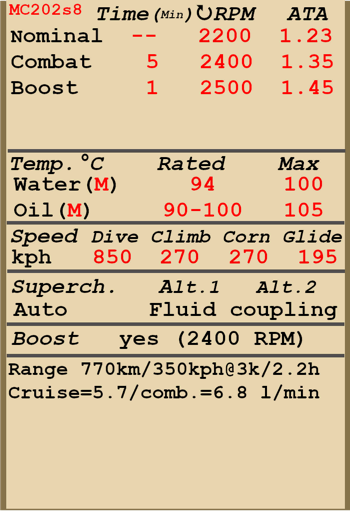

# MC.202 ser.VIII  

<table><tbody><tr><td style="text-align: center"></td><td style="text-align: center"></td></tr></tbody></table>  

Velocidad indicada de pérdida en configuración de vuelo: 151..166 km/h  
Velocidad indicada de pérdida en configuración de despegue/aterrizaje: 139..152 km/h  
Velocidad de picado límite: 850 km/h  
Carga de rotura máxima (en fuerzas <i>g</i>): 14,8 <i>g</i>  
Ángulo de ataque crítico en configuración de vuelo: 19,6°  
Ángulo de ataque crítico en configuración de aterrizaje: 17,4°  
  
Velocidad respecto al suelo al nivel del mar, engine mode - combate: 500 km/h  
Velocidad máxima respecto al suelo a 2000 m, engine mode - combate: 543 km/h  
Velocidad máxima respecto al suelo a 5000 m, engine mode - combate: 604 km/h  
  
Techo de servicio: 11300 m  
Tasa de ascenso al nivel del mar: 17,3 m/s  
Tasa de ascenso a 3000 m: 15,1 m/s  
Tasa de ascenso a 6000 m: 10,6 m/s  
  
Viraje de máximo rendimiento al nivel del mar: 22,6 s, a 270 km/h velocidad indicada (IAS).  
Viraje de máximo rendimiento a 3000 m: 28,2 s, a 270 km/h velocidad indicada (IAS).  
  
Autonomía de vuelo a 3000 m: 2,2 h, a 350 km/h velocidad indicada (IAS).  
  
Velocidad de despegue: 160..190 km/h  
Velocidad senda de planeo: 190..200 km/h  
Velocidad de aterrizaje: 140..150 km/h  
Ángulo de aterrizaje: 13,9°  
  
Nota 1: los datos están basados en la atmósfera estándar internacional (ISA).  
Nota 2: diferentes rendimientos de vuelo dados para los diferentes pesos posibles del avión.  
Nota 3: velocidades máximas, tasas de ascenso y tiempos de giro dados para el peso estándar del avión.  
Nota 4: tasas de ascenso dadas para la potencia de Combate; tiempos de giro dados para la potencia de Impulsión.  
  
Motor:  
Modelo: RA.1000  
Potencia máxima en modo Impulso al nivel del mar: 1175 CV  
Potencia máxima en modo Combate al nivel del mar: 1050 CV  
Potencia máxima en modo Combate a 3700 m: 1100 CV  
  
Modos de funcionamiento motor:  
Continuo (sin límite de tiempo): 2200 rpm, 1,23 ata  
Combate (hasta 5 minutos): 2400 rpm, 1,35 ata  
Impulso (hasta 1 minuto): 2500 rpm, 1,45 ata  
  
Temperatura nominal del agua en la admisión del motor: 70..80 °C  
Temperatura nominal del agua en la salida del motor: 94 °C  
Temperatura máxima del agua en la salida del motor: 100 °C  
Temperatura nominal del aceite en la admisión del motor: 60..75 °C  
Temperatura máxima del aceite en la admisión del motor: 85 °C  
Temperatura nominal del aceite a la salida del motor: 90..100 °C  
Temperatura máxima del aceite a la salida del motor: 110 °C  
  
Altitud de cambio de etapa del compresor: acoplamiento hidraúlico  
  
Peso vacío: 2448 kg  
Peso mínimo (sin munición, 10% de combustible): 2622 kg  
Peso estándar: 2967 kg  
Peso máximo al despegue: 3197 kg  
Carga de combustible: 307 kg / 430 l  
Carga útil: 749 kg  
  
Armamento delantero:  
2 ametralladoras de 12,7 mm «Breda SAFAT 12,7», 400 balas, 700 balas por minuto, sincronizadas  
2 ametralladoras de 7,7 mm «Breda SAFAT 7,7», 500 balas, 900 balas por minuto, montadas en ala (modificación)  
2 cañones de 20 mm «MG 151/20», 135 balas, 700 balas por minuto, montados en ala (modificación)  
  
Bombas:  
2 bombas de propósito general de 50 kg «50-T»  
2 bombas de propósito general de 100 kg «100-T»  
  
Longitud: 8,85 m  
Envergadura alar: 10,58 m  
Superficie de ala: 16,8 m²  
  
Debut en combate: junio de 1942  
  
Características operativas:  
- La palanca de potencia está invertida: hacia atrás = potencia máxima, hacia adelante = ralentí.  
- El motor está equipado con un sistema de control automático de la mezcla y un compresor con acoplamiento hidraúlico que no necesita control manual.  
- El motor tiene un regulador automático de las rpm de dos modos fijos: 2200 rpm modo normal, 2400 rpm modo impulso. Es posible apagar el regulador y controlar el paso de la hélice manualmente mediante un actuador mecánico.  
- Las persianas de los radiadores de agua y aceite se controlan manualmente.  
- El avión no tiene compensadores de control en vuelo. Está equipado con unas aletas de compensación flexibles que pueden ser ajustadas antes del vuelo por el personal de tierra.  
- El avión tiene las alas asimétricas para compensar el alabeo: la izquierda es 20 cm más larga que la derecha.  
- El avión cuenta con un estabilizador horizontal que se controla manualmente. Debe situarse en posición neutral antes del despegue y aterrizaje. Además, puede emplearse para compensar la palanca de control durante el vuelo. En un picado pronunciado el estabilizador debe fijarse de tal manera que el piloto tenga que empujar la palanca hacia adelante para mantener el ángulo de picado.  
- Los flaps tienen un accionador hidraúlico y pueden bajarse gradualmente hasta formar un ángulo de 45°. El sistema de funcionamiento de los flaps incluye un «muelle neumático» que permite que los flaps sean empujados hacia arriba por el flujo de aire a velocidades superiores a 200 km/h.  
- El avión cuenta con un sistema manual para bloquear la rueda de cola. Se debe bloquear la rueda cuando se vaya a rodar en línea recta durante un tramo largo y antes del despegue y aterrizaje.  
- El avión posee frenos neumáticos diferenciales en la ruedas compartidos por una palanca de freno. Cuando se tira de la palanca del freno y se pisa un pedal del control del timón el freno opuesto se libera y el avión comienza a girar en un sentido u otro.  
- El avión cuenta con un indicador de combustible que indica solamente el nivel de combustible del depósito frontal.  
- El diseño de la cubierta de la cabina no permite su apertura durante el vuelo. La cubierta debe cerrarse antes del despegue para evitar dañarla. La cubierta tiene un sistema de desbloqueo de emergencia para facilitar el salto.  
- El sistema de control del anclaje de las bombas solo permite el lanzamiento una a una.  
- La mira tiene un filtro solar deslizante. También cuenta con una mira mecánica plegable de respaldo que puede emplearse si la mira principal está dañada.  
  
Datos básicos y configuraciones recomendadas de los controles del avión:  
1. Arranque del motor:  
	- palanca de control de la mezcla: (control de mezcla automático)  
	- posición de los radiadores de aceite y agua: cerrados  
	- palanca de control del paso de la hélice: corto (control paso automático)  
	- palanca de potencia: 0%  
	- antes de empezar a rodar, desbloquear rueda de cola  
  
2. Posición de la palanca de control de mezcla según momento de vuelo: (control de mezcla automático)  
  
3.1 Posición del radiador de aceite según momento de vuelo:  
	- despegue: abierto 100%  
	- ascenso: abierto 100%  
	- crucero: abierto 100% (en condiciones invernales - abierto 50%)  
	- combate: abierto 50%  
  
3.2 Posición del radiador de agua según momento de vuelo:  
	- despegue: abierto 100%  
	- ascenso: abierto 100%  
	- crucero: abierto 100% (en condiciones invernales - cerrar si necesario)  
	- combate: abierto 50%  
  
4. Consumo aproximado de combustible a 2000 m de altitud:  
	- Modo motor - Crucero: 5,7 l/min  
	- Modo motor - Combate: 6,8 l/min  

## Modificaciones  
### 2 bombas 100-T  

2 bombas de propósito general de 100 kg 100-T  
Peso adicional: 220 kg  
Peso de munición: 200 kg  
Peso de los soportes: 20 kg  
Pérdida de velocidad estimada antes de soltar: 20 km/h  
Pérdida de velocidad estimada tras soltar: 7 km/h  
  
### 2 bombas 50-T  

2 bombas de propósito general de 55 kg 50-T  
Peso adicional: 130 kg  
Peso de munición: 110 kg  
Peso de los soportes: 20 kg  
Pérdida de velocidad estimada antes de soltar: 14 km/h  
Pérdida de velocidad estimada tras soltar: 7 km/h  
  
### Parabrisas blindado  

Protección adicional para el piloto: parabrisas blindado de tres capas  
Peso adicional: 10 kg  
Pérdida de velocidad estimada: 0 km/h  

### 2 ametralladoras de 7,7 mm  

2 ametralladoras de 7,7 mm Breda SAFAT montadas en las alas con 500 balas cada una  
Peso adicional: 49 kg  
Peso de munición: 24 kg  
Peso del armamento: 25 kg  
Perdida de velocidad estimada: 0 km/h  
  
### 2 cañones de 20 mm MG 151/20  

2 cañones de 20 mm MG 151/20 montados en carcasas exteriores subalares con 135 balas cada uno  
Peso adicional: 212 kg  
Peso de munición: 55 kg  
Peso del armamento: 157 kg  
Pérdida de velocidad estimada: 15 km/h  
