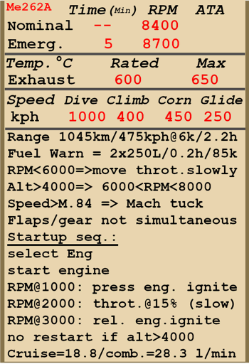

# Me 262 A  

<table><tbody><tr><td style="text-align: center"></td><td style="text-align: center"></tr></td></tr></tbody></table>  

Приборная скорость сваливания в полётной конфигурации: 165..200 км/ч  
Приборная скорость сваливания в посадочной конфигурации: 139..154 км/ч  
Предельная истинная скорость в пикировании: 1000 км/ч  
Разрушающая перегрузка: 12,5 единиц  
Угол атаки сваливания, в полётной конфигурации при убранных предкрылках: 17°  
Угол атаки сваливания, в полётной конфигурации при выпущенных предкрылках: 23°  
Угол атаки сваливания, в посадочной конфигурации: 22°  
  
Максимальная истинная скорость у земли, режим двигателя - номинальный, 8400 об/мин: 759 км/ч  
Максимальная истинная скорость на высоте 6000 м, режим двигателя - номинальный, 8400 об/мин: 780 км/ч  
Максимальная истинная скорость на высоте 9000 м, режим двигателя - номинальный, 8400 об/мин: 739 км/ч  
  
Максимальная истинная скорость у земли, режим двигателя - максимальный, 8700 об/мин: 837 км/ч  
Максимальная истинная скорость на высоте 6000 м, режим двигателя - максимальный, 8700 об/мин: 871 км/ч  
Максимальная истинная скорость на высоте 9000 м, режим двигателя - максимальный, 8700 об/мин: 838 км/ч  
  
Практический потолок: 12000 м  
Скороподъёмность у земли: 19,3 м/с  
Скороподъёмность на высоте 6000 м: 9,7 м/с  
Скороподъёмность на высоте 9000 м: 5,4 м/с  
  
Время виража предельного по тяге у земли: 32..35 с, на скорости 450 км/ч по прибору  
Время виража предельного по тяге на высоте 6000 м: 43..48 с, на скорости 380 км/ч по прибору   
  
Максимальная продолжительность полёта на высоте 6000 м: 2 ч 20 мин, на скорости 475 км/ч по прибору  
  
Скорость взлётная: 200..220 км/ч  
Скорость на глиссаде: 250 км/ч  
Скорость посадочная: 165..185 км/ч  
Посадочный угол: 12,3°  
  
Примечание 1: данные указаны для условий международной стандартной атмосферы.  
Примечание 2: диапазоны характеристик даны для допустимого диапазона масс самолёта.  
Примечание 3: максимальные скорости, скороподъемности и время виража даны для стандартной массы самолёта.  
Примечание 4: скороподъемность и время виража даны на максимальном (8700 об/мин) режиме работы двигателя.  
  
Двигатель: 2 x турбореактивный  
Модель: Jumo-004 B1  
Максимальная тяга при максимальной скорости (8700 об/мин) у земли: 810 кгс  
Максимальная тяга при максимальной скорости (8700 об/мин) на высоте 6000 м: 530 кгс  
Максимальная тяга при максимальной скорости (8700 об/мин) на высоте 9000 м: 385 кгс  
  
Режимы работы двигателя:  
Номинальный (время не ограничено): 8400 об/мин  
Максимальный (15 минут): 8700 об/мин  
  
Температура истекаемого газа на выходе из двигателя номинальная: 600 °С  
Температура истекаемого газа на выходе из двигателя максимальная: 650 °С  
  
Давление истекаемого газа на выходе из двигателя: 0,2...0,38 кг/кв.см  
  
Давление впрыска топлива: 40..80 кг/кв.см  
  
Давление масла на выходе из двигателя номинальное: 2 кг/кв.см  
Давление масла на выходе из двигателя предельное: 5 кг/кв.см  
  
Масса пустого самолёта: 4146 кг  
Минимальная масса (без БК, 10% топлива): 4737 кг  
Стандартная масса: 6400 кг  
Масса с полной заправкой топлива: 6900 кг  
Максимальная взлётная масса: 7100 кг  
Максимальный запас топлива: 2161 кг / 2570 л  
Максимальная полезная нагрузка: 700 кг  
  
Вооружение курсовое:  
2 x 30мм пушка "MK 108", 100 снарядов, 650 выстр/мин, носовая внутренняя (верхняя)  
2 x 30мм пушка "MK 108", 80 снарядов, 650 выстр/мин, носовая внешняя (нижняя)  
  
Вооружение бомбовое:  
2 x 249 кг осколочно-фугасная авиабомба "SC 250"  
500 кг осколочно-фугасная авиабомба "SC 500"  
  
Длина: 10,6 м  
Размах крыла: 12,6 м  
Площадь крыла: 20,4 кв.м  
  
Начало участия в боевых действиях: лето 1944 года  
  
Особенности эксплуатации:  
- Самолёт оборудован двумя турбореактивными двигателями Jumo-004 B1. Регулирование работы двигателя происходит автоматически в зависимости от положения РУД, который задает необходимые обороты турбокомпрессора.  
- Двигатель оснащен автоматическим топливным регулятором, который вступает в работу при оборотах турбокомпрессора выше 6000, и поэтому в диапазоне малых оборотов турбокомпрессора регулирование топлива неэффективно и влечёт опасность перелить топливо при резкой даче РУД вперёд, что приводит к перегреву двигателя и возможному пожару.  
- На больших высотах быстрым движением РУД назад можно обеднить топливовоздушную смесь настолько, что это приведет к самовыключению двигателя. Также на больших высотах недопустимо снижать обороты турбокомпрессора ниже 6000-8000 в зависимости от высоты.  
- Запуск остановившегося двигателя в воздухе разрешён только на высоте ниже 4000 метров. Попытка запустить двигатель на большей высоте скорее всего окажется неудачной, и может привести к перегреву и пожару.  
- Самолёт имеет переставной стабилизатор и триммер руля направления для снятия нагрузки на органах управления.  
- Самолёт имеет сильную тенденцию к затягиванию в пикирование при значениях числа Маха выше 0,84.   
- Привод посадочных закрылков гидравлический. Закрылки не имеют фиксированного положения, максимальный угол выпуска 55°. Выпуск и уборка управляются соответствующим гидрокраном, который недоступен для работы во время процесса выпуска/уборки шасси.  
- Тормоза колёс шасси гидравлические. Тормоза основных колес шасси управляются нажатием на соответствующую педаль. Носовое колесо свободно ориентируемое (максимальный угол поворота 50° в каждую сторону), снабжено демпфером поворота и имеет отдельную ручку тормоза. Самолёт обладает тенденцией к развороту при страгивании, если носовое колесо не ориентировано по продольной оси самолёта.  
- Самолёт оборудован двумя основными (расходными) топливными баками объемом 900 литров и двумя дополнительными объемом 600 литров и 170 литров. Перекачка происходит из дополнительных в основные баки с помощью электробензопомпы, которая включается летчиком при уровне топлива в основных баках ниже 600 литров. Основные баки снабжены топливомерами и лампами аварийного остатка топлива (при остатке топлива менее 250 литров).  
  
Основные данные и рекомендуемые положения органов управления самолётом:  
1. Запуск двигателя:  
	- рекомендуемое положение рукояти управления смесью: автоматическое управление смесью  
	- рекомендуемое положение рычага управления двигателем: 0%  
  
2. Рекомендуемые положения рукояти смеси при различных режимах полёта: автоматическое управление смесью  
  
3. Рекомендуемые положения рукояти управления радиаторами при различных режимах полёта: радиаторы отсутствуют  
  
4. Ориентировочный расход топлива на различных режимах работы на высоте 2000 м:  
	- крейсерский режим работы двигателя: 18,8 л/мин  
	- боевой режим работы двигателя: 28,3 л/мин  

## Модификации  
### Бронезаголовник  

Бронированный заголовник для дополнительной защиты пилота  
Дополнительная масса: 33 кг  
Ориентировочная потеря скорости: 0 км/ч  

### Клапан приёмистости  

Клапан в топливной магистрали двигателя, ограничивающий избыточное давление топлива при резкой даче РУД на увеличение оборотов для предотвращения перегрева двигателя. Практически полностью исключает вероятность пожара при резкой работе РУДом.  
Устанавливался на двигатели Jumo-004 B1 с конца 1944 года при выполнении ремонтных работ.  
  
### Бронеспинка  

Дополнительная защита пилота  
Дополнительная масса: 59 кг  
Ориентировочная потеря скорости: 0 км/ч  

### Бомбовая нагрузка  

249 кг осколочно-фугасная авиабомба SC 250  
Дополнительная масса: 279 кг  
Масса вооружения: 249 кг  
Масса держателей: 30 кг  
Ориентировочная потеря скорости до сброса: 124 км/ч  
Ориентировочная потеря скорости после сброса: 76 км/ч  
  
2 x 249 кг осколочно-фугасные авиабомбы SC 250  
Дополнительная масса: 558 кг  
Масса вооружения: 498 кг  
Масса держателей: 60 кг  
Ориентировочная потеря скорости до сброса: 154 км/ч  
Ориентировочная потеря скорости после сброса: 100 км/ч  
  
500 кг осколочно-фугасная авиабомба SC 500  
Дополнительная масса: 530 кг  
Масса вооружения: 500 кг  
Масса держателей: 30 кг  
Ориентировочная потеря скорости до сброса: 136 км/ч  
Ориентировочная потеря скорости после сброса: 76 км/ч  
  
### Гироприцел  

Гироприцел EZ42  
Дополнительная масса: 13 кг  
Ориентировочная потеря скорости: 0 км/ч  

### 24 х R4M  

24 55-мм реактивных осколочных снарядов R4M  
Дополнительная масса: 90 кг  
Масса вооружения: 73 кг  
Масса держателей: 17 кг  
Ориентировочная потеря скорости до пуска: 70 км/ч  
Ориентировочная потеря скорости после пуска: 36 км/ч  
  
### Снятая передняя броня  

Снятая передняя броня пушек  
Снижение массы: 124 кг  
Ориентировочная прибавка скорости: 2 км/ч  
  
### Снятые внутренние пушки  

Снятые две внутренние (верхние) пушки MK-108  
Уменьшение массы: 244  
Масса снимаемого боекомплекта: 119 кг  
Масса снимаемых орудий: 125 кг  
Ориентировочный выигрыш в скорости: 9 км/ч  
